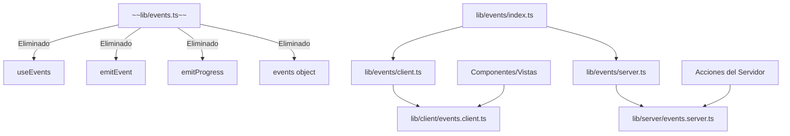
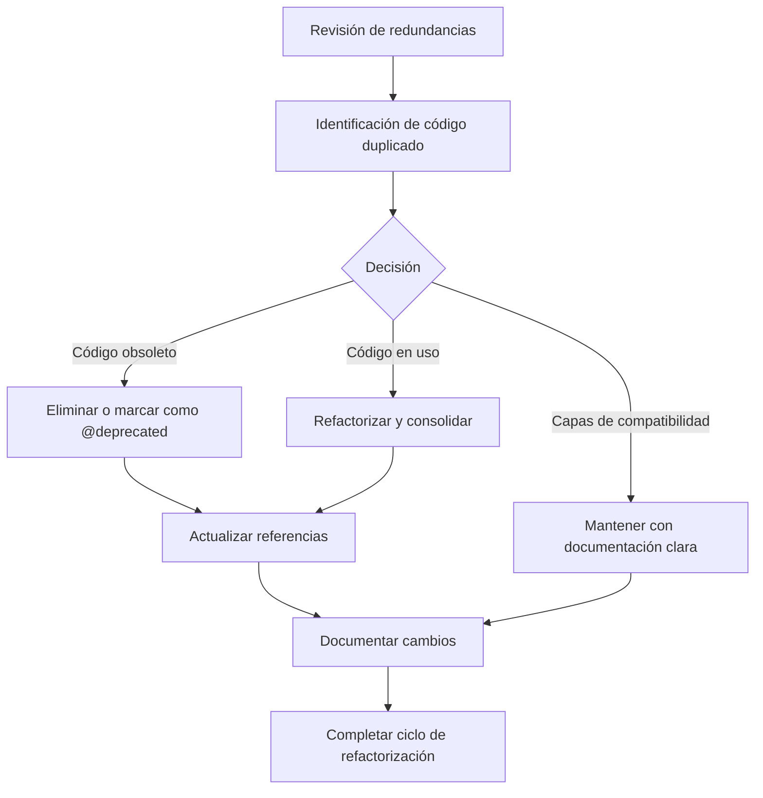

# Revisión de Código Duplicado/Redundante en lib/

## Hallazgos

### 1. Sistema de eventos (events.ts vs events/)
- ~~`lib/events.ts`: Contiene la implementación principal de eventos~~
- `lib/events/index.ts`: Re-exporta desde client.ts y server.ts
- `lib/events/client.ts`: Re-exporta desde lib/client/events.client.ts
- `lib/events/server.ts`: Re-exporta desde lib/server/events.server.ts
- `lib/client/events.client.ts`: Implementación de eventos para el cliente
- `lib/server/events.server.ts`: Implementación de eventos para el servidor

**Evaluación:** Existía redundancia entre events.ts y el sistema modular de events/ con client y server. La estructura actual representa una transición hacia una arquitectura más modular. Todas las importaciones en el código utilizan directamente el sistema modular (clientEvents de lib/client/events.client.ts) y no se encontraron referencias directas a lib/events.ts.

### 2. Utilidades de formato (format-utils.ts vs utils/format.utils.ts)
- ~~`lib/format-utils.ts`: Contiene funciones básicas (formatBytes, formatNumber, formatDate, formatDuration)~~
- `lib/utils/format.utils.ts`: Contiene funciones de formateo completas y es la versión actual recomendada
- ~~`lib/utils/format.ts`: Contiene funciones similares pero con nombres ligeramente diferentes (formatFileSize en lugar de formatBytes)~~

**Evaluación:** Había duplicación entre format-utils.ts y format.ts con format.utils.ts. Se han eliminado los archivos redundantes y se ha consolidado toda la funcionalidad en format.utils.ts.

### 3. Sistema de logging (logger.ts vs logger/)
- ~~`lib/logger.ts`: Implementación básica del logger~~
- `lib/logger/logger.ts`: Archivo de compatibilidad que marca el archivo anterior como obsoleto
- `lib/logger/enhanced-logger.ts`: Implementación mejorada (también marcada como obsoleta)
- `lib/logger/server-logger.ts`: Implementación actual recomendada

**Evaluación:** Clara evolución del sistema de logging. El archivo lib/logger.ts era obsoleto y ha sido eliminado.

### 4. Utilidades generales (utils.ts vs utils/)
- `lib/utils.ts`: Contiene la función cn para combinar clases de Tailwind y re-exporta deepMerge
- `lib/utils/`: Carpeta con múltiples utilidades especializadas agrupadas por funcionalidad

**Evaluación:** No hay redundancia directa. utils.ts contiene principalmente la función cn para Tailwind, mientras que la carpeta utils/ tiene utilidades más específicas. Se ha modificado utils/index.ts para exportar cn desde utils.ts, centralizando así su uso.

### 5. Sistema de notificaciones (toast.ts vs services/toast.service.ts)
- ~~`lib/toast.ts`: Versión obsoleta que actúa como puente hacia la nueva implementación~~
- `lib/services/toast.service.ts`: Implementación actual y recomendada

**Evaluación:** El archivo toast.ts estaba marcado como obsoleto con un comentario `@deprecated` y actuaba como puente de compatibilidad hacia services/toast.service.ts. Se ha eliminado el archivo y se han actualizado las importaciones para usar directamente el servicio actualizado.

### 6. Sistema de tipos (types.ts vs types/)
- `lib/types.ts`: Contiene interfaces básicas y generales del sistema (User, Collection, Folder, Tag, Settings, ImageMetadata, etc.)
- `lib/types/blend-modes.ts`: Contiene tipos específicos para modos de mezcla (BlendMode, BlendModeOption)

**Evaluación:** No hay redundancia sino complementariedad. El archivo types.ts contiene tipos fundamentales mientras que la carpeta types/ parece contener tipos más específicos o de dominio. Los tipos en types.ts parecen ser suficientemente importantes como para estar en el nivel raíz.

### 7. Sistema de procesamiento de imágenes (image.ts vs image-loader.ts vs image-processing.ts)
- `lib/image.ts`: Funciones para procesamiento de imágenes (processImage, createThumbnail) usando Sharp
- `lib/image-loader.ts`: Cargador de imágenes para Next.js que optimiza las URLs según el contexto
- `lib/image-processing.ts`: Funciones similares a image.ts pero orientadas al procesamiento de imágenes subidas

**Evaluación:** Hay cierta superposición entre image.ts e image-processing.ts, ambos usan Sharp para procesar imágenes pero con enfoques ligeramente diferentes. image-loader.ts tiene un propósito distinto (optimización de URLs) y no presenta redundancia con los otros.

### 8. Sistema de caché (cache.ts vs config/cache.config.ts)
- `lib/cache.ts`: Implementación de la clase CacheManager y creación de instancias de caché específicas
- `lib/config/cache.config.ts`: Configuración y esquemas para las diferentes instancias de caché

**Evaluación:** No hay redundancia, sino separación de responsabilidades. cache.ts implementa la lógica mientras que cache.config.ts contiene solo la configuración. Esta es una buena práctica de diseño donde la implementación y la configuración están separadas.

## Tareas pendientes
- [x] Eliminar lib/format-utils.ts y actualizar referencias para usar lib/utils/format.utils.ts
- [x] Analizar posible duplicación entre format.utils.ts y format.ts
- [x] Eliminar lib/logger.ts (obsoleto) y actualizar referencias para usar lib/logger/server-logger.ts
- [x] Examinar relación entre utils.ts y carpeta utils/
- [x] Verificar relación entre toast.ts y services/toast.service.ts
- [x] Analizar types.ts y carpeta types/
- [x] Revisar redundancias entre image.ts, image-loader.ts, image-processing.ts
- [x] Examinar cache.ts y config/cache.config.ts
- [x] Analizar posibilidad de eliminar lib/events.ts a favor del sistema modular en events/

## Cambios realizados
- ✅ Se ha eliminado `lib/format-utils.ts` ya que era redundante con `lib/utils/format.utils.ts`
- ✅ Se ha actualizado la importación en `components/folders/views/folder-details-view.tsx` para usar la versión correcta
- ✅ Se ha eliminado `lib/logger.ts` por ser obsoleto y reemplazado por `lib/logger/server-logger.ts`
- ✅ Se han actualizado las importaciones de logger en los archivos de acciones de configuración visual para usar serverLogger
- ✅ Se ha eliminado `lib/utils/format.ts` ya que sus funciones están incluidas en `lib/utils/format.utils.ts`
- ✅ Se ha añadido la función `formatFileSize` como alias de `formatBytes` en `format.utils.ts` para mantener compatibilidad
- ✅ Se han actualizado las importaciones en los archivos de layout de tarjetas para usar `format.utils.ts`
- ✅ Se ha modificado `lib/utils/index.ts` para exportar la función `cn` desde `lib/utils.ts`, centralizando su uso
- ✅ Se ha eliminado `lib/events.ts` ya que todas las importaciones en el proyecto utilizan directamente el sistema modular de eventos
- ✅ Se ha eliminado `lib/toast.ts` ya que funcionaba como un simple puente hacia `lib/services/toast.service.ts`
- ✅ Se han actualizado las importaciones de toastService en `lib/services/file-operations.service.ts` y `components/features/file-browser/context-menu/context-action-handler.ts` para utilizar directamente `lib/services/toast.service.ts`

## Notas
- No moveremos archivos, solo eliminaremos código redundante
- Actualizaremos referencias en otros archivos cuando sea necesario
- Varios archivos tienen comentarios que indican que están obsoletos o que deberían usarse alternativas
- La consolidación de las utilidades de formato facilitará el mantenimiento y evitará confusiones
- ~~El archivo `lib/toast.ts` se mantiene como puente de compatibilidad pero los nuevos desarrollos deberían usar directamente `lib/services/toast.service.ts`~~
- La implementación de cache está bien separada en la lógica (cache.ts) y la configuración (cache.config.ts)
- Se podría considerar consolidar las funcionalidades de `image.ts` e `image-processing.ts` en un futuro para evitar la duplicación de código de procesamiento de imágenes
- ~~El archivo `lib/events.ts` parece ser una versión anterior del sistema de eventos que ha sido reemplazada por un enfoque más modular. No se encontraron importaciones directas a este archivo en el código, lo que sugiere que puede ser eliminado de forma segura.~~

## Conclusión y Recomendaciones

Tras el análisis de la estructura del código en la carpeta `lib/`, hemos identificado varias áreas de redundancia y optimizado algunas de ellas. Se destacan los siguientes patrones:

1. **Evolución de arquitectura**: El proyecto muestra una clara evolución desde archivos monolíticos hacia estructuras más modulares y organizadas, como se ve en los sistemas de eventos, logging y utilidades.

2. **Capas de compatibilidad**: Se han implementado capas de compatibilidad (como `toast.ts` y `events.ts`) para facilitar la transición hacia nuevas implementaciones sin romper el código existente. Estas capas se han eliminado ahora que las transiciones están completas.

3. **Separación de responsabilidades**: Se observa una tendencia hacia la separación de responsabilidades, como en el caso de la implementación del caché y su configuración.

### Recomendaciones:

1. **Eliminar código redundante**: Continuar la eliminación de archivos redundantes o marcarlos claramente como obsoletos cuando su eliminación inmediata no sea posible.

2. **Documentar interfaces**: Mejorar la documentación de las interfaces y APIs, especialmente en sistemas complejos como eventos y caché.

3. **Consolidar procesamiento de imágenes**: Considerar la unificación de `image.ts` e `image-processing.ts` en un único módulo con funcionalidades más coherentes.

4. **Completar transición a arquitectura modular**: Se ha finalizado la transición hacia una arquitectura modular en el sistema de eventos, eliminando `lib/events.ts`.

5. **Establecer convenciones claras**: Desarrollar y documentar convenciones claras para la estructura de archivos y nombramiento, facilitando la consistencia en futuras contribuciones.

6. **Revisiones periódicas**: Establecer revisiones periódicas de código para identificar redundancias y oportunidades de refactorización, manteniendo la base de código limpia y mantenible.

