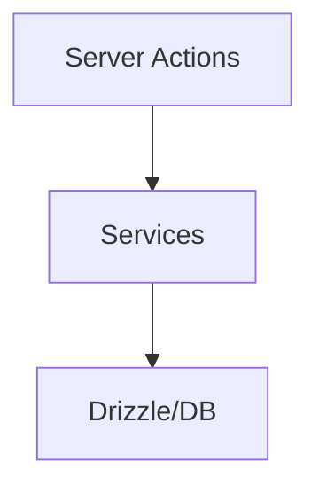

# Capa de Servicios

Los servicios encapsulan la lógica de negocio y acceso a datos. Son consumidos
por las **Server Actions** y en ocasiones directamente por componentes del lado
servidor.

Cada directorio dentro de `src/services` corresponde a una entidad o módulo del
sistema (por ejemplo, `folder`, `image`, `group`). Estos servicios exponen
funciones como `getFolders`, `createImage` o `updateGroup`, dependiendo de la
entidad.



## Estructura Actual (Reorganizada)

### Entidades Base

- `album/` - Gestión de álbumes de imágenes
- `file/` - Operaciones de archivos del sistema
- `folder/` - Gestión de carpetas
- `group/` - Agrupación de elementos
- `image/` - Procesamiento de imágenes
- `tag/` - Sistema de etiquetado
- `video/` - Procesamiento de videos (placeholder)

### Entidades Organizacionales

- `collection/` - Colecciones de elementos
- `profile/` - Perfiles de usuario

### Entidades de Contenido

- `audio/` - Archivos de audio
- `concept/` - Conceptos y ideas
- `document/` - Documentos de texto
- `file3d/` - Archivos 3D
- `json-file/` - Archivos JSON
- `note/` - Notas y anotaciones
- `place/` - Lugares y ubicaciones
- `workflow/` - Flujos de trabajo
- `world-item/` - Elementos del mundo

### Servicios del Sistema

- `settings/` - Configuración de la aplicación
- `stats/` - Estadísticas y métricas
- `toast/` - Notificaciones temporales

### Servicios Especializados

- `activity/` - Registro de actividades
- `character/` - Personajes
- `metadata/` - Metadatos de archivos
- `property/` - Propiedades personalizadas
- `queue-job/` - Trabajos en cola
- `wildcard/` - Patrones y comodines

## Estructura de Cada Servicio

```text
src/services/<entidad>/
├── <entidad>.service.ts   # Implementación principal
├── index.ts               # Exportaciones públicas
└── README.md              # Documentación específica (opcional)
```

### Servicios Especiales

Algunos servicios tienen archivos adicionales:

- `collection/events.service.ts` - Eventos específicos de colecciones
- `image/converter.service.ts` - Conversión de imágenes

## Importación

```typescript
// ✅ Correcto - Importar desde la carpeta
import { noteService } from '@/services/note';
import { statsEventEmitter } from '@/services/stats';

// ❌ Incorrecto - Rutas legacy eliminadas
import { noteService } from '@/services/note.service';
import { statsEventEmitter } from '@/services/stats.service';
```

## Migración Completada

- ✅ Movimiento de servicios sueltos a carpetas organizadas
- ✅ Eliminación de archivos legacy (`*-service-export.ts`)
- ✅ Actualización de exportaciones en `index.ts`
- ✅ Actualización automática de todas las importaciones (68 archivos)
- ✅ Validación de errores de TypeScript
