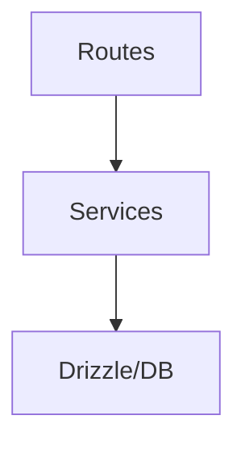

# Service layer

Services encapsulate business logic and data access.

Routes call services. Server components can also call services directly.

Each directory in `src/services` maps to an entity or module of the system.

Examples include `folder`, `image`, and `group`.

These services expose functions such as `getFolders`, `createImage`, or `updateGroup`, depending on the entity.



## Current structure (reorganized)

### Base entities

The following directories hold the base entity services:

- `album/` - Album management
- `file/` - Filesystem file operations
- `folder/` - Folder management
- `group/` - Group membership
- `image/` - Image processing
- `tag/` - Tag system
- `video/` - Video processing (placeholder)

### Organizational entities

The following directories hold organizational services:

- `collection/` - Collections of items
- `profile/` - User profiles

### Content entities

The following directories hold content services:

- `audio/` - Audio files
- `concept/` - Concepts and ideas
- `document/` - Text documents
- `file3d/` - 3D files
- `json-file/` - JSON files
- `note/` - Notes and annotations
- `place/` - Places and locations
- `workflow/` - Workflows
- `world-item/` - World items

### System services

The following directories hold system services:

- `settings/` - Application configuration
- `stats/` - Statistics and metrics
- `toast/` - Temporary notifications

### Specialized services

The following directories hold specialized services:

- `activity/` - Activity records
- `character/` - Characters
- `metadata/` - File metadata
- `property/` - Custom properties
- `queue-job/` - Queued jobs
- `wildcard/` - Patterns and wildcards

## Structure of each service

```text
src/services/<entity>/
├── <entity>.service.ts   # main implementation
├── index.ts               # public exports
└── README.md              # specific documentation (optional)
```

### Special services

Some services include extra files:

- `collection/events.service.ts` - Collection-specific events
- `image/converter.service.ts` - Image conversion

## Import

```typescript
// ✅ Correct - Import from the folder
import { noteService } from '@/services/note';
import { statsEventEmitter } from '@/services/stats';

// ❌ Incorrect - Removed legacy paths
import { noteService } from '@/services/note.service';
import { statsEventEmitter } from '@/services/stats.service';
```

## Completed migration

The following work is complete:

- Move loose services into organized folders
- Remove legacy files (`*-service-export.ts`)
- Update exports in `index.ts`
- Update all imports automatically (68 files)
- Validate TypeScript errors
