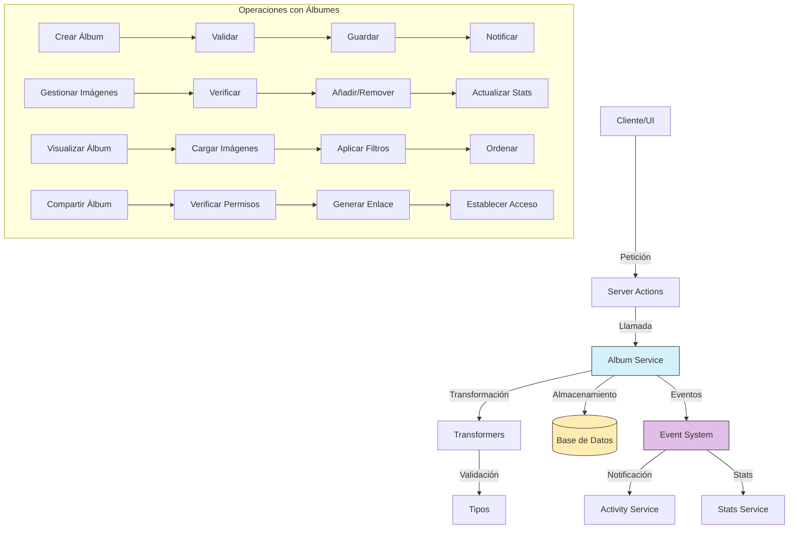

# Servicio de Álbumes (Album)

## Descripción General

El servicio de álbumes (Album) es un componente fundamental del sistema que permite organizar y presentar colecciones de imágenes y videos de manera visual. A diferencia de las carpetas (que siguen una estructura jerárquica) y las colecciones (que agrupan contenido variado), los álbumes están diseñados específicamente para la presentación y visualización de contenido visual con opciones de personalización para la experiencia de galería.

## Diagrama de Flujo



## Estructura del Módulo

### Archivos del Servicio

```
src/services/album/
├── album.service.ts    # Implementación principal del servicio
└── index.ts            # Punto de entrada y exportaciones
```

### Archivos de Transformers

```
src/transformers/album/
├── README.md           # Documentación específica de transformers
├── index.ts            # Exportaciones del módulo
├── mappers.ts          # Funciones para mapear entre objetos
├── serializers.ts      # Serializadores para distintos formatos
└── transformer.ts      # Transformador principal
```

### Tipos de Datos

```
src/types/entities/album/
├── enums.ts            # Enumeraciones para álbumes
├── extended.ts         # Tipos extendidos con información adicional
├── index.ts            # Exportaciones del módulo
├── schema.ts           # Esquemas de validación
├── stats-types.ts      # Tipos relacionados con estadísticas
└── types.ts            # Definiciones principales de tipos e interfaces
```

### Server Actions

```
src/app/actions/albums/
├── album.actions.ts       # Acciones principales para álbumes
├── album-images.actions.ts # Acciones específicas para imágenes en álbumes
└── index.ts               # Exportaciones del módulo
```

## Funcionalidades Principales

### 1. Gestión de Álbumes

- **Crear Álbum**: Permite crear nuevos álbumes con nombre, descripción y opciones de visualización.
- **Obtener Álbum**: Recupera información detallada de un álbum por su ID.
- **Actualizar Álbum**: Modifica propiedades y configuración de un álbum existente.
- **Eliminar Álbum**: Elimina un álbum manteniendo las imágenes intactas.
- **Listar Álbumes**: Obtiene álbumes con filtros, ordenación y paginación.

### 2. Gestión de Contenido

- **Añadir Imágenes**: Agrega imágenes o videos a un álbum.
- **Remover Imágenes**: Elimina imágenes específicas de un álbum.
- **Reordenar Contenido**: Cambia el orden de visualización de los elementos.
- **Establecer Imagen Destacada**: Define una imagen principal para representar el álbum.
- **Filtrar Contenido**: Filtra el contenido del álbum según criterios como fecha, etiquetas, etc.

### 3. Presentación y Visualización

- **Configuración de Visualización**: Define opciones como tamaño de miniaturas, estilo de presentación, etc.
- **Ordenación Personalizada**: Establece criterios de ordenación para la visualización.
- **Temas y Estilos**: Personaliza la apariencia visual del álbum con colores y emojis.
- **Modo Presentación**: Configura opciones para visualización en modo diapositivas.

### 4. Compartición y Colaboración

- **Compartir Álbum**: Genera enlaces para compartir el álbum con otros usuarios.
- **Colaboración**: Permite que múltiples usuarios editen un mismo álbum.
- **Control de Acceso**: Gestiona los permisos de visualización y edición.
- **Estadísticas de Uso**: Seguimiento de visualizaciones y actividad.

## Ejemplos de Uso

### Crear un Nuevo Álbum

```typescript
import { albumService } from '@/services/index';

// Crear un álbum básico
const newAlbum = await albumService.createAlbum({
  name: 'Vacaciones 2023',
  description: 'Recuerdos de nuestro viaje a la playa',
  emoji: '🏖️',
  color: '#3498db'
});

// Crear un álbum con configuración avanzada
const customAlbum = await albumService.createAlbum({
  name: 'Fotografía de Naturaleza',
  description: 'Colección de fotos de paisajes naturales',
  emoji: '🌲',
  color: '#27ae60',
  sortBy: 'capturedAt',
  sortDirection: 'desc',
  viewMode: 'GRID',
  thumbnailSize: 'MEDIUM'
});
```

### Gestionar Imágenes en un Álbum

```typescript
import { albumService } from '@/services/index';

// Añadir imágenes a un álbum
await albumService.addImagesToAlbum('album-id-123', ['image-id-1', 'image-id-2', 'image-id-3']);

// Establecer una imagen destacada
await albumService.setFeaturedImage('album-id-123', 'image-id-2');

// Obtener todas las imágenes de un álbum
const albumImages = await albumService.getAlbumImages('album-id-123', {
  page: 1,
  limit: 50,
  sortBy: 'dateAdded',
  sortDirection: 'desc'
});

// Eliminar una imagen del álbum
await albumService.removeImageFromAlbum('album-id-123', 'image-id-3');
```

### Configurar la Visualización

```typescript
import { albumService } from '@/services/index';

// Actualizar configuración de visualización
await albumService.updateAlbum('album-id-123', {
  viewMode: 'MASONRY',
  thumbnailSize: 'LARGE',
  showCaptions: true,
  sortBy: 'name',
  sortDirection: 'asc'
});

// Aplicar filtros de visualización
const filteredImages = await albumService.getAlbumImages('album-id-123', {
  filters: {
    tags: ['playa', 'atardecer'],
    dateRange: {
      from: new Date('2023-06-01'),
      to: new Date('2023-06-30')
    },
    orientation: 'LANDSCAPE'
  }
});
```

### Compartir y Colaborar

```typescript
import { albumService } from '@/services/index';

// Compartir un álbum con un usuario específico
await albumService.shareAlbum('album-id-123', 'user-id-456', {
  accessLevel: 'EDIT'
});

// Compartir un álbum con un grupo
await albumService.shareAlbumWithGroup('album-id-123', 'group-id-789', {
  accessLevel: 'VIEW'
});

// Generar un enlace público de compartición
const shareLink = await albumService.generateShareLink('album-id-123', {
  expiresIn: '7d',
  allowDownload: true
});
```

## Diferencias con Otras Entidades Organizativas

| Característica | Album | Collection | Folder | Tag |
|----------------|-------|------------|--------|-----|
| **Propósito principal** | Presentación visual | Agrupación temática | Organización jerárquica | Clasificación conceptual |
| **Contenido principal** | Imágenes y videos | Contenido mixto | Archivos y carpetas | Transversal a entidades |
| **Experiencia de usuario** | Galería visual | Agrupación flexible | Navegación de archivos | Filtrado por concepto |
| **Opciones visuales** | Extensivas | Básicas | Mínimas | No aplica |
| **Compartición** | Orientada a visualización | Orientada a colaboración | Orientada a acceso | No aplica directamente |
| **Ordenación** | Personalizable | Limitada | Criterios estándar | Alfabética/frecuencia |

## Relaciones con Otras Entidades

| Entidad        | Tipo de Relación     | Descripción                                          |
|----------------|----------------------|------------------------------------------------------|
| **Image**      | Muchos a muchos      | Los álbumes pueden contener múltiples imágenes       |
| **Video**      | Muchos a muchos      | Los álbumes pueden contener múltiples videos         |
| **User**       | Muchos a uno         | Los álbumes pertenecen a usuarios                    |
| **Tag**        | Muchos a muchos      | Los álbumes pueden tener múltiples etiquetas         |
| **Collection** | Muchos a muchos      | Los álbumes pueden formar parte de colecciones       |
| **Group**      | Muchos a muchos      | Los álbumes pueden compartirse con grupos            |
| **Activity**   | Referencial          | Las actividades pueden referenciar álbumes           |

## Modelo de Datos

```typescript
// Modelo básico de Album
interface Album {
  id: string;                  // Identificador único
  name: string;                // Nombre del álbum
  description?: string;        // Descripción opcional
  emoji?: string;              // Emoji representativo
  color?: string;              // Color asociado (hex o nombre)
  viewMode: AlbumViewMode;     // Modo de visualización (GRID, MASONRY, SLIDESHOW, etc.)
  thumbnailSize: ThumbnailSize; // Tamaño de miniaturas (SMALL, MEDIUM, LARGE)
  sortBy: string;              // Campo de ordenación (name, createdAt, etc.)
  sortDirection: SortDirection; // Dirección de ordenación (asc, desc)
  isFavorite: boolean;         // Indica si está marcado como favorito
  featuredImageId?: string;    // ID de la imagen destacada
  showCaptions: boolean;       // Muestra títulos bajo las imágenes
  createdAt: Date;             // Fecha de creación
  updatedAt: Date;             // Fecha de última actualización
}

// Extensión con estadísticas
interface AlbumWithStats extends Album {
  stats: {
    imageCount: number;        // Cantidad de imágenes
    videoCount: number;        // Cantidad de videos
    tagCount: number;          // Cantidad de etiquetas
    viewCount: number;         // Cantidad de visualizaciones
    totalSize: number;         // Tamaño total en bytes
    lastUpdated?: Date;        // Última actualización de contenido
    distribution?: {           // Distribución por tipo, formato, etc.
      [key: string]: number;
    }
  }
}

// Relación entre álbum e imagen
interface AlbumImage {
  albumId: string;             // ID del álbum
  imageId: string;             // ID de la imagen
  order: number;               // Orden de visualización
  addedAt: Date;               // Fecha de adición
  addedBy: string;             // ID del usuario que añadió la imagen
}
```

## Buenas Prácticas

1. **Optimización de Imágenes**: Asegúrese de que las imágenes estén optimizadas para el modo de visualización.
2. **Paginación Eficiente**: Implemente paginación adecuada para álbumes con gran cantidad de imágenes.
3. **Caché de Visualización**: Utilice estrategias de caché para mejorar la experiencia de visualización.
4. **Validación de Entradas**: Valide los criterios de ordenación y filtrado para evitar consultas ineficientes.
5. **Control de Permisos**: Verifique los permisos antes de permitir acceso o modificaciones.
6. **Manejo de Estadísticas**: Actualice las estadísticas de forma asíncrona para no afectar el rendimiento.
7. **Experiencia Responsive**: Asegure que las opciones de visualización se adapten a diferentes dispositivos.

## Solución de Problemas Comunes

| Problema | Solución |
|----------|----------|
| **Álbumes vacíos** | Utilice `albumService.findEmptyAlbums()` para identificar y gestionar |
| **Imágenes duplicadas** | Detecte con `albumService.findDuplicateImages()` antes de añadir |
| **Rendimiento en álbumes grandes** | Implemente carga progresiva y visualización virtualizada |
| **Inconsistencia de estadísticas** | Recalcule con `albumService.refreshStats()` |
| **Problemas de ordenación** | Valide y corrija con `albumService.reorderImages()` |

## Roadmap y Mejoras Futuras

- Implementación de álbumes inteligentes basados en criterios automáticos
- Mejoras en las opciones de presentación con transiciones y efectos visuales
- Capacidades de edición básica de imágenes dentro del álbum
- Funcionalidades de colaboración en tiempo real para edición de álbumes
- Opciones avanzadas de exportación (PDF, libro de fotos, presentación)