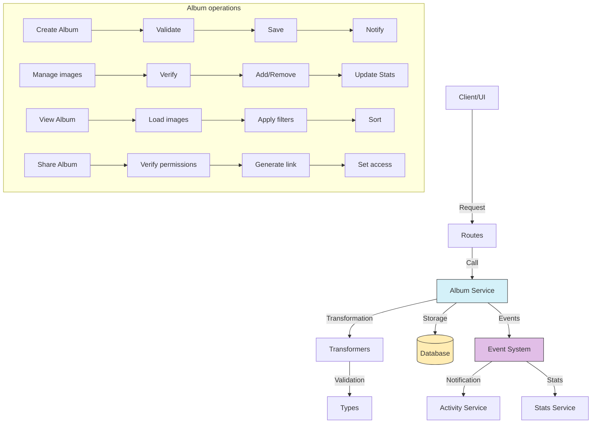

# Album service (Album)

## Overview

The Album service is a fundamental component of the system.

The service organizes and presents collections of images and videos in a visual way.

Folders follow a hierarchical structure. Collections group mixed content.

Albums are designed specifically for presentation and display of visual content with customization options for the gallery experience.

## Flow diagram



Routes call services.

## Module structure

### Service files

```
src/services/album/
├── album.service.ts    # Main service implementation
└── index.ts            # Entry point and exports
```

### Transformer files

```
src/transformers/album/
├── README.md           # Transformer-specific documentation
├── index.ts            # Module exports
├── mappers.ts          # Functions that map between objects
├── serializers.ts      # Serializers for different formats
└── transformer.ts      # Main transformer
```

### Data types

```
src/types/entities/album/
├── enums.ts            # Enumerations for Albums
├── extended.ts         # Extended types with extra information
├── index.ts            # Module exports
├── schema.ts           # Validation schemas
├── stats-types.ts      # Types related to statistics
└── types.ts            # Main type and interface definitions
```

### Route modules

```
src/app/actions/albums/
├── album.actions.ts       # Main Album operations
├── album-images.actions.ts # Operations specific to images in Albums
└── index.ts               # Module exports
```

## Main features

### 1. Album management

The service provides the following Album operations:

- **Create Album**: Creates new Albums with name, description, and display options.
- **Get Album**: Retrieves detailed Album information by ID.
- **Update Album**: Changes properties and configuration of an existing Album.
- **Delete Album**: Deletes an Album while the images stay intact.
- **List Albums**: Gets Albums with filters, sort, and pagination.

### 2. Content management

The service provides the following content operations:

- **Add images**: Adds images or videos to an Album.
- **Remove images**: Removes specific images from an Album.
- **Reorder content**: Changes the display order of items.
- **Set featured image**: Defines a main image that represents the Album.
- **Filter content**: Filters Album content by date or Tags.

### 3. Presentation and display

The service provides the following display operations:

- **Display configuration**: Defines options such as thumbnail size and presentation style.
- **Custom sort**: Sets sort criteria for display.
- **Themes and styles**: Customizes the visual appearance of the Album with colors and emojis.
- **Presentation mode**: Configures options for slideshow display.

### 4. Sharing and collaboration

The service provides the following sharing operations:

- **Share Album**: Generates links that share the Album with other users.
- **Collaboration**: Lets multiple users edit the same Album.
- **Access control**: Manages view and edit permissions.
- **Usage statistics**: Tracking of views and activity.

## Usage examples

### Create a new Album

```typescript
import { albumService } from '@/services/index';

// Create a basic Album
const newAlbum = await albumService.createAlbum({
	name: 'Vacation 2023',
	description: 'Memories of our trip to the beach',
	emoji: '🏖️',
	color: '#3498db',
});

// Create an Album with advanced configuration
const customAlbum = await albumService.createAlbum({
	name: 'Nature Photography',
	description: 'Collection of natural landscape photos',
	emoji: '🌲',
	color: '#27ae60',
	sortBy: 'capturedAt',
	sortDirection: 'desc',
	viewMode: 'GRID',
	thumbnailSize: 'MEDIUM',
});
```

### Manage images in an Album

```typescript
import { albumService } from '@/services/index';

// Add images to an Album
await albumService.addImagesToAlbum('album-id-123', ['image-id-1', 'image-id-2', 'image-id-3']);

// Set a featured image
await albumService.setFeaturedImage('album-id-123', 'image-id-2');

// Get all images of an Album
const albumImages = await albumService.getAlbumImages('album-id-123', {
	page: 1,
	limit: 50,
	sortBy: 'dateAdded',
	sortDirection: 'desc',
});

// Remove an image from the Album
await albumService.removeImageFromAlbum('album-id-123', 'image-id-3');
```

### Configure the display

```typescript
import { albumService } from '@/services/index';

// Update display configuration
await albumService.updateAlbum('album-id-123', {
	viewMode: 'MASONRY',
	thumbnailSize: 'LARGE',
	showCaptions: true,
	sortBy: 'name',
	sortDirection: 'asc',
});

// Apply display filters
const filteredImages = await albumService.getAlbumImages('album-id-123', {
	filters: {
		tags: ['beach', 'sunset'],
		dateRange: {
			from: new Date('2023-06-01'),
			to: new Date('2023-06-30'),
		},
		orientation: 'LANDSCAPE',
	},
});
```

### Share and collaborate

```typescript
import { albumService } from '@/services/index';

// Share an Album with a specific user
await albumService.shareAlbum('album-id-123', 'user-id-456', {
	accessLevel: 'EDIT',
});

// Share an Album with a Group
await albumService.shareAlbumWithGroup('album-id-123', 'group-id-789', {
	accessLevel: 'VIEW',
});

// Generate a public share link
const shareLink = await albumService.generateShareLink('album-id-123', {
	expiresIn: '7d',
	allowDownload: true,
});
```

## Differences from other organizer entities

| Characteristic             | Album                     | Collection               | Folder                  | Tag                      |
| -------------------------- | ------------------------- | ------------------------ | ----------------------- | ------------------------ |
| **Main purpose**           | Visual presentation       | Thematic grouping        | Hierarchical organization | Conceptual classification |
| **Main content**           | Images and videos         | Mixed content            | Files and Folders       | Cross-cutting to entities |
| **User experience**        | Visual gallery            | Flexible grouping        | File navigation         | Filter by concept        |
| **Visual options**         | Extensive                 | Basic                    | Minimal                 | Does not apply           |
| **Sharing**                | Oriented to display       | Oriented to collaboration | Oriented to access     | Does not apply directly  |
| **Sort**                   | Customizable              | Limited                  | Standard criteria       | Alphabetical/frequency   |

## Relations with other entities

| Entity         | Relation type    | Description                                    |
| -------------- | ---------------- | ---------------------------------------------- |
| **Image**      | Many to many     | Albums can contain multiple images             |
| **Video**      | Many to many     | Albums can contain multiple videos             |
| **User**       | Many to one      | Albums belong to users                         |
| **Tag**        | Many to many     | Albums can have multiple Tags                  |
| **Collection** | Many to many     | Albums can be part of Collections              |
| **Group**      | Many to many     | Albums can be shared with Groups               |
| **Activity**   | Referential      | Activities can reference Albums                |

## Data model

```typescript
// Basic Album model
interface Album {
	id: string; // Unique identifier
	name: string; // Album name
	description?: string; // Optional description
	emoji?: string; // Representative emoji
	color?: string; // Associated color (hex or name)
	viewMode: AlbumViewMode; // Display mode (GRID, MASONRY, SLIDESHOW, etc.)
	thumbnailSize: ThumbnailSize; // Thumbnail size (SMALL, MEDIUM, LARGE)
	sortBy: string; // Sort field (name, createdAt, etc.)
	sortDirection: SortDirection; // Sort direction (asc, desc)
	isFavorite: boolean; // Indicates whether it is marked as a Favorite
	featuredImageId?: string; // Featured image ID
	showCaptions: boolean; // Shows titles under the images
	createdAt: Date; // Creation date
	updatedAt: Date; // Last update date
}

// Extension with statistics
interface AlbumWithStats extends Album {
	stats: {
		imageCount: number; // Image count
		videoCount: number; // Video count
		tagCount: number; // Tag count
		viewCount: number; // View count
		totalSize: number; // Total size in bytes
		lastUpdated?: Date; // Last content update
		distribution?: {
			// Distribution by type, format
			[key: string]: number;
		};
	};
}

// Relation between Album and image
interface AlbumImage {
	albumId: string; // Album ID
	imageId: string; // Image ID
	order: number; // Display order
	addedAt: Date; // Date added
	addedBy: string; // ID of the user who added the image
}
```

## Good practices

Optimize images for the display mode.

Implement adequate pagination for Albums with a large number of images.

Use cache strategies to improve the display experience.

Validate sort and filter criteria to avoid inefficient queries.

Verify permissions before you allow access or modifications.

Update statistics asynchronously so that they do not affect performance.

Ensure that display options adapt to different devices.

## Common troubleshooting

| Problem                            | Solution                                                              |
| ---------------------------------- | --------------------------------------------------------------------- |
| **Empty Albums**                   | Use `albumService.findEmptyAlbums()` to identify and manage them      |
| **Duplicate images**               | Detect with `albumService.findDuplicateImages()` before you add       |
| **Performance in large Albums**    | Implement progressive load and virtualized display                    |
| **Inconsistent statistics**        | Recalculate with `albumService.refreshStats()`                        |
| **Sort problems**                  | Validate and correct with `albumService.reorderImages()`              |

## Roadmap and future improvements

The following work is planned:

- Implementation of smart Albums based on automatic criteria
- Improvements in presentation options with transitions and visual effects
- Basic image-edit capabilities inside the Album
- Real-time collaboration features for Album editing
- Advanced export options (PDF, photo book, presentation)
