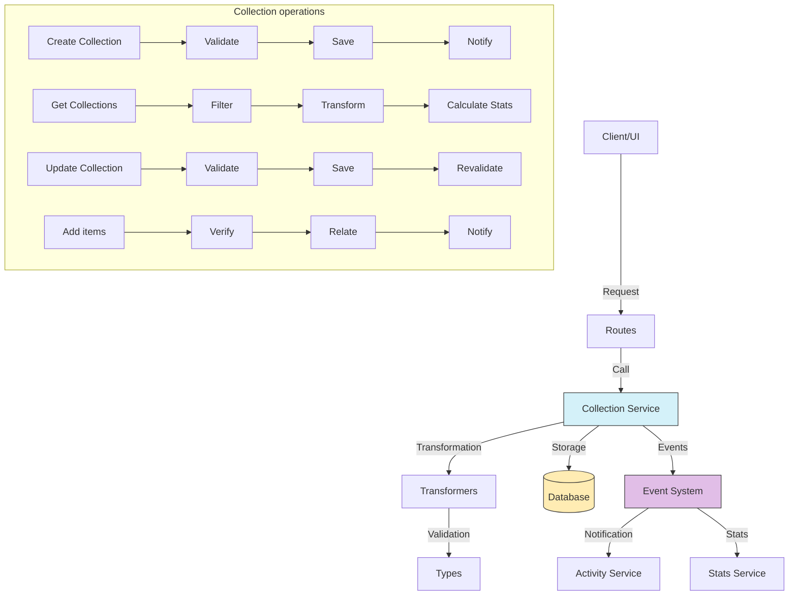

# Collection service (Collection)

## Overview

The Collection service is a central component of the media organization system.

The service groups and classifies different content types under thematic or functional criteria.

Albums group images mainly. Folders follow a hierarchical structure.

Collections offer a flexible way to organize mixed content with customizable properties.

## Flow diagram



Routes call services.

## Module structure

### Service files

```
src/services/collection/
├── collection.service.ts    # Main service implementation
└── index.ts                 # Entry point and exports
```

### Transformer files

```
src/transformers/collection/
├── README.md               # Transformer-specific documentation
├── index.ts                # Module exports
├── mappers.ts              # Functions that map between objects
├── serializers.ts          # Serializers for different formats
└── transformer.ts          # Main transformer
```

### Data types

```
src/types/entities/collection/
├── base.ts                 # Basic types for Collections
├── enums.ts                # Enumerations for Collections
├── extended.ts             # Extended types with extra information
├── index.ts                # Module exports
└── types.ts                # Main type and interface definitions
```

### Route modules

```
src/app/actions/collections/
├── collection.actions.ts   # Actions for all operations
└── index.ts                # Module exports
```

## Main features

### 1. Collection management

The service provides the following Collection operations:

- **Create Collection**: Creates new Collections with customizable properties.
- **Get Collection**: Retrieves detailed Collection information by ID.
- **Get Collections**: Lists all Collections with filters and statistics.
- **Update Collection**: Changes properties of an existing Collection.
- **Delete Collection**: Deletes a Collection while its items stay intact.

### 2. Item management

The service provides the following item operations:

- **Add items**: Adds images and other items to a Collection.
- **Remove items**: Removes specific items from a Collection.
- **Get items**: Retrieves the items associated with a Collection.
- **Empty Collection**: Removes all items from a Collection.

### 3. Organization and categorization

The service provides the following organization operations:

- **Categories**: Assignment of predefined categories (PERSONAL, TRABAJO, PROYECTO).
- **Customization**: Assignment of emojis and colors for visual identification.
- **Prioritization**: Marking of Collections as featured or Favorites.
- **Visibility**: Control of public and private Collections.

### 4. Interaction and statistics

The service provides the following interaction operations:

- **Statistics calculation**: Number of items, total size, last update.
- **Notifications**: Event system that notifies Collection changes.
- **UI integration**: Extended properties for display and selection.

## Usage examples

### Create a new Collection

```typescript
import { collectionService } from '@/services/index';

// Create a Collection
const newCollection = await collectionService.createCollection({
	name: 'Favorite Places',
	description: 'Collection of my preferred places to visit',
	emoji: '🏞️',
	color: '#3498db',
	category: 'PERSONAL',
	isPublic: true,
	isPinned: true,
});
```

### Get Collections with statistics

```typescript
import { collectionService } from '@/services/index';

// Get all Collections
const collections = await collectionService.getCollections();

// Work with the statistics
collections.forEach((collection) => {
	console.log(`${collection.name}: ${collection.stats.imageCount} images, ${collection.stats.videoCount} videos`);
	console.log(`Total size: ${collection.stats.totalSize} bytes`);
});
```

### Update a Collection

```typescript
import { collectionService } from '@/services/index';

// Update Collection properties
const updatedCollection = await collectionService.updateCollection('collection-id-123', {
	name: 'Travel Destinations',
	description: 'Updated with new destinations to visit',
	emoji: '✈️',
	color: '#e74c3c',
	isPinned: true,
});
```

### Add an image to a Collection

```typescript
import { collectionService } from '@/services/index';

// Add an image to the Collection
await collectionService.addImageToCollection('collection-id-123', 'image-id-456');

// Verify the added image
const collectionImages = await collectionService.getCollectionImages('collection-id-123');
console.log(`The collection now has ${collectionImages.length} images`);
```

### Remove an image from a Collection

```typescript
import { collectionService } from '@/services/index';

// Remove an image from the Collection
await collectionService.removeImageFromCollection('collection-id-123', 'image-id-456');
```

## Differences from other organizer entities

| Characteristic          | Collection                     | Album                   | Folder                  | Tag                        |
| ----------------------- | ------------------------------ | ----------------------- | ----------------------- | -------------------------- |
| **Main purpose**        | Flexible grouping by theme     | Image grouping          | Hierarchical organization | Classification by concept |
| **Structure**           | Flat with possible nesting     | Flat                    | Hierarchical            | Flat                       |
| **Customization**       | High (emoji, color, category)  | Medium                  | Low                     | Minimal                    |
| **Content types**       | Multiple                       | Mainly images           | Files and Folders       | Any                        |
| **Hierarchy**           | Optional                       | No                      | Required                | No                         |
| **UI display**          | Customizable                   | Gallery-oriented        | Tree structure          | Tag list or cloud          |

## Relations with other entities

| Entity       | Relation type    | Description                                           |
| ------------ | ---------------- | ----------------------------------------------------- |
| **Image**    | Many to many     | Collections can contain multiple images               |
| **Video**    | Many to many     | Collections can contain multiple videos               |
| **Album**    | Many to many     | Collections can contain or reference Albums           |
| **Tag**      | Many to many     | Collections can have multiple Tags                    |
| **Group**    | Many to many     | Collections can be shared with Groups                 |
| **User**     | Many to one      | Collections belong to users                           |
| **Activity** | Referential      | Activities can reference Collections                  |

## Data model

```typescript
// Basic Collection model
interface CollectionBase {
	id: string; // Unique identifier
	name: string; // Collection name
	description?: string; // Optional description
	emoji?: string; // Representative emoji
	color?: string; // Associated color (hex or name)
	category?: CollectionCategory; // Category (PERSONAL, WORK, PROJECT, OTHER)
	isPublic: boolean; // Indicates whether the Collection is public
	isPinned: boolean; // Indicates whether it is pinned in the UI
	isFavorite: boolean; // Indicates whether it is marked as a Favorite
	parentId?: string; // Parent Collection ID (if nested)
	createdAt: Date; // Creation date
	updatedAt: Date; // Last update date
}

// Extension with statistics
interface CollectionWithStats extends CollectionBase {
	stats: {
		imageCount: number; // Image count
		videoCount: number; // Video count
		albumCount: number; // Album count
		tagCount: number; // Tag count
		groupCount: number; // Related Group count
		totalSize: number; // Total size in bytes
		lastUpdated?: Date; // Last content update
	};
}

// Complete extension with relations
interface CollectionComplete extends CollectionWithStats {
	parent?: CollectionBase; // Parent Collection
	children: CollectionBase[]; // Child Collections
	images: Image[]; // Images in the Collection
	videos: Video[]; // Videos in the Collection
	albums: Album[]; // Albums in the Collection
	tags: Tag[]; // Tags of the Collection
	groups: Group[]; // Groups with access to the Collection
	user: User; // Owner user
}
```

## Good practices

Validate Collection names to avoid duplicates.

Always use the transformation functions to keep data consistency.

Implement Collection change notifications correctly.

Verify permissions before you allow access to private Collections.

Load relations only when needed to improve performance.

Use a coherent set of categories to ease navigation.

Use emoji and color properties to improve the user experience.

## Common troubleshooting

| Problem                            | Solution                                                          |
| ---------------------------------- | ----------------------------------------------------------------- |
| **Orphan Collections**             | Verify and repair references to deleted parent Collections        |
| **Duplicate items**                | Use the `collectionService.deduplicateItems()` function           |
| **Collections without items**      | Identify with `collectionService.findEmptyCollections()`          |
| **Inconsistent statistics**        | Recalculate with `collectionService.refreshStats()`               |
| **Name conflicts**                 | Implement prior validation or add a suffix to differentiate       |

## Roadmap and future improvements

The following work is planned:

- Implementation of smart Collections based on automatic rules
- Improvements in the categorization system with customizable subcategories
- Collaboration features for shared Collection editing
- Export and import of complete Collections
- Automatic item recommendations for existing Collections
