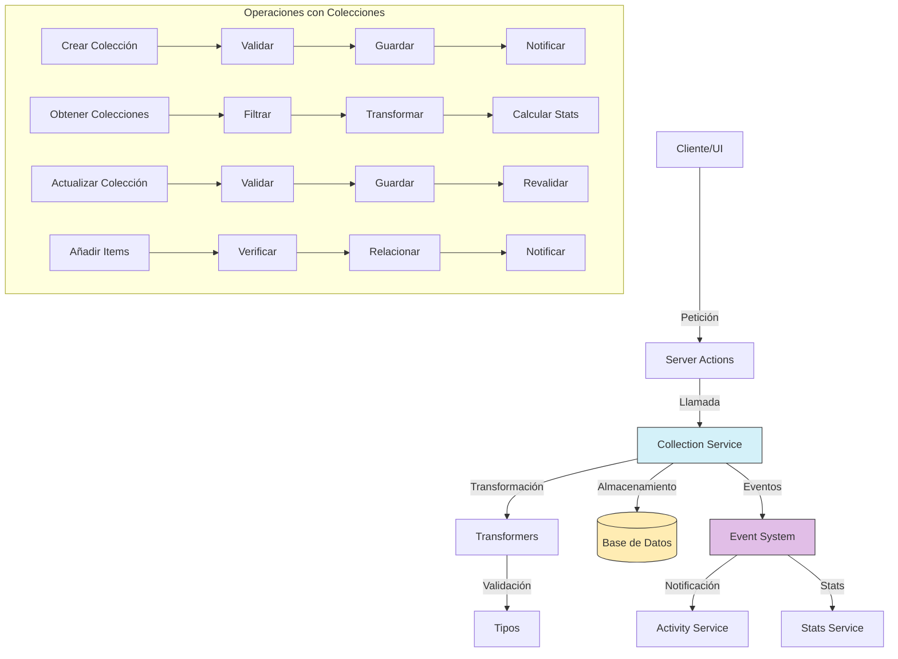

# Servicio de Colecciones (Collection)

## Descripción General

El servicio de colecciones (Collection) es un componente central del sistema de organización de medios que permite agrupar y clasificar diferentes tipos de contenido bajo criterios temáticos o funcionales. A diferencia de los álbumes (que agrupan principalmente imágenes) y carpetas (que siguen una estructura jerárquica), las colecciones ofrecen una forma flexible de organizar contenido variado con propiedades personalizables.

## Diagrama de Flujo



## Estructura del Módulo

### Archivos del Servicio

```
src/services/collection/
├── collection.service.ts    # Implementación principal del servicio
└── index.ts                 # Punto de entrada y exportaciones
```

### Archivos de Transformers

```
src/transformers/collection/
├── README.md               # Documentación específica de transformers
├── index.ts                # Exportaciones del módulo
├── mappers.ts              # Funciones para mapear entre objetos
├── serializers.ts          # Serializadores para distintos formatos
└── transformer.ts          # Transformador principal
```

### Tipos de Datos

```
src/types/entities/collection/
├── base.ts                 # Tipos básicos para colecciones
├── enums.ts                # Enumeraciones para colecciones
├── extended.ts             # Tipos extendidos con información adicional
├── index.ts                # Exportaciones del módulo
└── types.ts                # Definiciones principales de tipos e interfaces
```

### Server Actions

```
src/app/actions/collections/
├── collection.actions.ts   # Acciones para todas las operaciones
└── index.ts                # Exportaciones del módulo
```

## Funcionalidades Principales

### 1. Gestión de Colecciones

- **Crear Colección**: Permite crear nuevas colecciones con propiedades personalizables.
- **Obtener Colección**: Recupera información detallada de una colección por su ID.
- **Obtener Colecciones**: Lista todas las colecciones con filtros y estadísticas.
- **Actualizar Colección**: Modifica propiedades de una colección existente.
- **Eliminar Colección**: Elimina una colección manteniendo sus elementos intactos.

### 2. Gestión de Elementos

- **Añadir Elementos**: Agrega imágenes y otros elementos a una colección.
- **Eliminar Elementos**: Remueve elementos específicos de una colección.
- **Obtener Elementos**: Recupera los elementos asociados a una colección.
- **Vaciar Colección**: Elimina todos los elementos de una colección.

### 3. Organización y Categorización

- **Categorías**: Asignación de categorías predefinidas (PERSONAL, TRABAJO, PROYECTO, etc.).
- **Personalización**: Asignación de emojis y colores para identificación visual.
- **Priorización**: Marcado de colecciones como destacadas o favoritas.
- **Visibilidad**: Control de colecciones públicas y privadas.

### 4. Interacción y Estadísticas

- **Cálculo de Estadísticas**: Número de elementos, tamaño total, última actualización, etc.
- **Notificaciones**: Sistema de eventos para notificar cambios en colecciones.
- **Integración con UI**: Propiedades extendidas para visualización y selección.

## Ejemplos de Uso

### Crear una Nueva Colección

```typescript
import { collectionService } from '@/services/index';

// Crear una colección
const newCollection = await collectionService.createCollection({
  name: 'Lugares Favoritos',
  description: 'Colección de mis lugares preferidos para visitar',
  emoji: '🏞️',
  color: '#3498db',
  category: 'PERSONAL',
  isPublic: true,
  isPinned: true
});
```

### Obtener Colecciones con Estadísticas

```typescript
import { collectionService } from '@/services/index';

// Obtener todas las colecciones
const collections = await collectionService.getCollections();

// Trabajar con las estadísticas
collections.forEach(collection => {
  console.log(`${collection.name}: ${collection.stats.imageCount} imágenes, ${collection.stats.videoCount} videos`);
  console.log(`Tamaño total: ${collection.stats.totalSize} bytes`);
});
```

### Actualizar una Colección

```typescript
import { collectionService } from '@/services/index';

// Actualizar propiedades de una colección
const updatedCollection = await collectionService.updateCollection('collection-id-123', {
  name: 'Destinos de Viaje',
  description: 'Actualizada con nuevos destinos para visitar',
  emoji: '✈️',
  color: '#e74c3c',
  isPinned: true
});
```

### Añadir una Imagen a una Colección

```typescript
import { collectionService } from '@/services/index';

// Añadir una imagen a la colección
await collectionService.addImageToCollection('collection-id-123', 'image-id-456');

// Verificar la imagen añadida
const collectionImages = await collectionService.getCollectionImages('collection-id-123');
console.log(`La colección ahora tiene ${collectionImages.length} imágenes`);
```

### Eliminar una Imagen de una Colección

```typescript
import { collectionService } from '@/services/index';

// Eliminar una imagen de la colección
await collectionService.removeImageFromCollection('collection-id-123', 'image-id-456');
```

## Diferencias con Otras Entidades Organizativas

| Característica | Collection | Album | Folder | Tag |
|----------------|------------|-------|--------|-----|
| **Propósito principal** | Agrupación flexible por tema | Agrupación de imágenes | Organización jerárquica | Clasificación por concepto |
| **Estructura** | Plana con posible anidación | Plana | Jerárquica | Plana |
| **Personalización** | Alta (emoji, color, categoría) | Media | Baja | Mínima |
| **Tipos de contenido** | Múltiples | Principalmente imágenes | Archivos y carpetas | Cualquiera |
| **Jerarquía** | Opcional | No | Obligatoria | No |
| **Visualización UI** | Personalizable | Orientada a galería | Estructura de árbol | Lista o nube de etiquetas |

## Relaciones con Otras Entidades

| Entidad      | Tipo de Relación   | Descripción                                          |
|--------------|--------------------|----------------------------------------------------|
| **Image**    | Muchos a muchos    | Las colecciones pueden contener múltiples imágenes  |
| **Video**    | Muchos a muchos    | Las colecciones pueden contener múltiples videos    |
| **Album**    | Muchos a muchos    | Las colecciones pueden contener o referenciar álbumes |
| **Tag**      | Muchos a muchos    | Las colecciones pueden tener múltiples etiquetas    |
| **Group**    | Muchos a muchos    | Las colecciones pueden compartirse con grupos       |
| **User**     | Muchos a uno       | Las colecciones pertenecen a usuarios               |
| **Activity** | Referencial        | Las actividades pueden referenciar colecciones      |

## Modelo de Datos

```typescript
// Modelo básico de Collection
interface CollectionBase {
  id: string;                  // Identificador único
  name: string;                // Nombre de la colección
  description?: string;        // Descripción opcional
  emoji?: string;              // Emoji representativo
  color?: string;              // Color asociado (hex o nombre)
  category?: CollectionCategory; // Categoría (PERSONAL, WORK, PROJECT, OTHER)
  isPublic: boolean;           // Indica si la colección es pública
  isPinned: boolean;           // Indica si está fijada en la UI
  isFavorite: boolean;         // Indica si está marcada como favorita
  parentId?: string;           // ID de la colección padre (si es anidada)
  createdAt: Date;             // Fecha de creación
  updatedAt: Date;             // Fecha de última actualización
}

// Extensión con estadísticas
interface CollectionWithStats extends CollectionBase {
  stats: {
    imageCount: number;        // Cantidad de imágenes
    videoCount: number;        // Cantidad de videos
    albumCount: number;        // Cantidad de álbumes
    tagCount: number;          // Cantidad de etiquetas
    groupCount: number;        // Cantidad de grupos relacionados
    totalSize: number;         // Tamaño total en bytes
    lastUpdated?: Date;        // Última actualización de contenido
  }
}

// Extensión completa con relaciones
interface CollectionComplete extends CollectionWithStats {
  parent?: CollectionBase;     // Colección padre
  children: CollectionBase[];  // Colecciones hijas
  images: Image[];             // Imágenes en la colección
  videos: Video[];             // Videos en la colección
  albums: Album[];             // Álbumes en la colección
  tags: Tag[];                 // Etiquetas de la colección
  groups: Group[];             // Grupos con acceso a la colección
  user: User;                  // Usuario propietario
}
```

## Buenas Prácticas

1. **Validación de Nombres**: Asegúrese de validar los nombres de colecciones para evitar duplicados.
2. **Uso de Transformers**: Utilice siempre las funciones de transformación para mantener la consistencia de datos.
3. **Manejo de Eventos**: Implemente correctamente las notificaciones de cambios en colecciones.
4. **Control de Acceso**: Verifique los permisos antes de permitir acceso a colecciones privadas.
5. **Optimización de Carga**: Cargue las relaciones solo cuando sea necesario para mejorar el rendimiento.
6. **Categorización Consistente**: Utilice un conjunto coherente de categorías para facilitar la navegación.
7. **Personalización Visual**: Aproveche las propiedades de emoji y color para mejorar la experiencia de usuario.

## Solución de Problemas Comunes

| Problema | Solución |
|----------|----------|
| **Colecciones huérfanas** | Verifique y repare las referencias a colecciones padre eliminadas |
| **Elementos duplicados** | Utilice la función `collectionService.deduplicateItems()` |
| **Colecciones sin elementos** | Identifique con `collectionService.findEmptyCollections()` |
| **Inconsistencia de estadísticas** | Recalcule con `collectionService.refreshStats()` |
| **Conflictos de nombres** | Implemente validación previa o añada sufijo para diferenciar |

## Roadmap y Mejoras Futuras

- Implementación de colecciones inteligentes basadas en reglas automáticas
- Mejoras en el sistema de categorización con subcategorías personalizables
- Funcionalidades de colaboración para edición compartida de colecciones
- Exportación e importación de colecciones completas
- Recomendaciones automáticas de elementos para colecciones existentes