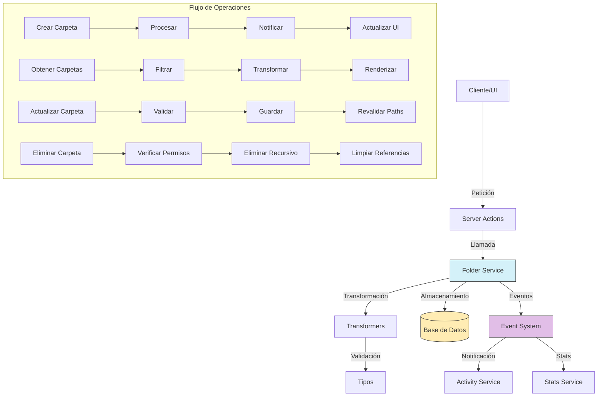

# Servicio de Carpetas (Folder)

## Descripción General

El servicio de carpetas (Folder) es un componente fundamental del sistema de gestión de imágenes que permite organizar archivos en estructuras jerárquicas. Este servicio proporciona funcionalidades para crear, leer, actualizar y eliminar carpetas, así como gestionar su contenido y relaciones con otras entidades.

## Diagrama de Flujo



## Estructura del Módulo

### Archivos del Servicio

```
src/services/folder/
├── folder.service.ts    # Implementación principal del servicio
└── index.ts             # Punto de entrada y exportaciones
```

### Archivos de Transformers

```
src/transformers/folder/
├── converters.ts        # Conversores entre formatos de datos
├── index.ts             # Exportaciones del módulo
├── mappers.ts           # Funciones para mapear entre objetos
├── serializers.ts       # Serializadores para distintos formatos
├── service.ts           # Funciones de servicio del transformer
└── transformer.ts       # Transformador principal
```

### Tipos de Datos

```
src/types/entities/folder/
├── enums.ts             # Enumeraciones para carpetas
├── index.ts             # Exportaciones del módulo
└── types.ts             # Definiciones de tipos e interfaces
```

### Server Actions

```
src/app/actions/folders/
├── crud.actions.ts           # Acciones CRUD (crear, leer, actualizar, eliminar)
├── folder-diagnostics.ts     # Diagnósticos y validación
├── folder-images.actions.ts  # Acciones relacionadas con imágenes en carpetas
├── folder-types.ts           # Tipos específicos para las acciones
├── index.ts                  # Exportaciones del módulo
├── process.actions.ts        # Procesamiento de carpetas
├── query.actions.ts          # Consultas complejas
└── stats.actions.ts          # Estadísticas de carpetas
```

## Funcionalidades Principales

### 1. Gestión de Carpetas

- **Crear Carpeta**: Permite crear nuevas carpetas con validación de nombres y rutas.
- **Obtener Carpeta**: Recupera información detallada de una carpeta por su ID.
- **Actualizar Carpeta**: Modifica propiedades de una carpeta existente.
- **Eliminar Carpeta**: Elimina una carpeta y su contenido de forma segura.
- **Listar Carpetas**: Obtiene carpetas con filtros y paginación.

### 2. Gestión de Jerarquías

- **Carpetas Anidadas**: Soporte para estructuras jerárquicas de carpetas.
- **Navegación**: Métodos para navegar en el árbol de carpetas.
- **Obtener Ruta**: Funciones para obtener la ruta completa de una carpeta.

### 3. Integración con Imágenes

- **Contenido de Carpetas**: Gestión de imágenes y otros archivos dentro de carpetas.
- **Estadísticas**: Cálculo de estadísticas como cantidad de archivos, tamaño total, etc.
- **Procesamiento por Lotes**: Acciones masivas en los contenidos de las carpetas.

### 4. Características Avanzadas

- **Búsqueda**: Capacidades de búsqueda dentro de carpetas.
- **Diagnósticos**: Detección y reparación de problemas en la estructura.
- **Eventos**: Sistema de notificaciones para cambios en carpetas.

## Ejemplos de Uso

### Crear una Nueva Carpeta

```typescript
import { folderService } from '@/services/index';

// Crear una carpeta en la raíz
const newFolder = await folderService.createFolder({
  name: 'Vacaciones 2023',
  description: 'Fotos de las vacaciones familiares',
  isPrivate: false
});

// Crear una subcarpeta
const subFolder = await folderService.createFolder({
  name: 'Playa',
  parentId: newFolder.id,
  description: 'Fotos de la playa',
  isPrivate: false
});
```

### Obtener Carpetas con Filtros

```typescript
import { folderService } from '@/services/index';

// Obtener carpetas con filtros
const folders = await folderService.getFolders({
  search: 'vacaciones',
  includeEmpty: false,
  sortBy: 'createdAt',
  sortDirection: 'desc',
  page: 1,
  limit: 20
});

// Obtener jerarquía de carpetas
const folderTree = await folderService.getFolderTree();
```

### Actualizar una Carpeta

```typescript
import { folderService } from '@/services/index';

// Actualizar propiedades de una carpeta
const updatedFolder = await folderService.updateFolder('folder-id-123', {
  name: 'Vacaciones 2023 - Editado',
  description: 'Fotos actualizadas de las vacaciones',
  isPrivate: true
});
```

### Eliminar una Carpeta

```typescript
import { folderService } from '@/services/index';

// Eliminar una carpeta y su contenido
await folderService.deleteFolder('folder-id-123');

// Eliminar con opciones adicionales
await folderService.deleteFolder('folder-id-456', {
  deleteContents: true,
  moveToTrash: true
});
```

### Obtener Imágenes de una Carpeta

```typescript
import { folderService } from '@/services/index';

// Obtener imágenes con paginación
const images = await folderService.getFolderImages('folder-id-123', {
  page: 1,
  limit: 50,
  sortBy: 'fileName',
  sortDirection: 'asc'
});
```

## Relaciones con Otras Entidades

| Entidad        | Tipo de Relación     | Descripción                                          |
|----------------|----------------------|------------------------------------------------------|
| **Image**      | Uno a muchos         | Una carpeta puede contener múltiples imágenes        |
| **Video**      | Uno a muchos         | Una carpeta puede contener múltiples videos          |
| **File**       | Uno a muchos         | Una carpeta puede contener múltiples archivos        |
| **Folder**     | Auto-referencial     | Las carpetas pueden contener otras carpetas (jerarquía) |
| **Tag**        | Muchos a muchos      | Las carpetas pueden tener múltiples etiquetas        |
| **Collection** | Muchos a muchos      | Las carpetas pueden formar parte de colecciones      |
| **Activity**   | Referencial          | Las actividades pueden referenciar carpetas          |

## Modelo de Datos

```typescript
// Modelo simplificado de Folder
interface Folder {
  id: string;                  // Identificador único
  name: string;                // Nombre de la carpeta
  description?: string;        // Descripción opcional
  parentId?: string;           // ID de la carpeta padre (si es subcarpeta)
  path: string;                // Ruta completa en el sistema de archivos
  isPrivate: boolean;          // Indica si la carpeta es privada
  isSystem: boolean;           // Indica si es una carpeta del sistema
  isTrash: boolean;            // Indica si es la carpeta de papelera
  isHidden: boolean;           // Indica si está oculta en listados
  status: FolderStatus;        // Estado de la carpeta (ACTIVE, ARCHIVED, etc.)
  thumbnail?: string;          // URL de la miniatura representativa
  createdAt: Date;             // Fecha de creación
  updatedAt: Date;             // Fecha de última actualización
}

// Extensión con estadísticas
interface FolderWithStats extends Folder {
  stats: {
    imageCount: number;        // Cantidad de imágenes
    videoCount: number;        // Cantidad de videos
    fileCount: number;         // Cantidad de otros archivos
    subfolderCount: number;    // Cantidad de subcarpetas
    totalSize: number;         // Tamaño total en bytes
    lastModified?: Date;       // Última modificación de contenido
  }
}
```

## Buenas Prácticas

1. **Validación de Entradas**: Siempre valide los datos de entrada antes de crear o actualizar carpetas.
2. **Manejo de Errores**: Implemente un manejo adecuado de errores con códigos específicos.
3. **Transacciones**: Use transacciones para operaciones que involucren múltiples entidades.
4. **Revalidación**: Revalide las rutas afectadas después de modificaciones.
5. **Permisos**: Verifique los permisos antes de realizar operaciones en carpetas.
6. **Eventos**: Utilice el sistema de eventos para notificar cambios en carpetas.
7. **Consistencia**: Mantenga la consistencia en las rutas y relaciones jerárquicas.

## Solución de Problemas Comunes

| Problema | Solución |
|----------|----------|
| **Carpetas huérfanas** | Utilice `folderDiagnostics.findOrphanFolders()` para detectar y reparar |
| **Conflictos de nombres** | Use `folderService.validateFolderName()` antes de crear/actualizar |
| **Referencias rotas** | Ejecute `folderDiagnostics.checkBrokenReferences()` periódicamente |
| **Inconsistencias de ruta** | Repare con `folderService.recalculatePaths()` |
| **Problemas de rendimiento** | Utilice paginación y evite cargar árboles completos innecesariamente |

## Roadmap y Mejoras Futuras

- Implementación de papelera con recuperación de elementos eliminados
- Soporte para compartir carpetas con otros usuarios
- Mejoras en el rendimiento para carpetas con gran cantidad de elementos
- Implementación de etiquetas automáticas basadas en contenido
- Sincronización con servicios de almacenamiento en la nube