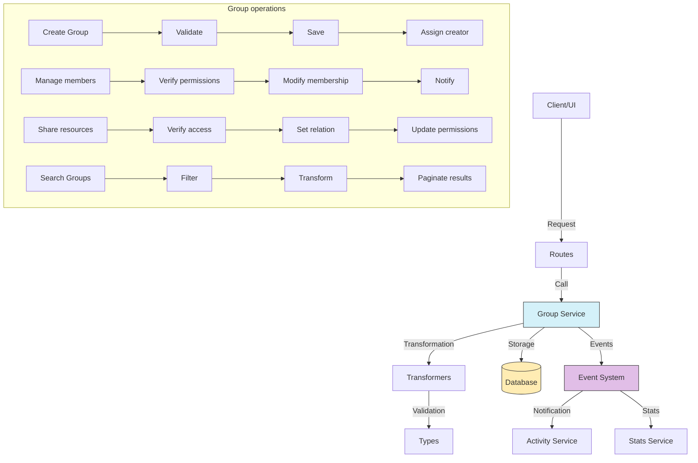

# Group service (Group)

## Overview

The Group service is a central component of the permission and collaboration system.

The service organizes users and manages access to shared resources.

Groups ease collective permission assignment and collaboration among users with common interests or projects.

Groups provide an intermediate layer between individual users and shared resources.

## Flow diagram



Routes call services.

## Module structure

### Service files

```
src/services/group/
├── group.service.ts    # Main service implementation
└── index.ts            # Entry point and exports
```

### Transformer files

```
src/transformers/group/
├── index.ts            # Module exports
├── mappers.ts          # Functions that map between objects
├── serializers.ts      # Serializers for different formats
└── transformer.ts      # Main transformer
```

### Data types

```
src/types/entities/group/
├── index.ts            # Module exports
├── schema.ts           # Validation schemas
└── types.ts            # Type and interface definitions
```

### Route modules

```
src/app/actions/groups/
├── group.actions.ts    # Actions for all operations
└── index.ts            # Module exports
```

## Main features

### 1. Group management

The service provides the following Group operations:

- **Create Group**: Creates new Groups with name, description, and initial configuration.
- **Get Group**: Retrieves detailed Group information by ID.
- **Update Group**: Changes properties and configuration of an existing Group.
- **Delete Group**: Deletes a Group and its relations in a safe way.
- **List Groups**: Gets Groups with filters, sort, and pagination.

### 2. Member management

The service provides the following member operations:

- **Add member**: Adds a user to a Group with a specific role.
- **Remove member**: Removes a user from a Group.
- **Update role**: Changes the role of a member inside the Group.
- **List members**: Gets all members of a Group with their roles.
- **Verify membership**: Checks whether a user is a member of a specific Group.

### 3. Access control and sharing

The service provides the following access operations:

- **Share resource**: Grants access to a resource for all Group members.
- **Revoke access**: Removes Group access to a specific resource.
- **Verify permission**: Checks whether a Group has permissions on a resource.
- **List resources**: Gets all resources shared with a Group.
- **Get Groups with access**: Lists all Groups that have access to a resource.

### 4. Advanced features

The service provides the following advanced features:

- **Group hierarchies**: Support for nested Groups and permission inheritance.
- **Custom roles**: Definition of roles with specific permission sets.
- **Invitations**: System that invites users to join Groups.
- **Statistics**: Analysis of activity and resource use inside the Group.

## Usage examples

### Create a new Group

```typescript
import { groupService } from '@/services/index';

// Create a basic Group
const newGroup = await groupService.createGroup({
	name: 'Design Team',
	description: 'Group for collaboration of the graphic design team',
	isPrivate: false,
	avatarUrl: 'https://example.com/avatars/design-team.png',
});

// Create a Group with advanced configuration
const projectGroup = await groupService.createGroup({
	name: 'Project XYZ',
	description: 'Private group for the development of Project XYZ',
	isPrivate: true,
	joinPolicy: 'INVITE_ONLY',
	features: ['STORAGE_QUOTA_10GB', 'MAX_MEMBERS_15'],
});
```

### Manage Group members

```typescript
import { groupService } from '@/services/index';

// Add a member to the Group
await groupService.addMember('group-id-123', 'user-id-456', {
	role: 'EDITOR',
	addedBy: 'admin-user-id',
});

// Get all members of a Group
const members = await groupService.getGroupMembers('group-id-123', {
	includeRoles: true,
	page: 1,
	limit: 50,
});

// Update the role of a member
await groupService.updateMemberRole('group-id-123', 'user-id-456', 'ADMIN');

// Remove a member from the Group
await groupService.removeMember('group-id-123', 'user-id-456');
```

### Share resources with the Group

```typescript
import { groupService } from '@/services/index';

// Share a Collection with a Group
await groupService.shareResource('group-id-123', {
	resourceType: 'COLLECTION',
	resourceId: 'collection-id-789',
	accessLevel: 'READ_WRITE',
});

// Get all Collections shared with a Group
const collections = await groupService.getGroupResources('group-id-123', {
	resourceType: 'COLLECTION',
	page: 1,
	limit: 20,
});

// Update permissions of a resource
await groupService.updateResourceAccess('group-id-123', 'collection-id-789', {
	accessLevel: 'READ_ONLY',
});

// Revoke access to a resource
await groupService.revokeResourceAccess('group-id-123', {
	resourceType: 'COLLECTION',
	resourceId: 'collection-id-789',
});
```

### Search and filter Groups

```typescript
import { groupService } from '@/services/index';

// Search Groups with filters
const groups = await groupService.findGroups({
	search: 'design',
	isPrivate: false,
	memberCount: { min: 5 },
	sortBy: 'activityLevel',
	sortDirection: 'desc',
	page: 1,
	limit: 20,
});

// Get Groups that a user belongs to
const userGroups = await groupService.getUserGroups('user-id-456', {
	roles: ['ADMIN', 'EDITOR'],
	includePrivate: true,
});
```

## Relations with other entities

| Entity         | Relation type    | Description                                             |
| -------------- | ---------------- | ------------------------------------------------------- |
| **User**       | Many to many     | Users can belong to multiple Groups                     |
| **Collection** | Many to many     | Collections can be shared with Groups                   |
| **Album**      | Many to many     | Albums can be shared with Groups                        |
| **Folder**     | Many to many     | Folders can be shared with Groups                       |
| **Image**      | Many to many     | Images can be shared with Groups directly               |
| **Video**      | Many to many     | Videos can be shared with Groups directly               |
| **Activity**   | Referential      | Activities can reference Groups                         |
| **Group**      | Self-referential | Groups can be nested (parent-child Group)               |

## Data model

```typescript
// Basic Group model
interface Group {
	id: string; // Unique identifier
	name: string; // Group name
	description?: string; // Optional description
	isPrivate: boolean; // Indicates whether the Group is private
	avatarUrl?: string; // URL of the Group profile image
	joinPolicy: GroupJoinPolicy; // Join policy (OPEN, APPROVAL, INVITE_ONLY)
	memberCount: number; // Total number of members
	parentId?: string; // Parent Group ID (if it is a subgroup)
	features: string[]; // Enabled features or capabilities
	createdAt: Date; // Creation date
	updatedAt: Date; // Last update date
}

// Group membership
interface GroupMembership {
	groupId: string; // Group ID
	userId: string; // Member user ID
	role: GroupRole; // User role (ADMIN, EDITOR, VIEWER)
	joinedAt: Date; // Date joined the Group
	addedBy?: string; // ID of the user who added the member
	status: MembershipStatus; // Status (ACTIVE, PENDING, BLOCKED)
}

// Resource access
interface GroupResourceAccess {
	groupId: string; // Group ID
	resourceType: ResourceType; // Resource type (COLLECTION, ALBUM, FOLDER, etc.)
	resourceId: string; // Resource ID
	accessLevel: AccessLevel; // Access level (READ, READ_WRITE, ADMIN)
	grantedAt: Date; // Date the access was granted
	grantedBy: string; // ID of the user who granted the access
}
```

## Good practices

Always verify permissions before you run operations on Groups.

Use transactions for operations that modify multiple relations.

Implement permission propagation correctly in nested Groups.

Set reasonable limits on the number of members and resources per Group.

Notify relevant members about important changes in the Group.

Keep a record of significant changes in membership and permissions.

Optimize queries for Groups with a large number of members or resources.

## Common troubleshooting

| Problem                     | Solution                                                                                     |
| --------------------------- | -------------------------------------------------------------------------------------------- |
| **Role conflicts**          | Implement a clear precedence policy when a user has multiple roles                           |
| **Abandoned Groups**        | Configure automatic cleanup of inactive Groups with no members or only inactive members      |
| **Permission overload**     | Use predefined roles instead of granular permissions to simplify management                  |
| **Scalability**             | Implement permission cache and batch verification to improve performance                     |
| **Pending invitations**     | Set an expiration time for unaccepted invitations                                            |

## Roadmap and future improvements

The following work is planned:

- Implementation of more advanced governance policies for large Groups
- Template system to create Groups with predefined configurations
- Audit and compliance capabilities for activities inside the Group
- Metrics and analysis of collaboration and resource use
- Integration with external authentication systems and user directories
