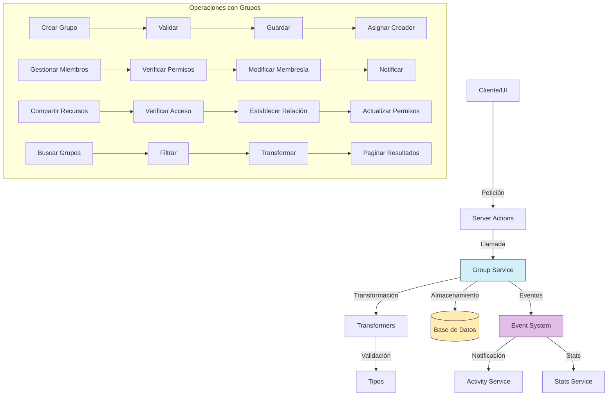

# Servicio de Grupos (Group)

## Descripción General

El servicio de grupos (Group) es un componente central del sistema de gestión de permisos y colaboración que permite organizar usuarios y administrar el acceso a recursos compartidos. Los grupos facilitan la asignación colectiva de permisos y la colaboración entre usuarios con intereses o proyectos comunes, proporcionando una capa intermedia entre usuarios individuales y recursos compartidos.

## Diagrama de Flujo



## Estructura del Módulo

### Archivos del Servicio

```
src/services/group/
├── group.service.ts    # Implementación principal del servicio
└── index.ts            # Punto de entrada y exportaciones
```

### Archivos de Transformers

```
src/transformers/group/
├── index.ts            # Exportaciones del módulo
├── mappers.ts          # Funciones para mapear entre objetos
├── serializers.ts      # Serializadores para distintos formatos
└── transformer.ts      # Transformador principal
```

### Tipos de Datos

```
src/types/entities/group/
├── index.ts            # Exportaciones del módulo
├── schema.ts           # Esquemas de validación
└── types.ts            # Definiciones de tipos e interfaces
```

### Server Actions

```
src/app/actions/groups/
├── group.actions.ts    # Acciones para todas las operaciones
└── index.ts            # Exportaciones del módulo
```

## Funcionalidades Principales

### 1. Gestión de Grupos

- **Crear Grupo**: Permite crear nuevos grupos con nombre, descripción y configuración inicial.
- **Obtener Grupo**: Recupera información detallada de un grupo por su ID.
- **Actualizar Grupo**: Modifica propiedades y configuración de un grupo existente.
- **Eliminar Grupo**: Elimina un grupo y sus relaciones de forma segura.
- **Listar Grupos**: Obtiene grupos con filtros, ordenación y paginación.

### 2. Gestión de Miembros

- **Añadir Miembro**: Agrega un usuario a un grupo con un rol específico.
- **Remover Miembro**: Elimina un usuario de un grupo.
- **Actualizar Rol**: Modifica el rol de un miembro dentro del grupo.
- **Listar Miembros**: Obtiene todos los miembros de un grupo con sus roles.
- **Verificar Pertenencia**: Comprueba si un usuario es miembro de un grupo específico.

### 3. Control de Acceso y Compartición

- **Compartir Recurso**: Concede acceso a un recurso para todos los miembros del grupo.
- **Revocar Acceso**: Elimina el acceso de un grupo a un recurso específico.
- **Verificar Permiso**: Comprueba si un grupo tiene permisos sobre un recurso.
- **Listar Recursos**: Obtiene todos los recursos compartidos con un grupo.
- **Obtener Grupos con Acceso**: Lista todos los grupos que tienen acceso a un recurso.

### 4. Características Avanzadas

- **Jerarquías de Grupos**: Soporte para grupos anidados y herencia de permisos.
- **Roles Personalizados**: Definición de roles con conjuntos específicos de permisos.
- **Invitaciones**: Sistema para invitar usuarios a unirse a grupos.
- **Estadísticas**: Análisis de actividad y uso de recursos dentro del grupo.

## Ejemplos de Uso

### Crear un Nuevo Grupo

```typescript
import { groupService } from '@/services/index';

// Crear un grupo básico
const newGroup = await groupService.createGroup({
  name: 'Equipo de Diseño',
  description: 'Grupo para colaboración del equipo de diseño gráfico',
  isPrivate: false,
  avatarUrl: 'https://example.com/avatars/design-team.png'
});

// Crear un grupo con configuración avanzada
const projectGroup = await groupService.createGroup({
  name: 'Proyecto XYZ',
  description: 'Grupo exclusivo para el desarrollo del Proyecto XYZ',
  isPrivate: true,
  joinPolicy: 'INVITE_ONLY',
  features: ['STORAGE_QUOTA_10GB', 'MAX_MEMBERS_15']
});
```

### Gestionar Miembros del Grupo

```typescript
import { groupService } from '@/services/index';

// Añadir un miembro al grupo
await groupService.addMember('group-id-123', 'user-id-456', {
  role: 'EDITOR',
  addedBy: 'admin-user-id'
});

// Obtener todos los miembros de un grupo
const members = await groupService.getGroupMembers('group-id-123', {
  includeRoles: true,
  page: 1,
  limit: 50
});

// Actualizar el rol de un miembro
await groupService.updateMemberRole('group-id-123', 'user-id-456', 'ADMIN');

// Remover un miembro del grupo
await groupService.removeMember('group-id-123', 'user-id-456');
```

### Compartir Recursos con el Grupo

```typescript
import { groupService } from '@/services/index';

// Compartir una colección con un grupo
await groupService.shareResource('group-id-123', {
  resourceType: 'COLLECTION',
  resourceId: 'collection-id-789',
  accessLevel: 'READ_WRITE'
});

// Obtener todas las colecciones compartidas con un grupo
const collections = await groupService.getGroupResources('group-id-123', {
  resourceType: 'COLLECTION',
  page: 1,
  limit: 20
});

// Actualizar permisos de un recurso
await groupService.updateResourceAccess('group-id-123', 'collection-id-789', {
  accessLevel: 'READ_ONLY'
});

// Revocar acceso a un recurso
await groupService.revokeResourceAccess('group-id-123', {
  resourceType: 'COLLECTION',
  resourceId: 'collection-id-789'
});
```

### Buscar y Filtrar Grupos

```typescript
import { groupService } from '@/services/index';

// Buscar grupos con filtros
const groups = await groupService.findGroups({
  search: 'diseño',
  isPrivate: false,
  memberCount: { min: 5 },
  sortBy: 'activityLevel',
  sortDirection: 'desc',
  page: 1,
  limit: 20
});

// Obtener grupos a los que pertenece un usuario
const userGroups = await groupService.getUserGroups('user-id-456', {
  roles: ['ADMIN', 'EDITOR'],
  includePrivate: true
});
```

## Relaciones con Otras Entidades

| Entidad        | Tipo de Relación     | Descripción                                          |
|----------------|----------------------|------------------------------------------------------|
| **User**       | Muchos a muchos      | Los usuarios pueden pertenecer a múltiples grupos    |
| **Collection** | Muchos a muchos      | Las colecciones pueden compartirse con grupos        |
| **Album**      | Muchos a muchos      | Los álbumes pueden compartirse con grupos            |
| **Folder**     | Muchos a muchos      | Las carpetas pueden compartirse con grupos           |
| **Image**      | Muchos a muchos      | Las imágenes pueden compartirse con grupos directamente |
| **Video**      | Muchos a muchos      | Los videos pueden compartirse con grupos directamente |
| **Activity**   | Referencial          | Las actividades pueden referenciar grupos            |
| **Group**      | Auto-referencial     | Los grupos pueden estar anidados (grupo padre-hijo)  |

## Modelo de Datos

```typescript
// Modelo básico de Group
interface Group {
  id: string;                  // Identificador único
  name: string;                // Nombre del grupo
  description?: string;        // Descripción opcional
  isPrivate: boolean;          // Indica si el grupo es privado
  avatarUrl?: string;          // URL de la imagen de perfil del grupo
  joinPolicy: GroupJoinPolicy; // Política de unión (OPEN, APPROVAL, INVITE_ONLY)
  memberCount: number;         // Número total de miembros
  parentId?: string;           // ID del grupo padre (si es un subgrupo)
  features: string[];          // Características o capacidades habilitadas
  createdAt: Date;             // Fecha de creación
  updatedAt: Date;             // Fecha de última actualización
}

// Membresía de Grupo
interface GroupMembership {
  groupId: string;             // ID del grupo
  userId: string;              // ID del usuario miembro
  role: GroupRole;             // Rol del usuario (ADMIN, EDITOR, VIEWER)
  joinedAt: Date;              // Fecha de unión al grupo
  addedBy?: string;            // ID del usuario que añadió al miembro
  status: MembershipStatus;    // Estado (ACTIVE, PENDING, BLOCKED)
}

// Acceso a recurso
interface GroupResourceAccess {
  groupId: string;             // ID del grupo
  resourceType: ResourceType;  // Tipo de recurso (COLLECTION, ALBUM, FOLDER, etc.)
  resourceId: string;          // ID del recurso
  accessLevel: AccessLevel;    // Nivel de acceso (READ, READ_WRITE, ADMIN)
  grantedAt: Date;             // Fecha en que se concedió el acceso
  grantedBy: string;           // ID del usuario que concedió el acceso
}
```

## Buenas Prácticas

1. **Control de Permisos**: Verifique siempre los permisos antes de realizar operaciones en grupos.
2. **Transacciones**: Use transacciones para operaciones que modifican múltiples relaciones.
3. **Propagación Jerárquica**: Implemente correctamente la propagación de permisos en grupos anidados.
4. **Límites**: Establezca límites razonables en el número de miembros y recursos por grupo.
5. **Notificaciones**: Notifique a los miembros relevantes sobre cambios importantes en el grupo.
6. **Historial**: Mantenga un registro de cambios significativos en la membresía y permisos.
7. **Rendimiento**: Optimice las consultas para grupos con gran número de miembros o recursos.

## Solución de Problemas Comunes

| Problema | Solución |
|----------|----------|
| **Conflictos de roles** | Implemente una política clara de precedencia cuando un usuario tiene múltiples roles |
| **Grupos abandonados** | Configure limpieza automática de grupos inactivos sin miembros o con solo miembros inactivos |
| **Sobrecarga de permisos** | Utilice roles predefinidos en lugar de permisos granulares para simplificar la gestión |
| **Escalabilidad** | Implemente caché de permisos y verifique en lotes para mejorar rendimiento |
| **Invitaciones pendientes** | Establezca un tiempo de expiración para invitaciones no aceptadas |

## Roadmap y Mejoras Futuras

- Implementación de políticas de gobierno más avanzadas para grupos grandes
- Sistema de plantillas para crear grupos con configuraciones predefinidas
- Capacidades de auditoría y cumplimiento para actividades dentro del grupo
- Métricas y análisis de colaboración y uso de recursos
- Integración con sistemas externos de autenticación y directorios de usuarios