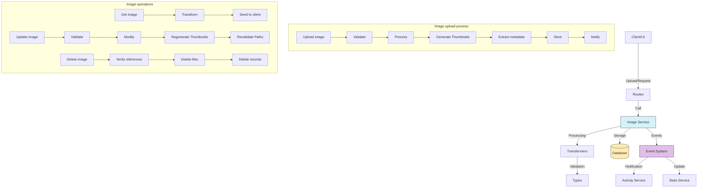

# Image service (Image)

## Overview

The Image service is a central component of the image management system.

The service stores, organizes, and manipulates image files.

The service provides functions to upload, process, retrieve, update, and delete images.

The service also manages metadata, thumbnails, and relations with other entities.

## Flow diagram



Routes call services.

## Module structure

### Service files

```
src/services/image/
├── image.service.ts    # Main service implementation
└── index.ts            # Entry point and exports
```

### Transformer files

```
src/transformers/image/
├── index.ts           # Module exports
├── mappers.ts         # Functions that map between objects
├── serializers.ts     # Serializers for different formats
└── transformer.ts     # Main transformer
```

### Data types

```
src/types/entities/image/
├── base.ts           # Basic types for images
├── complete.ts       # Complete types with all relations
├── enums.ts          # Enumerations for images
├── extended.ts       # Extended types with extra information
├── index.ts          # Module exports
├── transformer.ts    # Types specific to transformers
└── types.ts          # Main type and interface definitions
```

### Route modules

```
src/app/actions/images/
├── folder-images.action.ts        # Actions for images in Folders
├── image-access.actions.ts        # Image access control
├── image-crud.actions.ts          # Basic CRUD operations
├── image-processing.actions.ts    # Image processing
├── image-stats.actions.ts         # Image statistics
├── image-thumbnails.actions.ts    # Thumbnail generation and management
├── image-types.actions.ts         # Actions related to image types
├── images-random.action.ts        # Retrieval of random images
└── index.ts                       # Module exports
```

## Main features

### 1. Image management

The service provides the following image operations:

- **Upload image**: Loads new image files with format validation.
- **Get image**: Retrieves detailed image information by ID.
- **Update image**: Changes properties and metadata of an existing image.
- **Delete image**: Deletes an image and its associated resources in a safe way.
- **List images**: Gets images with filters, sort, and pagination.

### 2. Image processing

The service provides the following processing operations:

- **Thumbnail generation**: Automatically creates reduced versions for preview.
- **Metadata extraction**: Gets EXIF information, dimensions, and other technical metadata.
- **Optimization**: Compression and optimization of images to improve performance.
- **Resize**: Size adjustment for specific needs.

### 3. Organization and search

The service provides the following organization operations:

- **Grouping in Folders**: Hierarchical organization in Folders.
- **Tagging**: Addition and management of Tags for classification.
- **Advanced search**: Search by metadata, names, dates, and other criteria.
- **Collections**: Grouping in thematic Collections.

### 4. Advanced features

The service provides the following advanced features:

- **Access control**: Management of permissions and image visibility.
- **Statistics**: Analysis of use, views, and downloads.
- **Favorites**: Marking of Favorite images for fast access.
- **Automatic detection**: Classification through computer-vision algorithms.

## Usage examples

### Upload a new image

```typescript
import { imageService } from '@/services/index';

// Upload an image to a specific Folder
const newImage = await imageService.uploadImage({
	file: imageFile, // Browser File object
	name: 'Sunrise at the beach',
	description: 'Photograph of sunrise at the Valencia beach',
	folderId: 'folder-id-123',
	tags: ['sunrise', 'beach', 'nature'],
	isPrivate: false,
});
```

### Get images with filters

```typescript
import { imageService } from '@/services/index';

// Get images with advanced filters
const images = await imageService.getImages({
	search: 'beach',
	tags: ['vacation'],
	folderId: 'folder-id-123',
	minWidth: 1920,
	minHeight: 1080,
	formats: ['jpeg', 'png'],
	dateFrom: new Date('2023-01-01'),
	dateTo: new Date('2023-12-31'),
	sortBy: 'createdAt',
	sortDirection: 'desc',
	page: 1,
	limit: 20,
});
```

### Update an image

```typescript
import { imageService } from '@/services/index';

// Update image properties
const updatedImage = await imageService.updateImage('image-id-123', {
	name: 'New image title',
	description: 'Updated description',
	isPrivate: true,
	tags: ['tag1', 'tag2'],
	folderId: 'new-folder-id',
});
```

### Generate thumbnails

```typescript
import { imageService } from '@/services/index';

// Generate or regenerate thumbnails for an image
const thumbnails = await imageService.generateThumbnails('image-id-123', {
	sizes: ['small', 'medium', 'large'],
	forceRegenerate: true,
});
```

### Get metadata of an image

```typescript
import { imageService } from '@/services/index';

// Get technical and EXIF metadata of an image
const metadata = await imageService.getImageMetadata('image-id-123');

console.log(`Dimensions: ${metadata.width}x${metadata.height}`);
console.log(`Camera: ${metadata.exif?.make} ${metadata.exif?.model}`);
console.log(`Capture date: ${metadata.exif?.dateTimeOriginal}`);
```

## Relations with other entities

| Entity         | Relation type    | Description                                   |
| -------------- | ---------------- | --------------------------------------------- |
| **Folder**     | Many to one      | Images belong to Folders                      |
| **Tag**        | Many to many     | Images can have multiple Tags                 |
| **Album**      | Many to many     | Images can be part of Albums                  |
| **Collection** | Many to many     | Images can be in Collections                  |
| **Metadata**   | One to one       | Each image has associated metadata            |
| **Thumbnail**  | One to many      | An image can have multiple thumbnails         |
| **Activity**   | Referential      | Activities can reference images               |
| **User**       | Many to one      | Images belong to users                        |

## Data model

```typescript
// Simplified Image model
interface Image {
	id: string; // Unique identifier
	name: string; // Image name or title
	description?: string; // Optional description
	path: string; // Full path on the filesystem
	originalFilename: string; // Original filename
	mimeType: string; // MIME type (image/jpeg, image/png, etc.)
	size: number; // Size in bytes
	width: number; // Width in pixels
	height: number; // Height in pixels
	format: ImageFormat; // Format (jpeg, png, gif, etc.)
	folderId?: string; // Containing Folder ID
	isPrivate: boolean; // Indicates whether the image is private
	isFavorite: boolean; // Indicates whether it is marked as a Favorite
	status: ImageStatus; // Image status (ACTIVE, PROCESSING, etc.)
	uploadedAt: Date; // Upload date
	capturedAt?: Date; // Capture date (from EXIF if available)
	createdAt: Date; // Creation date
	updatedAt: Date; // Last update date
}

// Extension with metadata
interface ImageWithMetadata extends Image {
	metadata: {
		exif?: ExifMetadata; // EXIF metadata (camera, settings, GPS)
		colorProfile?: string; // Color profile
		colorSpace?: string; // Color space
		hasAlpha: boolean; // Indicates whether it has an alpha channel
		dpi?: number; // Dots per inch
		orientation?: number; // EXIF orientation
	};
}

// Extension with relations
interface ImageComplete extends ImageWithMetadata {
	folder?: Folder; // Containing Folder
	thumbnails: Thumbnail[]; // Associated thumbnails
	tags: Tag[]; // Associated Tags
	albums: Album[]; // Albums that contain this image
	collections: Collection[]; // Collections that contain this image
	user: User; // Owner user
}
```

## Good practices

Verify size, type, and format before you process images.

Use queues for processing of heavy images.

Implement a robust error-handling system.

Organize physical files with a logical structure.

Verify permissions before you allow access to private images.

Update cache when images are modified.

Remove sensitive data from EXIF metadata if needed.

## Performance optimization

Use modern formats such as WebP for better compression.

Provide different sizes for different devices.

Implement lazy loading for images.

Adjust compression levels by need.

Use content delivery networks for public images.

## Common troubleshooting

| Problem                    | Solution                                                |
| -------------------------- | ------------------------------------------------------- |
| **Orphan images**          | Run `imageService.findOrphanImages()` to detect them    |
| **Missing thumbnails**     | Use `imageService.regenerateMissingThumbnails()`        |
| **Image corruption**       | Validate with `imageService.verifyImageIntegrity()`     |
| **Incorrect metadata**     | Repair with `imageService.refreshMetadata()`            |
| **Permission problems**    | Verify with `imageService.validateAccess()`             |

## Roadmap and future improvements

The following work is planned:

- Implementation of object and scene recognition
- Improvements in compression and optimization algorithms
- Visual search by similarity
- Basic image editing from the interface
- Support for custom metadata defined by the user
