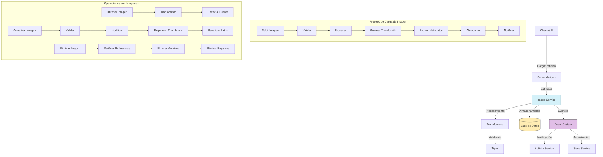

# Servicio de Imágenes (Image)

## Descripción General

El servicio de imágenes (Image) es un componente central del sistema de gestión de imágenes que permite almacenar, organizar y manipular archivos de imagen. Este servicio proporciona funcionalidades para subir, procesar, recuperar, actualizar y eliminar imágenes, así como gestionar sus metadatos, miniaturas y relaciones con otras entidades.

## Diagrama de Flujo



## Estructura del Módulo

### Archivos del Servicio

```
src/services/image/
├── image.service.ts    # Implementación principal del servicio
└── index.ts            # Punto de entrada y exportaciones
```

### Archivos de Transformers

```
src/transformers/image/
├── index.ts           # Exportaciones del módulo
├── mappers.ts         # Funciones para mapear entre objetos
├── serializers.ts     # Serializadores para distintos formatos
└── transformer.ts     # Transformador principal
```

### Tipos de Datos

```
src/types/entities/image/
├── base.ts           # Tipos básicos para imágenes
├── complete.ts       # Tipos completos con todas las relaciones
├── enums.ts          # Enumeraciones para imágenes
├── extended.ts       # Tipos extendidos con información adicional
├── index.ts          # Exportaciones del módulo
├── transformer.ts    # Tipos específicos para transformers
└── types.ts          # Definiciones principales de tipos e interfaces
```

### Server Actions

```
src/app/actions/images/
├── folder-images.action.ts        # Acciones para imágenes en carpetas
├── image-access.actions.ts        # Control de acceso a imágenes
├── image-crud.actions.ts          # Operaciones CRUD básicas
├── image-processing.actions.ts    # Procesamiento de imágenes
├── image-stats.actions.ts         # Estadísticas de imágenes
├── image-thumbnails.actions.ts    # Generación y gestión de miniaturas
├── image-types.actions.ts         # Acciones relacionadas con tipos de imagen
├── images-random.action.ts        # Obtención de imágenes aleatorias
└── index.ts                       # Exportaciones del módulo
```

## Funcionalidades Principales

### 1. Gestión de Imágenes

- **Subir Imagen**: Permite cargar nuevos archivos de imagen con validación de formatos.
- **Obtener Imagen**: Recupera información detallada de una imagen por su ID.
- **Actualizar Imagen**: Modifica propiedades y metadatos de una imagen existente.
- **Eliminar Imagen**: Elimina una imagen y sus recursos asociados de forma segura.
- **Listar Imágenes**: Obtiene imágenes con filtros, ordenación y paginación.

### 2. Procesamiento de Imágenes

- **Generación de Miniaturas**: Crea automáticamente versiones reducidas para previsualización.
- **Extracción de Metadatos**: Obtiene información EXIF, dimensiones, y otros metadatos técnicos.
- **Optimización**: Compresión y optimización de imágenes para mejorar rendimiento.
- **Redimensionamiento**: Ajuste de tamaño según necesidades específicas.

### 3. Organización y Búsqueda

- **Agrupación en Carpetas**: Organización jerárquica en carpetas.
- **Etiquetado**: Adición y gestión de etiquetas para clasificación.
- **Búsqueda Avanzada**: Búsqueda por metadatos, nombres, fechas y otros criterios.
- **Colecciones**: Agrupación en colecciones temáticas.

### 4. Características Avanzadas

- **Control de Acceso**: Gestión de permisos y visibilidad de imágenes.
- **Estadísticas**: Análisis de uso, visualizaciones y descargas.
- **Favoritos**: Marcado de imágenes favoritas para acceso rápido.
- **Detección Automática**: Clasificación mediante algoritmos de visión por computadora.

## Ejemplos de Uso

### Subir una Nueva Imagen

```typescript
import { imageService } from '@/services/index';

// Subir una imagen a una carpeta específica
const newImage = await imageService.uploadImage({
  file: imageFile, // Objeto File del navegador
  name: 'Amanecer en la playa',
  description: 'Fotografía del amanecer en la playa de Valencia',
  folderId: 'folder-id-123',
  tags: ['amanecer', 'playa', 'naturaleza'],
  isPrivate: false
});
```

### Obtener Imágenes con Filtros

```typescript
import { imageService } from '@/services/index';

// Obtener imágenes con filtros avanzados
const images = await imageService.getImages({
  search: 'playa',
  tags: ['vacaciones'],
  folderId: 'folder-id-123',
  minWidth: 1920,
  minHeight: 1080,
  formats: ['jpeg', 'png'],
  dateFrom: new Date('2023-01-01'),
  dateTo: new Date('2023-12-31'),
  sortBy: 'createdAt',
  sortDirection: 'desc',
  page: 1,
  limit: 20
});
```

### Actualizar una Imagen

```typescript
import { imageService } from '@/services/index';

// Actualizar propiedades de una imagen
const updatedImage = await imageService.updateImage('image-id-123', {
  name: 'Nuevo título de imagen',
  description: 'Descripción actualizada',
  isPrivate: true,
  tags: ['etiqueta1', 'etiqueta2'],
  folderId: 'nueva-carpeta-id'
});
```

### Generar Miniaturas

```typescript
import { imageService } from '@/services/index';

// Generar o regenerar miniaturas para una imagen
const thumbnails = await imageService.generateThumbnails('image-id-123', {
  sizes: ['small', 'medium', 'large'],
  forceRegenerate: true
});
```

### Obtener Metadatos de una Imagen

```typescript
import { imageService } from '@/services/index';

// Obtener metadatos técnicos y EXIF de una imagen
const metadata = await imageService.getImageMetadata('image-id-123');

console.log(`Dimensiones: ${metadata.width}x${metadata.height}`);
console.log(`Cámara: ${metadata.exif?.make} ${metadata.exif?.model}`);
console.log(`Fecha de captura: ${metadata.exif?.dateTimeOriginal}`);
```

## Relaciones con Otras Entidades

| Entidad        | Tipo de Relación     | Descripción                                          |
|----------------|----------------------|------------------------------------------------------|
| **Folder**     | Muchos a uno         | Las imágenes pertenecen a carpetas                   |
| **Tag**        | Muchos a muchos      | Las imágenes pueden tener múltiples etiquetas        |
| **Album**      | Muchos a muchos      | Las imágenes pueden formar parte de álbumes          |
| **Collection** | Muchos a muchos      | Las imágenes pueden estar en colecciones             |
| **Metadata**   | Uno a uno            | Cada imagen tiene metadatos asociados                |
| **Thumbnail**  | Uno a muchos         | Una imagen puede tener múltiples miniaturas          |
| **Activity**   | Referencial          | Las actividades pueden referenciar imágenes          |
| **User**       | Muchos a uno         | Las imágenes pertenecen a usuarios                   |

## Modelo de Datos

```typescript
// Modelo simplificado de Image
interface Image {
  id: string;                  // Identificador único
  name: string;                // Nombre o título de la imagen
  description?: string;        // Descripción opcional
  path: string;                // Ruta completa en el sistema de archivos
  originalFilename: string;    // Nombre de archivo original
  mimeType: string;            // Tipo MIME (image/jpeg, image/png, etc.)
  size: number;                // Tamaño en bytes
  width: number;               // Ancho en píxeles
  height: number;              // Alto en píxeles
  format: ImageFormat;         // Formato (jpeg, png, gif, etc.)
  folderId?: string;           // ID de la carpeta contenedora
  isPrivate: boolean;          // Indica si la imagen es privada
  isFavorite: boolean;         // Indica si está marcada como favorita
  status: ImageStatus;         // Estado de la imagen (ACTIVE, PROCESSING, etc.)
  uploadedAt: Date;            // Fecha de subida
  capturedAt?: Date;           // Fecha de captura (de EXIF si disponible)
  createdAt: Date;             // Fecha de creación
  updatedAt: Date;             // Fecha de última actualización
}

// Extensión con metadatos
interface ImageWithMetadata extends Image {
  metadata: {
    exif?: ExifMetadata;       // Metadatos EXIF (cámara, configuración, GPS, etc.)
    colorProfile?: string;     // Perfil de color
    colorSpace?: string;       // Espacio de color
    hasAlpha: boolean;         // Indica si tiene canal alfa
    dpi?: number;              // Puntos por pulgada
    orientation?: number;      // Orientación EXIF
  }
}

// Extensión con relaciones
interface ImageComplete extends ImageWithMetadata {
  folder?: Folder;             // Carpeta contenedora
  thumbnails: Thumbnail[];     // Miniaturas asociadas
  tags: Tag[];                 // Etiquetas asociadas
  albums: Album[];             // Álbumes que contienen esta imagen
  collections: Collection[];   // Colecciones que contienen esta imagen
  user: User;                  // Usuario propietario
}
```

## Buenas Prácticas

1. **Validación de Archivos**: Verifique tamaño, tipo y formato antes de procesar imágenes.
2. **Procesamiento Asíncrono**: Use colas para procesamiento de imágenes pesadas.
3. **Manejo de Errores**: Implemente un sistema robusto de manejo de errores.
4. **Almacenamiento Eficiente**: Organice los archivos físicos siguiendo una estructura lógica.
5. **Seguridad**: Verifique permisos antes de permitir acceso a imágenes privadas.
6. **Revalidación de Caché**: Actualice caché cuando se modifiquen imágenes.
7. **Metadatos Sensibles**: Elimine datos sensibles de los metadatos EXIF si es necesario.

## Optimización de Rendimiento

1. **Formatos Modernos**: Utilice formatos como WebP para mejor compresión.
2. **Carga Responsiva**: Proporcione diferentes tamaños para diferentes dispositivos.
3. **Carga Diferida**: Implemente lazy loading para imágenes.
4. **Compresión Inteligente**: Ajuste niveles de compresión según necesidades.
5. **CDN**: Utilice redes de distribución de contenido para imágenes públicas.

## Solución de Problemas Comunes

| Problema | Solución |
|----------|----------|
| **Imágenes huérfanas** | Ejecute `imageService.findOrphanImages()` para detectar |
| **Miniaturas faltantes** | Use `imageService.regenerateMissingThumbnails()` |
| **Corrupción de imágenes** | Valide con `imageService.verifyImageIntegrity()` |
| **Metadatos incorrectos** | Repare con `imageService.refreshMetadata()` |
| **Problemas de permisos** | Verifique con `imageService.validateAccess()` |

## Roadmap y Mejoras Futuras

- Implementación de reconocimiento de objetos y escenas
- Mejoras en algoritmos de compresión y optimización
- Búsqueda visual por similitud
- Edición básica de imágenes desde la interfaz
- Soporte para metadatos personalizados definidos por el usuario