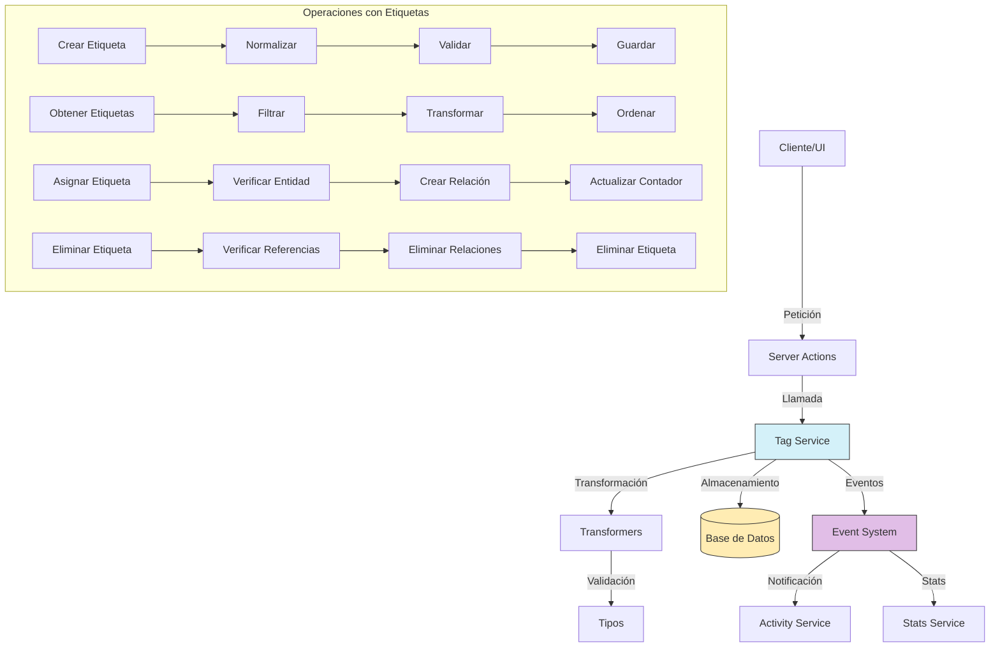

# Servicio de Etiquetas (Tag)

## Descripción General

El servicio de etiquetas (Tag) es un componente fundamental del sistema de organización y clasificación que permite categorizar y filtrar contenido mediante palabras clave o términos descriptivos. Las etiquetas proporcionan una forma flexible y transversal de organizar contenido, complementando otros sistemas como carpetas y colecciones pero con un enfoque más orientado a conceptos y características.

## Diagrama de Flujo



## Estructura del Módulo

### Archivos del Servicio

```
src/services/tag/
├── tag.service.ts    # Implementación principal del servicio
└── index.ts          # Punto de entrada y exportaciones
```

### Archivos de Transformers

```
src/transformers/tag/
├── index.ts          # Exportaciones del módulo
├── mappers.ts        # Funciones para mapear entre objetos
├── serializers.ts    # Serializadores para distintos formatos
├── transformer.ts    # Transformador principal
└── v2/               # Nueva versión del transformer (en desarrollo)
```

### Tipos de Datos

```
src/types/entities/tag/
├── base.ts           # Tipos básicos para etiquetas
├── enums.ts          # Enumeraciones para etiquetas
├── extended.ts       # Tipos extendidos con información adicional
├── index.ts          # Exportaciones del módulo
├── schema.ts         # Esquemas de validación
└── types.ts          # Definiciones de tipos e interfaces
```

### Server Actions

```
src/app/actions/tags/
├── crud.actions.ts      # Acciones CRUD básicas
├── index.ts             # Exportaciones del módulo
├── query.actions.ts     # Consultas y búsquedas
└── relation.actions.ts  # Gestión de relaciones con otras entidades
```

## Funcionalidades Principales

### 1. Gestión de Etiquetas

- **Crear Etiqueta**: Permite crear nuevas etiquetas con normalización de nombres.
- **Obtener Etiqueta**: Recupera información detallada de una etiqueta por su ID.
- **Actualizar Etiqueta**: Modifica propiedades de una etiqueta existente.
- **Eliminar Etiqueta**: Elimina una etiqueta y sus relaciones de forma segura.
- **Listar Etiquetas**: Obtiene etiquetas con filtros, ordenación y paginación.

### 2. Gestión de Relaciones

- **Asignar Etiqueta**: Asocia una etiqueta a una entidad (imagen, video, carpeta, etc.).
- **Eliminar Asignación**: Remueve la asociación entre una etiqueta y una entidad.
- **Obtener Entidades**: Recupera todas las entidades asociadas a una etiqueta.
- **Obtener Etiquetas**: Recupera todas las etiquetas asociadas a una entidad.

### 3. Categorización y Jerarquía

- **Categorías**: Organización de etiquetas en categorías predefinidas.
- **Jerarquía**: Soporte opcional para relaciones padre-hijo entre etiquetas.
- **Etiquetas Relacionadas**: Identificación de etiquetas frecuentemente usadas juntas.
- **Sinónimos**: Manejo de términos equivalentes para mejorar la búsqueda.

### 4. Análisis y Estadísticas

- **Popularidad**: Seguimiento de las etiquetas más utilizadas.
- **Frecuencia de Uso**: Historial de aplicación de etiquetas.
- **Recomendaciones**: Sugerencia de etiquetas basadas en contenido similar.
- **Tendencias**: Análisis de cambios en el uso de etiquetas a lo largo del tiempo.

## Ejemplos de Uso

### Crear una Nueva Etiqueta

```typescript
import { tagService } from '@/services/index';

// Crear una etiqueta simple
const newTag = await tagService.createTag({
	name: 'paisaje',
	description: 'Fotografías de paisajes naturales',
	color: '#4CAF50',
	category: 'SUBJECT',
});

// Crear una etiqueta con slug personalizado
const customTag = await tagService.createTag({
	name: 'Retrato en Blanco y Negro',
	slug: 'retrato-bw',
	description: 'Retratos en formato monocromático',
	color: '#607D8B',
	category: 'STYLE',
});
```

### Obtener Etiquetas con Filtros

```typescript
import { tagService } from '@/services/index';

// Obtener etiquetas con filtros
const tags = await tagService.getTags({
	search: 'paisaje',
	categories: ['SUBJECT', 'LOCATION'],
	sortBy: 'usageCount',
	sortDirection: 'desc',
	page: 1,
	limit: 20,
});

// Obtener etiquetas populares
const popularTags = await tagService.getPopularTags(10);
```

### Actualizar una Etiqueta

```typescript
import { tagService } from '@/services/index';

// Actualizar propiedades de una etiqueta
const updatedTag = await tagService.updateTag('tag-id-123', {
	name: 'Paisaje Natural',
	description: 'Fotografías de paisajes naturales sin intervención humana',
	color: '#8BC34A',
	category: 'SUBJECT',
});
```

### Gestionar Relaciones con Entidades

```typescript
import { tagService } from '@/services/index';

// Asignar etiquetas a una imagen
await tagService.assignTagsToEntity('image', 'image-id-123', ['tag-id-1', 'tag-id-2', 'tag-id-3']);

// Obtener todas las imágenes con una etiqueta específica
const images = await tagService.getEntitiesWithTag('image', 'tag-id-123', { page: 1, limit: 50 });

// Eliminar una etiqueta de una entidad
await tagService.removeTagFromEntity('image', 'image-id-123', 'tag-id-1');
```

### Trabajar con Grupos de Etiquetas

```typescript
import { tagService } from '@/services/index';

// Obtener etiquetas agrupadas por categoría
const groupedTags = await tagService.getTagsByCategory();

// Obtener etiquetas relacionadas
const relatedTags = await tagService.getRelatedTags('tag-id-123', 5);
```

## Relaciones con Otras Entidades

| Entidad        | Tipo de Relación | Descripción                                        |
| -------------- | ---------------- | -------------------------------------------------- |
| **Image**      | Muchos a muchos  | Las imágenes pueden tener múltiples etiquetas      |
| **Video**      | Muchos a muchos  | Los videos pueden tener múltiples etiquetas        |
| **Folder**     | Muchos a muchos  | Las carpetas pueden tener múltiples etiquetas      |
| **Album**      | Muchos a muchos  | Los álbumes pueden tener múltiples etiquetas       |
| **Collection** | Muchos a muchos  | Las colecciones pueden tener múltiples etiquetas   |
| **Character**  | Muchos a muchos  | Los personajes pueden tener etiquetas descriptivas |
| **Place**      | Muchos a muchos  | Los lugares pueden tener etiquetas descriptivas    |
| **Tag**        | Auto-referencial | Las etiquetas pueden tener relaciones jerárquicas  |
| **Activity**   | Referencial      | Las actividades pueden referenciar etiquetas       |

## Modelo de Datos

```typescript
// Modelo básico de Tag
interface TagBase {
	id: string; // Identificador único
	name: string; // Nombre visible de la etiqueta
	slug: string; // Versión normalizada para URL y búsqueda
	description?: string; // Descripción opcional
	color?: string; // Color asociado (hex o nombre)
	icon?: string; // Icono representativo (nombre o emoji)
	category?: TagCategory; // Categoría (SUBJECT, STYLE, TECHNICAL, etc.)
	isSystem: boolean; // Indica si es una etiqueta del sistema
	parentId?: string; // ID de la etiqueta padre (si es jerárquica)
	createdAt: Date; // Fecha de creación
	updatedAt: Date; // Fecha de última actualización
}

// Extensión con estadísticas
interface TagWithStats extends TagBase {
	usageCount: number; // Número total de usos
	imageCount: number; // Cantidad de imágenes con esta etiqueta
	videoCount: number; // Cantidad de videos con esta etiqueta
	folderCount: number; // Cantidad de carpetas con esta etiqueta
	albumCount: number; // Cantidad de álbumes con esta etiqueta
	lastUsed?: Date; // Última vez que se usó la etiqueta
}

// Extensión con relaciones
interface TagComplete extends TagWithStats {
	parent?: TagBase; // Etiqueta padre
	children: TagBase[]; // Etiquetas hijas
	relatedTags: TagBase[]; // Etiquetas frecuentemente usadas junto a esta
	synonyms: string[]; // Términos equivalentes
}
```

## Buenas Prácticas

1. **Normalización**: Normalice los nombres de etiquetas para evitar duplicados (mayúsculas, espacios, etc.).
2. **Validación**: Asegúrese de validar y limpiar las entradas para evitar caracteres no deseados.
3. **Uso de Slugs**: Utilice siempre slugs para búsquedas y URL para mayor consistencia.
4. **Transacciones**: Use transacciones al modificar relaciones entre etiquetas y entidades.
5. **Categorización**: Mantenga un sistema coherente de categorías de etiquetas.
6. **Límites**: Considere límites razonables para la cantidad de etiquetas por entidad.
7. **Rendimiento**: Optimice las consultas que implican etiquetas mediante índices apropiados.

## Solución de Problemas Comunes

| Problema                         | Solución                                                           |
| -------------------------------- | ------------------------------------------------------------------ |
| **Etiquetas duplicadas**         | Utilice `tagService.mergeTags()` para fusionar etiquetas similares |
| **Etiquetas huérfanas**          | Identifique con `tagService.findUnusedTags()`                      |
| **Normalización incorrecta**     | Regenere slugs con `tagService.regenerateSlugs()`                  |
| **Inconsistencia en contadores** | Recalcule con `tagService.recalculateUsageCounts()`                |
| **Rendimiento en consultas**     | Utilice etiquetas precomputadas para las entidades más accedidas   |

## Roadmap y Mejoras Futuras

- Implementación de auto-etiquetado mediante análisis de contenido
- Soporte para jerarquías más complejas de etiquetas
- Sistema de sugerencia de etiquetas basado en el contenido
- Análisis de tendencias y patrones de uso de etiquetas
- Integración con sistemas de taxonomía externos para enriquecer metadatos
