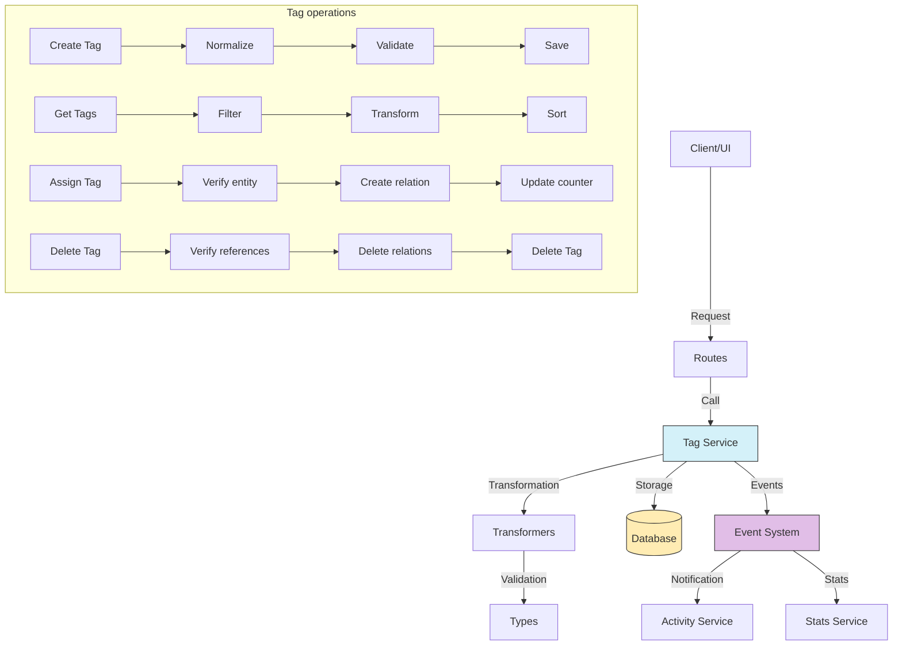

# Tag service (Tag)

## Overview

The Tag service is a fundamental component of the organization and classification system.

The service categorizes and filters content through keywords or descriptive terms.

Tags provide a flexible and cross-cutting way to organize content.

Tags complement other systems such as Folders and Collections, with a focus more oriented to concepts and characteristics.

## Flow diagram



Routes call services.

## Module structure

### Service files

```
src/services/tag/
├── tag.service.ts    # Main service implementation
└── index.ts          # Entry point and exports
```

### Transformer files

```
src/transformers/tag/
├── index.ts          # Module exports
├── mappers.ts        # Functions that map between objects
├── serializers.ts    # Serializers for different formats
├── transformer.ts    # Main transformer
└── v2/               # New transformer version (in development)
```

### Data types

```
src/types/entities/tag/
├── base.ts           # Basic types for Tags
├── enums.ts          # Enumerations for Tags
├── extended.ts       # Extended types with extra information
├── index.ts          # Module exports
├── schema.ts         # Validation schemas
└── types.ts          # Type and interface definitions
```

### Route modules

```
src/app/actions/tags/
├── crud.actions.ts      # Basic CRUD actions
├── index.ts             # Module exports
├── query.actions.ts     # Queries and searches
└── relation.actions.ts  # Relation management with other entities
```

## Main features

### 1. Tag management

The service provides the following Tag operations:

- **Create Tag**: Creates new Tags with name normalization.
- **Get Tag**: Retrieves detailed Tag information by ID.
- **Update Tag**: Changes properties of an existing Tag.
- **Delete Tag**: Deletes a Tag and its relations in a safe way.
- **List Tags**: Gets Tags with filters, sort, and pagination.

### 2. Relation management

The service provides the following relation operations:

- **Assign Tag**: Associates a Tag with an entity (image, video, Folder).
- **Remove assignment**: Removes the association between a Tag and an entity.
- **Get entities**: Retrieves all entities associated with a Tag.
- **Get Tags**: Retrieves all Tags associated with an entity.

### 3. Categorization and hierarchy

The service provides the following organization operations:

- **Categories**: Organization of Tags in predefined categories.
- **Hierarchy**: Optional support for parent-child relations between Tags.
- **Related Tags**: Identification of Tags frequently used together.
- **Synonyms**: Handling of equivalent terms to improve search.

### 4. Analysis and statistics

The service provides the following analysis operations:

- **Popularity**: Tracking of the most used Tags.
- **Usage frequency**: History of Tag application.
- **Recommendations**: Suggestion of Tags based on similar content.
- **Trends**: Analysis of changes in Tag use over time.

## Usage examples

### Create a new Tag

```typescript
import { tagService } from '@/services/index';

// Create a simple Tag
const newTag = await tagService.createTag({
	name: 'landscape',
	description: 'Photographs of natural landscapes',
	color: '#4CAF50',
	category: 'SUBJECT',
});

// Create a Tag with a custom slug
const customTag = await tagService.createTag({
	name: 'Black and White Portrait',
	slug: 'portrait-bw',
	description: 'Portraits in monochrome format',
	color: '#607D8B',
	category: 'STYLE',
});
```

### Get Tags with filters

```typescript
import { tagService } from '@/services/index';

// Get Tags with filters
const tags = await tagService.getTags({
	search: 'landscape',
	categories: ['SUBJECT', 'LOCATION'],
	sortBy: 'usageCount',
	sortDirection: 'desc',
	page: 1,
	limit: 20,
});

// Get popular Tags
const popularTags = await tagService.getPopularTags(10);
```

### Update a Tag

```typescript
import { tagService } from '@/services/index';

// Update Tag properties
const updatedTag = await tagService.updateTag('tag-id-123', {
	name: 'Natural Landscape',
	description: 'Photographs of natural landscapes without human intervention',
	color: '#8BC34A',
	category: 'SUBJECT',
});
```

### Manage relations with entities

```typescript
import { tagService } from '@/services/index';

// Assign Tags to an image
await tagService.assignTagsToEntity('image', 'image-id-123', ['tag-id-1', 'tag-id-2', 'tag-id-3']);

// Get all images with a specific Tag
const images = await tagService.getEntitiesWithTag('image', 'tag-id-123', { page: 1, limit: 50 });

// Remove a Tag from an entity
await tagService.removeTagFromEntity('image', 'image-id-123', 'tag-id-1');
```

### Work with Tag groups

```typescript
import { tagService } from '@/services/index';

// Get Tags grouped by category
const groupedTags = await tagService.getTagsByCategory();

// Get related Tags
const relatedTags = await tagService.getRelatedTags('tag-id-123', 5);
```

## Relations with other entities

| Entity         | Relation type    | Description                                        |
| -------------- | ---------------- | -------------------------------------------------- |
| **Image**      | Many to many     | Images can have multiple Tags                      |
| **Video**      | Many to many     | Videos can have multiple Tags                      |
| **Folder**     | Many to many     | Folders can have multiple Tags                     |
| **Album**      | Many to many     | Albums can have multiple Tags                      |
| **Collection** | Many to many     | Collections can have multiple Tags                 |
| **Character**  | Many to many     | Characters can have descriptive Tags               |
| **Place**      | Many to many     | Places can have descriptive Tags                   |
| **Tag**        | Self-referential | Tags can have hierarchical relations               |
| **Activity**   | Referential      | Activities can reference Tags                      |

## Data model

```typescript
// Basic Tag model
interface TagBase {
	id: string; // Unique identifier
	name: string; // Visible Tag name
	slug: string; // Normalized version for URL and search
	description?: string; // Optional description
	color?: string; // Associated color (hex or name)
	icon?: string; // Representative icon (name or emoji)
	category?: TagCategory; // Category (SUBJECT, STYLE, TECHNICAL, etc.)
	isSystem: boolean; // Indicates whether it is a system Tag
	parentId?: string; // Parent Tag ID (if hierarchical)
	createdAt: Date; // Creation date
	updatedAt: Date; // Last update date
}

// Extension with statistics
interface TagWithStats extends TagBase {
	usageCount: number; // Total number of uses
	imageCount: number; // Image count with this Tag
	videoCount: number; // Video count with this Tag
	folderCount: number; // Folder count with this Tag
	albumCount: number; // Album count with this Tag
	lastUsed?: Date; // Last time the Tag was used
}

// Extension with relations
interface TagComplete extends TagWithStats {
	parent?: TagBase; // Parent Tag
	children: TagBase[]; // Child Tags
	relatedTags: TagBase[]; // Tags frequently used with this one
	synonyms: string[]; // Equivalent terms
}
```

## Good practices

Normalize Tag names to avoid duplicates (uppercase, spaces).

Validate and clean inputs to avoid unwanted characters.

Always use slugs for searches and URLs for greater consistency.

Use transactions when you modify relations between Tags and entities.

Keep a coherent system of Tag categories.

Consider reasonable limits for the number of Tags per entity.

Optimize queries that involve Tags through appropriate indexes.

## Common troubleshooting

| Problem                          | Solution                                                           |
| -------------------------------- | ------------------------------------------------------------------ |
| **Duplicate Tags**               | Use `tagService.mergeTags()` to merge similar Tags                 |
| **Orphan Tags**                  | Identify with `tagService.findUnusedTags()`                        |
| **Incorrect normalization**      | Regenerate slugs with `tagService.regenerateSlugs()`               |
| **Inconsistent counters**        | Recalculate with `tagService.recalculateUsageCounts()`             |
| **Query performance**            | Use precomputed Tags for the most accessed entities                |

## Roadmap and future improvements

The following work is planned:

- Implementation of auto-tagging through content analysis
- Support for more complex Tag hierarchies
- Tag suggestion system based on content
- Analysis of trends and Tag usage patterns
- Integration with external taxonomy systems to enrich metadata
