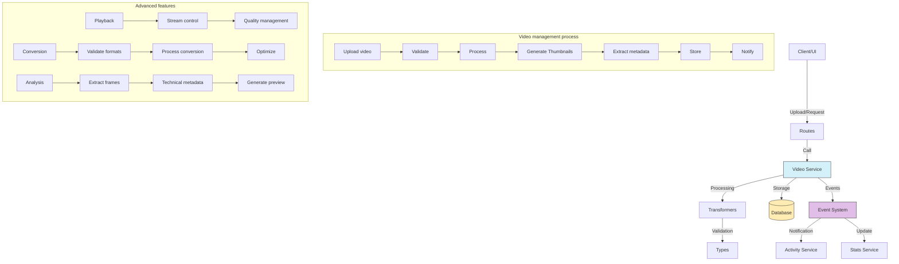

# Video service (Video)

## Overview

The Video service is a specialized component of the media management system.

The service stores, organizes, and manipulates video files.

The service provides functions to upload, process, retrieve, update, and delete videos.

The service also manages metadata, thumbnails, and relations with other entities.

## Flow diagram



Routes call services.

## Module structure

### Service files

```
src/services/video/
├── video.service.ts    # Main service implementation
└── index.ts            # Entry point and exports
```

### Transformer files

```
src/transformers/video/
├── index.ts           # Module exports
├── mappers.ts         # Functions that map between objects
└── serializers.ts     # Serializers for different formats
```

### Data types

```
src/types/entities/video/
├── enums.ts           # Enumerations for videos
├── index.ts           # Module exports
├── schema.ts          # Validation schemas
└── types.ts           # Type and interface definitions
```

### Route modules

```
src/app/actions/videos/
├── index.ts           # Module exports
├── stats.actions.ts   # Actions related to statistics
└── video.actions.ts   # Main video actions
```

## Main features

### 1. Video management

The service provides the following video operations:

- **Upload video**: Loads new video files with format validation.
- **Get video**: Retrieves detailed video information by ID.
- **Update video**: Changes properties and metadata of an existing video.
- **Delete video**: Deletes a video and its associated resources in a safe way.
- **List videos**: Gets videos with filters, sort, and pagination.

### 2. Video processing

The service provides the following processing operations:

- **Thumbnail generation**: Automatically creates preview and key frames.
- **Metadata extraction**: Gets technical information such as resolution, duration, and codec.
- **Transcoding**: Conversion between different formats and qualities.
- **Optimization**: Compression and optimization for playback on multiple devices.

### 3. Organization and search

The service provides the following organization operations:

- **Grouping in Folders**: Hierarchical organization in Folders.
- **Tagging**: Addition and management of Tags for classification.
- **Advanced search**: Search by metadata, names, duration, and other criteria.
- **Collections**: Grouping in thematic Collections.

### 4. Advanced features

The service provides the following advanced features:

- **Adaptive streaming**: Support for streaming with multiple qualities.
- **Partial playback**: Access to specific fragments of videos.
- **Content analysis**: Frame extraction and scene detection.
- **Usage statistics**: Tracking of plays and viewing time.

## Usage examples

### Upload a new video

```typescript
import { videoService } from '@/services/index';

// Upload a video to a specific Folder
const newVideo = await videoService.uploadVideo({
	file: videoFile, // Browser File object
	title: 'Trip to the mountain',
	description: 'Video of the family trip to Sierra Nevada',
	folderId: 'folder-id-123',
	tags: ['trip', 'mountain', 'family'],
	isPrivate: false,
});
```

### Get videos with filters

```typescript
import { videoService } from '@/services/index';

// Get videos with advanced filters
const videos = await videoService.getVideos({
	search: 'trip',
	tags: ['mountain'],
	folderId: 'folder-id-123',
	minDuration: 60, // In seconds
	maxDuration: 600, // In seconds
	minResolution: '720p',
	formats: ['mp4', 'mov'],
	dateFrom: new Date('2023-01-01'),
	dateTo: new Date('2023-12-31'),
	sortBy: 'uploadedAt',
	sortDirection: 'desc',
	page: 1,
	limit: 20,
});
```

### Update a video

```typescript
import { videoService } from '@/services/index';

// Update video properties
const updatedVideo = await videoService.updateVideo('video-id-123', {
	title: 'New video title',
	description: 'Updated description',
	isPrivate: true,
	tags: ['tag1', 'tag2'],
	folderId: 'new-folder-id',
});
```

### Process a video

```typescript
import { videoService } from '@/services/index';

// Generate an optimized version of the video
const processedVideo = await videoService.processVideo('video-id-123', {
	generateThumbnails: true,
	extractMetadata: true,
	convertToFormat: 'mp4',
	resolutions: ['480p', '720p', '1080p'],
});
```

### Get metadata of a video

```typescript
import { videoService } from '@/services/index';

// Get technical metadata of a video
const metadata = await videoService.getVideoMetadata('video-id-123');

console.log(`Resolution: ${metadata.width}x${metadata.height}`);
console.log(`Duration: ${metadata.duration} seconds`);
console.log(`Codec: ${metadata.videoCodec}`);
console.log(`Bitrate: ${metadata.bitrate} kbps`);
```

## Relations with other entities

| Entity         | Relation type    | Description                                 |
| -------------- | ---------------- | ------------------------------------------- |
| **Folder**     | Many to one      | Videos belong to Folders                    |
| **Tag**        | Many to many     | Videos can have multiple Tags               |
| **Album**      | Many to many     | Videos can be part of Albums                |
| **Collection** | Many to many     | Videos can be in Collections                |
| **Metadata**   | One to one       | Each video has associated metadata          |
| **Thumbnail**  | One to many      | A video can have multiple thumbnails        |
| **Activity**   | Referential      | Activities can reference videos             |
| **User**       | Many to one      | Videos belong to users                      |

## Data model

```typescript
// Simplified Video model
interface Video {
	id: string; // Unique identifier
	title: string; // Video title
	description?: string; // Optional description
	path: string; // Full path on the filesystem
	originalFilename: string; // Original filename
	mimeType: string; // MIME type (video/mp4, video/webm, etc.)
	size: number; // Size in bytes
	width: number; // Width in pixels
	height: number; // Height in pixels
	duration: number; // Duration in seconds
	format: VideoFormat; // Format (mp4, mov, webm, etc.)
	folderId?: string; // Containing Folder ID
	isPrivate: boolean; // Indicates whether the video is private
	isFavorite: boolean; // Indicates whether it is marked as a Favorite
	status: VideoStatus; // Video status (ACTIVE, PROCESSING, etc.)
	uploadedAt: Date; // Upload date
	recordedAt?: Date; // Recording date (if available)
	createdAt: Date; // Creation date
	updatedAt: Date; // Last update date
}

// Extension with technical metadata
interface VideoWithMetadata extends Video {
	metadata: {
		videoCodec?: string; // Video codec (H.264, VP9, etc.)
		audioCodec?: string; // Audio codec (AAC, MP3, etc.)
		bitrate?: number; // Total bitrate (kbps)
		videoBitrate?: number; // Video bitrate (kbps)
		audioBitrate?: number; // Audio bitrate (kbps)
		frameRate?: number; // Frames per second
		audioChannels?: number; // Number of audio channels
		audioSampleRate?: number; // Audio sample rate (Hz)
		rotation?: number; // Video rotation (degrees)
		hasAudio: boolean; // Indicates whether it has an audio track
	};
}

// Extension with relations
interface VideoComplete extends VideoWithMetadata {
	folder?: Folder; // Containing Folder
	thumbnails: Thumbnail[]; // Associated thumbnails
	tags: Tag[]; // Associated Tags
	albums: Album[]; // Albums that contain this video
	collections: Collection[]; // Collections that contain this video
	user: User; // Owner user
}
```

## Good practices

Verify size, type, and format before you process videos.

Use queues for video processing, which is often intensive.

Consider specialized storage for large files.

Optimize conversion parameters for the intended use.

Extract and store detailed technical metadata for search.

Automatically create thumbnails for preview.

Keep different versions for different qualities.

## Performance optimization

Implement HLS or DASH to adapt to the user connection.

Allow playback before the video loads completely.

Cache popular fragments for fast playback.

Use modern codecs such as H.265/HEVC or AV1 for better compression.

Use content delivery networks for public videos.

## Common troubleshooting

| Problem                       | Solution                                                     |
| ----------------------------- | ------------------------------------------------------------ |
| **Corrupt videos**            | Use `videoService.verifyVideoIntegrity()` for detection      |
| **Failed transcoding**        | Review logs with `videoService.getProcessingLogs()`          |
| **Missing thumbnails**        | Regenerate with `videoService.regenerateThumbnails()`        |
| **Incorrect metadata**        | Update with `videoService.refreshMetadata()`                 |
| **Playback problems**         | Verify format with `videoService.checkCompatibility()`       |

## Roadmap and future improvements

The following work is planned:

- Implementation of automatic transcription
- Content analysis through AI for object and scene detection
- Basic video editor in the browser
- Improvements in compression algorithms
- Integration with external video-processing services
