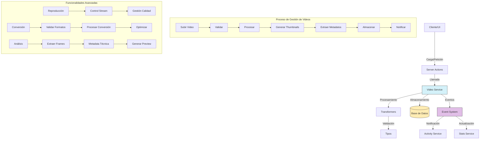

# Servicio de Videos (Video)

## Descripción General

El servicio de videos (Video) es un componente especializado del sistema de gestión de medios que permite almacenar, organizar y manipular archivos de video. Este servicio proporciona funcionalidades para subir, procesar, recuperar, actualizar y eliminar videos, así como gestionar sus metadatos, miniaturas, y relaciones con otras entidades.

## Diagrama de Flujo



## Estructura del Módulo

### Archivos del Servicio

```
src/services/video/
├── video.service.ts    # Implementación principal del servicio
└── index.ts            # Punto de entrada y exportaciones
```

### Archivos de Transformers

```
src/transformers/video/
├── index.ts           # Exportaciones del módulo
├── mappers.ts         # Funciones para mapear entre objetos
└── serializers.ts     # Serializadores para distintos formatos
```

### Tipos de Datos

```
src/types/entities/video/
├── enums.ts           # Enumeraciones para videos
├── index.ts           # Exportaciones del módulo
├── schema.ts          # Esquemas de validación
└── types.ts           # Definiciones de tipos e interfaces
```

### Server Actions

```
src/app/actions/videos/
├── index.ts           # Exportaciones del módulo
├── stats.actions.ts   # Acciones relacionadas con estadísticas
└── video.actions.ts   # Acciones principales para videos
```

## Funcionalidades Principales

### 1. Gestión de Videos

- **Subir Video**: Permite cargar nuevos archivos de video con validación de formatos.
- **Obtener Video**: Recupera información detallada de un video por su ID.
- **Actualizar Video**: Modifica propiedades y metadatos de un video existente.
- **Eliminar Video**: Elimina un video y sus recursos asociados de forma segura.
- **Listar Videos**: Obtiene videos con filtros, ordenación y paginación.

### 2. Procesamiento de Videos

- **Generación de Miniaturas**: Crea automáticamente previsualización y fotogramas clave.
- **Extracción de Metadatos**: Obtiene información técnica como resolución, duración, codec, etc.
- **Transcodificación**: Conversión entre diferentes formatos y calidades.
- **Optimización**: Compresión y optimización para reproducción en múltiples dispositivos.

### 3. Organización y Búsqueda

- **Agrupación en Carpetas**: Organización jerárquica en carpetas.
- **Etiquetado**: Adición y gestión de etiquetas para clasificación.
- **Búsqueda Avanzada**: Búsqueda por metadatos, nombres, duración y otros criterios.
- **Colecciones**: Agrupación en colecciones temáticas.

### 4. Características Avanzadas

- **Streaming Adaptativo**: Soporte para streaming con múltiples calidades.
- **Reproducción Parcial**: Acceso a fragmentos específicos de videos.
- **Análisis de Contenido**: Extracción de fotogramas y detección de escenas.
- **Estadísticas de Uso**: Seguimiento de reproducciones y tiempo de visualización.

## Ejemplos de Uso

### Subir un Nuevo Video

```typescript
import { videoService } from '@/services/index';

// Subir un video a una carpeta específica
const newVideo = await videoService.uploadVideo({
  file: videoFile, // Objeto File del navegador
  title: 'Viaje a la montaña',
  description: 'Video del viaje familiar a Sierra Nevada',
  folderId: 'folder-id-123',
  tags: ['viaje', 'montaña', 'familia'],
  isPrivate: false
});
```

### Obtener Videos con Filtros

```typescript
import { videoService } from '@/services/index';

// Obtener videos con filtros avanzados
const videos = await videoService.getVideos({
  search: 'viaje',
  tags: ['montaña'],
  folderId: 'folder-id-123',
  minDuration: 60, // En segundos
  maxDuration: 600, // En segundos
  minResolution: '720p',
  formats: ['mp4', 'mov'],
  dateFrom: new Date('2023-01-01'),
  dateTo: new Date('2023-12-31'),
  sortBy: 'uploadedAt',
  sortDirection: 'desc',
  page: 1,
  limit: 20
});
```

### Actualizar un Video

```typescript
import { videoService } from '@/services/index';

// Actualizar propiedades de un video
const updatedVideo = await videoService.updateVideo('video-id-123', {
  title: 'Nuevo título del video',
  description: 'Descripción actualizada',
  isPrivate: true,
  tags: ['etiqueta1', 'etiqueta2'],
  folderId: 'nueva-carpeta-id'
});
```

### Procesar un Video

```typescript
import { videoService } from '@/services/index';

// Generar una versión optimizada del video
const processedVideo = await videoService.processVideo('video-id-123', {
  generateThumbnails: true,
  extractMetadata: true,
  convertToFormat: 'mp4',
  resolutions: ['480p', '720p', '1080p']
});
```

### Obtener Metadatos de un Video

```typescript
import { videoService } from '@/services/index';

// Obtener metadatos técnicos de un video
const metadata = await videoService.getVideoMetadata('video-id-123');

console.log(`Resolución: ${metadata.width}x${metadata.height}`);
console.log(`Duración: ${metadata.duration} segundos`);
console.log(`Codec: ${metadata.videoCodec}`);
console.log(`Bitrate: ${metadata.bitrate} kbps`);
```

## Relaciones con Otras Entidades

| Entidad        | Tipo de Relación     | Descripción                                        |
|----------------|----------------------|----------------------------------------------------|
| **Folder**     | Muchos a uno         | Los videos pertenecen a carpetas                   |
| **Tag**        | Muchos a muchos      | Los videos pueden tener múltiples etiquetas        |
| **Album**      | Muchos a muchos      | Los videos pueden formar parte de álbumes          |
| **Collection** | Muchos a muchos      | Los videos pueden estar en colecciones             |
| **Metadata**   | Uno a uno            | Cada video tiene metadatos asociados               |
| **Thumbnail**  | Uno a muchos         | Un video puede tener múltiples miniaturas          |
| **Activity**   | Referencial          | Las actividades pueden referenciar videos          |
| **User**       | Muchos a uno         | Los videos pertenecen a usuarios                   |

## Modelo de Datos

```typescript
// Modelo simplificado de Video
interface Video {
  id: string;                  // Identificador único
  title: string;               // Título del video
  description?: string;        // Descripción opcional
  path: string;                // Ruta completa en el sistema de archivos
  originalFilename: string;    // Nombre de archivo original
  mimeType: string;            // Tipo MIME (video/mp4, video/webm, etc.)
  size: number;                // Tamaño en bytes
  width: number;               // Ancho en píxeles
  height: number;              // Alto en píxeles
  duration: number;            // Duración en segundos
  format: VideoFormat;         // Formato (mp4, mov, webm, etc.)
  folderId?: string;           // ID de la carpeta contenedora
  isPrivate: boolean;          // Indica si el video es privado
  isFavorite: boolean;         // Indica si está marcado como favorito
  status: VideoStatus;         // Estado del video (ACTIVE, PROCESSING, etc.)
  uploadedAt: Date;            // Fecha de subida
  recordedAt?: Date;           // Fecha de grabación (si disponible)
  createdAt: Date;             // Fecha de creación
  updatedAt: Date;             // Fecha de última actualización
}

// Extensión con metadatos técnicos
interface VideoWithMetadata extends Video {
  metadata: {
    videoCodec?: string;       // Codec de video (H.264, VP9, etc.)
    audioCodec?: string;       // Codec de audio (AAC, MP3, etc.)
    bitrate?: number;          // Tasa de bits total (kbps)
    videoBitrate?: number;     // Tasa de bits de video (kbps)
    audioBitrate?: number;     // Tasa de bits de audio (kbps)
    frameRate?: number;        // Cuadros por segundo
    audioChannels?: number;    // Número de canales de audio
    audioSampleRate?: number;  // Tasa de muestreo de audio (Hz)
    rotation?: number;         // Rotación del video (grados)
    hasAudio: boolean;         // Indica si tiene pista de audio
  }
}

// Extensión con relaciones
interface VideoComplete extends VideoWithMetadata {
  folder?: Folder;             // Carpeta contenedora
  thumbnails: Thumbnail[];     // Miniaturas asociadas
  tags: Tag[];                 // Etiquetas asociadas
  albums: Album[];             // Álbumes que contienen este video
  collections: Collection[];   // Colecciones que contienen este video
  user: User;                  // Usuario propietario
}
```

## Buenas Prácticas

1. **Validación de Archivos**: Verifique tamaño, tipo y formato antes de procesar videos.
2. **Procesamiento Asíncrono**: Use colas para procesamiento de videos, que suele ser intensivo.
3. **Estrategia de Almacenamiento**: Considere almacenamiento especializado para archivos grandes.
4. **Transcodificación Eficiente**: Optimice los parámetros de conversión según el uso previsto.
5. **Metadatos Completos**: Extraiga y almacene metadatos técnicos detallados para búsqueda.
6. **Generación de Previsualizaciones**: Cree automáticamente miniaturas para previsualización.
7. **Gestión de Versiones**: Mantenga versiones diferentes para distintas calidades.

## Optimización de Rendimiento

1. **Streaming Adaptativo**: Implemente HLS o DASH para adaptarse a la conexión del usuario.
2. **Carga Progresiva**: Permita la reproducción antes de que el video se cargue completamente.
3. **Caché de Fragmentos**: Almacene en caché fragmentos populares para reproducción rápida.
4. **Compresión Eficiente**: Utilice codecs modernos como H.265/HEVC o AV1 para mejor compresión.
5. **CDN**: Utilice redes de distribución de contenido para videos públicos.

## Solución de Problemas Comunes

| Problema | Solución |
|----------|----------|
| **Videos corruptos** | Utilice `videoService.verifyVideoIntegrity()` para detección |
| **Transcodificación fallida** | Revise logs con `videoService.getProcessingLogs()` |
| **Miniaturas faltantes** | Regenere con `videoService.regenerateThumbnails()` |
| **Metadatos incorrectos** | Actualice con `videoService.refreshMetadata()` |
| **Problemas de reproducción** | Verifique formato con `videoService.checkCompatibility()` |

## Roadmap y Mejoras Futuras

- Implementación de transcripción automática
- Análisis de contenido mediante IA para detección de objetos y escenas
- Editor básico de video en el navegador
- Mejoras en algoritmos de compresión
- Integración con servicios externos de procesamiento de video