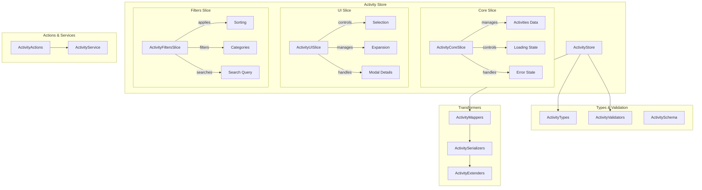

# Activity entity (Activities)

## Description

The **Activity** entity manages recording and tracking of all system activities.

The entity provides a complete history of actions performed by users and automatic processes.

## Architecture



## File structure

```
src/store/entities/activity/
├── index.ts              # Combined main store
├── types.ts              # Store types
├── selectors.ts          # Optimized selectors
├── README.md             # This documentation
└── slices/
    ├── core.ts           # Main data slice
    ├── ui.ts             # User interface slice
    └── filters.ts        # Filter and search slice

src/types/entities/activity/
├── index.ts              # Main exports
├── types.ts              # Canonical types
└── enums.ts              # Enumerations

src/transformers/activity/
├── mappers.ts            # Data mapping
├── serializers.ts        # Serialization
├── validators.ts         # Validations
└── schema.ts             # Zod schemas

src/utils/activity/
└── helpers.ts            # Specific utilities
```

## Main types

### ActivityBase

```typescript
interface ActivityBase {
	id: string;
	type: string;
	description: string;
	imageId?: string | null;
	createdAt: Date;
}
```

### ActivityComplete

```typescript
interface ActivityComplete extends ActivityBase {
	image?: {
		id: string;
		name: string;
		path: string;
		thumbnail?: string | null;
	} | null;
	iconEmoji?: string;
	iconColor?: string;
	category?: string;
	isSelected?: boolean;
	isExpanded?: boolean;
}
```

### ActivityState

```typescript
interface ActivityState {
	core: ActivityCoreState;
	ui: ActivityUIState;
	filters: ActivityFiltersState;
}
```

## Store API

### Core slice

```typescript
// Getters
getActivity(id: string): ActivityComplete | undefined
getActivities(): ActivityComplete[]
getActivitiesByImageId(imageId: string): ActivityComplete[]

// Operations
addActivity(activity: ActivityBase): void
addActivities(activities: ActivityBase[]): void
deleteActivity(id: string): void
clearActivities(): void

// State
setLoading(isLoading: boolean): void
setError(error: string | null): void

// Async Actions
fetchActivity(id: string): Promise<ActivityComplete | undefined>
fetchActivities(filters?: ActivityFilters): Promise<ActivityListResponse | undefined>
createActivity(data: CreateActivityData): Promise<ActivityComplete | undefined>
removeActivity(id: string): Promise<boolean>
```

### UI slice

```typescript
// Selection
selectActivity(id: string | null): void
unselectActivity(id: string): void
toggleActivitySelection(id: string): void
selectMultipleActivities(ids: string[]): void
clearSelection(): void

// Expansion
expandActivity(id: string): void
collapseActivity(id: string): void
toggleActivityExpansion(id: string): void
collapseAllActivities(): void

// Modal
openDetailModal(id: string): void
closeDetailModal(): void

// Highlight
highlightActivity(id: string | null): void

// Grouping
toggleGroupByDate(): void
setGroupByDate(groupByDate: boolean): void
```

### Filters slice

```typescript
// Sort
setSortCriteria(criteria: ActivitySortCriteria): void

// Search
setSearchQuery(query: string): void

// Categories
addCategoryFilter(category: ActivityCategory): void
removeCategoryFilter(category: ActivityCategory): void
toggleCategoryFilter(category: ActivityCategory): void
clearCategoryFilters(): void

// Dates
setDateRange(from: Date | null, to: Date | null): void
clearDateRange(): void

// Special
setAlertFilter(onlyAlerts: boolean): void
setImageIdFilter(imageId: string | null): void

// Reset
resetAllFilters(): void
buildActivityFilters(): ActivityFilters
```

## Main selectors

```typescript
// Basic data
selectActivities(state): ActivityComplete[]
selectIsLoading(state): boolean
selectError(state): string | null

// UI
selectSelectedActivities(state): ActivityComplete[]
selectIsActivitySelected(id)(state): boolean
selectDetailActivity(state): ActivityComplete | null

// Computed filters
selectFilteredActivities(state): ActivityComplete[]
selectSortedActivities(state): ActivityComplete[]
selectActivitiesByDay(state): Record<string, ActivityComplete[]>
selectActivitiesByType(state): Record<string, ActivityComplete[]>
```

## Usage examples

### Basic use of the store

```typescript
import { useActivityStore } from '@/store/entities/activity';

function ActivityComponent() {
  // Access the store
  const activities = useActivityStore(state => state.getActivities());
  const isLoading = useActivityStore(state => state.core.isLoading);
  const addActivity = useActivityStore(state => state.addActivity);

  // Create a new activity
  const handleCreateActivity = async () => {
    await useActivityStore.getState().createActivity({
      type: 'user_action',
      description: 'User performed an action',
      imageId: 'image-123'
    });
  };

  return (
    <div>
      {isLoading ? (
        <div>Loading...</div>
      ) : (
        activities.map(activity => (
          <div key={activity.id}>{activity.description}</div>
        ))
      )}
    </div>
  );
}
```

### Use with selectors

```typescript
import { useActivityStore } from '@/store/entities/activity';
import { selectSortedActivities, selectActivitiesByDay } from '@/store/entities/activity/selectors';

function ActivityList() {
  // Use selectors for computed data
  const sortedActivities = useActivityStore(selectSortedActivities);
  const activitiesByDay = useActivityStore(selectActivitiesByDay);

  return (
    <div>
      {Object.entries(activitiesByDay).map(([day, activities]) => (
        <div key={day}>
          <h3>{day}</h3>
          {activities.map(activity => (
            <ActivityItem key={activity.id} activity={activity} />
          ))}
        </div>
      ))}
    </div>
  );
}
```

### Filter management

```typescript
function ActivityFilters() {
  const {
    setSortCriteria,
    setSearchQuery,
    addCategoryFilter,
    setDateRange,
    resetAllFilters
  } = useActivityStore();

  const handleFilterChange = () => {
    setSortCriteria(ActivitySortCriteria.DATE_DESC);
    setSearchQuery('user');
    addCategoryFilter(ActivityCategory.USER);
    setDateRange(new Date('2024-01-01'), new Date());
  };

  return (
    <div>
      <button onClick={handleFilterChange}>Apply Filters</button>
      <button onClick={resetAllFilters}>Clear Filters</button>
    </div>
  );
}
```

## Relations

### With images

An activity can be related to a specific image.

The relation stores `imageId`.

You can filter by a specific image.

### With the event system

Activities are created automatically by system events.

Event types: `system_error`, `system_warning`, `system_info`

### With user actions

Activities record user actions.

User types: `user_login`, `user_logout`, `user_settings_update`

## Optimizations

### Selective persistence

```typescript
// Only user configurations persist
partialize: (state) => ({
	ui: {
		groupByDate: state.ui.groupByDate,
	},
	filters: {
		sortBy: state.filters.sortBy,
		onlyAlerts: state.filters.onlyAlerts,
	},
});
```

### Memoization

Selectors are optimized to avoid unnecessary re-renders.

The store uses efficient grouping functions.

Computed data is cached automatically.

### Lazy load

Activities load on demand.

Pagination is automatic for large volumes.

Filters apply on the server when possible.

## Current status

**Completed:**

- Canonical types defined
- Store with separate slices
- Optimized selectors
- Validations with Zod
- Basic transformers
- Array utility created

**In progress:**

- Integration with HTTP routes
- Unit tests
- Performance optimizations

**Pending:**

- Implementation of real HTTP routes
- Integration with the notification system
- Activity metrics and analytics

## Development commands

```bash
# Verify types
bunx tsc --noEmit src/store/entities/activity/**/*.ts

# Run tests
bun test -- src/store/entities/activity

# Generate documentation
bun run docs:activity
```
