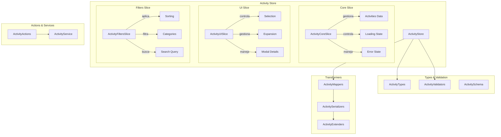

# 📋 Entidad Activity (Actividades)

## 🎯 Descripción

La entidad **Activity** gestiona el registro y seguimiento de todas las actividades del sistema, proporcionando un historial completo de acciones realizadas por los usuarios y procesos automáticos.

## 🏗️ Arquitectura



## 📁 Estructura de Archivos

```
src/store/entities/activity/
├── 📄 index.ts              # Store principal combinado
├── 📄 types.ts              # Tipos del store
├── 📄 selectors.ts          # Selectores optimizados
├── 📄 README.md             # Esta documentación
└── slices/
    ├── 📄 core.ts           # Slice principal de datos
    ├── 📄 ui.ts             # Slice de interfaz de usuario
    └── 📄 filters.ts        # Slice de filtros y búsqueda

src/types/entities/activity/
├── 📄 index.ts              # Exportaciones principales
├── 📄 types.ts              # Tipos canónicos
└── 📄 enums.ts              # Enumeraciones

src/transformers/activity/
├── 📄 mappers.ts            # Mapeo de datos
├── 📄 serializers.ts        # Serialización
├── 📄 validators.ts         # Validaciones
└── 📄 schema.ts             # Esquemas Zod

src/utils/activity/
└── 📄 helpers.ts            # Utilidades específicas
```

## 🔧 Tipos Principales

### ActivityBase

```typescript
interface ActivityBase {
	id: string;
	type: string;
	description: string;
	imageId?: string | null;
	createdAt: Date;
}
```

### ActivityComplete

```typescript
interface ActivityComplete extends ActivityBase {
	image?: {
		id: string;
		name: string;
		path: string;
		thumbnail?: string | null;
	} | null;
	iconEmoji?: string;
	iconColor?: string;
	category?: string;
	isSelected?: boolean;
	isExpanded?: boolean;
}
```

### ActivityState

```typescript
interface ActivityState {
	core: ActivityCoreState;
	ui: ActivityUIState;
	filters: ActivityFiltersState;
}
```

## 🎮 API del Store

### Core Slice

```typescript
// 📊 Getters
getActivity(id: string): ActivityComplete | undefined
getActivities(): ActivityComplete[]
getActivitiesByImageId(imageId: string): ActivityComplete[]

// ✏️ Operaciones
addActivity(activity: ActivityBase): void
addActivities(activities: ActivityBase[]): void
deleteActivity(id: string): void
clearActivities(): void

// 🔄 Estado
setLoading(isLoading: boolean): void
setError(error: string | null): void

// 🌐 Async Actions
fetchActivity(id: string): Promise<ActivityComplete | undefined>
fetchActivities(filters?: ActivityFilters): Promise<ActivityListResponse | undefined>
createActivity(data: CreateActivityData): Promise<ActivityComplete | undefined>
removeActivity(id: string): Promise<boolean>
```

### UI Slice

```typescript
// 🎯 Selección
selectActivity(id: string | null): void
unselectActivity(id: string): void
toggleActivitySelection(id: string): void
selectMultipleActivities(ids: string[]): void
clearSelection(): void

// 📖 Expansión
expandActivity(id: string): void
collapseActivity(id: string): void
toggleActivityExpansion(id: string): void
collapseAllActivities(): void

// 🔍 Modal
openDetailModal(id: string): void
closeDetailModal(): void

// ✨ Resaltado
highlightActivity(id: string | null): void

// 📅 Agrupación
toggleGroupByDate(): void
setGroupByDate(groupByDate: boolean): void
```

### Filters Slice

```typescript
// 🔤 Ordenación
setSortCriteria(criteria: ActivitySortCriteria): void

// 🔍 Búsqueda
setSearchQuery(query: string): void

// 🏷️ Categorías
addCategoryFilter(category: ActivityCategory): void
removeCategoryFilter(category: ActivityCategory): void
toggleCategoryFilter(category: ActivityCategory): void
clearCategoryFilters(): void

// 📅 Fechas
setDateRange(from: Date | null, to: Date | null): void
clearDateRange(): void

// 🚨 Especiales
setAlertFilter(onlyAlerts: boolean): void
setImageIdFilter(imageId: string | null): void

// 🔄 Reset
resetAllFilters(): void
buildActivityFilters(): ActivityFilters
```

## 📊 Selectores Principales

```typescript
// Datos básicos
selectActivities(state): ActivityComplete[]
selectIsLoading(state): boolean
selectError(state): string | null

// UI
selectSelectedActivities(state): ActivityComplete[]
selectIsActivitySelected(id)(state): boolean
selectDetailActivity(state): ActivityComplete | null

// Filtros computados
selectFilteredActivities(state): ActivityComplete[]
selectSortedActivities(state): ActivityComplete[]
selectActivitiesByDay(state): Record<string, ActivityComplete[]>
selectActivitiesByType(state): Record<string, ActivityComplete[]>
```

## 🔄 Ejemplos de Uso

### Uso Básico del Store

```typescript
import { useActivityStore } from '@/store/entities/activity';

function ActivityComponent() {
  // Acceder al store
  const activities = useActivityStore(state => state.getActivities());
  const isLoading = useActivityStore(state => state.core.isLoading);
  const addActivity = useActivityStore(state => state.addActivity);

  // Crear nueva actividad
  const handleCreateActivity = async () => {
    await useActivityStore.getState().createActivity({
      type: 'user_action',
      description: 'Usuario realizó una acción',
      imageId: 'image-123'
    });
  };

  return (
    <div>
      {isLoading ? (
        <div>Cargando...</div>
      ) : (
        activities.map(activity => (
          <div key={activity.id}>{activity.description}</div>
        ))
      )}
    </div>
  );
}
```

### Uso con Selectores

```typescript
import { useActivityStore } from '@/store/entities/activity';
import { selectSortedActivities, selectActivitiesByDay } from '@/store/entities/activity/selectors';

function ActivityList() {
  // Usar selectores para datos computados
  const sortedActivities = useActivityStore(selectSortedActivities);
  const activitiesByDay = useActivityStore(selectActivitiesByDay);

  return (
    <div>
      {Object.entries(activitiesByDay).map(([day, activities]) => (
        <div key={day}>
          <h3>{day}</h3>
          {activities.map(activity => (
            <ActivityItem key={activity.id} activity={activity} />
          ))}
        </div>
      ))}
    </div>
  );
}
```

### Gestión de Filtros

```typescript
function ActivityFilters() {
  const {
    setSortCriteria,
    setSearchQuery,
    addCategoryFilter,
    setDateRange,
    resetAllFilters
  } = useActivityStore();

  const handleFilterChange = () => {
    setSortCriteria(ActivitySortCriteria.DATE_DESC);
    setSearchQuery('usuario');
    addCategoryFilter(ActivityCategory.USER);
    setDateRange(new Date('2024-01-01'), new Date());
  };

  return (
    <div>
      <button onClick={handleFilterChange}>Aplicar Filtros</button>
      <button onClick={resetAllFilters}>Limpiar Filtros</button>
    </div>
  );
}
```

## 🔗 Relaciones

### Con Imágenes

- Una actividad puede estar relacionada con una imagen específica
- Se almacena el `imageId` para la relación
- Se puede filtrar por imagen específica

### Con Sistema de Eventos

- Las actividades se crean automáticamente por eventos del sistema
- Tipos de eventos: `system_error`, `system_warning`, `system_info`

### Con Acciones de Usuario

- Las actividades registran acciones de usuario
- Tipos de usuario: `user_login`, `user_logout`, `user_settings_update`

## ⚡ Optimizaciones

### Persistencia Selectiva

```typescript
// Solo se persisten configuraciones de usuario
partialize: (state) => ({
	ui: {
		groupByDate: state.ui.groupByDate,
	},
	filters: {
		sortBy: state.filters.sortBy,
		onlyAlerts: state.filters.onlyAlerts,
	},
});
```

### Memoización

- Los selectores están optimizados para evitar re-renders innecesarios
- Se usan funciones de agrupación eficientes
- Datos computados se cachean automáticamente

### Carga Lazy

- Las actividades se cargan bajo demanda
- Paginación automática para grandes volúmenes
- Filtros aplicados en el servidor cuando es posible

## 🚀 Estado Actual

✅ **Completado:**

- ✅ Tipos canónicos definidos
- ✅ Store con slices separados
- ✅ Selectores optimizados
- ✅ Validaciones con Zod
- ✅ Transformers básicos
- ✅ Utilidad de arrays creada

🔄 **En Progreso:**

- 🔄 Integración con server actions
- 🔄 Tests unitarios
- 🔄 Optimizaciones de rendimiento

📋 **Pendiente:**

- ⏳ Implementación de server actions reales
- ⏳ Integración con sistema de notificaciones
- ⏳ Métricas y analytics de actividades

## 🔧 Comandos de Desarrollo

```bash
# Verificar tipos
bunx tsc --noEmit src/store/entities/activity/**/*.ts

# Ejecutar tests
bun test -- src/store/entities/activity

# Generar documentación
bun run docs:activity
```
