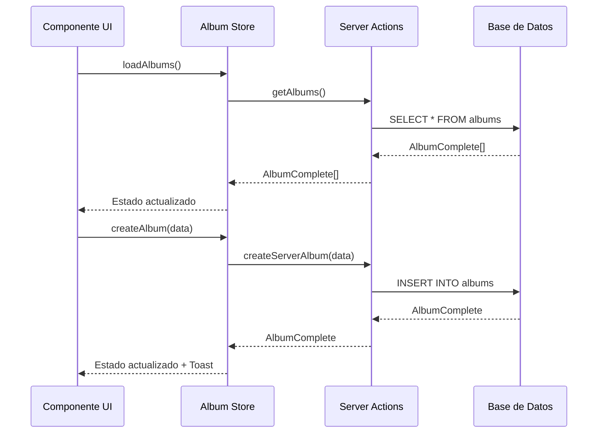

# 📚 Store de Album

## 🎯 Propósito

Gestión centralizada del estado de álbumes con Zustand, incluyendo datos, UI, filtros y acciones CRUD.

## 🏗️ Arquitectura

```mermaid
graph TB
    subgraph "Album Store"
        A[AlbumState] --> B[albums: AlbumComplete[]]
        A --> C[UI State]
        A --> D[Filters State]
        A --> E[Actions]

        C --> C1[selectedIds]
        C --> C2[viewMode]
        C --> C3[isViewerOpen]
        C --> C4[displayState]

        D --> D1[searchQuery]
        D --> D2[sortBy]
        D --> D3[filterByType]
        D --> D4[dateRange]

        E --> E1[CRUD Operations]
        E --> E2[UI Actions]
        E --> E3[Filter Actions]
    end

    subgraph "Tipos"
        F[AlbumComplete] --> F1[AlbumBase + Parsed Fields]
        G[AlbumFiltersState] --> G1[Filtros + UI State]
        H[AlbumUIState] --> H1[Estado Visual]
    end

    A --> F
    A --> G
    A --> H
```

## 📊 Estado Principal

### **AlbumState**

```typescript
interface AlbumState {
	albums: AlbumComplete[]; // 📚 Álbumes con campos parseados
	isLoading: boolean; // ⏳ Estado de carga
	error: string | null; // ❌ Error actual
	lastUpdated: number | null; // 🕐 Última actualización

	ui: AlbumUIState; // 🎮 Estado de interfaz
	filters: AlbumFiltersState; // 🔍 Estado de filtros

	// Selectores
	getAlbumById: (id: string) => AlbumComplete | undefined;
	getFilteredAlbums: () => AlbumComplete[];
	getSortedAlbums: () => AlbumComplete[];
}
```

### **AlbumUIState**

```typescript
interface AlbumUIState {
	selectedIds: string[]; // ✅ IDs seleccionados
	viewMode: AlbumViewMode; // 👁️ Modo de vista (grid, list, etc.)
	isViewerOpen: boolean; // 🖼️ Visor abierto
	currentAlbumId: string | null; // 📍 Álbum actual
	displayState: Record<string, AlbumDisplayState>; // 📊 Estados de display
	draggedAlbumId: string | null; // 🔄 Álbum siendo arrastrado
	dropTargetAlbumId: string | null; // 🎯 Target de drop
	highlightedId: string | null; // ⭐ Álbum resaltado
	expandedIds: string[]; // 📂 Álbumes expandidos
}
```

### **AlbumFiltersState**

```typescript
interface AlbumFiltersState {
	// Búsqueda
	query: string; // 🔍 Query principal
	searchQuery: string; // 🔍 Alias para compatibilidad

	// Ordenamiento y filtros
	sortBy: AlbumSortCriteria; // 📊 Criterio de ordenamiento
	filterByType: AlbumType | null; // 🏷️ Filtro por tipo
	filterByParentId: string | null; // 👨‍👩‍👧‍👦 Filtro por padre
	filterFavorites: boolean; // ⭐ Solo favoritos
	filterShared: boolean; // 🤝 Solo compartidos
	filterArchived: boolean; // 📦 Solo archivados

	// Filtros de contenido
	hasImages?: boolean; // 🖼️ Tiene imágenes
	hasVideos?: boolean; // 🎬 Tiene videos
	categories?: string[]; // 🏷️ Categorías
	types?: string[]; // 📝 Tipos

	// Rango de fechas
	dateRange: {
		from: Date | null; // 📅 Fecha desde
		to: Date | null; // 📅 Fecha hasta
	};
}
```

## 🔄 Flujo de Datos



## 🎮 Modos de Vista

### **AlbumViewMode**

- `GRID` - Vista en rejilla (por defecto)
- `LIST` - Vista en lista
- `COMPACT` - Vista compacta
- `COVER_FLOW` - Vista cover flow
- `MASONRY` - Vista masonry

### **AlbumDisplayState**

- `COLLAPSED` - Colapsado
- `EXPANDED` - Expandido
- `COVER_ONLY` - Solo portada
- `DETAILS` - Con detalles

## 📊 Criterios de Ordenamiento

### **AlbumSortCriteria**

- `NAME_ASC` / `NAME_DESC` - Por nombre
- `DATE_CREATED_ASC` / `DATE_CREATED_DESC` - Por fecha de creación
- `DATE_UPDATED_ASC` / `DATE_UPDATED_DESC` - Por fecha de actualización
- `ITEM_COUNT_ASC` / `ITEM_COUNT_DESC` - Por cantidad de items
- `SIZE_ASC` / `SIZE_DESC` - Por tamaño
- `CUSTOM` - Ordenamiento personalizado

## 🔧 Acciones Principales

### **CRUD Operations**

```typescript
// Carga
loadAlbums(): Promise<void>
loadAlbumById(id: string): Promise<AlbumComplete | undefined>

// Gestión
createAlbum(album: AlbumCreateInput): Promise<void>
updateAlbum(id: string, album: AlbumUpdateInput): Promise<void>
deleteAlbum(id: string): Promise<void>

// Imágenes
addImageToAlbum(albumId: string, imageId: string): Promise<void>
removeImageFromAlbum(albumId: string, imageId: string): Promise<void>
```

### **UI Actions**

```typescript
selectAlbum(id: string | null): void
selectMultipleAlbums(ids: string[]): void
toggleSelection(id: string): void
clearSelection(): void
```

### **Filter Actions**

```typescript
updateFilters(filters: Partial<AlbumFiltersState>): void
clearFilters(): void
setSearchQuery(query: string): void
```

## 🎯 Patrones de Uso

### **Cargar y Mostrar Álbumes**

```typescript
const { albums, loadAlbums, isLoading } = useAlbumStore()

useEffect(() => {
  loadAlbums()
}, [loadAlbums])

if (isLoading) return <Loading />
return <AlbumGrid albums={albums} />
```

### **Filtrar Álbumes**

```typescript
const { getFilteredAlbums, updateFilters, filters } = useAlbumStore();

const filteredAlbums = getFilteredAlbums();

// Filtrar por favoritos
updateFilters({ filterFavorites: true });

// Buscar por nombre
updateFilters({ searchQuery: 'vacaciones' });
```

### **Selección Múltiple**

```typescript
const { selectedIds, selectMultipleAlbums, toggleSelection, clearSelection } = useAlbumStore();

// Seleccionar todos
selectMultipleAlbums(albums.map((a) => a.id));

// Toggle individual
toggleSelection(albumId);

// Limpiar selección
clearSelection();
```

## 🔍 Selectores Optimizados

### **getFilteredAlbums()**

Aplica filtros de búsqueda y favoritos en tiempo real.

### **getSortedAlbums()**

Combina filtrado y ordenamiento según criterio activo.

### **getAlbumById(id)**

Búsqueda O(n) por ID, optimizable con Record si es necesario.

## 🚀 Optimizaciones

### **Persistencia**

- Store persistido en localStorage como `album-store`
- Hidratación automática al cargar la aplicación

### **Performance**

- Selectores memoizados con Zustand
- Filtrado y ordenamiento optimizado
- Estados UI separados para evitar re-renders

## 🎨 Características Especiales

### **Gestión de Imágenes**

- Agregar/quitar imágenes de álbumes
- Portadas automáticas (featuredImage)
- Conteo de items en tiempo real

### **Categorización**

- Filtros por categoría y tipo
- Agrupamiento visual
- Shortcuts de teclado personalizables

### **Estado Visual**

- Drag & drop entre álbumes
- Estados expandido/colapsado por álbum
- Resaltado dinámico

## 📋 Tipos Relacionados

- `AlbumComplete` - Álbum con campos parseados (filtros, sortBy)
- `AlbumCreateInput` / `AlbumUpdateInput` - DTOs para CRUD
- `AlbumViewMode` / `AlbumDisplayState` - Estados de UI
- `AlbumSortCriteria` - Opciones de ordenamiento

## 🔗 Dependencias

- `@/types/entities/album` - Tipos canónicos
- `@/app/actions/albums` - Server actions
- `@/lib/logger` - Logging
- `@/lib/ui/toast` - Notificaciones
