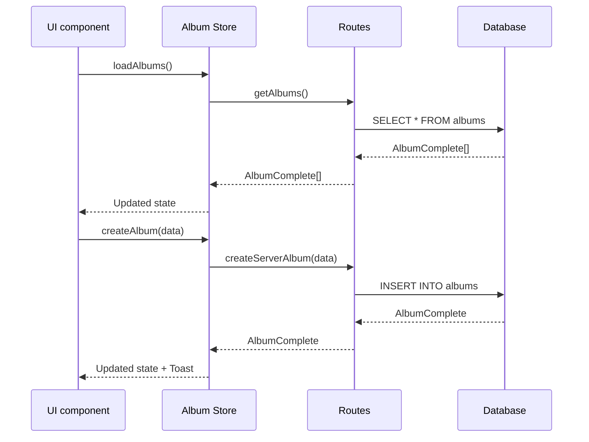

# Album store

## Purpose

This store centralizes Album state with Zustand, including data, UI, filters, and CRUD actions.

## Architecture

```mermaid
graph TB
    subgraph "Album Store"
        A[AlbumState] --> B[albums: AlbumComplete[]]
        A --> C[UI State]
        A --> D[Filters State]
        A --> E[Actions]

        C --> C1[selectedIds]
        C --> C2[viewMode]
        C --> C3[isViewerOpen]
        C --> C4[displayState]

        D --> D1[searchQuery]
        D --> D2[sortBy]
        D --> D3[filterByType]
        D --> D4[dateRange]

        E --> E1[CRUD Operations]
        E --> E2[UI Actions]
        E --> E3[Filter Actions]
    end

    subgraph "Types"
        F[AlbumComplete] --> F1[AlbumBase + Parsed Fields]
        G[AlbumFiltersState] --> G1[Filters + UI State]
        H[AlbumUIState] --> H1[Visual state]
    end

    A --> F
    A --> G
    A --> H
```

## Main state

### AlbumState

```typescript
interface AlbumState {
	albums: AlbumComplete[]; // Albums with parsed fields
	isLoading: boolean; // Loading state
	error: string | null; // Current error
	lastUpdated: number | null; // Last update

	ui: AlbumUIState; // Interface state
	filters: AlbumFiltersState; // Filter state

	// Selectors
	getAlbumById: (id: string) => AlbumComplete | undefined;
	getFilteredAlbums: () => AlbumComplete[];
	getSortedAlbums: () => AlbumComplete[];
}
```

### AlbumUIState

```typescript
interface AlbumUIState {
	selectedIds: string[]; // Selected IDs
	viewMode: AlbumViewMode; // View mode (grid, list)
	isViewerOpen: boolean; // Viewer open
	currentAlbumId: string | null; // Current Album
	displayState: Record<string, AlbumDisplayState>; // Display states
	draggedAlbumId: string | null; // Album being dragged
	dropTargetAlbumId: string | null; // Drop target
	highlightedId: string | null; // Highlighted Album
	expandedIds: string[]; // Expanded Albums
}
```

### AlbumFiltersState

```typescript
interface AlbumFiltersState {
	// Search
	query: string; // Main query
	searchQuery: string; // Alias for compatibility

	// Sort and filters
	sortBy: AlbumSortCriteria; // Sort criterion
	filterByType: AlbumType | null; // Filter by type
	filterByParentId: string | null; // Filter by parent
	filterFavorites: boolean; // Favorites only
	filterShared: boolean; // Shared only
	filterArchived: boolean; // Archived only

	// Content filters
	hasImages?: boolean; // Has images
	hasVideos?: boolean; // Has videos
	categories?: string[]; // Categories
	types?: string[]; // Types

	// Date range
	dateRange: {
		from: Date | null; // Date from
		to: Date | null; // Date to
	};
}
```

## Data flow



Routes call services.

## View modes

### AlbumViewMode

The store supports the following view modes:

- `GRID` - Grid view (default)
- `LIST` - List view
- `COMPACT` - Compact view
- `COVER_FLOW` - Cover flow view
- `MASONRY` - Masonry view

### AlbumDisplayState

The store supports the following display states:

- `COLLAPSED` - Collapsed
- `EXPANDED` - Expanded
- `COVER_ONLY` - Cover only
- `DETAILS` - With details

## Sort criteria

### AlbumSortCriteria

The store supports the following sort criteria:

- `NAME_ASC` / `NAME_DESC` - By name
- `DATE_CREATED_ASC` / `DATE_CREATED_DESC` - By creation date
- `DATE_UPDATED_ASC` / `DATE_UPDATED_DESC` - By update date
- `ITEM_COUNT_ASC` / `ITEM_COUNT_DESC` - By item count
- `SIZE_ASC` / `SIZE_DESC` - By size
- `CUSTOM` - Custom sort

## Main actions

### CRUD operations

```typescript
// Load
loadAlbums(): Promise<void>
loadAlbumById(id: string): Promise<AlbumComplete | undefined>

// Management
createAlbum(album: AlbumCreateInput): Promise<void>
updateAlbum(id: string, album: AlbumUpdateInput): Promise<void>
deleteAlbum(id: string): Promise<void>

// Images
addImageToAlbum(albumId: string, imageId: string): Promise<void>
removeImageFromAlbum(albumId: string, imageId: string): Promise<void>
```

### UI actions

```typescript
selectAlbum(id: string | null): void
selectMultipleAlbums(ids: string[]): void
toggleSelection(id: string): void
clearSelection(): void
```

### Filter actions

```typescript
updateFilters(filters: Partial<AlbumFiltersState>): void
clearFilters(): void
setSearchQuery(query: string): void
```

## Usage patterns

### Load and show Albums

```typescript
const { albums, loadAlbums, isLoading } = useAlbumStore()

useEffect(() => {
  loadAlbums()
}, [loadAlbums])

if (isLoading) return <Loading />
return <AlbumGrid albums={albums} />
```

### Filter Albums

```typescript
const { getFilteredAlbums, updateFilters, filters } = useAlbumStore();

const filteredAlbums = getFilteredAlbums();

// Filter by Favorites
updateFilters({ filterFavorites: true });

// Search by name
updateFilters({ searchQuery: 'vacation' });
```

### Multi-select

```typescript
const { selectedIds, selectMultipleAlbums, toggleSelection, clearSelection } = useAlbumStore();

// Select all
selectMultipleAlbums(albums.map((a) => a.id));

// Toggle individual
toggleSelection(albumId);

// Clear selection
clearSelection();
```

## Optimized selectors

### getFilteredAlbums()

Applies search and Favorite filters in real time.

### getSortedAlbums()

Combines filter and sort according to the active criterion.

### getAlbumById(id)

O(n) search by ID, optimizable with Record if needed.

## Optimizations

### Persistence

The store persists in localStorage as `album-store`.

Hydration is automatic when the application loads.

### Performance

Selectors are memoized with Zustand.

Filter and sort are optimized.

UI states stay separate to avoid re-renders.

## Special features

### Image management

The store provides the following image features:

- Add or remove images from Albums
- Automatic covers (featuredImage)
- Real-time item count

### Categorization

The store provides the following categorization features:

- Filters by category and type
- Visual grouping
- Customizable keyboard shortcuts

### Visual state

The store provides the following visual features:

- Drag and drop between Albums
- Expanded or collapsed states per Album
- Dynamic highlighting

## Related types

The store uses the following related types:

- `AlbumComplete` - Album with parsed fields (filters, sortBy)
- `AlbumCreateInput` / `AlbumUpdateInput` - DTOs for CRUD
- `AlbumViewMode` / `AlbumDisplayState` - UI states
- `AlbumSortCriteria` - Sort options

## Dependencies

The store depends on the following modules:

- `@/types/entities/album` - Canonical types
- `@/app/actions/albums` - Route modules
- `@/lib/logger` - Logging
- `@/lib/ui/toast` - Notifications
