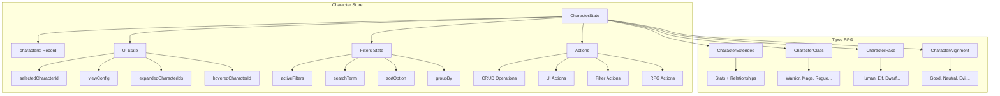
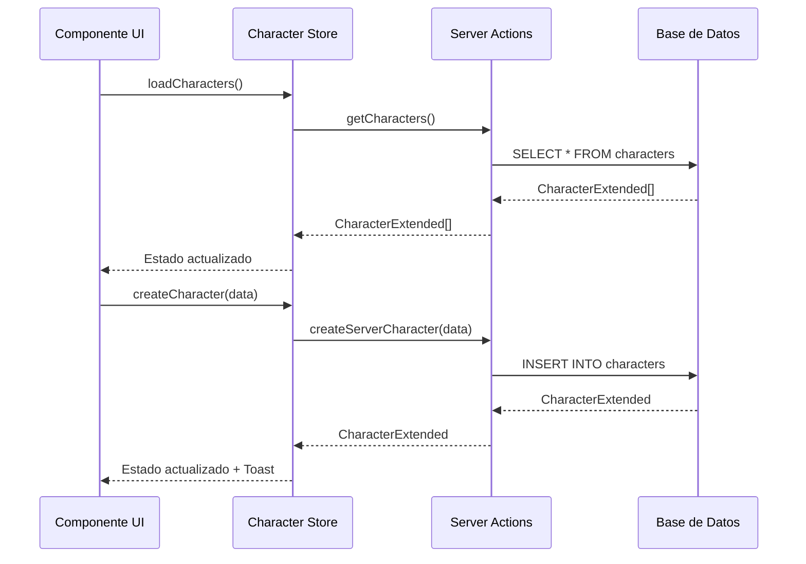

# 🎭 Store de Character

## 🎯 Propósito

Gestión centralizada del estado de personajes con Zustand, incluyendo datos, UI, filtros y acciones CRUD especializadas para RPG/D&D.

## 🏗️ Arquitectura



## 📊 Estado Principal

### **CharacterState**

```typescript
interface CharacterState {
  characters: Record<string, CharacterExtended>  // 🎭 Personajes con datos extendidos

  // UI State
  viewConfig: CharacterViewConfig               // 🎮 Configuración de vista
  selectedCharacterId: string | null            // ✅ ID seleccionado
  hoveredCharacterId: string | null             // 👆 ID con hover
  expandedCharacterIds: string[]                // 📂 IDs expandidos

  // Loading & Errors
  isLoading: boolean                            // ⏳ Estado de carga
  error: string | null                          // ❌ Error actual

  // Filtros y ordenamiento
  activeFilters: CharacterFilters[]             // 🔍 Filtros activos
  searchTerm: string                            // 🔍 Término de búsqueda
  defaultSortOption: CharacterSortOption        // 📊 Orden por defecto
  currentSortOption: CharacterSortOption        // 📊 Orden actual

  // Agrupamiento
  groupBy: 'none' | 'class' | 'race' | 'category' | 'level'
}
```

### **CharacterViewConfig**

```typescript
interface CharacterViewConfig {
  viewType: 'grid' | 'list' | 'compact' | 'gallery' | 'card'  // 👁️ Tipo de vista
  sortBy: 'name' | 'level' | 'race' | 'class' | 'date'        // 📊 Campo de orden
  sortDirection: 'asc' | 'desc'                               // ⬆️⬇️ Dirección
  showImages: boolean                                         // 🖼️ Mostrar imágenes
  imageCount: number                                          // 🔢 Cantidad de imágenes
  enableAnimations: boolean                                   // ✨ Animaciones
  groupBy?: 'race' | 'class' | 'alignment' | 'category' | null // 📊 Agrupamiento
  showStats: boolean                                          // 📈 Mostrar estadísticas
  compactView: boolean                                        // 📱 Vista compacta
}
```

## 🔄 Flujo de Datos



## 🎮 Enumeraciones RPG

### **CharacterClass**

- `WARRIOR` ⚔️ - Guerrero
- `MAGE` 🔮 - Mago
- `ROGUE` 🗡️ - Pícaro
- `CLERIC` ✨ - Clérigo
- `RANGER` 🏹 - Explorador
- `BARD` 🎭 - Bardo
- `PALADIN` 🛡️ - Paladín
- `DRUID` 🌿 - Druida
- `MONK` 👊 - Monje
- `WARLOCK` 📜 - Brujo
- `SORCERER` 🌟 - Hechicero
- `BARBARIAN` 🪓 - Bárbaro
- `ARTIFICER` ⚙️ - Artífice

### **CharacterRace**

- `HUMAN` 👤 - Humano
- `ELF` 🧝‍♀️ - Elfo
- `DWARF` 🧔 - Enano
- `HALFLING` 🍃 - Mediano
- `GNOME` 🧙‍♂️ - Gnomo
- `HALF_ELF` 🧝‍♂️ - Semi-elfo
- `HALF_ORC` 👹 - Semi-orco
- `TIEFLING` 😈 - Tiefling
- `DRAGONBORN` 🐉 - Dracónido

### **CharacterAlignment**

- `LAWFUL_GOOD` ⚖️✨ - Legal bueno
- `NEUTRAL_GOOD` ⚖️ - Neutral bueno
- `CHAOTIC_GOOD` 🌪️✨ - Caótico bueno
- `LAWFUL_NEUTRAL` ⚖️ - Legal neutral
- `TRUE_NEUTRAL` ⚖️ - Neutral puro
- `CHAOTIC_NEUTRAL` 🌪️ - Caótico neutral
- `LAWFUL_EVIL` ⚖️💀 - Legal malvado
- `NEUTRAL_EVIL` 💀 - Neutral malvado
- `CHAOTIC_EVIL` 🌪️💀 - Caótico malvado

### **CharacterSortOption**

- `NAME_ASC` / `NAME_DESC` - Por nombre
- `LEVEL_ASC` / `LEVEL_DESC` - Por nivel
- `CLASS_ASC` / `CLASS_DESC` - Por clase
- `RACE_ASC` / `RACE_DESC` - Por raza
- `DATE_ASC` / `DATE_DESC` - Por fecha

## 🔧 Acciones Principales

### **CRUD Operations**

```typescript
// Gestión básica
addCharacter(character: CharacterBase | CharacterExtended): void
updateCharacter(id: string, updates: Partial<CharacterBase>): void
removeCharacter(id: string): void

// Operaciones por lotes
bulkAddCharacters(characters: CharacterExtended[]): void
bulkUpdateCharacters(updates: Array<{id: string, data: Partial<CharacterBase>}>): void
bulkRemoveCharacters(ids: string[]): void
```

### **RPG Specific Actions**

```typescript
// Operaciones RPG
toggleFavorite(id: string): void
setFeaturedImage(id: string, imageId: string | null): void
incrementLevel(id: string): void
decrementLevel(id: string): void

// Relaciones
addRelationship(id: string, targetId: string, type: string, strength: number): void
removeRelationship(id: string, targetId: string): void

// Gestión de grupos/propiedades
addGroupToCharacter(characterId: string, groupId: string): void
addPropertyToCharacter(characterId: string, propertyId: string): void
addWildcardToCharacter(characterId: string, wildcardId: string): void
```

### **UI Actions**

```typescript
selectCharacter(id: string | null): void
hoverCharacter(id: string | null): void
toggleExpandCharacter(id: string): void
expandAllCharacters(): void
collapseAllCharacters(): void
setViewConfig(config: Partial<CharacterViewConfig>): void
```

### **Filter Actions**

```typescript
filterByClass(characterClass: CharacterClass | null): void
filterByRace(race: CharacterRace | null): void
filterByLevel(minLevel: number | null, maxLevel: number | null): void
filterByCategory(category: CharacterCategory | null): void
filterByAlignment(alignment: CharacterAlignment | null): void
filterByText(searchTerm: string): void
filterByFavorites(onlyFavorites: boolean): void
```

## 🎯 Patrones de Uso

### **Cargar y Mostrar Personajes**

```typescript
const { characters, isLoading } = useCharacterStore()

// Obtener como array
const characterArray = Object.values(characters)

// Filtrar por clase
const warriors = characterArray.filter(char => char.class === CharacterClass.WARRIOR)
```

### **Filtrar por Nivel**

```typescript
const { filterByLevel, getFilteredCharacters } = useCharacterStore()

// Personajes nivel 5-10
filterByLevel(5, 10)
const midLevelChars = getFilteredCharacters()
```

### **Agrupamiento**

```typescript
const { setGroupBy, getGroupedCharacters } = useCharacterStore()

// Agrupar por clase
setGroupBy('class')
const groupedByClass = getGroupedCharacters()
// { "Warrior": [...], "Mage": [...], "Rogue": [...] }
```

### **Gestión de Nivel**

```typescript
const { incrementLevel, decrementLevel } = useCharacterStore()

// Subir de nivel
incrementLevel(characterId)

// Bajar de nivel
decrementLevel(characterId)
```

## 🔍 Selectores Optimizados

### **getSortedCharacters()**

Aplica ordenamiento según `currentSortOption`.

### **getGroupedCharacters()**

Agrupa personajes por criterio activo con conteos.

### **getFilteredCharacters()**

Aplica todos los filtros activos en tiempo real.

### **getCharactersByIds()**

Obtiene múltiples personajes por IDs de forma eficiente.

## 🚀 Optimizaciones

### **Estructura Record**

- `characters: Record<string, CharacterExtended>` para acceso O(1)
- Selectores memoizados para evitar re-cálculos

### **Persistencia Selectiva**

```typescript
partialize: (state) => ({
  characters: state.characters,
  viewConfig: state.viewConfig,
  defaultSortOption: state.defaultSortOption,
  currentSortOption: state.currentSortOption,
  groupBy: state.groupBy,
})
```

### **Estados Separados**

- UI state separado para evitar re-renders innecesarios
- Filtros independientes del estado principal

## 🎨 Características Especiales RPG

### **Sistema de Niveles**

- Incremento/decremento automático
- Agrupamiento por rangos de nivel
- Estadísticas de nivel promedio

### **Gestión de Relaciones**

- Relaciones entre personajes con tipos y fuerza
- Vínculos con grupos, propiedades y wildcards
- Actualización en lote de relaciones

### **Filtrado Avanzado**

- Filtros por atributos RPG (clase, raza, alineamiento)
- Combinación de múltiples filtros
- Búsqueda textual en múltiples campos

### **Colores y Emojis por Clase**

- Mapeo automático de colores por clase
- Emojis temáticos para cada clase
- Consistencia visual en toda la aplicación

## 📋 Tipos Relacionados

- `CharacterExtended` - Personaje con campos parseados y UI
- `CharacterViewConfig` - Configuración de visualización
- `CharacterClass/Race/Alignment` - Enums RPG
- `CharacterSortOption` - Opciones de ordenamiento
- `CharacterFilters` - Filtros de búsqueda

## 🔗 Dependencias

- `@/types/entities/character` - Tipos canónicos
- `@/types/entities/character/enums` - Enumeraciones RPG
- `@/utils/character` - Utilidades y helpers
- `@/lib/logger` - Logging
- `@/services/toast` - Notificaciones
