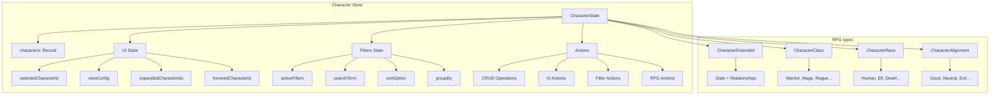
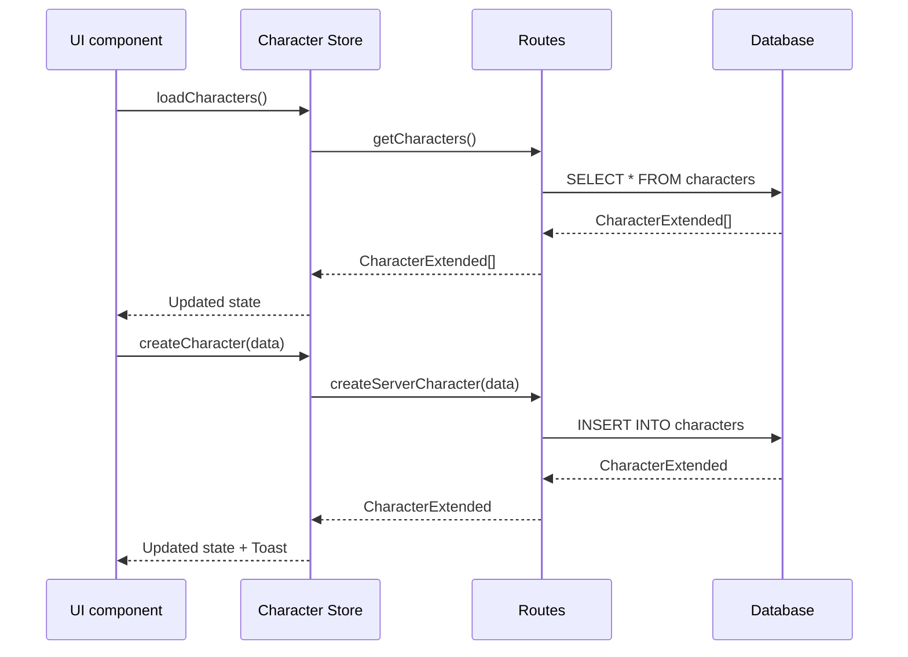

# Character store

## Purpose

This store centralizes Character state with Zustand, including data, UI, filters, and specialized CRUD actions for RPG/D&D.

## Architecture



## Main state

### CharacterState

```typescript
interface CharacterState {
	characters: Record<string, CharacterExtended>; // Characters with extended data

	// UI State
	viewConfig: CharacterViewConfig; // View configuration
	selectedCharacterId: string | null; // Selected ID
	hoveredCharacterId: string | null; // Hovered ID
	expandedCharacterIds: string[]; // Expanded IDs

	// Loading & Errors
	isLoading: boolean; // Loading state
	error: string | null; // Current error

	// Filters and sort
	activeFilters: CharacterFilters[]; // Active filters
	searchTerm: string; // Search term
	defaultSortOption: CharacterSortOption; // Default sort
	currentSortOption: CharacterSortOption; // Current sort

	// Grouping
	groupBy: 'none' | 'class' | 'race' | 'category' | 'level';
}
```

### CharacterViewConfig

```typescript
interface CharacterViewConfig {
	viewType: 'grid' | 'list' | 'compact' | 'gallery' | 'card'; // View type
	sortBy: 'name' | 'level' | 'race' | 'class' | 'date'; // Sort field
	sortDirection: 'asc' | 'desc'; // Direction
	showImages: boolean; // Show images
	imageCount: number; // Image count
	enableAnimations: boolean; // Animations
	groupBy?: 'race' | 'class' | 'alignment' | 'category' | null; // Grouping
	showStats: boolean; // Show statistics
	compactView: boolean; // Compact view
}
```

## Data flow



Routes call services.

## RPG enumerations

### CharacterClass

The store uses the following classes:

- `WARRIOR` - Warrior
- `MAGE` - Mage
- `ROGUE` - Rogue
- `CLERIC` - Cleric
- `RANGER` - Ranger
- `BARD` - Bard
- `PALADIN` - Paladin
- `DRUID` - Druid
- `MONK` - Monk
- `WARLOCK` - Warlock
- `SORCERER` - Sorcerer
- `BARBARIAN` - Barbarian
- `ARTIFICER` - Artificer

### CharacterRace

The store uses the following races:

- `HUMAN` - Human
- `ELF` - Elf
- `DWARF` - Dwarf
- `HALFLING` - Halfling
- `GNOME` - Gnome
- `HALF_ELF` - Half-elf
- `HALF_ORC` - Half-orc
- `TIEFLING` - Tiefling
- `DRAGONBORN` - Dragonborn

### CharacterAlignment

The store uses the following alignments:

- `LAWFUL_GOOD` - Lawful good
- `NEUTRAL_GOOD` - Neutral good
- `CHAOTIC_GOOD` - Chaotic good
- `LAWFUL_NEUTRAL` - Lawful neutral
- `TRUE_NEUTRAL` - True neutral
- `CHAOTIC_NEUTRAL` - Chaotic neutral
- `LAWFUL_EVIL` - Lawful evil
- `NEUTRAL_EVIL` - Neutral evil
- `CHAOTIC_EVIL` - Chaotic evil

### CharacterSortOption

The store uses the following sort options:

- `NAME_ASC` / `NAME_DESC` - By name
- `LEVEL_ASC` / `LEVEL_DESC` - By level
- `CLASS_ASC` / `CLASS_DESC` - By class
- `RACE_ASC` / `RACE_DESC` - By race
- `DATE_ASC` / `DATE_DESC` - By date

## Main actions

### CRUD operations

```typescript
// Basic management
addCharacter(character: CharacterBase | CharacterExtended): void
updateCharacter(id: string, updates: Partial<CharacterBase>): void
removeCharacter(id: string): void

// Batch operations
bulkAddCharacters(characters: CharacterExtended[]): void
bulkUpdateCharacters(updates: Array<{id: string, data: Partial<CharacterBase>}>): void
bulkRemoveCharacters(ids: string[]): void
```

### RPG specific actions

```typescript
// RPG operations
toggleFavorite(id: string): void
setFeaturedImage(id: string, imageId: string | null): void
incrementLevel(id: string): void
decrementLevel(id: string): void

// Relations
addRelationship(id: string, targetId: string, type: string, strength: number): void
removeRelationship(id: string, targetId: string): void

// Group/property management
addGroupToCharacter(characterId: string, groupId: string): void
addPropertyToCharacter(characterId: string, propertyId: string): void
addWildcardToCharacter(characterId: string, wildcardId: string): void
```

### UI actions

```typescript
selectCharacter(id: string | null): void
hoverCharacter(id: string | null): void
toggleExpandCharacter(id: string): void
expandAllCharacters(): void
collapseAllCharacters(): void
setViewConfig(config: Partial<CharacterViewConfig>): void
```

### Filter actions

```typescript
filterByClass(characterClass: CharacterClass | null): void
filterByRace(race: CharacterRace | null): void
filterByLevel(minLevel: number | null, maxLevel: number | null): void
filterByCategory(category: CharacterCategory | null): void
filterByAlignment(alignment: CharacterAlignment | null): void
filterByText(searchTerm: string): void
filterByFavorites(onlyFavorites: boolean): void
```

## Usage patterns

### Load and show Characters

```typescript
const { characters, isLoading } = useCharacterStore();

// Get as an array
const characterArray = Object.values(characters);

// Filter by class
const warriors = characterArray.filter((char) => char.class === CharacterClass.WARRIOR);
```

### Filter by level

```typescript
const { filterByLevel, getFilteredCharacters } = useCharacterStore();

// Characters level 5-10
filterByLevel(5, 10);
const midLevelChars = getFilteredCharacters();
```

### Grouping

```typescript
const { setGroupBy, getGroupedCharacters } = useCharacterStore();

// Group by class
setGroupBy('class');
const groupedByClass = getGroupedCharacters();
// { "Warrior": [...], "Mage": [...], "Rogue": [...] }
```

### Level management

```typescript
const { incrementLevel, decrementLevel } = useCharacterStore();

// Increase level
incrementLevel(characterId);

// Decrease level
decrementLevel(characterId);
```

## Optimized selectors

### getSortedCharacters()

Applies sort according to `currentSortOption`.

### getGroupedCharacters()

Groups Characters by the active criterion with counts.

### getFilteredCharacters()

Applies all active filters in real time.

### getCharactersByIds()

Gets multiple Characters by IDs in an efficient way.

## Optimizations

### Record structure

`characters: Record<string, CharacterExtended>` provides O(1) access.

Selectors are memoized to avoid recalculation.

### Selective persistence

```typescript
partialize: (state) => ({
	characters: state.characters,
	viewConfig: state.viewConfig,
	defaultSortOption: state.defaultSortOption,
	currentSortOption: state.currentSortOption,
	groupBy: state.groupBy,
});
```

### Separate states

UI state stays separate to avoid unnecessary re-renders.

Filters stay independent of the main state.

## Special RPG features

### Level system

The store provides the following level features:

- Automatic increment and decrement
- Grouping by level ranges
- Average level statistics

### Relation management

The store provides the following relation features:

- Relations between Characters with types and strength
- Links with Groups, Properties, and Wildcards
- Batch update of relations

### Advanced filtering

The store provides the following filter features:

- Filters by RPG attributes (class, race, alignment)
- Combination of multiple filters
- Text search in multiple fields

### Colors and emojis by class

The store provides the following visual features:

- Automatic color mapping by class
- Thematic emojis for each class
- Visual consistency across the application

## Related types

The store uses the following related types:

- `CharacterExtended` - Character with parsed fields and UI
- `CharacterViewConfig` - Display configuration
- `CharacterClass/Race/Alignment` - RPG enums
- `CharacterSortOption` - Sort options
- `CharacterFilters` - Search filters

## Dependencies

The store depends on the following modules:

- `@/types/entities/character` - Canonical types
- `@/types/entities/character/enums` - RPG enumerations
- `@/utils/character` - Utilities and helpers
- `@/lib/logger` - Logging
- `@/lib/ui/toast` - Notifications
