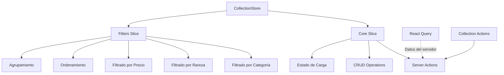

# 📚 Collection Store

## 📋 Descripción

Store de Zustand para la gestión del estado de colecciones en la aplicación de gestión de imágenes. Maneja datos de colecciones NFT/blockchain, configuración de UI, filtros y ordenamiento.

## 🏗️ Arquitectura

### Estructura de Slices

```
collection/
├── index.ts           # Store principal con persistencia
├── types.ts          # Tipos específicos del store
├── slices/
│   ├── core.ts       # CRUD y operaciones principales con Server Actions
│   └── filters.ts    # Filtrado y ordenamiento
└── README.md         # Esta documentación
```

### Flujo de Datos



## 🔧 Tipos Principales

### CollectionState

```typescript
interface CollectionState {
	// Datos principales - usando Record para mejor performance
	collections: Record<string, CollectionExtended>;

	// Estado UI
	viewConfig: CollectionViewConfig;
	selectedCollectionId: string | null;
	hoveredCollectionId: string | null;
	expandedCollectionIds: string[];

	// Estado de carga y errores
	isLoading: boolean;
	error: string | null;

	// Filtrado y ordenamiento
	activeFilters: CollectionFilter[];
	searchTerm: string;
	defaultSortOption: string;
	currentSortOption: string;

	// Agrupamiento
	groupBy: 'category' | 'rarity' | 'platform' | null;
}
```

### CollectionExtended

```typescript
interface CollectionExtended extends CollectionBase {
	// Estados de UI (no persistidos)
	isHovered?: boolean;
	isOpen?: boolean;
	isLoading?: boolean;
	hasError?: boolean;

	// Datos calculados
	imageCount?: number;
	videoCount?: number;
	tagCount?: number;
	groupCount?: number;
	propertyCount?: number;

	// Filtros parseados para UI
	parsedFilters?: CollectionFilter[];

	// Propiedad de rareza (derivada de category o metadatos)
	rarity?: string;
}
```

## 🎛️ Slices

### 1. Core Slice

Maneja operaciones CRUD y comunicación con Server Actions:

```typescript
// Operaciones de consulta
getCollectionById(id: string): CollectionExtended | undefined
getCollections(): CollectionExtended[]
getSelectedCollection(): CollectionExtended | undefined

// Operaciones de mutación
setCollections(collections: CollectionExtended[])
addCollection(collection: CollectionExtended)
updateCollection(id: string, data: Partial<CollectionExtended>)
removeCollection(id: string)
selectCollection(id: string | null)

// Estado de carga y errores
setLoading(isLoading: boolean)
setError(error: string | null)

// Acciones asíncronas con Server Actions
fetchCollection(id: string): Promise<CollectionExtended | undefined>
fetchCollections(): Promise<CollectionExtended[]>
createCollectionServer(data: CollectionCreateInput): Promise<CollectionExtended | undefined>
updateCollectionServer(id: string, data: Partial<CollectionUpdateInput>): Promise<CollectionExtended | undefined>
removeCollectionServer(id: string): Promise<boolean>
```

### 2. Filters Slice

Maneja filtrado, ordenamiento y agrupamiento:

```typescript
// Filtros por criterios
filterByCategory(category: string | null): CollectionExtended[]
filterByRarity(rarity: string | null): CollectionExtended[]
filterByPrice(minPrice: number | null, maxPrice: number | null): CollectionExtended[]
filterByName(searchTerm: string): CollectionExtended[]

// Obtener datos procesados
getSortedCollections(sortOption?: string): CollectionExtended[]
getGroupedCollections(groupBy?: 'category' | 'rarity' | 'platform' | null): Record<string, CollectionExtended[]>

// Operaciones avanzadas de filtrado
addFilter(filter: CollectionFilter)
removeFilter(index: number)
clearFilters()
applyFilters(filters: CollectionFilter[]): CollectionExtended[]

// Configuraciones
setDefaultSortOption(option: string)
setDefaultGroupBy(groupBy: 'category' | 'rarity' | 'platform' | null)
```

## 📊 Persistencia

El store persiste automáticamente:

- ✅ `collections` - Datos de colecciones
- ✅ `viewConfig` - Configuración de visualización
- ✅ `selectedCollectionId` - Colección seleccionada
- ✅ `defaultSortOption` - Opción de ordenamiento por defecto
- ✅ `currentSortOption` - Opción de ordenamiento actual
- ✅ `groupBy` - Criterio de agrupamiento
- ❌ Estados temporales (loading, error, hover, expandido)

## 🎯 Selectores Útiles

```typescript
// Obtener colección específica
const collection = selectCollectionById('collection-id')(state);

// Obtener colecciones procesadas
const sortedCollections = selectSortedCollections(state);
const groupedCollections = selectGroupedCollections(state);
const favoriteCollections = selectFavoriteCollections(state);
const allCollections = selectAllCollections(state);

// Estado actual
const currentCollection = selectCurrentCollection(state);
const collectionCount = selectCollectionCount(state);
```

## 🔄 Patrones de Uso

### Obtener y Mostrar Colecciones

```typescript
// ✅ CORRECTO - Usar métodos del store con Server Actions
const store = useCollectionStore();
const collections = await store.fetchCollections();

// ✅ CORRECTO - Obtener datos locales
const localCollections = store.getCollections();
```

### Crear/Modificar Colecciones

```typescript
// ✅ CORRECTO - Usar Server Actions
const store = useCollectionStore();
const newCollection = await store.createCollectionServer({
	name: 'Mi Colección',
	emoji: '🎨',
	color: '#3B82F6',
	// ... otros campos
});

// ✅ CORRECTO - Actualizar colección
const updated = await store.updateCollectionServer('collection-id', {
	name: 'Nuevo Nombre',
});
```

### Filtrar y Ordenar

```typescript
// ✅ CORRECTO - Usar filtros del store
const store = useCollectionStore();
const nftCollections = store.filterByCategory('nft');
const expensiveCollections = store.filterByPrice(100, null);
const sortedByName = store.getSortedCollections('name_asc');
```

### Gestionar Estado UI

```typescript
// ✅ CORRECTO - Selección y configuración
const store = useCollectionStore();
store.selectCollection('collection-id');
store.setDefaultSortOption('price_desc');
store.setDefaultGroupBy('category');
```

## 🚨 Características Especiales

### Integración NFT/Blockchain

Las colecciones soportan metadatos específicos de NFT:

- `platform` - OpenSea, Rarible, etc.
- `network` - Ethereum, Polygon, etc.
- `tokenId`, `tokenAddress`, `contractAddress`
- `price` - Precio en la moneda nativa
- `editions` - Información de ediciones (JSON serializado)

### Conversión de Tipos

El store maneja automáticamente la conversión entre `CollectionComplete` (del servidor) y `CollectionExtended` (del cliente):

```typescript
// Conversión automática en fetchCollection
const extendedCollection: CollectionExtended = {
	...serverCollection,
	imageCount: serverCollection._count?.images || 0,
	videoCount: serverCollection._count?.videos || 0,
	tagCount: serverCollection._count?.tags || 0,
	// ... otros conteos calculados
};
```

### Filtros Avanzados

Soporte para operadores de filtro completos:

- `equals`, `contains`, `startsWith`, `endsWith`
- `gt`, `gte`, `lt`, `lte`, `between`

## 🔗 Relaciones

### Dependencias

- `@/types/entities/collection` - Tipos canónicos
- `@/utils/collection` - Utilidades de ordenamiento y agrupamiento
- `@/app/actions/collections/collection.actions` - Server Actions
- `zustand` - Gestión de estado

### Entidades Relacionadas

- `Image` - Imágenes en colecciones
- `Video` - Videos en colecciones
- `Tag` - Etiquetas de colecciones
- `Group` - Grupos de colecciones
- `Property` - Propiedades personalizadas
- `Album` - Álbumes relacionados

## 📈 Métricas y Performance

### Optimizaciones Aplicadas

- ✅ Uso de Record en lugar de Array para acceso O(1)
- ✅ Persistencia selectiva (solo datos necesarios)
- ✅ Conversión automática de tipos servidor/cliente
- ✅ Filtros aplicados en memoria (eficiente para <1000 colecciones)

### Consideraciones de Performance

- Los datos se almacenan como Record para acceso rápido por ID
- Las operaciones de filtrado se optimizan para colecciones pequeñas/medianas
- La persistencia excluye estados temporales para mejor rendimiento

---

**Última actualización**: Enero 2025
**Versión**: 1.0 (Server Actions Integration)
**Mantenedor**: AI Assistant
