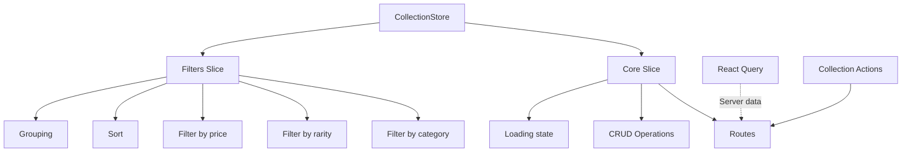

# Collection store

## Description

This Zustand store manages Collection state in the media management application.

The store handles NFT/blockchain Collection data, UI configuration, filters, and sort.

## Architecture

### Slice structure

```
collection/
├── index.ts           # Main store with persistence
├── types.ts          # Types specific to the store
├── slices/
│   ├── core.ts       # CRUD and main operations with routes
│   └── filters.ts    # Filter and sort
└── README.md         # This documentation
```

### Data flow



Routes call services.

## Main types

### CollectionState

```typescript
interface CollectionState {
	// Main data - using Record for better performance
	collections: Record<string, CollectionExtended>;

	// UI state
	viewConfig: CollectionViewConfig;
	selectedCollectionId: string | null;
	hoveredCollectionId: string | null;
	expandedCollectionIds: string[];

	// Loading and error state
	isLoading: boolean;
	error: string | null;

	// Filter and sort
	activeFilters: CollectionFilter[];
	searchTerm: string;
	defaultSortOption: string;
	currentSortOption: string;

	// Grouping
	groupBy: 'category' | 'rarity' | 'platform' | null;
}
```

### CollectionExtended

```typescript
interface CollectionExtended extends CollectionBase {
	// UI states (not persisted)
	isHovered?: boolean;
	isOpen?: boolean;
	isLoading?: boolean;
	hasError?: boolean;

	// Calculated data
	imageCount?: number;
	videoCount?: number;
	tagCount?: number;
	groupCount?: number;
	propertyCount?: number;

	// Parsed filters for UI
	parsedFilters?: CollectionFilter[];

	// Rarity property (derived from category or metadata)
	rarity?: string;
}
```

## Slices

### 1. Core slice

This slice handles CRUD operations and communication with routes:

```typescript
// Query operations
getCollectionById(id: string): CollectionExtended | undefined
getCollections(): CollectionExtended[]
getSelectedCollection(): CollectionExtended | undefined

// Mutation operations
setCollections(collections: CollectionExtended[])
addCollection(collection: CollectionExtended)
updateCollection(id: string, data: Partial<CollectionExtended>)
removeCollection(id: string)
selectCollection(id: string | null)

// Loading and error state
setLoading(isLoading: boolean)
setError(error: string | null)

// Asynchronous actions with routes
fetchCollection(id: string): Promise<CollectionExtended | undefined>
fetchCollections(): Promise<CollectionExtended[]>
createCollectionServer(data: CollectionCreateInput): Promise<CollectionExtended | undefined>
updateCollectionServer(id: string, data: Partial<CollectionUpdateInput>): Promise<CollectionExtended | undefined>
removeCollectionServer(id: string): Promise<boolean>
```

### 2. Filters slice

This slice handles filter, sort, and grouping:

```typescript
// Filters by criteria
filterByCategory(category: string | null): CollectionExtended[]
filterByRarity(rarity: string | null): CollectionExtended[]
filterByPrice(minPrice: number | null, maxPrice: number | null): CollectionExtended[]
filterByName(searchTerm: string): CollectionExtended[]

// Get processed data
getSortedCollections(sortOption?: string): CollectionExtended[]
getGroupedCollections(groupBy?: 'category' | 'rarity' | 'platform' | null): Record<string, CollectionExtended[]>

// Advanced filter operations
addFilter(filter: CollectionFilter)
removeFilter(index: number)
clearFilters()
applyFilters(filters: CollectionFilter[]): CollectionExtended[]

// Configurations
setDefaultSortOption(option: string)
setDefaultGroupBy(groupBy: 'category' | 'rarity' | 'platform' | null)
```

## Persistence

The store persists the following data automatically:

- `collections` - Collection data
- `viewConfig` - Display configuration
- `selectedCollectionId` - Selected Collection
- `defaultSortOption` - Default sort option
- `currentSortOption` - Current sort option
- `groupBy` - Grouping criterion

Temporary states (loading, error, hover, expanded) do not persist.

## Useful selectors

```typescript
// Get a specific Collection
const collection = selectCollectionById('collection-id')(state);

// Get processed Collections
const sortedCollections = selectSortedCollections(state);
const groupedCollections = selectGroupedCollections(state);
const favoriteCollections = selectFavoriteCollections(state);
const allCollections = selectAllCollections(state);

// Current state
const currentCollection = selectCurrentCollection(state);
const collectionCount = selectCollectionCount(state);
```

## Usage patterns

### Get and show Collections

```typescript
// CORRECT - Use store methods with routes
const store = useCollectionStore();
const collections = await store.fetchCollections();

// CORRECT - Get local data
const localCollections = store.getCollections();
```

### Create or modify Collections

```typescript
// CORRECT - Use routes
const store = useCollectionStore();
const newCollection = await store.createCollectionServer({
	name: 'My Collection',
	emoji: '🎨',
	color: '#3B82F6',
	// ... other fields
});

// CORRECT - Update Collection
const updated = await store.updateCollectionServer('collection-id', {
	name: 'New Name',
});
```

### Filter and sort

```typescript
// CORRECT - Use store filters
const store = useCollectionStore();
const nftCollections = store.filterByCategory('nft');
const expensiveCollections = store.filterByPrice(100, null);
const sortedByName = store.getSortedCollections('name_asc');
```

### Manage UI state

```typescript
// CORRECT - Selection and configuration
const store = useCollectionStore();
store.selectCollection('collection-id');
store.setDefaultSortOption('price_desc');
store.setDefaultGroupBy('category');
```

## Special features

### NFT/blockchain integration

Collections support NFT-specific metadata.

The metadata includes the following fields:

- `platform` - OpenSea, Rarible
- `network` - Ethereum, Polygon
- `tokenId`, `tokenAddress`, `contractAddress`
- `price` - Price in the native currency
- `editions` - Edition information (serialized JSON)

### Type conversion

The store automatically handles conversion between `CollectionComplete` (from the server) and `CollectionExtended` (from the client):

```typescript
// Automatic conversion in fetchCollection
const extendedCollection: CollectionExtended = {
	...serverCollection,
	imageCount: serverCollection._count?.images || 0,
	videoCount: serverCollection._count?.videos || 0,
	tagCount: serverCollection._count?.tags || 0,
	// ... other calculated counts
};
```

### Advanced filters

The store supports complete filter operators.

The operators include the following:

- `equals`, `contains`, `startsWith`, `endsWith`
- `gt`, `gte`, `lt`, `lte`, `between`

## Relations

### Dependencies

The store depends on the following modules:

- `@/types/entities/collection` - Canonical types
- `@/utils/collection` - Sort and grouping utilities
- `@/app/actions/collections/collection.actions` - Route modules
- `zustand` - State management

### Related entities

The store relates to the following entities:

- `Image` - Images in Collections
- `Video` - Videos in Collections
- `Tag` - Collection Tags
- `Group` - Collection Groups
- `Property` - Custom properties
- `Album` - Related Albums

## Metrics and performance

### Applied optimizations

The store uses the following optimizations:

- Use of Record instead of Array for O(1) access
- Selective persistence (only needed data)
- Automatic server/client type conversion
- Filters applied in memory (efficient for fewer than 1000 Collections)

### Performance considerations

Data is stored as Record for fast access by ID.

Filter operations are optimized for small and medium Collections.

Persistence excludes temporary states for better performance.

---

**Last update**: January 2025
**Version**: 1.0 (Route integration)
**Maintainer**: AI Assistant
