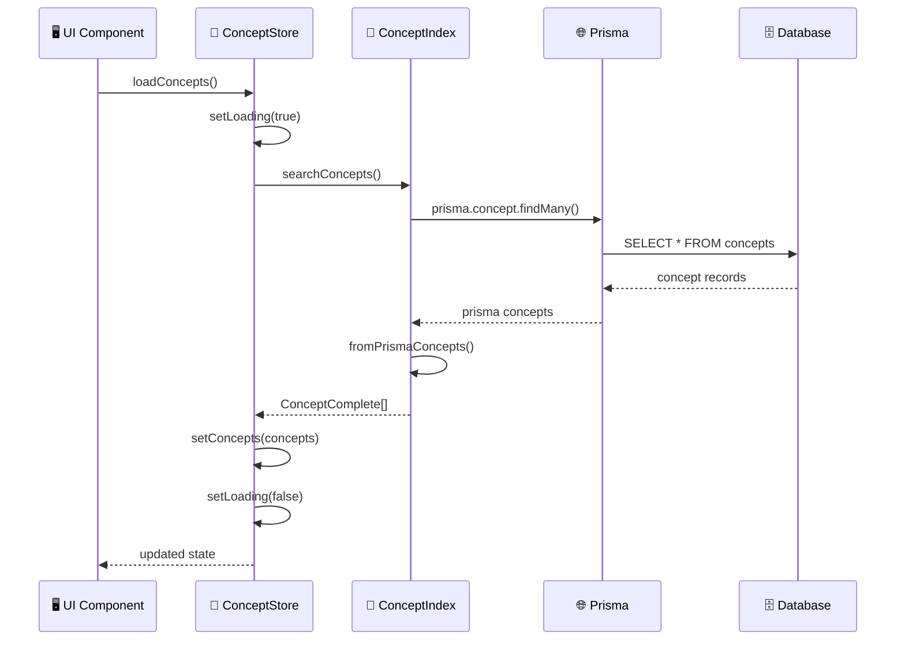
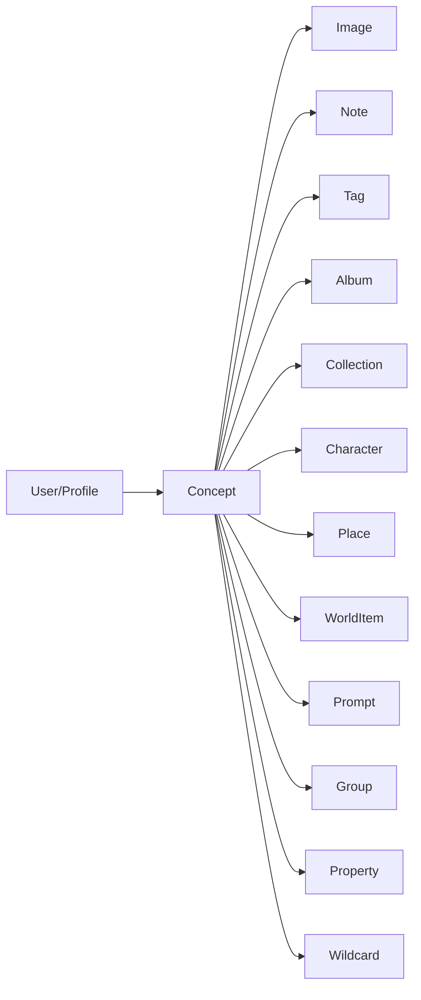

# 📝 Documentación de la Entidad Concept

## 🏗️ Arquitectura General

La entidad **Concept** representa conceptos o ideas en la aplicación, permitiendo organizar y gestionar conocimientos, notas y contenido relacionado.


## 📁 Estructura de Archivos

```
src/store/entities/concept/
├── README.md                    # Esta documentación
├── index.ts                     # Store principal y exportaciones
├── types.ts                     # Tipos específicos del store
└── slices/
    └── core.ts                  # Estado y operaciones básicas

src/transformers/concept/
├── index.ts                     # Funciones principales y exportaciones
├── mappers.ts                   # Transformaciones de datos
├── serializers.ts               # Serialización para UI
└── transformer.ts               # Transformadores avanzados

src/types/entities/concept/
└── types.ts                     # Tipos canónicos
```

## 🎯 Tipos Principales

### ConceptBase
```typescript
interface ConceptBase {
  id: string;
  name: string;                  // Nombre del concepto
  emoji: string;                 // Emoji representativo
  color: string;                 // Color del concepto
  description: string | null;    // Descripción breve
  content: string;               // Contenido principal
  category: string;              // Categoría del concepto
  featuredImage: string | null;  // Imagen destacada
  isFavorite: boolean;           // Marcado como favorito
  createdAt: Date;
  updatedAt: Date;
}
```

### ConceptComplete
```typescript
interface ConceptComplete extends ConceptBase {
  _count?: {
    images?: number;             // Número de imágenes relacionadas
    notes?: number;              // Número de notas relacionadas
    tags?: number;               // Número de tags asociados
  };
}
```

### ConceptExtended
```typescript
interface ConceptExtended extends ConceptComplete {
  isSelected?: boolean;          // Estado de selección en UI
  isHighlighted?: boolean;       // Estado de resaltado
  previewContent?: string;       // Vista previa del contenido
  lastUpdated?: Date;            // Última actualización
  importance?: number;           // Nivel de importancia (1-10)
}
```

### ConceptWithStats
```typescript
interface ConceptWithStats extends ConceptComplete {
  stats: {
    imageCount: number;          // Conteo de imágenes
    tagCount: number;            // Conteo de tags
    noteCount: number;           // Conteo de notas
    totalContentItems: number;   // Total de elementos relacionados
    lastUpdated: Date;           // Última actualización
  };
}
```

## 🏪 API del Store

### Core Slice
```typescript
// Estado
interface CoreSlice {
  concepts: ConceptWithStats[];
  selectedConcept: ConceptBase | null;
  isLoading: boolean;
  error: string | null;
}

// Acciones principales
loadConcepts(): Promise<void>
setConcepts(concepts: ConceptWithStats[]): void
createConcept(concept: ConceptCreateInput): Promise<void>
updateConcept(id: string, concept: ConceptUpdateInput): Promise<void>
deleteConcept(id: string): Promise<void>
selectConcept(concept: ConceptBase | null): void
reset(): void
```

## 🔄 Transformers

### Index (Funciones Principales)
```typescript
// Operaciones CRUD
searchConcepts(options?: ConceptSearchOptions): Promise<ConceptSearchResult>
getConceptById(id: string): Promise<ConceptComplete | null>
createConcept(data: ConceptCreateInput): Promise<ConceptComplete>
updateConcept(id: string, data: ConceptUpdateInput): Promise<ConceptComplete>
deleteConcept(id: string): Promise<void>
getConceptsByIds(ids: string[]): Promise<ConceptComplete[]>

// Utilidades
parseConceptFilters(filtersStr: string): ConceptFilters
toConceptComplete(concept: any): ConceptComplete
```

### Mappers
```typescript
// Transformaciones de datos
toCreateConceptData(data: Partial<ConceptBase>): Prisma.ConceptCreateInput
toUpdateConceptData(data: Partial<ConceptBase>): Prisma.ConceptUpdateInput
toSearchOptions(options: ConceptSearchOptions): Prisma.ConceptFindManyArgs
toSearchFilters(filters: ConceptFilters): Prisma.ConceptWhereInput
toSearchResult(concepts: ConceptComplete[], total: number, options: ConceptSearchOptions): ConceptSearchResult

// Utilidades
toPlainConcept(concept: ConceptBase): Record<string, any>
filterConcepts(concepts: ConceptBase[], filters: ConceptFilters): ConceptBase[]
```

### Serializers
```typescript
// Serialización desde Prisma
fromPrismaConcept(prismaConcept: ConceptFromPrisma, options?: FromPrismaConceptOptions): ConceptComplete
fromPrismaConcepts(prismaConcepts: ConceptFromPrisma[], options?: FromPrismaConceptOptions): ConceptComplete[]

// Validación y transformación
validateConcept(data: Partial<ConceptBase>): Partial<ConceptBase>
extendConcept<T>(concept: T, options?: { includePreview?: boolean }): T & { previewContent?: string }
toPrismaConcept(data: Partial<ConceptBase>): Prisma.ConceptCreateInput

// Utilidades para tags
serializeTags(tags: string[]): string
deserializeTags(tagsJson: string | null): string[]
```

### Transformer Principal
```typescript
// Transformaciones avanzadas
transformConcept<T>(input: T, options?: TransformConceptOptions): ConceptComplete
transformConcepts<T>(inputs: T[], options?: TransformConceptOptions): ConceptComplete[]
transformConceptToExtended<T>(concept: T): ConceptExtended
transformConceptToWithStats<T>(concept: T): ConceptWithStats
```

## 📊 Flujo de Datos



## 🎨 Ejemplos de Uso

### Uso Básico del Store
```typescript
import { useConceptStore } from '@/store/entities/concept';

function ConceptComponent() {
  const concepts = useConceptStore.use.concepts();
  const loadConcepts = useConceptStore.use.loadConcepts();
  const createConcept = useConceptStore.use.createConcept();
  const isLoading = useConceptStore.use.isLoading();

  useEffect(() => {
    loadConcepts();
  }, [loadConcepts]);

  const handleCreateConcept = async () => {
    await createConcept({
      name: 'Nuevo Concepto',
      content: 'Contenido del concepto...',
      category: 'ideas',
      emoji: '💡',
      color: '#3b82f6'
    });
  };

  return (
    <div>
      <button onClick={handleCreateConcept}>
        Crear Concepto
      </button>

      {isLoading && <div>Cargando conceptos...</div>}

      <div>
        {concepts.map(concept => (
          <div key={concept.id}>
            {concept.emoji} {concept.name}
            <p>{concept.description}</p>
            <small>Imágenes: {concept._count?.images || 0}</small>
          </div>
        ))}
      </div>
    </div>
  );
}
```

### Búsqueda y Filtros
```typescript
import { searchConcepts } from '@/transformers/concept';

async function searchConceptsExample() {
  // Búsqueda básica
  const results = await searchConcepts({
    filters: {
      search: 'inteligencia artificial',
      category: 'tecnología',
      onlyFavorites: false
    },
    page: 1,
    pageSize: 20,
    includeRelations: true
  });

  console.log(`Encontrados ${results.total} conceptos`);
  console.log(`Página ${results.page} de ${results.totalPages}`);

  results.items.forEach(concept => {
    console.log(`${concept.emoji} ${concept.name}`);
    console.log(`Imágenes: ${concept._count?.images || 0}`);
  });
}
```

### Transformaciones
```typescript
import {
  transformConcept,
  transformConceptToExtended,
  transformConceptToWithStats
} from '@/transformers/concept/transformer';

// Transformar datos de API
const rawConcept = {
  id: 'concept-1',
  name: 'Machine Learning',
  content: 'El aprendizaje automático es...',
  emoji: '🤖',
  color: '#3b82f6',
  category: 'ai',
  created_at: '2024-01-15T10:00:00Z'
};

const concept = transformConcept(rawConcept);

// Extender para UI
const extendedConcept = transformConceptToExtended(concept);
console.log(extendedConcept.previewContent); // Primeros 100 caracteres
console.log(extendedConcept.importance); // Nivel calculado 1-10

// Con estadísticas
const conceptWithStats = transformConceptToWithStats(concept);
console.log(conceptWithStats.stats.totalContentItems);
```

### Operaciones CRUD
```typescript
import {
  createConcept,
  updateConcept,
  deleteConcept,
  getConceptById
} from '@/transformers/concept';

// Crear concepto
const newConcept = await createConcept({
  name: 'Quantum Computing',
  content: 'La computación cuántica utiliza...',
  category: 'física',
  emoji: '⚛️',
  color: '#8b5cf6'
});

// Obtener por ID
const concept = await getConceptById(newConcept.id);

// Actualizar
if (concept) {
  const updated = await updateConcept(concept.id, {
    description: 'Descripción actualizada',
    isFavorite: true
  });
}

// Eliminar
await deleteConcept(concept.id);
```

## 🔧 Configuración

### Filtros Disponibles
```typescript
interface ConceptFilters {
  search?: string;               // Búsqueda en nombre, descripción y contenido
  category?: string | string[];  // Filtro por categoría
  tags?: string[];              // Filtro por tags
  onlyFavorites?: boolean;      // Solo favoritos
}
```

### Opciones de Búsqueda
```typescript
interface ConceptSearchOptions {
  filters?: ConceptFilters;
  page?: number;                // Página actual (1-based)
  pageSize?: number;           // Elementos por página
  includeRelations?: boolean;   // Incluir relaciones
}
```

### Ordenación
```typescript
enum ConceptSortOption {
  NAME_ASC = 'name_asc',
  NAME_DESC = 'name_desc',
  CREATED_AT_ASC = 'created_at_asc',
  CREATED_AT_DESC = 'created_at_desc',
  UPDATED_AT_ASC = 'updated_at_asc',
  UPDATED_AT_DESC = 'updated_at_desc',
}
```

## 🔗 Relaciones con Otras Entidades



## 📈 Métricas y Estadísticas

### Estadísticas Calculadas
```typescript
interface ConceptStats {
  imageCount: number;            // Imágenes relacionadas
  tagCount: number;              // Tags asociados
  noteCount: number;             // Notas relacionadas
  totalContentItems: number;     // Total de elementos
  lastUpdated: Date;             // Última actualización
}
```

### Cálculo de Importancia
```typescript
function calculateImportance(concept: ConceptComplete): number {
  let importance = 5; // Valor base

  // Contenido extenso (+1)
  if (concept.content && concept.content.length > 500) {
    importance += 1;
  }

  // Tiene descripción (+1)
  if (concept.description) {
    importance += 1;
  }

  // Tiene imagen destacada (+1)
  if (concept.featuredImage) {
    importance += 1;
  }

  // Es favorito (+1)
  if (concept.isFavorite) {
    importance += 1;
  }

  // Muchas relaciones (+1)
  const totalRelations = (concept._count?.images || 0) +
                         (concept._count?.notes || 0) +
                         (concept._count?.tags || 0);
  if (totalRelations > 5) {
    importance += 1;
  }

  return Math.min(10, Math.max(1, importance));
}
```

## 🚀 Próximas Mejoras

1. **Búsqueda semántica** con IA para conceptos relacionados
2. **Mapas conceptuales** visuales con relaciones
3. **Versionado de contenido** con historial de cambios
4. **Colaboración** en tiempo real para edición
5. **Exportación** a formatos estándar (Markdown, PDF)
6. **Plantillas** predefinidas para tipos de conceptos
7. **Análisis de sentimientos** del contenido
8. **Recomendaciones** automáticas de conceptos relacionados

---

*Documentación generada automáticamente - Última actualización: 2024*