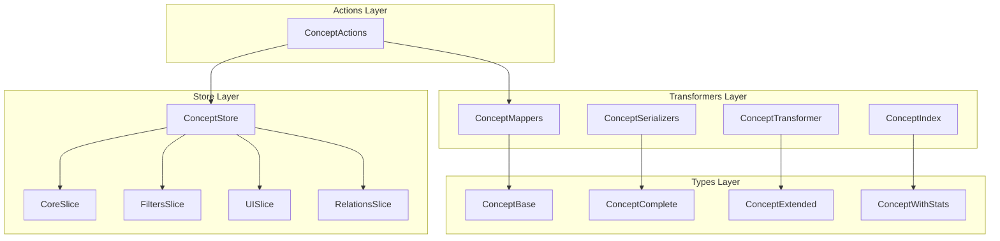
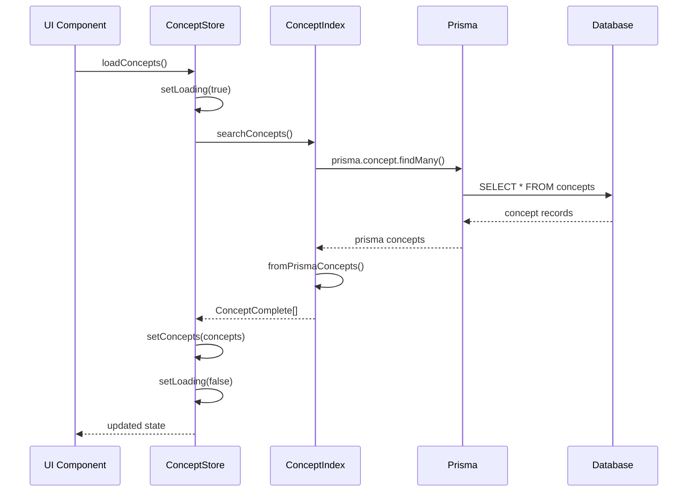
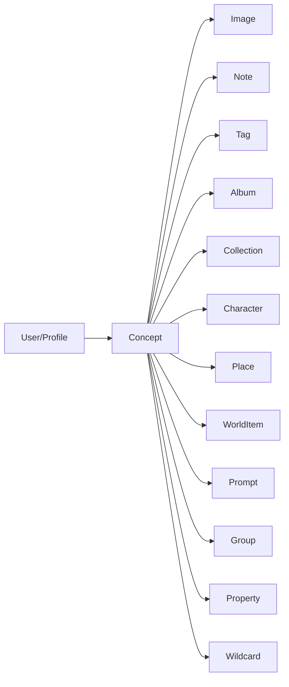

# Concept entity documentation

## General architecture

The **Concept** entity represents concepts or ideas in the application.

The entity lets you organize and manage knowledge, notes, and related content.



## File structure

```
src/store/entities/concept/
├── README.md                    # This documentation
├── index.ts                     # Main store and exports
├── types.ts                     # Types specific to the store
└── slices/
    └── core.ts                  # State and basic operations

src/transformers/concept/
├── index.ts                     # Main functions and exports
├── mappers.ts                   # Data transformations
├── serializers.ts               # Serialization for UI
└── transformer.ts               # Advanced transformers

src/types/entities/concept/
└── types.ts                     # Canonical types
```

## Main types

### ConceptBase

```typescript
interface ConceptBase {
	id: string;
	name: string; // Concept name
	emoji: string; // Representative emoji
	color: string; // Concept color
	description: string | null; // Brief description
	content: string; // Main content
	category: string; // Concept category
	featuredImage: string | null; // Featured image
	isFavorite: boolean; // Marked as a Favorite
	createdAt: Date;
	updatedAt: Date;
}
```

### ConceptComplete

```typescript
interface ConceptComplete extends ConceptBase {
	_count?: {
		images?: number; // Number of related images
		notes?: number; // Number of related notes
		tags?: number; // Number of associated Tags
	};
}
```

### ConceptExtended

```typescript
interface ConceptExtended extends ConceptComplete {
	isSelected?: boolean; // Selection state in UI
	isHighlighted?: boolean; // Highlight state
	previewContent?: string; // Content preview
	lastUpdated?: Date; // Last update
	importance?: number; // Importance level (1-10)
}
```

### ConceptWithStats

```typescript
interface ConceptWithStats extends ConceptComplete {
	stats: {
		imageCount: number; // Image count
		tagCount: number; // Tag count
		noteCount: number; // Note count
		totalContentItems: number; // Total related items
		lastUpdated: Date; // Last update
	};
}
```

## Store API

### Core slice

```typescript
// State
interface CoreSlice {
  concepts: ConceptWithStats[];
  selectedConcept: ConceptBase | null;
  isLoading: boolean;
  error: string | null;
}

// Main actions
loadConcepts(): Promise<void>
setConcepts(concepts: ConceptWithStats[]): void
createConcept(concept: ConceptCreateInput): Promise<void>
updateConcept(id: string, concept: ConceptUpdateInput): Promise<void>
deleteConcept(id: string): Promise<void>
selectConcept(concept: ConceptBase | null): void
reset(): void
```

## Transformers

### Index (main functions)

```typescript
// CRUD operations
searchConcepts(options?: ConceptSearchOptions): Promise<ConceptSearchResult>
getConceptById(id: string): Promise<ConceptComplete | null>
createConcept(data: ConceptCreateInput): Promise<ConceptComplete>
updateConcept(id: string, data: ConceptUpdateInput): Promise<ConceptComplete>
deleteConcept(id: string): Promise<void>
getConceptsByIds(ids: string[]): Promise<ConceptComplete[]>

// Utilities
parseConceptFilters(filtersStr: string): ConceptFilters
toConceptComplete(concept: any): ConceptComplete
```

### Mappers

```typescript
// Data transformations
toCreateConceptData(data: Partial<ConceptBase>): Prisma.ConceptCreateInput
toUpdateConceptData(data: Partial<ConceptBase>): Prisma.ConceptUpdateInput
toSearchOptions(options: ConceptSearchOptions): Prisma.ConceptFindManyArgs
toSearchFilters(filters: ConceptFilters): Prisma.ConceptWhereInput
toSearchResult(concepts: ConceptComplete[], total: number, options: ConceptSearchOptions): ConceptSearchResult

// Utilities
toPlainConcept(concept: ConceptBase): Record<string, any>
filterConcepts(concepts: ConceptBase[], filters: ConceptFilters): ConceptBase[]
```

### Serializers

```typescript
// Serialization from Prisma
fromPrismaConcept(prismaConcept: ConceptFromPrisma, options?: FromPrismaConceptOptions): ConceptComplete
fromPrismaConcepts(prismaConcepts: ConceptFromPrisma[], options?: FromPrismaConceptOptions): ConceptComplete[]

// Validation and transformation
validateConcept(data: Partial<ConceptBase>): Partial<ConceptBase>
extendConcept<T>(concept: T, options?: { includePreview?: boolean }): T & { previewContent?: string }
toPrismaConcept(data: Partial<ConceptBase>): Prisma.ConceptCreateInput

// Tag utilities
serializeTags(tags: string[]): string
deserializeTags(tagsJson: string | null): string[]
```

### Main transformer

```typescript
// Advanced transformations
transformConcept<T>(input: T, options?: TransformConceptOptions): ConceptComplete
transformConcepts<T>(inputs: T[], options?: TransformConceptOptions): ConceptComplete[]
transformConceptToExtended<T>(concept: T): ConceptExtended
transformConceptToWithStats<T>(concept: T): ConceptWithStats
```

## Data flow



## Usage examples

### Basic use of the store

```typescript
import { useConceptStore } from '@/store/entities/concept';

function ConceptComponent() {
  const concepts = useConceptStore.use.concepts();
  const loadConcepts = useConceptStore.use.loadConcepts();
  const createConcept = useConceptStore.use.createConcept();
  const isLoading = useConceptStore.use.isLoading();

  useEffect(() => {
    loadConcepts();
  }, [loadConcepts]);

  const handleCreateConcept = async () => {
    await createConcept({
      name: 'New Concept',
      content: 'Concept content...',
      category: 'ideas',
      emoji: '💡',
      color: '#3b82f6'
    });
  };

  return (
    <div>
      <button onClick={handleCreateConcept}>
        Create Concept
      </button>

      {isLoading && <div>Loading concepts...</div>}

      <div>
        {concepts.map(concept => (
          <div key={concept.id}>
            {concept.emoji} {concept.name}
            <p>{concept.description}</p>
            <small>Images: {concept._count?.images || 0}</small>
          </div>
        ))}
      </div>
    </div>
  );
}
```

### Search and filters

```typescript
import { searchConcepts } from '@/transformers/concept';

async function searchConceptsExample() {
	// Basic search
	const results = await searchConcepts({
		filters: {
			search: 'artificial intelligence',
			category: 'technology',
			onlyFavorites: false,
		},
		page: 1,
		pageSize: 20,
		includeRelations: true,
	});

	console.log(`Found ${results.total} concepts`);
	console.log(`Page ${results.page} of ${results.totalPages}`);

	results.items.forEach((concept) => {
		console.log(`${concept.emoji} ${concept.name}`);
		console.log(`Images: ${concept._count?.images || 0}`);
	});
}
```

### Transformations

```typescript
import {
	transformConcept,
	transformConceptToExtended,
	transformConceptToWithStats,
} from '@/transformers/concept/transformer';

// Transform API data
const rawConcept = {
	id: 'concept-1',
	name: 'Machine Learning',
	content: 'Machine learning is...',
	emoji: '🤖',
	color: '#3b82f6',
	category: 'ai',
	created_at: '2024-01-15T10:00:00Z',
};

const concept = transformConcept(rawConcept);

// Extend for UI
const extendedConcept = transformConceptToExtended(concept);
console.log(extendedConcept.previewContent); // First 100 characters
console.log(extendedConcept.importance); // Calculated level 1-10

// With statistics
const conceptWithStats = transformConceptToWithStats(concept);
console.log(conceptWithStats.stats.totalContentItems);
```

### CRUD operations

```typescript
import { createConcept, updateConcept, deleteConcept, getConceptById } from '@/transformers/concept';

// Create a Concept
const newConcept = await createConcept({
	name: 'Quantum Computing',
	content: 'Quantum computing uses...',
	category: 'physics',
	emoji: '⚛️',
	color: '#8b5cf6',
});

// Get by ID
const concept = await getConceptById(newConcept.id);

// Update
if (concept) {
	const updated = await updateConcept(concept.id, {
		description: 'Updated description',
		isFavorite: true,
	});
}

// Delete
await deleteConcept(concept.id);
```

## Configuration

### Available filters

```typescript
interface ConceptFilters {
	search?: string; // Search in name, description, and content
	category?: string | string[]; // Filter by category
	tags?: string[]; // Filter by Tags
	onlyFavorites?: boolean; // Favorites only
}
```

### Search options

```typescript
interface ConceptSearchOptions {
	filters?: ConceptFilters;
	page?: number; // Current page (1-based)
	pageSize?: number; // Items per page
	includeRelations?: boolean; // Include relations
}
```

### Sort

```typescript
enum ConceptSortOption {
	NAME_ASC = 'name_asc',
	NAME_DESC = 'name_desc',
	CREATED_AT_ASC = 'created_at_asc',
	CREATED_AT_DESC = 'created_at_desc',
	UPDATED_AT_ASC = 'updated_at_asc',
	UPDATED_AT_DESC = 'updated_at_desc',
}
```

## Relations with other entities



## Metrics and statistics

### Calculated statistics

```typescript
interface ConceptStats {
	imageCount: number; // Related images
	tagCount: number; // Associated Tags
	noteCount: number; // Related notes
	totalContentItems: number; // Total items
	lastUpdated: Date; // Last update
}
```

### Importance calculation

```typescript
function calculateImportance(concept: ConceptComplete): number {
	let importance = 5; // Base value

	// Long content (+1)
	if (concept.content && concept.content.length > 500) {
		importance += 1;
	}

	// Has description (+1)
	if (concept.description) {
		importance += 1;
	}

	// Has featured image (+1)
	if (concept.featuredImage) {
		importance += 1;
	}

	// Is a Favorite (+1)
	if (concept.isFavorite) {
		importance += 1;
	}

	// Many relations (+1)
	const totalRelations = (concept._count?.images || 0) + (concept._count?.notes || 0) + (concept._count?.tags || 0);
	if (totalRelations > 5) {
		importance += 1;
	}

	return Math.min(10, Math.max(1, importance));
}
```

## Planned improvements

The following improvements are planned:

1. **Semantic search** with AI for related Concepts
2. **Visual concept maps** with relations
3. **Content versioning** with change history
4. **Real-time collaboration** for editing
5. **Export** to standard formats (Markdown, PDF)
6. **Predefined templates** for Concept types
7. **Sentiment analysis** of content
8. **Automatic recommendations** of related Concepts

---

_Documentation generated automatically - Last update: 2024_
