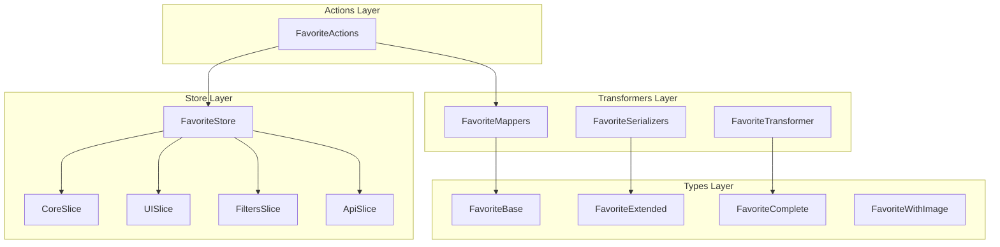
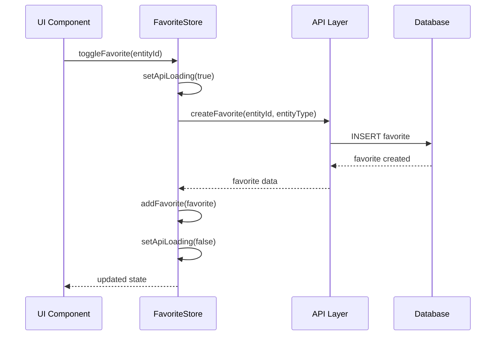
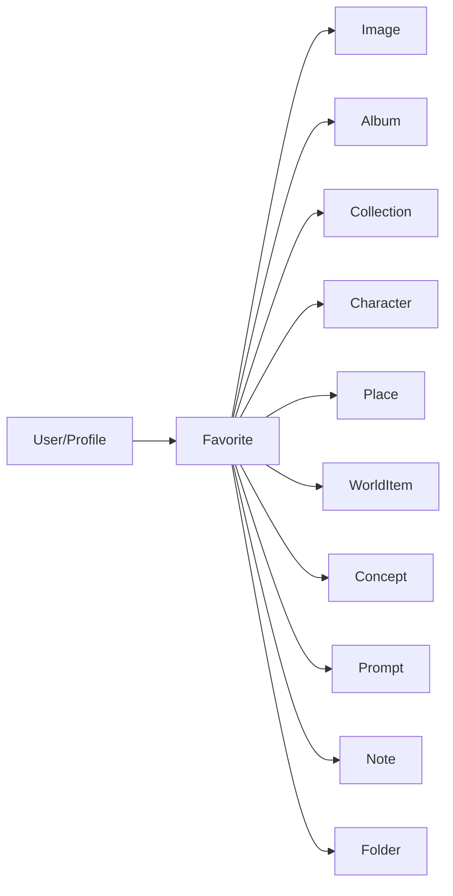

# Favorite entity documentation

## General architecture

The **Favorite** entity represents the Favorite system of the application.

The entity lets users mark different entity types as Favorites for fast access.



## File structure

```
src/store/entities/favorite/
├── README.md                    # This documentation
├── index.ts                     # Main store and exports
├── types.ts                     # Types specific to the store
├── constants.ts                 # Default values and constants
└── slices/
    ├── core.slice.ts           # State and basic operations
    ├── ui.slice.ts             # User interface state
    ├── filters.slice.ts        # Filters and search
    └── api.slice.ts            # API operations

src/transformers/favorite/
├── mappers.ts                  # Data transformations
├── serializers.ts              # Serialization for UI
└── transformer.ts              # Main transformers

src/types/entities/favorite/
└── types.ts                    # Canonical types
```

## Main types

### FavoriteBase

```typescript
interface FavoriteBase {
	id: string;
	entityId: string; // ID of the entity marked as a Favorite
	entityType: FavoriteEntityType; // Entity type
	userId?: string; // User ID (optional)
	profileId?: string; // Profile ID (optional)
	createdAt: Date;
	updatedAt: Date;
}
```

### FavoriteExtended

```typescript
interface FavoriteExtended extends FavoriteComplete {
	entityName?: string; // Entity name
	entityPreview?: string; // Entity preview
	entityIcon?: string; // Entity icon
	entityColor?: string; // Entity color
	isSelected?: boolean; // Selection state
	isHovered?: boolean; // Hover state
	_count?: Record<string, number>; // Counters
}
```

### FavoriteEntityType

```typescript
enum FavoriteEntityType {
	IMAGE = 'image',
	ALBUM = 'album',
	COLLECTION = 'collection',
	FOLDER = 'folder',
	CHARACTER = 'character',
	PLACE = 'place',
	WORLD_ITEM = 'worldItem',
	CONCEPT = 'concept',
	PROMPT = 'prompt',
	NOTE = 'note',
}
```

## Store API

### Core slice

```typescript
// State
interface CoreState {
  favorites: FavoriteExtended[];
  isLoading: boolean;
  error: string | null;
}

// Main actions
setFavorites(favorites: FavoriteExtended[]): void
addFavorite(favorite: FavoriteExtended): void
removeFavorite(id: string): void
updateFavorite(id: string, data: Partial<FavoriteExtended>): void
clearFavorites(): void
isFavorited(id: string): boolean
```

### UI slice

```typescript
// Interface state
interface UIState {
  viewMode: FavoriteViewMode;
  sortCriteria: FavoriteSortCriteria;
  sortDirection: 'asc' | 'desc';
  selectedIds: string[];
}

// UI actions
setViewMode(mode: FavoriteViewMode): void
setSortCriteria(criteria: FavoriteSortCriteria): void
toggleSortDirection(): void
selectFavorite(id: string): void
deselectFavorite(id: string): void
selectAll(): void
deselectAll(): void
```

### Filters slice

```typescript
// Filter state
interface FiltersState {
  filters: FavoriteFilters;
  isFilterActive: boolean;
}

// Filter actions
setFilters(filters: Partial<FavoriteFilters>): void
clearFilters(): void
setEntityTypeFilter(types: string[]): void
setDateRangeFilter(from: Date | null, to: Date | null): void
setSearchFilter(query: string): void
getFilteredFavorites(): FavoriteExtended[]
```

### API slice

```typescript
// API state
interface ApiState {
  isApiLoading: boolean;
  apiError: string | null;
  lastFetch: Date | null;
}

// API operations
fetchFavorites(): Promise<void>
createFavorite(entityId: string, entityType: string): Promise<void>
deleteFavorite(id: string): Promise<void>
setApiLoading(loading: boolean): void
setApiError(error: string | null): void
```

## Transformers

### Mappers

```typescript
// Main transformations
toFavoriteExtended(favorite: FavoriteBase): FavoriteExtended
toFavoritesExtended(favorites: FavoriteBase[]): FavoriteExtended[]
mapFavoriteFiltersToPrisma(filters: FavoriteFilters): any
mapCreateFavoriteDataToPrisma(data: FavoriteCreateInput): any
mapUpdateFavoriteDataToPrisma(data: FavoriteUpdateInput): any
groupFavoritesByType(favorites: FavoriteExtended[]): GroupedFavorites[]
```

### Serializers

```typescript
// Serialization for UI
transformImageToFileItem(image: any): FileItem
toFavoriteWithImage(favorite: any): FavoriteWithImage
toFavoritesWithImages(favorites: any[]): FavoriteWithImage[]
```

### Main transformer

```typescript
// Advanced transformations
transformFavorite<T>(favorite: T, options?: TransformFavoriteOptions): FavoriteComplete
transformFavorites<T>(favorites: T[], options?: TransformFavoriteOptions): FavoriteComplete[]
transformFavoriteToExtended<T>(favorite: T, entityDetails?: any): FavoriteComplete
groupFavoritesByType(favorites: FavoriteComplete[]): FavoritesByType[]
calculateFavoriteStats(favorites: FavoriteComplete[], recentLimit?: number): FavoriteStats
```

## Data flow



## Usage examples

### Basic use of the store

```typescript
import { useFavoriteStore } from '@/store/entities/favorite';

function FavoriteComponent() {
  const favorites = useFavoriteStore.use.favorites();
  const addFavorite = useFavoriteStore.use.addFavorite();
  const isLoading = useFavoriteStore.use.isLoading();

  const handleAddFavorite = () => {
    const newFavorite: FavoriteExtended = {
      id: 'fav-1',
      entityId: 'img-123',
      entityType: FavoriteEntityType.IMAGE,
      userId: 'user-1',
      createdAt: new Date(),
      updatedAt: new Date(),
      entityName: 'My Favorite Image',
      entityIcon: '🖼️',
      entityColor: '#3b82f6'
    };

    addFavorite(newFavorite);
  };

  return (
    <div>
      <button onClick={handleAddFavorite}>
        Add Favorite
      </button>

      {isLoading && <div>Loading...</div>}

      <div>
        {favorites.map(favorite => (
          <div key={favorite.id}>
            {favorite.entityIcon} {favorite.entityName}
          </div>
        ))}
      </div>
    </div>
  );
}
```

### Filters and search

```typescript
function FavoriteFilters() {
  const setEntityTypeFilter = useFavoriteStore.use.setEntityTypeFilter();
  const setSearchFilter = useFavoriteStore.use.setSearchFilter();
  const getFilteredFavorites = useFavoriteStore.use.getFilteredFavorites();

  const filteredFavorites = getFilteredFavorites();

  return (
    <div>
      <select
        onChange={(e) => setEntityTypeFilter([e.target.value])}
      >
        <option value="">All types</option>
        <option value="image">Images</option>
        <option value="album">Albums</option>
        <option value="collection">Collections</option>
      </select>

      <input
        type="text"
        placeholder="Search favorites..."
        onChange={(e) => setSearchFilter(e.target.value)}
      />

      <div>
        {filteredFavorites.map(favorite => (
          <div key={favorite.id}>
            {favorite.entityName}
          </div>
        ))}
      </div>
    </div>
  );
}
```

### Transformations

```typescript
import { transformFavorite, groupFavoritesByType } from '@/transformers/favorite/transformer';

// Transform API data
const rawFavorite = {
	id: 'fav-1',
	entity_id: 'img-123',
	entity_type: 'image',
	user_id: 'user-1',
	created_at: '2024-01-15T10:00:00Z',
};

const favorite = transformFavorite(rawFavorite);

// Group by type
const groupedFavorites = groupFavoritesByType(favorites);
console.log(groupedFavorites);
// [
//   {
//     type: 'image',
//     displayName: 'Images',
//     icon: '🖼️',
//     color: '#3b82f6',
//     count: 5,
//     items: [...]
//   }
// ]
```

## Configuration

### Default constants

```typescript
// Default view mode
DEFAULT_VIEW_MODE = FavoriteViewMode.GRID;

// Default sort criterion
DEFAULT_SORT_CRITERIA = FavoriteSortCriteria.UPDATED_AT;
DEFAULT_SORT_DIRECTION = 'desc';

// Default filters
DEFAULT_FILTERS = {
	entityType: [],
	createdAfter: null,
	createdBefore: null,
	search: '',
};
```

### Persistence

The store persists the following data automatically:

- View mode
- Sort criteria
- Active filters

## Relations with other entities



## Metrics and statistics

### Calculated statistics

```typescript
interface FavoriteStats {
	totalCount: number; // Total Favorites
	byType: Record<string, number>; // Count by type
	recentlyAdded: FavoriteComplete[]; // Recent Favorites
}
```

### Groupings

```typescript
interface FavoritesByType {
	type: string; // Entity type
	displayName: string; // Display name
	icon: string; // Type icon
	color: string; // Type color
	count: number; // Favorite count
	items: FavoriteComplete[]; // Favorites of the type
}
```

## Planned improvements

The following improvements are planned:

1. **Real-time synchronization** with WebSockets
2. **Shared Favorites** among users
3. **Custom Favorite categories**
4. **Export/import** of Favorites
5. **Smart Favorites** based on AI
6. **Notifications** of changes in Favorites

---

_Documentation generated automatically - Last update: 2024_
