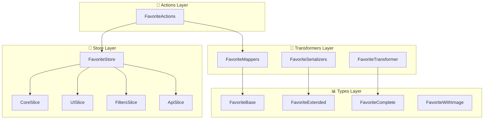
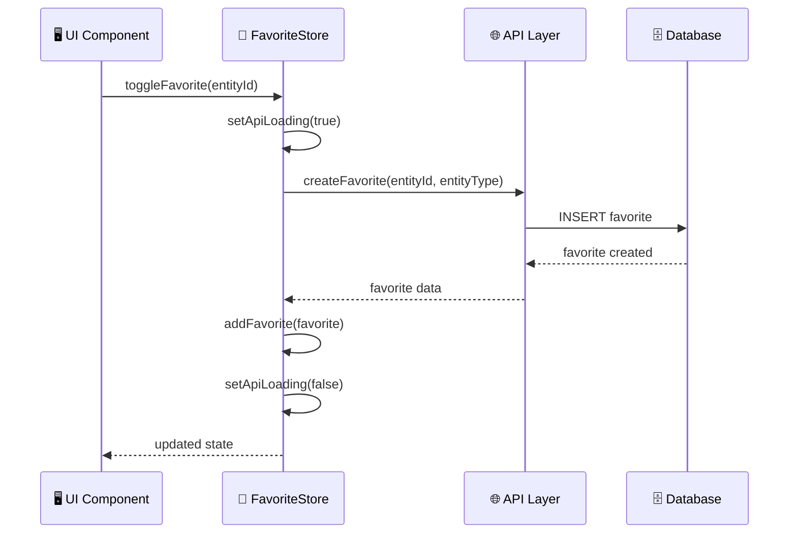
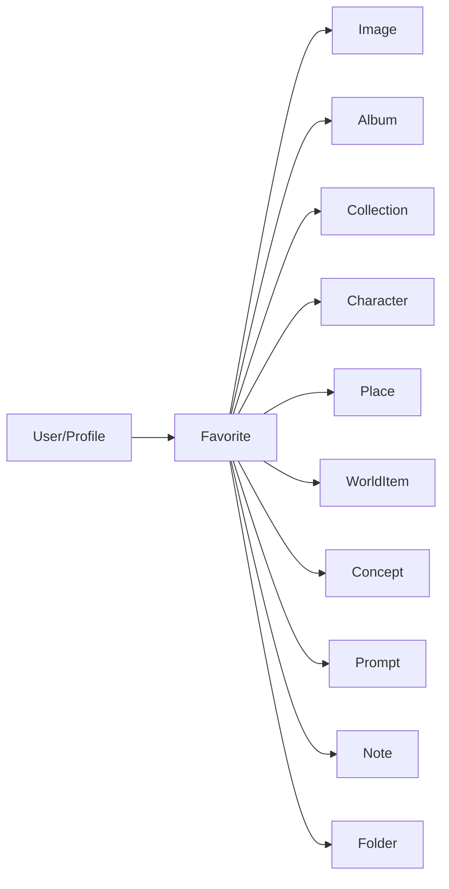

# 📋 Documentación de la Entidad Favorite

## 🏗️ Arquitectura General

La entidad **Favorite** representa el sistema de favoritos de la aplicación, permitiendo a los usuarios marcar diferentes tipos de entidades como favoritas para acceso rápido.



## 📁 Estructura de Archivos

```
src/store/entities/favorite/
├── README.md                    # Esta documentación
├── index.ts                     # Store principal y exportaciones
├── types.ts                     # Tipos específicos del store
├── constants.ts                 # Valores por defecto y constantes
└── slices/
    ├── core.slice.ts           # Estado y operaciones básicas
    ├── ui.slice.ts             # Estado de interfaz de usuario
    ├── filters.slice.ts        # Filtros y búsqueda
    └── api.slice.ts            # Operaciones de API

src/transformers/favorite/
├── mappers.ts                  # Transformaciones de datos
├── serializers.ts              # Serialización para UI
└── transformer.ts              # Transformadores principales

src/types/entities/favorite/
└── types.ts                    # Tipos canónicos
```

## 🎯 Tipos Principales

### FavoriteBase

```typescript
interface FavoriteBase {
  id: string;
  entityId: string;              // ID de la entidad marcada como favorita
  entityType: FavoriteEntityType; // Tipo de entidad
  userId?: string;               // ID del usuario (opcional)
  profileId?: string;            // ID del perfil (opcional)
  createdAt: Date;
  updatedAt: Date;
}
```

### FavoriteExtended

```typescript
interface FavoriteExtended extends FavoriteComplete {
  entityName?: string;           // Nombre de la entidad
  entityPreview?: string;        // Vista previa de la entidad
  entityIcon?: string;           // Icono de la entidad
  entityColor?: string;          // Color de la entidad
  isSelected?: boolean;          // Estado de selección
  isHovered?: boolean;           // Estado de hover
  _count?: Record<string, number>; // Contadores
}
```

### FavoriteEntityType

```typescript
enum FavoriteEntityType {
  IMAGE = 'image',
  ALBUM = 'album',
  COLLECTION = 'collection',
  FOLDER = 'folder',
  CHARACTER = 'character',
  PLACE = 'place',
  WORLD_ITEM = 'worldItem',
  CONCEPT = 'concept',
  PROMPT = 'prompt',
  NOTE = 'note',
}
```

## 🏪 API del Store

### Core Slice

```typescript
// Estado
interface CoreState {
  favorites: FavoriteExtended[];
  isLoading: boolean;
  error: string | null;
}

// Acciones principales
setFavorites(favorites: FavoriteExtended[]): void
addFavorite(favorite: FavoriteExtended): void
removeFavorite(id: string): void
updateFavorite(id: string, data: Partial<FavoriteExtended>): void
clearFavorites(): void
isFavorited(id: string): boolean
```

### UI Slice

```typescript
// Estado de interfaz
interface UIState {
  viewMode: FavoriteViewMode;
  sortCriteria: FavoriteSortCriteria;
  sortDirection: 'asc' | 'desc';
  selectedIds: string[];
}

// Acciones de UI
setViewMode(mode: FavoriteViewMode): void
setSortCriteria(criteria: FavoriteSortCriteria): void
toggleSortDirection(): void
selectFavorite(id: string): void
deselectFavorite(id: string): void
selectAll(): void
deselectAll(): void
```

### Filters Slice

```typescript
// Estado de filtros
interface FiltersState {
  filters: FavoriteFilters;
  isFilterActive: boolean;
}

// Acciones de filtros
setFilters(filters: Partial<FavoriteFilters>): void
clearFilters(): void
setEntityTypeFilter(types: string[]): void
setDateRangeFilter(from: Date | null, to: Date | null): void
setSearchFilter(query: string): void
getFilteredFavorites(): FavoriteExtended[]
```

### API Slice

```typescript
// Estado de API
interface ApiState {
  isApiLoading: boolean;
  apiError: string | null;
  lastFetch: Date | null;
}

// Operaciones de API
fetchFavorites(): Promise<void>
createFavorite(entityId: string, entityType: string): Promise<void>
deleteFavorite(id: string): Promise<void>
setApiLoading(loading: boolean): void
setApiError(error: string | null): void
```

## 🔄 Transformers

### Mappers

```typescript
// Transformaciones principales
toFavoriteExtended(favorite: FavoriteBase): FavoriteExtended
toFavoritesExtended(favorites: FavoriteBase[]): FavoriteExtended[]
mapFavoriteFiltersToPrisma(filters: FavoriteFilters): any
mapCreateFavoriteDataToPrisma(data: FavoriteCreateInput): any
mapUpdateFavoriteDataToPrisma(data: FavoriteUpdateInput): any
groupFavoritesByType(favorites: FavoriteExtended[]): GroupedFavorites[]
```

### Serializers

```typescript
// Serialización para UI
transformImageToFileItem(image: any): FileItem
toFavoriteWithImage(favorite: any): FavoriteWithImage
toFavoritesWithImages(favorites: any[]): FavoriteWithImage[]
```

### Transformer Principal

```typescript
// Transformaciones avanzadas
transformFavorite<T>(favorite: T, options?: TransformFavoriteOptions): FavoriteComplete
transformFavorites<T>(favorites: T[], options?: TransformFavoriteOptions): FavoriteComplete[]
transformFavoriteToExtended<T>(favorite: T, entityDetails?: any): FavoriteComplete
groupFavoritesByType(favorites: FavoriteComplete[]): FavoritesByType[]
calculateFavoriteStats(favorites: FavoriteComplete[], recentLimit?: number): FavoriteStats
```

## 📊 Flujo de Datos



## 🎨 Ejemplos de Uso

### Uso Básico del Store

```typescript
import { useFavoriteStore } from '@/store/entities/favorite';

function FavoriteComponent() {
  const favorites = useFavoriteStore.use.favorites();
  const addFavorite = useFavoriteStore.use.addFavorite();
  const isLoading = useFavoriteStore.use.isLoading();

  const handleAddFavorite = () => {
    const newFavorite: FavoriteExtended = {
      id: 'fav-1',
      entityId: 'img-123',
      entityType: FavoriteEntityType.IMAGE,
      userId: 'user-1',
      createdAt: new Date(),
      updatedAt: new Date(),
      entityName: 'Mi Imagen Favorita',
      entityIcon: '🖼️',
      entityColor: '#3b82f6'
    };

    addFavorite(newFavorite);
  };

  return (
    <div>
      <button onClick={handleAddFavorite}>
        Agregar Favorito
      </button>

      {isLoading && <div>Cargando...</div>}

      <div>
        {favorites.map(favorite => (
          <div key={favorite.id}>
            {favorite.entityIcon} {favorite.entityName}
          </div>
        ))}
      </div>
    </div>
  );
}
```

### Filtros y Búsqueda

```typescript
function FavoriteFilters() {
  const setEntityTypeFilter = useFavoriteStore.use.setEntityTypeFilter();
  const setSearchFilter = useFavoriteStore.use.setSearchFilter();
  const getFilteredFavorites = useFavoriteStore.use.getFilteredFavorites();

  const filteredFavorites = getFilteredFavorites();

  return (
    <div>
      <select
        onChange={(e) => setEntityTypeFilter([e.target.value])}
      >
        <option value="">Todos los tipos</option>
        <option value="image">Imágenes</option>
        <option value="album">Álbumes</option>
        <option value="collection">Colecciones</option>
      </select>

      <input
        type="text"
        placeholder="Buscar favoritos..."
        onChange={(e) => setSearchFilter(e.target.value)}
      />

      <div>
        {filteredFavorites.map(favorite => (
          <div key={favorite.id}>
            {favorite.entityName}
          </div>
        ))}
      </div>
    </div>
  );
}
```

### Transformaciones

```typescript
import { transformFavorite, groupFavoritesByType } from '@/transformers/favorite/transformer';

// Transformar datos de API
const rawFavorite = {
  id: 'fav-1',
  entity_id: 'img-123',
  entity_type: 'image',
  user_id: 'user-1',
  created_at: '2024-01-15T10:00:00Z'
};

const favorite = transformFavorite(rawFavorite);

// Agrupar por tipo
const groupedFavorites = groupFavoritesByType(favorites);
console.log(groupedFavorites);
// [
//   {
//     type: 'image',
//     displayName: 'Imágenes',
//     icon: '🖼️',
//     color: '#3b82f6',
//     count: 5,
//     items: [...]
//   }
// ]
```

## 🔧 Configuración

### Constantes por Defecto

```typescript
// Modo de vista por defecto
DEFAULT_VIEW_MODE = FavoriteViewMode.GRID

// Criterio de ordenación por defecto
DEFAULT_SORT_CRITERIA = FavoriteSortCriteria.UPDATED_AT
DEFAULT_SORT_DIRECTION = 'desc'

// Filtros por defecto
DEFAULT_FILTERS = {
  entityType: [],
  createdAfter: null,
  createdBefore: null,
  search: '',
}
```

### Persistencia

El store persiste automáticamente:

- Modo de vista
- Criterios de ordenación
- Filtros activos

## 🔗 Relaciones con Otras Entidades



## 📈 Métricas y Estadísticas

### Estadísticas Calculadas

```typescript
interface FavoriteStats {
  totalCount: number;                    // Total de favoritos
  byType: Record<string, number>;        // Conteo por tipo
  recentlyAdded: FavoriteComplete[];     // Favoritos recientes
}
```

### Agrupaciones

```typescript
interface FavoritesByType {
  type: string;           // Tipo de entidad
  displayName: string;    // Nombre para mostrar
  icon: string;          // Icono del tipo
  color: string;         // Color del tipo
  count: number;         // Cantidad de favoritos
  items: FavoriteComplete[]; // Favoritos del tipo
}
```

## 🚀 Próximas Mejoras

1. **Sincronización en tiempo real** con WebSockets
2. **Favoritos compartidos** entre usuarios
3. **Categorías personalizadas** de favoritos
4. **Exportación/importación** de favoritos
5. **Favoritos inteligentes** basados en IA
6. **Notificaciones** de cambios en favoritos

---

*Documentación generada automáticamente - Última actualización: 2024*
