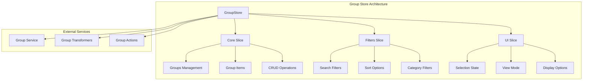
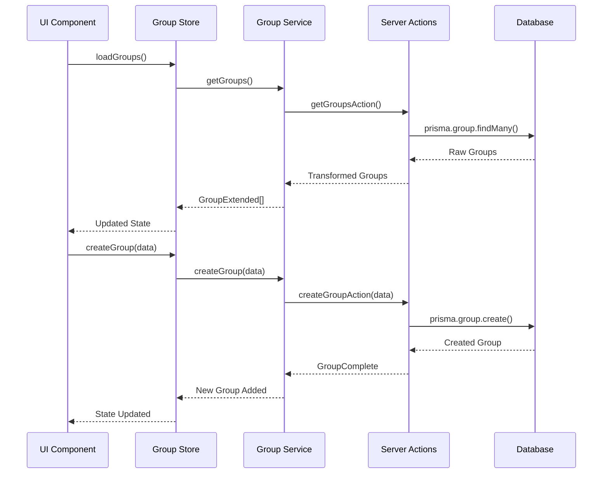
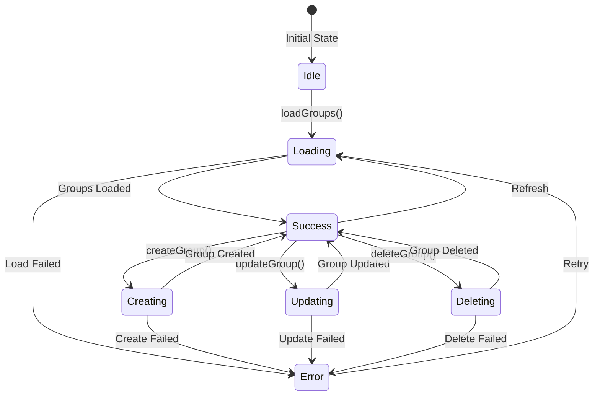

# 👥 Store de Group - Gestión de Grupos

## 📋 Resumen

El store de **Group** gestiona la organización de elementos en grupos temáticos, permitiendo agrupar imágenes, videos, álbumes, colecciones, etiquetas y otros elementos relacionados para facilitar su organización y navegación.

## 🏗️ Arquitectura del Store



## 🎯 Tipos Principales

### **Tipos Core**

```typescript
// Tipo base del grupo
interface GroupBase {
  id: string;
  name: string;
  emoji: string;
  color: string;
  description?: string;
  category?: string;
  isFavorite: boolean;
  createdAt: Date;
  updatedAt: Date;
}

// Tipo extendido con relaciones
interface GroupExtended extends GroupBase {
  itemsCount: number;
  tags?: Array<{ id: string; name: string; color: string }>;
  images?: Array<{ id: string; name: string; path: string }>;
  collections?: Array<{ id: string; name: string; emoji: string }>;
  // ... otras relaciones

  // Estados de UI
  isSelected?: boolean;
  isHighlighted?: boolean;
  isEditing?: boolean;
  isExpanded?: boolean;
}

// Tipo completo con contadores
interface GroupComplete extends GroupBase {
  _count: {
    images?: number;
    collections?: number;
    tags?: number;
    places?: number;
    worldItems?: number;
    concepts?: number;
    prompts?: number;
    notes?: number;
    wildcards?: number;
    properties?: number;
  };
}
```

### **Tipos de Filtros**

```typescript
interface GroupFilters {
  name?: string;
  category?: string;
  color?: string;
  isFavorite?: boolean;
  hasImages?: boolean;
  minItemsCount?: number;
  maxItemsCount?: number;
  createdAfter?: Date;
  createdBefore?: Date;
}

interface GroupSearchResult {
  items: GroupExtended[];
  total: number;
  page: number;
  limit: number;
  hasMore: boolean;
  filters: GroupFilters;
  sortBy: GroupSortCriteria;
}
```

## 🔄 Flujo de Datos



## 🎛️ API del Store

### **Core Actions**

```typescript
// 📊 Operaciones principales
loadGroup: (id: string) => Promise<GroupExtended | undefined>
loadGroups: () => Promise<GroupExtended[]>
createGroup: (data: GroupCreateInput) => Promise<GroupExtended>
updateGroup: (id: string, data: GroupUpdateInput) => Promise<GroupExtended>
deleteGroup: (id: string) => Promise<void>

// 🔍 Búsqueda y filtros
searchGroups: (filters: GroupFilters) => Promise<GroupSearchResult>
getFilteredGroups: () => GroupExtended[]
applyFilters: (groups: GroupExtended[]) => GroupExtended[]
applySort: (groups: GroupExtended[]) => GroupExtended[]
```

### **Filter Actions**

```typescript
// 🎯 Gestión de filtros
setSortBy: (sortBy: GroupSortCriteria) => void
setSearchQuery: (query: string) => void
setFilterByType: (type: string | null) => void
setFilterByCategory: (category: string | null) => void
setFilterFavorites: (favorites: boolean) => void
setDateRange: (from: Date | null, to: Date | null) => void
clearFilters: () => void
```

### **UI Actions**

```typescript
// 🎨 Estado de interfaz
setSelectedGroups: (ids: string[]) => void
toggleGroupSelection: (id: string) => void
setViewMode: (mode: GroupViewMode) => void
setGroupDisplayState: (id: string, state: GroupDisplayState) => void
setIsLoading: (loading: boolean) => void
setError: (error: string | null) => void
```

## 🎯 Ejemplos de Uso

### **Cargar y Mostrar Grupos**

```typescript
// En un componente React
const {
  groups,
  isLoading,
  error,
  loadGroups,
  getFilteredGroups
} = useGroupStore();

// Cargar grupos al montar
useEffect(() => {
  loadGroups();
}, [loadGroups]);

// Obtener grupos filtrados
const filteredGroups = getFilteredGroups();
```

### **Crear Nuevo Grupo**

```typescript
const { createGroup } = useGroupStore();

const handleCreateGroup = async (formData: GroupCreateInput) => {
  try {
    const newGroup = await createGroup({
      name: formData.name,
      emoji: formData.emoji || '📂',
      color: formData.color || '#3b82f6',
      category: formData.category,
      description: formData.description,
    });

    console.log('✅ Grupo creado:', newGroup);
  } catch (error) {
    console.error('❌ Error creando grupo:', error);
  }
};
```

### **Filtrar y Buscar**

```typescript
const {
  setSearchQuery,
  setFilterByCategory,
  setFilterFavorites,
  clearFilters
} = useGroupStore();

// Buscar por nombre
const handleSearch = (query: string) => {
  setSearchQuery(query);
};

// Filtrar por categoría
const handleCategoryFilter = (category: string) => {
  setFilterByCategory(category);
};

// Mostrar solo favoritos
const handleFavoritesFilter = () => {
  setFilterFavorites(true);
};

// Limpiar filtros
const handleClearFilters = () => {
  clearFilters();
};
```

### **Gestión de Selección**

```typescript
const {
  selectedGroups,
  setSelectedGroups,
  toggleGroupSelection
} = useGroupStore();

// Seleccionar múltiples grupos
const handleSelectAll = (groupIds: string[]) => {
  setSelectedGroups(groupIds);
};

// Toggle selección individual
const handleToggleGroup = (groupId: string) => {
  toggleGroupSelection(groupId);
};

// Obtener grupos seleccionados
const selectedGroupsData = groups.filter(g =>
  selectedGroups.includes(g.id)
);
```

## 🔧 Transformaciones

### **Extensión de Grupos**

```typescript
// Extender grupo base con propiedades adicionales
const extendGroup = (group: GroupBase): GroupComplete => ({
  ...group,
  _count: {
    images: 0,
    collections: 0,
    tags: 0,
    // ... otros contadores
  }
});

// Transformar para UI
const transformGroupToExtended = (
  group: GroupComplete,
  options: { isSelected?: boolean } = {}
): GroupExtended => ({
  ...group,
  itemsCount: Object.values(group._count).reduce((a, b) => a + (b || 0), 0),
  isSelected: options.isSelected || false,
  isHighlighted: false,
  isEditing: false,
  isExpanded: false,
});
```

## 📊 Estados de Carga



## 🎨 Integración con UI

### **Componentes Relacionados**

- `GroupCard` - Tarjeta de grupo individual
- `GroupList` - Lista de grupos
- `GroupFilters` - Panel de filtros
- `GroupCreator` - Formulario de creación
- `GroupEditor` - Editor de grupos

### **Hooks Personalizados**

```typescript
// Hook para grupos filtrados
const useFilteredGroups = () => {
  const { getFilteredGroups } = useGroupStore();
  return useMemo(() => getFilteredGroups(), [getFilteredGroups]);
};

// Hook para grupos seleccionados
const useSelectedGroups = () => {
  const { groups, selectedGroups } = useGroupStore();
  return useMemo(() =>
    groups.filter(g => selectedGroups.includes(g.id)),
    [groups, selectedGroups]
  );
};
```

## 🚀 Optimizaciones

- **Paginación**: Carga incremental de grupos
- **Caché**: Almacenamiento en memoria de grupos frecuentes
- **Debounce**: Búsqueda con retraso para evitar spam
- **Memoización**: Cálculos de filtros optimizados
- **Virtualización**: Para listas grandes de grupos

## 📈 Métricas y Analytics

- Total de grupos creados
- Grupos más utilizados
- Categorías populares
- Patrones de organización
- Rendimiento de búsquedas

---

**📝 Nota**: Esta documentación se actualiza automáticamente con cada cambio en la entidad Group.
