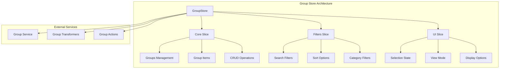
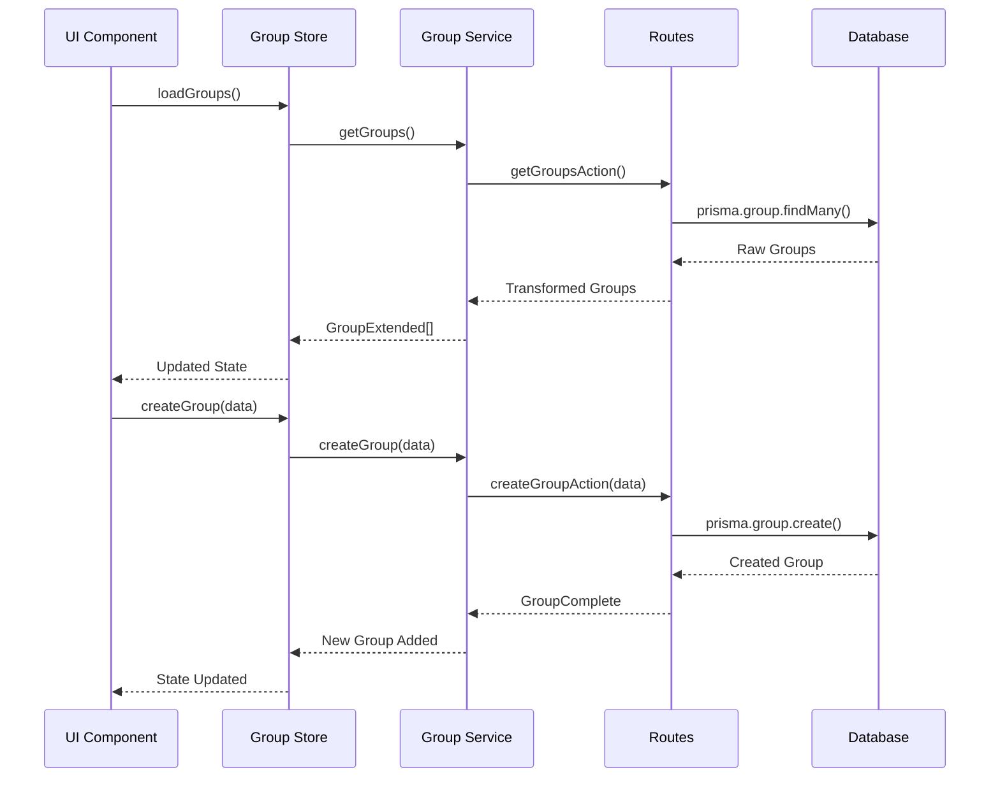
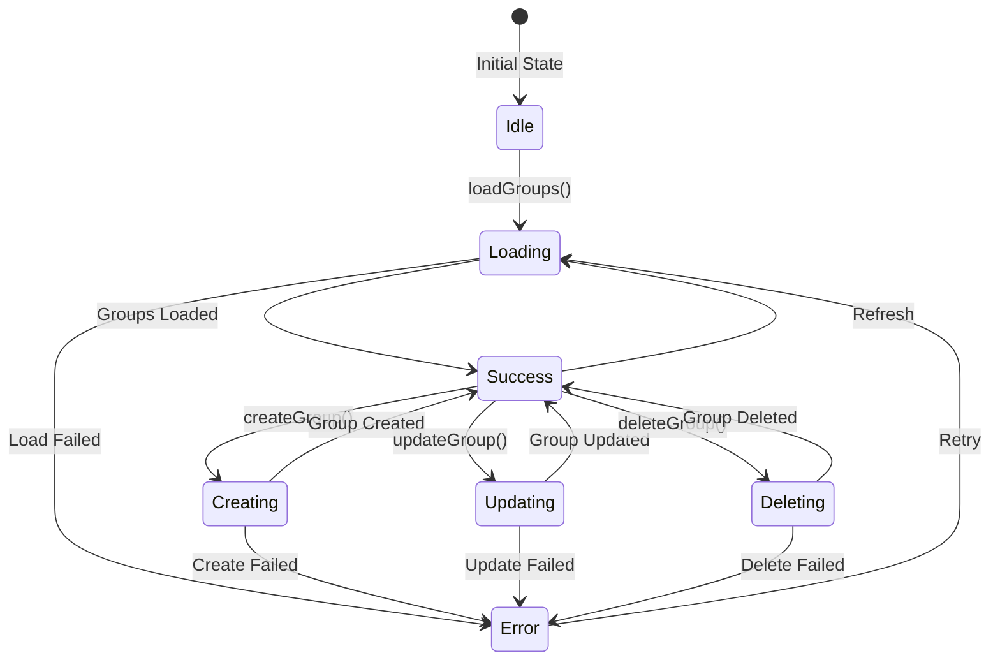

# Group store - Group management

## Summary

The **Group** store manages organization of items in thematic Groups.

The store can group images, videos, Albums, Collections, Tags, and other related items to ease organization and navigation.

## Store architecture



## Main types

### Core types

```typescript
// Base Group type
interface GroupBase {
	id: string;
	name: string;
	emoji: string;
	color: string;
	description?: string;
	category?: string;
	isFavorite: boolean;
	createdAt: Date;
	updatedAt: Date;
}

// Extended type with relations
interface GroupExtended extends GroupBase {
	itemsCount: number;
	tags?: Array<{ id: string; name: string; color: string }>;
	images?: Array<{ id: string; name: string; path: string }>;
	collections?: Array<{ id: string; name: string; emoji: string }>;
	// ... other relations

	// UI states
	isSelected?: boolean;
	isHighlighted?: boolean;
	isEditing?: boolean;
	isExpanded?: boolean;
}

// Complete type with counters
interface GroupComplete extends GroupBase {
	_count: {
		images?: number;
		collections?: number;
		tags?: number;
		places?: number;
		worldItems?: number;
		concepts?: number;
		prompts?: number;
		notes?: number;
		wildcards?: number;
		properties?: number;
	};
}
```

### Filter types

```typescript
interface GroupFilters {
	name?: string;
	category?: string;
	color?: string;
	isFavorite?: boolean;
	hasImages?: boolean;
	minItemsCount?: number;
	maxItemsCount?: number;
	createdAfter?: Date;
	createdBefore?: Date;
}

interface GroupSearchResult {
	items: GroupExtended[];
	total: number;
	page: number;
	limit: number;
	hasMore: boolean;
	filters: GroupFilters;
	sortBy: GroupSortCriteria;
}
```

## Data flow



Routes call services.

## Store API

### Core actions

```typescript
// Main operations
loadGroup: (id: string) => Promise<GroupExtended | undefined>
loadGroups: () => Promise<GroupExtended[]>
createGroup: (data: GroupCreateInput) => Promise<GroupExtended>
updateGroup: (id: string, data: GroupUpdateInput) => Promise<GroupExtended>
deleteGroup: (id: string) => Promise<void>

// Search and filters
searchGroups: (filters: GroupFilters) => Promise<GroupSearchResult>
getFilteredGroups: () => GroupExtended[]
applyFilters: (groups: GroupExtended[]) => GroupExtended[]
applySort: (groups: GroupExtended[]) => GroupExtended[]
```

### Filter actions

```typescript
// Filter management
setSortBy: (sortBy: GroupSortCriteria) => void
setSearchQuery: (query: string) => void
setFilterByType: (type: string | null) => void
setFilterByCategory: (category: string | null) => void
setFilterFavorites: (favorites: boolean) => void
setDateRange: (from: Date | null, to: Date | null) => void
clearFilters: () => void
```

### UI actions

```typescript
// Interface state
setSelectedGroups: (ids: string[]) => void
toggleGroupSelection: (id: string) => void
setViewMode: (mode: GroupViewMode) => void
setGroupDisplayState: (id: string, state: GroupDisplayState) => void
setIsLoading: (loading: boolean) => void
setError: (error: string | null) => void
```

## Usage examples

### Load and show Groups

```typescript
// In a React component
const { groups, isLoading, error, loadGroups, getFilteredGroups } = useGroupStore();

// Load Groups on mount
useEffect(() => {
	loadGroups();
}, [loadGroups]);

// Get filtered Groups
const filteredGroups = getFilteredGroups();
```

### Create a new Group

```typescript
const { createGroup } = useGroupStore();

const handleCreateGroup = async (formData: GroupCreateInput) => {
	try {
		const newGroup = await createGroup({
			name: formData.name,
			emoji: formData.emoji || '📂',
			color: formData.color || '#3b82f6',
			category: formData.category,
			description: formData.description,
		});

		console.log('Group created:', newGroup);
	} catch (error) {
		console.error('Error creating Group:', error);
	}
};
```

### Filter and search

```typescript
const { setSearchQuery, setFilterByCategory, setFilterFavorites, clearFilters } = useGroupStore();

// Search by name
const handleSearch = (query: string) => {
	setSearchQuery(query);
};

// Filter by category
const handleCategoryFilter = (category: string) => {
	setFilterByCategory(category);
};

// Show Favorites only
const handleFavoritesFilter = () => {
	setFilterFavorites(true);
};

// Clear filters
const handleClearFilters = () => {
	clearFilters();
};
```

### Selection management

```typescript
const { selectedGroups, setSelectedGroups, toggleGroupSelection } = useGroupStore();

// Select multiple Groups
const handleSelectAll = (groupIds: string[]) => {
	setSelectedGroups(groupIds);
};

// Toggle individual selection
const handleToggleGroup = (groupId: string) => {
	toggleGroupSelection(groupId);
};

// Get selected Groups
const selectedGroupsData = groups.filter((g) => selectedGroups.includes(g.id));
```

## Transformations

### Group extension

```typescript
// Extend a base Group with extra properties
const extendGroup = (group: GroupBase): GroupComplete => ({
	...group,
	_count: {
		images: 0,
		collections: 0,
		tags: 0,
		// ... other counters
	},
});

// Transform for UI
const transformGroupToExtended = (group: GroupComplete, options: { isSelected?: boolean } = {}): GroupExtended => ({
	...group,
	itemsCount: Object.values(group._count).reduce((a, b) => a + (b || 0), 0),
	isSelected: options.isSelected || false,
	isHighlighted: false,
	isEditing: false,
	isExpanded: false,
});
```

## Loading states



## UI integration

### Related components

The store integrates with the following components:

- `GroupCard` - Individual Group card
- `GroupList` - Group list
- `GroupFilters` - Filter panel
- `GroupCreator` - Creation form
- `GroupEditor` - Group editor

### Custom hooks

```typescript
// Hook for filtered Groups
const useFilteredGroups = () => {
	const { getFilteredGroups } = useGroupStore();
	return useMemo(() => getFilteredGroups(), [getFilteredGroups]);
};

// Hook for selected Groups
const useSelectedGroups = () => {
	const { groups, selectedGroups } = useGroupStore();
	return useMemo(() => groups.filter((g) => selectedGroups.includes(g.id)), [groups, selectedGroups]);
};
```

## Optimizations

The store uses the following optimizations:

- **Pagination**: Incremental load of Groups
- **Cache**: In-memory storage of frequent Groups
- **Debounce**: Search with delay to avoid spam
- **Memoization**: Optimized filter calculations
- **Virtualization**: For large Group lists

## Metrics and analytics

The store tracks the following metrics:

- Total of Groups created
- Most used Groups
- Popular categories
- Organization patterns
- Search performance

---

**Note**: This documentation updates automatically with each change in the Group entity.
