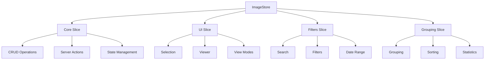
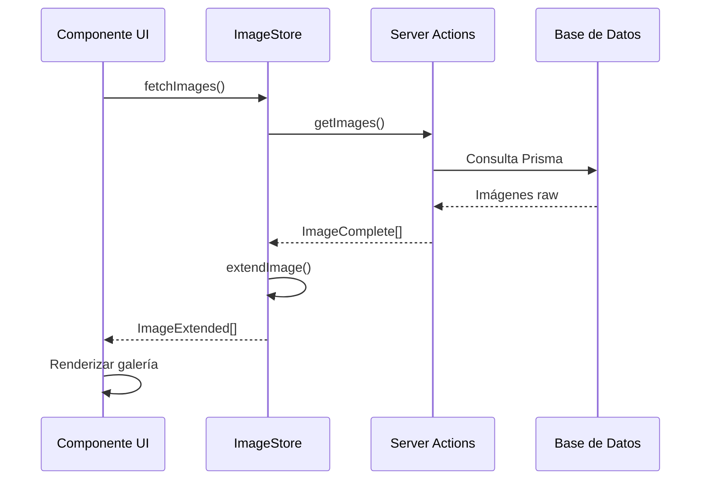

# 🖼️ Store de Image - Gestión de Imágenes

## 📋 Descripción

Store para la gestión completa de imágenes en el sistema, incluyendo operaciones CRUD, visualización, filtrado y agrupamiento.

## 🏗️ Arquitectura



## 🔧 Slices Implementados

### 1. **Core Slice** - Operaciones CRUD

```typescript
interface ImageCoreSlice {
  // Estado
  images: Record<string, ImageExtended>;
  isLoading: boolean;
  error: string | null;

  // Getters
  getImage: (id: string) => ImageExtended | undefined;
  getImages: () => ImageExtended[];
  getImagesByFolder: (folderId: string) => ImageExtended[];

  // Operaciones síncronas
  addImage: (image: ImageExtended) => void;
  addImages: (images: ImageExtended[]) => void;
  updateImage: (id: string, data: Partial<ImageExtended>) => void;
  deleteImage: (id: string) => void;

  // Operaciones asíncronas
  fetchImage: (id: string) => Promise<ImageExtended | undefined>;
  fetchImages: (options?) => Promise<ImageExtended[]>;
  createImage: (data: CreateImageData) => Promise<ImageExtended | undefined>;
  updateImage: (id: string, data: UpdateImageData) => Promise<ImageExtended | undefined>;
  removeImage: (id: string) => Promise<boolean>;
}
```

### 2. **UI Slice** - Interfaz de Usuario

```typescript
interface ImageUISlice {
  // Selección
  selectImage: (id: string | null) => void;
  toggleImageSelection: (id: string) => void;
  clearSelection: () => void;
  isImageSelected: (id: string) => boolean;

  // Visor
  openViewer: (imageId: string) => void;
  closeViewer: () => void;
  nextImage: () => void;
  previousImage: () => void;

  // Vista
  setViewMode: (viewMode: ImageViewMode) => void;
  getViewMode: () => ImageViewMode;
}
```

## 🎯 Características Especiales

### **Gestión de Thumbnails**

- Optimización automática de thumbnails
- Carga lazy de imágenes
- Gestión de errores de thumbnail

### **Modos de Visualización**

- `grid`: Vista en cuadrícula
- `list`: Vista en lista
- `masonry`: Vista tipo Pinterest
- `timeline`: Vista cronológica
- `map`: Vista en mapa (con geolocalización)
- `slideshow`: Presentación automática

### **Filtrado Avanzado**

- Por carpeta, etiquetas, álbumes
- Rango de fechas
- Tamaño y resolución
- Favoritos y públicas/privadas

### **Agrupamiento Inteligente**

- Por carpeta
- Por fecha
- Por etiquetas
- Por tamaño

## 📊 Tipos Principales

```typescript
// Tipo base de imagen
interface ImageBase {
  id: string;
  name: string;
  path: string;
  hash: string;
  size: number;
  width: number;
  height: number;
  metadata?: string | null;
  isFavorite: boolean;
  folderId: string | null;
  addedAt: Date;
}

// Imagen extendida con relaciones
interface ImageExtended extends ImageBase {
  tags?: any[];
  collections?: any[];
  albums?: any[];
  characters?: any[];
  places?: any[];
  stats?: any;
  folder?: any;
}

// Criterios de ordenamiento
type ImageSortCriteria =
  | 'name_asc' | 'name_desc'
  | 'date_asc' | 'date_desc'
  | 'size_asc' | 'size_desc'
  | 'width_asc' | 'width_desc'
  | 'height_asc' | 'height_desc'
  | 'favorite_first' | 'favorite_last';
```

## 🔄 Flujo de Datos



## 🎨 Patrones de Uso

### **Cargar Imágenes por Carpeta**

```typescript
const { fetchImages } = useImageStore();

// Cargar imágenes de carpetas específicas
await fetchImages({
  folderIds: ['folder-1', 'folder-2'],
  refresh: true
});
```

### **Gestión de Selección**

```typescript
const {
  selectImage,
  toggleImageSelection,
  getSelectedImages,
  clearSelection
} = useImageStore();

// Seleccionar imagen
selectImage('image-id');

// Alternar selección
toggleImageSelection('image-id');

// Obtener seleccionadas
const selected = getSelectedImages();
```

### **Visor de Imágenes**

```typescript
const {
  openViewer,
  closeViewer,
  nextImage,
  previousImage
} = useImageStore();

// Abrir visor
openViewer('image-id');

// Navegación
nextImage();
previousImage();
```

### **Filtrado y Búsqueda**

```typescript
import { sortImages, groupImages, filterImagesBySearch } from '@/utils/image';

const images = getImages();

// Ordenar
const sorted = sortImages(images, 'date_desc');

// Agrupar
const grouped = groupImages(images, 'folder');

// Filtrar por búsqueda
const filtered = filterImagesBySearch(images, 'vacation');
```

## 🚀 Optimizaciones

### **Performance**

- Uso de Record<string, ImageExtended> para acceso O(1)
- Lazy loading de thumbnails
- Virtualización en listas grandes
- Memoización de cálculos costosos

### **UX**

- Transiciones suaves entre modos de vista
- Previsualización rápida con thumbnails
- Selección múltiple con Shift/Ctrl
- Navegación con teclado en visor

### **Persistencia**

- Solo se persiste configuración de vista
- Imágenes se recargan en cada sesión
- Cache inteligente de thumbnails

## 🔗 Relaciones

- **Folder**: Organización jerárquica
- **Album**: Agrupaciones temáticas
- **Collection**: Colecciones NFT/Blockchain
- **Tag**: Etiquetado flexible
- **Character**: Personajes en imágenes
- **Place**: Ubicaciones geográficas

## 📈 Métricas y Estadísticas

- Total de imágenes y tamaño
- Distribución por carpetas
- Resoluciones más comunes
- Imágenes favoritas
- Imágenes con/sin thumbnails
- Estadísticas de uso del visor
