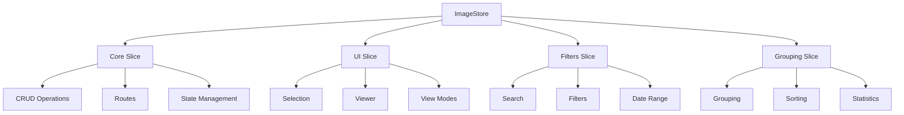
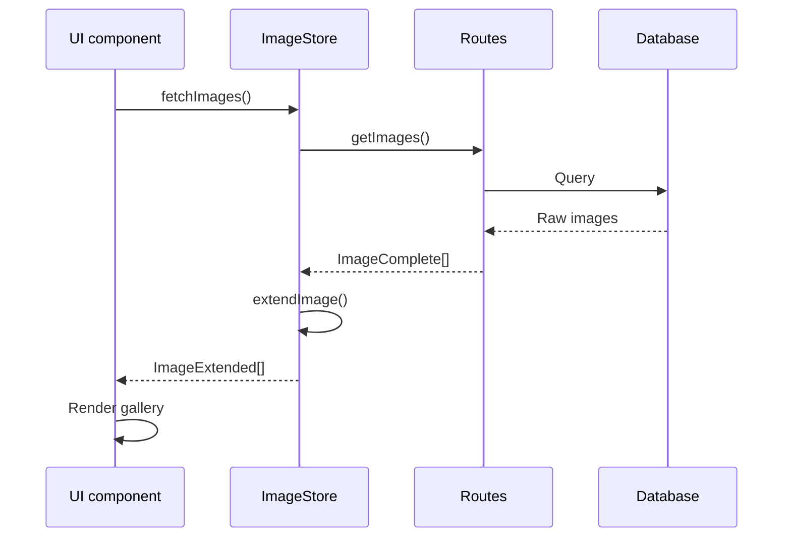

# Image store - image management

## Description

This store provides complete image management in the system, including CRUD operations, display, filter, and grouping.

## Architecture



Routes call services.

## Implemented slices

### 1. Core slice - CRUD operations

```typescript
interface ImageCoreSlice {
	// State
	images: Record<string, ImageExtended>;
	isLoading: boolean;
	error: string | null;

	// Getters
	getImage: (id: string) => ImageExtended | undefined;
	getImages: () => ImageExtended[];
	getImagesByFolder: (folderId: string) => ImageExtended[];

	// Synchronous operations
	addImage: (image: ImageExtended) => void;
	addImages: (images: ImageExtended[]) => void;
	updateImage: (id: string, data: Partial<ImageExtended>) => void;
	deleteImage: (id: string) => void;

	// Asynchronous operations
	fetchImage: (id: string) => Promise<ImageExtended | undefined>;
	fetchImages: (options?) => Promise<ImageExtended[]>;
	createImage: (data: CreateImageData) => Promise<ImageExtended | undefined>;
	updateImage: (id: string, data: UpdateImageData) => Promise<ImageExtended | undefined>;
	removeImage: (id: string) => Promise<boolean>;
}
```

### 2. UI slice - user interface

```typescript
interface ImageUISlice {
	// Selection
	selectImage: (id: string | null) => void;
	toggleImageSelection: (id: string) => void;
	clearSelection: () => void;
	isImageSelected: (id: string) => boolean;

	// Viewer
	openViewer: (imageId: string) => void;
	closeViewer: () => void;
	nextImage: () => void;
	previousImage: () => void;

	// View
	setViewMode: (viewMode: ImageViewMode) => void;
	getViewMode: () => ImageViewMode;
}
```

## Special features

### Thumbnail management

The store provides the following thumbnail features:

- Automatic thumbnail optimization
- Lazy image loading
- Thumbnail error management

### Display modes

The store supports the following view modes:

- `grid`: Grid view
- `list`: List view
- `masonry`: Pinterest-style view
- `timeline`: Chronological view
- `map`: Map view (with geolocation)
- `slideshow`: Automatic presentation

### Advanced filtering

The store filters by the following criteria:

- Folder, Tags, Albums
- Date range
- Size and resolution
- Favorites and public or private

### Intelligent grouping

The store groups by the following criteria:

- Folder
- Date
- Tags
- Size

## Main types

```typescript
// Base image type
interface ImageBase {
	id: string;
	name: string;
	path: string;
	hash: string;
	size: number;
	width: number;
	height: number;
	metadata?: string | null;
	isFavorite: boolean;
	folderId: string | null;
	addedAt: Date;
}

// Extended image with relations
interface ImageExtended extends ImageBase {
	tags?: any[];
	collections?: any[];
	albums?: any[];
	characters?: any[];
	places?: any[];
	stats?: any;
	folder?: any;
}

// Sort criteria
type ImageSortCriteria =
	| 'name_asc'
	| 'name_desc'
	| 'date_asc'
	| 'date_desc'
	| 'size_asc'
	| 'size_desc'
	| 'width_asc'
	| 'width_desc'
	| 'height_asc'
	| 'height_desc'
	| 'favorite_first'
	| 'favorite_last';
```

## Data flow



## Usage patterns

### Load images by Folder

```typescript
const { fetchImages } = useImageStore();

// Load images of specific Folders
await fetchImages({
	folderIds: ['folder-1', 'folder-2'],
	refresh: true,
});
```

### Selection management

```typescript
const { selectImage, toggleImageSelection, getSelectedImages, clearSelection } = useImageStore();

// Select an image
selectImage('image-id');

// Toggle selection
toggleImageSelection('image-id');

// Get selected images
const selected = getSelectedImages();
```

### Image viewer

```typescript
const { openViewer, closeViewer, nextImage, previousImage } = useImageStore();

// Open the viewer
openViewer('image-id');

// Navigation
nextImage();
previousImage();
```

### Filter and search

```typescript
import { sortImages, groupImages, filterImagesBySearch } from '@/utils/image';

const images = getImages();

// Sort
const sorted = sortImages(images, 'date_desc');

// Group
const grouped = groupImages(images, 'folder');

// Filter by search
const filtered = filterImagesBySearch(images, 'vacation');
```

## Optimizations

### Performance

The store uses the following performance techniques:

- Use of Record<string, ImageExtended> for O(1) access
- Lazy loading of thumbnails
- Virtualization in large lists
- Memoization of expensive calculations

### UX

The store provides the following UX features:

- Smooth transitions between view modes
- Fast preview with thumbnails
- Multi-select with Shift/Ctrl
- Keyboard navigation in the viewer

### Persistence

Only view configuration persists.

Images reload in each session.

Thumbnail cache is intelligent.

## Relations

The store relates to the following entities:

- **Folder**: Hierarchical organization
- **Album**: Thematic groupings
- **Collection**: NFT/blockchain Collections
- **Tag**: Flexible tagging
- **Character**: Characters in images
- **Place**: Geographic locations

## Metrics and statistics

The store tracks the following metrics:

- Total images and size
- Distribution by Folders
- Most common resolutions
- Favorite images
- Images with and without thumbnails
- Viewer usage statistics
