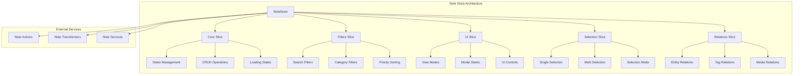
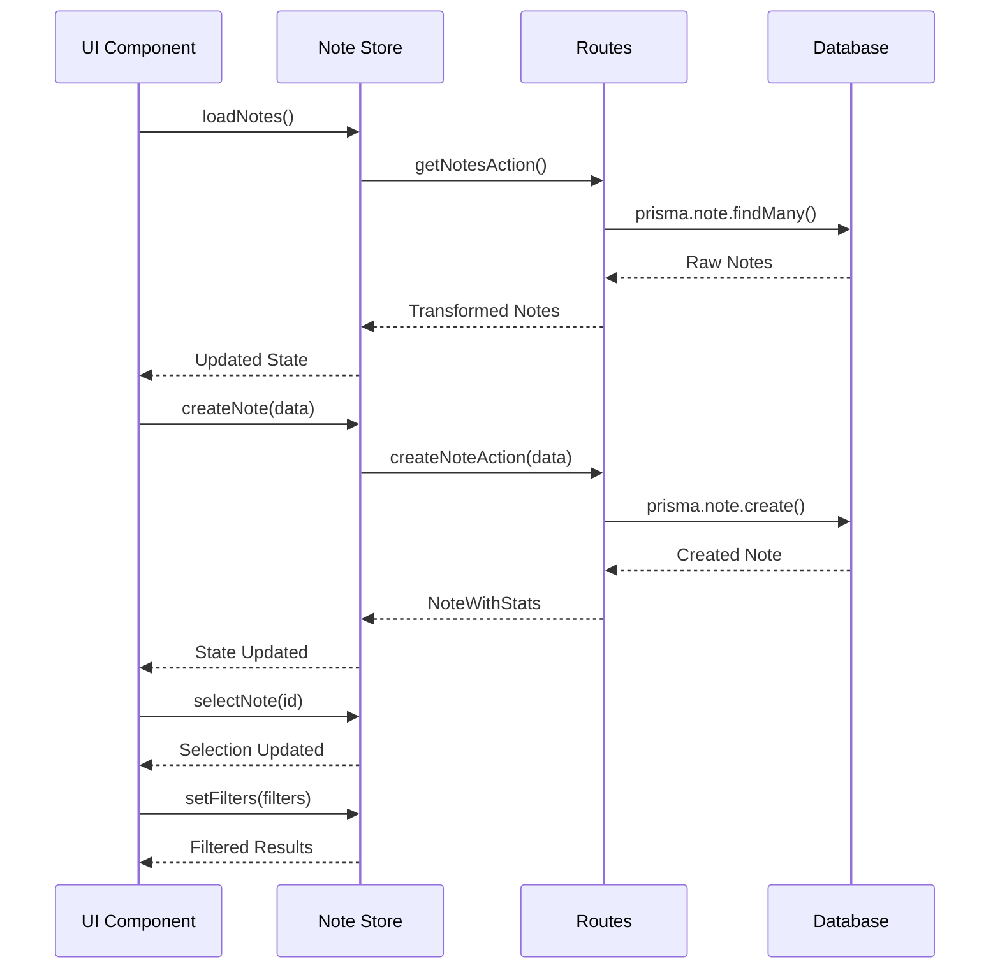
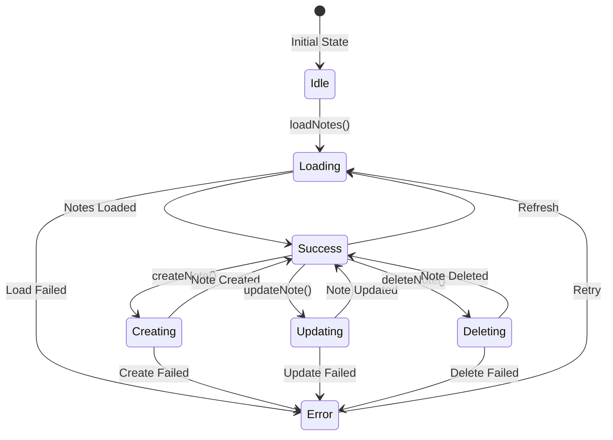

# Note store - Note management

## Summary

The **Note** store manages notes and text documents.

The store lets you create, edit, organize, and relate notes to other system items such as images, Albums, Characters, Places, and more.

## Store architecture



## Main types

### Core types

```typescript
// Base Note type
interface NoteBase {
	id: string;
	title: string;
	content: string;
	category: string;
	priority: number;
	status: string;
	featuredImage: string | null;
	isFavorite: boolean;
	presetId: string | null;
	createdAt: Date;
	updatedAt: Date;
}

// Extended type with relations
interface NoteExtended extends NoteComplete {
	isSelected: boolean;
	isHighlighted: boolean;
	isEditing: boolean;
	isExpanded: boolean;
	isLoading: boolean;
	hasError: boolean;
	isDragging: boolean;
	isDropTarget: boolean;
	totalItems: number;
}

// Complete type with statistics
interface NoteWithStats extends NoteComplete {
	stats: {
		totalItems: number;
		totalImages: number;
		totalVideos: number;
		totalAlbums: number;
		totalCollections: number;
		totalTags: number;
		totalCharacters: number;
		totalPlaces: number;
		totalWorldItems: number;
		totalConcepts: number;
		totalPrompts: number;
		totalWildcards: number;
		totalProperties: number;
		totalGroups: number;
		lastUpdated: Date;
	};
}
```

### Filter types

```typescript
interface NoteFilters {
	searchQuery?: string;
	categories?: string[];
	priorities?: number[];
	statuses?: string[];
	onlyFavorites?: boolean;
	contentContains?: string;
	hasTags?: boolean;
	hasImages?: boolean;
	hasVideos?: boolean;
}

interface NoteSearchResult {
	items: NoteComplete[];
	total: number;
	hasMore: boolean;
}
```

### Enums

```typescript
enum NoteCategory {
	GENERAL = 'general',
	STORY = 'story',
	LORE = 'lore',
	MECHANICS = 'mechanics',
	CHARACTER = 'character',
	PLACE = 'place',
	WORLD_ITEM = 'world_item',
	PROMPT = 'prompt',
	IDEA = 'idea',
	TODO = 'todo',
}

enum NoteStatus {
	ACTIVE = 'active',
	ARCHIVED = 'archived',
	COMPLETED = 'completed',
	DRAFT = 'draft',
	PENDING = 'pending',
}

enum NotePriority {
	LOWEST = 0,
	LOW = 1,
	MEDIUM = 2,
	HIGH = 3,
	HIGHEST = 4,
}

enum NoteViewMode {
	GRID = 'grid',
	LIST = 'list',
	CARDS = 'cards',
	COMPACT = 'compact',
	DETAIL = 'detail',
}
```

## Data flow



Routes call services.

## Store API

### Core actions

```typescript
// Main operations
loadNotes: () => Promise<void>
createNote: (note: NoteCreateInput) => Promise<string | null>
updateNote: (id: string, note: NoteUpdateInput) => Promise<void>
deleteNote: (id: string) => Promise<void>
selectNote: (noteId: string | null) => void
reset: () => void
```

### Filter actions

```typescript
// Filter management
setFilters: (filters: Partial<NoteFilters>) => void
setSortBy: (sortBy: NoteSortOption) => void
setPage: (page: number) => void
setPageSize: (pageSize: number) => void
setCategoryFilter: (category: string | null) => void
setStatusFilter: (status: string | null) => void
setPriorityFilter: (priority: number | null) => void
setSearchFilter: (search: string) => void
setTagsFilter: (tags: string[]) => void
setOnlyFavoritesFilter: (onlyFavorites: boolean) => void
clearFilters: () => void
```

### Selection actions

```typescript
// Selection management
selectNote: (id: string) => void
unselectNote: () => void
toggleMultiSelectMode: () => void
toggleNoteSelection: (id: string) => void
selectAllNotes: () => void
clearSelection: () => void
resetSelection: () => void
```

### UI actions

```typescript
// Interface state
openCreateModal: () => void
closeCreateModal: () => void
openEditModal: () => void
closeEditModal: () => void
openDeleteDialog: () => void
closeDeleteDialog: () => void
openDetailsDrawer: () => void
closeDetailsDrawer: () => void
setViewMode: (mode: NoteViewMode) => void
resetUI: () => void
```

### Relations actions

```typescript
// Relation management
addNoteToEntity: (noteId: string, entityId: string, entityType: EntityType) => Promise<void>;
removeNoteFromEntity: (noteId: string, entityId: string, entityType: EntityType) => Promise<void>;
```

## Usage examples

### Load and show Notes

```typescript
// In a React component
const { notes, isLoading, error, loadNotes } = useNoteStore();

// Load notes on mount
useEffect(() => {
	loadNotes();
}, [loadNotes]);

// Convert Record to Array for display
const notesArray = Object.values(notes);
```

### Create a new Note

```typescript
const { createNote } = useNoteStore();

const handleCreateNote = async (formData: NoteCreateInput) => {
	try {
		const noteId = await createNote({
			title: formData.title,
			content: formData.content || '',
			category: formData.category || 'general',
			priority: formData.priority || 2,
			status: formData.status || 'active',
			isFavorite: formData.isFavorite || false,
		});

		if (noteId) {
			console.log('Note created:', noteId);
		}
	} catch (error) {
		console.error('Error creating Note:', error);
	}
};
```

### Filter and search Notes

```typescript
const { setSearchFilter, setCategoryFilter, setPriorityFilter, setOnlyFavoritesFilter, clearFilters } = useNoteStore();

// Search by text
const handleSearch = (query: string) => {
	setSearchFilter(query);
};

// Filter by category
const handleCategoryFilter = (category: string) => {
	setCategoryFilter(category);
};

// Filter by priority
const handlePriorityFilter = (priority: number) => {
	setPriorityFilter(priority);
};

// Show Favorites only
const handleFavoritesFilter = () => {
	setOnlyFavoritesFilter(true);
};

// Clear filters
const handleClearFilters = () => {
	clearFilters();
};
```

### Selection management

```typescript
const {
	selectedNoteId,
	selectedNoteIds,
	isMultiSelectMode,
	selectNote,
	toggleMultiSelectMode,
	toggleNoteSelection,
	selectAllNotes,
	clearSelection,
} = useNoteStore();

// Select an individual Note
const handleSelectNote = (noteId: string) => {
	selectNote(noteId);
};

// Enable multi-select mode
const handleToggleMultiSelect = () => {
	toggleMultiSelectMode();
};

// Toggle selection in multi mode
const handleToggleNote = (noteId: string) => {
	toggleNoteSelection(noteId);
};

// Select all
const handleSelectAll = () => {
	selectAllNotes();
};

// Clear selection
const handleClearSelection = () => {
	clearSelection();
};
```

### UI management

```typescript
const {
	viewMode,
	isCreateModalOpen,
	isEditModalOpen,
	setViewMode,
	openCreateModal,
	closeCreateModal,
	openEditModal,
	closeEditModal,
} = useNoteStore();

// Change view mode
const handleViewModeChange = (mode: NoteViewMode) => {
	setViewMode(mode);
};

// Open the create modal
const handleOpenCreate = () => {
	openCreateModal();
};

// Open the edit modal
const handleOpenEdit = () => {
	openEditModal();
};
```

## Loading states



## UI integration

### Related components

The store integrates with the following components:

- `NoteCard` - Individual Note card
- `NoteList` - Note list
- `NoteEditor` - Content editor
- `NoteFilters` - Filter panel
- `NoteCreator` - Creation form
- `NoteViewer` - Complete Note viewer

### Custom hooks

```typescript
// Hook for filtered notes
const useFilteredNotes = () => {
	const { notes, filters } = useNoteStore();
	return useMemo(() => {
		// Apply filters to the notes
		return Object.values(notes).filter((note) => {
			// Filter logic
			return true;
		});
	}, [notes, filters]);
};

// Hook for selected notes
const useSelectedNotes = () => {
	const { notes, selectedNoteIds } = useNoteStore();
	return useMemo(() => selectedNoteIds.map((id) => notes[id]).filter(Boolean), [notes, selectedNoteIds]);
};
```

## Optimizations

The store uses the following optimizations:

- **Pagination**: Incremental load of notes
- **Cache**: In-memory storage of frequent notes
- **Debounce**: Search with delay to avoid spam
- **Memoization**: Optimized filter calculations
- **Virtualization**: For large note lists
- **Persistence**: Filter and view state

## Metrics and analytics

The store tracks the following metrics:

- Total of notes created
- Notes by category
- Notes by priority
- Favorite notes
- Edit time
- Usage frequency

---

**Note**: This documentation updates automatically with each change in the Note entity.
