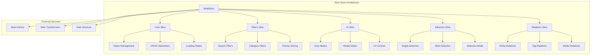
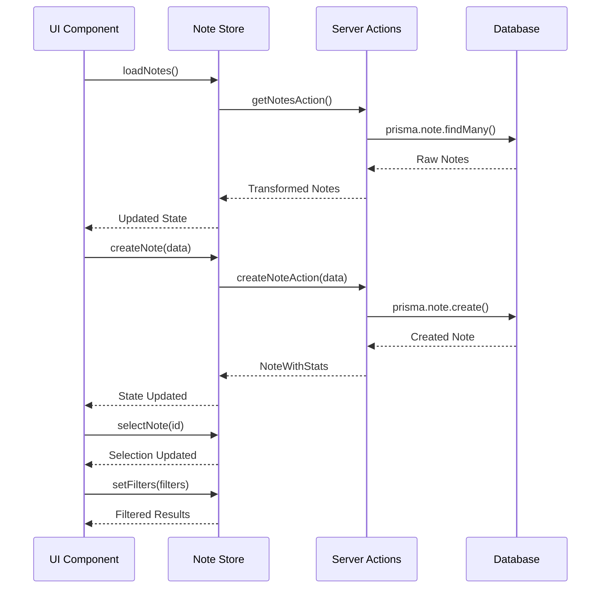
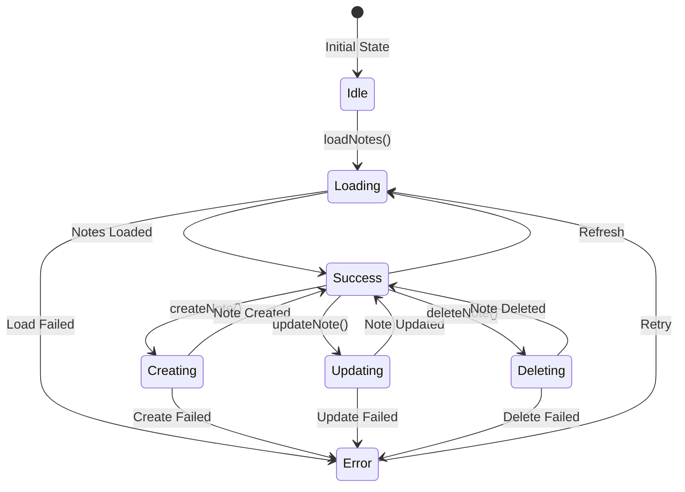

# 📝 Store de Note - Gestión de Notas

## 📋 Resumen

El store de **Note** gestiona notas y documentos de texto, permitiendo crear, editar, organizar y relacionar notas con otros elementos del sistema como imágenes, álbumes, personajes, lugares y más.

## 🏗️ Arquitectura del Store



## 🎯 Tipos Principales

### **Tipos Core**

```typescript
// Tipo base de la nota
interface NoteBase {
  id: string;
  title: string;
  content: string;
  category: string;
  priority: number;
  status: string;
  featuredImage: string | null;
  isFavorite: boolean;
  presetId: string | null;
  createdAt: Date;
  updatedAt: Date;
}

// Tipo extendido con relaciones
interface NoteExtended extends NoteComplete {
  isSelected: boolean;
  isHighlighted: boolean;
  isEditing: boolean;
  isExpanded: boolean;
  isLoading: boolean;
  hasError: boolean;
  isDragging: boolean;
  isDropTarget: boolean;
  totalItems: number;
}

// Tipo completo con estadísticas
interface NoteWithStats extends NoteComplete {
  stats: {
    totalItems: number;
    totalImages: number;
    totalVideos: number;
    totalAlbums: number;
    totalCollections: number;
    totalTags: number;
    totalCharacters: number;
    totalPlaces: number;
    totalWorldItems: number;
    totalConcepts: number;
    totalPrompts: number;
    totalWildcards: number;
    totalProperties: number;
    totalGroups: number;
    lastUpdated: Date;
  };
}
```

### **Tipos de Filtros**

```typescript
interface NoteFilters {
  searchQuery?: string;
  categories?: string[];
  priorities?: number[];
  statuses?: string[];
  onlyFavorites?: boolean;
  contentContains?: string;
  hasTags?: boolean;
  hasImages?: boolean;
  hasVideos?: boolean;
}

interface NoteSearchResult {
  items: NoteComplete[];
  total: number;
  hasMore: boolean;
}
```

### **Enums**

```typescript
enum NoteCategory {
  GENERAL = 'general',
  STORY = 'story',
  LORE = 'lore',
  MECHANICS = 'mechanics',
  CHARACTER = 'character',
  PLACE = 'place',
  WORLD_ITEM = 'world_item',
  PROMPT = 'prompt',
  IDEA = 'idea',
  TODO = 'todo',
}

enum NoteStatus {
  ACTIVE = 'active',
  ARCHIVED = 'archived',
  COMPLETED = 'completed',
  DRAFT = 'draft',
  PENDING = 'pending',
}

enum NotePriority {
  LOWEST = 0,
  LOW = 1,
  MEDIUM = 2,
  HIGH = 3,
  HIGHEST = 4,
}

enum NoteViewMode {
  GRID = 'grid',
  LIST = 'list',
  CARDS = 'cards',
  COMPACT = 'compact',
  DETAIL = 'detail',
}
```

## 🔄 Flujo de Datos



## 🎛️ API del Store

### **Core Actions**

```typescript
// 📊 Operaciones principales
loadNotes: () => Promise<void>
createNote: (note: NoteCreateInput) => Promise<string | null>
updateNote: (id: string, note: NoteUpdateInput) => Promise<void>
deleteNote: (id: string) => Promise<void>
selectNote: (noteId: string | null) => void
reset: () => void
```

### **Filter Actions**

```typescript
// 🎯 Gestión de filtros
setFilters: (filters: Partial<NoteFilters>) => void
setSortBy: (sortBy: NoteSortOption) => void
setPage: (page: number) => void
setPageSize: (pageSize: number) => void
setCategoryFilter: (category: string | null) => void
setStatusFilter: (status: string | null) => void
setPriorityFilter: (priority: number | null) => void
setSearchFilter: (search: string) => void
setTagsFilter: (tags: string[]) => void
setOnlyFavoritesFilter: (onlyFavorites: boolean) => void
clearFilters: () => void
```

### **Selection Actions**

```typescript
// 🔍 Gestión de selección
selectNote: (id: string) => void
unselectNote: () => void
toggleMultiSelectMode: () => void
toggleNoteSelection: (id: string) => void
selectAllNotes: () => void
clearSelection: () => void
resetSelection: () => void
```

### **UI Actions**

```typescript
// 🎨 Estado de interfaz
openCreateModal: () => void
closeCreateModal: () => void
openEditModal: () => void
closeEditModal: () => void
openDeleteDialog: () => void
closeDeleteDialog: () => void
openDetailsDrawer: () => void
closeDetailsDrawer: () => void
setViewMode: (mode: NoteViewMode) => void
resetUI: () => void
```

### **Relations Actions**

```typescript
// 🔗 Gestión de relaciones
addNoteToEntity: (noteId: string, entityId: string, entityType: EntityType) => Promise<void>
removeNoteFromEntity: (noteId: string, entityId: string, entityType: EntityType) => Promise<void>
```

## 🎯 Ejemplos de Uso

### **Cargar y Mostrar Notas**

```typescript
// En un componente React
const {
  notes,
  isLoading,
  error,
  loadNotes
} = useNoteStore();

// Cargar notas al montar
useEffect(() => {
  loadNotes();
}, [loadNotes]);

// Convertir Record a Array para mostrar
const notesArray = Object.values(notes);
```

### **Crear Nueva Nota**

```typescript
const { createNote } = useNoteStore();

const handleCreateNote = async (formData: NoteCreateInput) => {
  try {
    const noteId = await createNote({
      title: formData.title,
      content: formData.content || '',
      category: formData.category || 'general',
      priority: formData.priority || 2,
      status: formData.status || 'active',
      isFavorite: formData.isFavorite || false,
    });

    if (noteId) {
      console.log('✅ Nota creada:', noteId);
    }
  } catch (error) {
    console.error('❌ Error creando nota:', error);
  }
};
```

### **Filtrar y Buscar Notas**

```typescript
const {
  setSearchFilter,
  setCategoryFilter,
  setPriorityFilter,
  setOnlyFavoritesFilter,
  clearFilters
} = useNoteStore();

// Buscar por texto
const handleSearch = (query: string) => {
  setSearchFilter(query);
};

// Filtrar por categoría
const handleCategoryFilter = (category: string) => {
  setCategoryFilter(category);
};

// Filtrar por prioridad
const handlePriorityFilter = (priority: number) => {
  setPriorityFilter(priority);
};

// Mostrar solo favoritas
const handleFavoritesFilter = () => {
  setOnlyFavoritesFilter(true);
};

// Limpiar filtros
const handleClearFilters = () => {
  clearFilters();
};
```

### **Gestión de Selección**

```typescript
const {
  selectedNoteId,
  selectedNoteIds,
  isMultiSelectMode,
  selectNote,
  toggleMultiSelectMode,
  toggleNoteSelection,
  selectAllNotes,
  clearSelection
} = useNoteStore();

// Seleccionar nota individual
const handleSelectNote = (noteId: string) => {
  selectNote(noteId);
};

// Activar modo multi-selección
const handleToggleMultiSelect = () => {
  toggleMultiSelectMode();
};

// Toggle selección en modo múltiple
const handleToggleNote = (noteId: string) => {
  toggleNoteSelection(noteId);
};

// Seleccionar todas
const handleSelectAll = () => {
  selectAllNotes();
};

// Limpiar selección
const handleClearSelection = () => {
  clearSelection();
};
```

### **Gestión de UI**

```typescript
const {
  viewMode,
  isCreateModalOpen,
  isEditModalOpen,
  setViewMode,
  openCreateModal,
  closeCreateModal,
  openEditModal,
  closeEditModal
} = useNoteStore();

// Cambiar modo de vista
const handleViewModeChange = (mode: NoteViewMode) => {
  setViewMode(mode);
};

// Abrir modal de creación
const handleOpenCreate = () => {
  openCreateModal();
};

// Abrir modal de edición
const handleOpenEdit = () => {
  openEditModal();
};
```

## 📊 Estados de Carga



## 🎨 Integración con UI

### **Componentes Relacionados**

- `NoteCard` - Tarjeta de nota individual
- `NoteList` - Lista de notas
- `NoteEditor` - Editor de contenido
- `NoteFilters` - Panel de filtros
- `NoteCreator` - Formulario de creación
- `NoteViewer` - Visor de nota completa

### **Hooks Personalizados**

```typescript
// Hook para notas filtradas
const useFilteredNotes = () => {
  const { notes, filters } = useNoteStore();
  return useMemo(() => {
    // Aplicar filtros a las notas
    return Object.values(notes).filter(note => {
      // Lógica de filtrado
      return true;
    });
  }, [notes, filters]);
};

// Hook para notas seleccionadas
const useSelectedNotes = () => {
  const { notes, selectedNoteIds } = useNoteStore();
  return useMemo(() =>
    selectedNoteIds.map(id => notes[id]).filter(Boolean),
    [notes, selectedNoteIds]
  );
};
```

## 🚀 Optimizaciones

- **Paginación**: Carga incremental de notas
- **Caché**: Almacenamiento en memoria de notas frecuentes
- **Debounce**: Búsqueda con retraso para evitar spam
- **Memoización**: Cálculos de filtros optimizados
- **Virtualización**: Para listas grandes de notas
- **Persistencia**: Estado de filtros y vista

## 📈 Métricas y Analytics

- Total de notas creadas
- Notas por categoría
- Notas por prioridad
- Notas favoritas
- Tiempo de edición
- Frecuencia de uso

---

**📝 Nota**: Esta documentación se actualiza automáticamente con cada cambio en la entidad Note.
