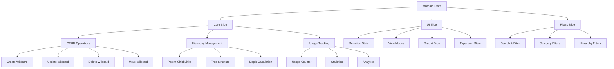

# 🃏 Wildcard Store

> **Store de Zustand para la gestión de comodines (wildcards) en el sistema de gestión de imágenes**

## 📋 Descripción

El **Wildcard Store** gestiona comodines para prompts de IA con funcionalidades avanzadas de jerarquía, categorización y seguimiento de uso. Los wildcards son fragmentos de texto reutilizables que se pueden organizar en estructuras jerárquicas y usar en prompts de generación de imágenes.

## 🏗️ Arquitectura



## 🎯 Características Especiales

### 🌳 Sistema Jerárquico

- **Estructura de árbol**: Wildcards padre-hijo con múltiples niveles
- **Navegación jerárquica**: Expansión/colapso de ramas
- **Movimiento de nodos**: Reorganización por drag & drop
- **Cálculo de profundidad**: Análisis automático de la estructura

### 🏷️ Categorización Avanzada

- **Categorías predefinidas**: Character, Style, Pose, Lighting, Background, etc.
- **Colores por categoría**: Identificación visual automática
- **Emojis representativos**: Iconografía contextual
- **Filtrado por categoría**: Búsqueda específica por tipo

### 📊 Seguimiento de Uso

- **Contador de uso**: Tracking automático de frecuencia
- **Estadísticas detalladas**: Análisis de patrones de uso
- **Wildcards populares**: Identificación de los más utilizados
- **Histórico de uso**: Seguimiento temporal

### 🔍 Búsqueda y Filtrado

- **Búsqueda textual**: En nombre, descripción, shortcut, replacement
- **Filtros jerárquicos**: Por nivel, padre, hijos
- **Filtros de uso**: Por frecuencia de utilización
- **Filtros de fecha**: Por rango temporal de creación

## 🧩 Estructura del Store

### 📊 Estado Principal

```typescript
interface WildcardState {
	core: {
		wildcards: Record<string, WildcardComplete>; // Mapa de wildcards por ID
		wildcardItems: Record<string, ItemReference[]>; // Items asociados
		isLoading: boolean; // Estado de carga
		error: string | null; // Error actual
		lastUpdated: Date | null; // Última actualización
	};
	ui: WildcardUIState; // Estado de interfaz
	filters: WildcardFiltersState; // Filtros activos
}
```

### 🎮 Estado de UI

```typescript
interface WildcardUIState {
	selectedIds: string[]; // IDs seleccionados
	viewMode: WildcardViewMode; // Modo de visualización
	isViewerOpen: boolean; // Visor abierto
	currentWildcardId: string | null; // Wildcard actual
	displayState: Record<string, WildcardDisplayState>; // Estados visuales
	draggedWildcardId: string | null; // Wildcard arrastrado
	dropTargetWildcardId: string | null; // Objetivo de drop
	highlightedId: string | null; // Wildcard resaltado
	expandedIds: string[]; // IDs expandidos
}
```

### 🔍 Filtros

```typescript
interface WildcardFiltersState {
	sortBy: WildcardSortCriteria; // Criterio de ordenamiento
	searchQuery: string; // Término de búsqueda
	filterByCategory: string | null; // Filtro por categoría
	filterFavorites: boolean; // Solo favoritos
	parentId: string | null; // Filtro por padre
	onlyWithChildren: boolean; // Solo con hijos
	dateRange: { from: Date | null; to: Date | null }; // Rango de fechas
}
```

## 🔄 Acciones Principales

### 📥 Gestión de Datos

```typescript
// Cargar wildcards
await fetchWildcards();

// Crear nuevo wildcard
await createWildcard({
	name: 'Nuevo Wildcard',
	shortcut: '__nuevo__',
	replacement: 'contenido del wildcard',
	category: 'character',
});

// Actualizar wildcard existente
await updateWildcard(id, { name: 'Nombre actualizado' });

// Eliminar wildcard
await removeWildcard(id);

// Mover wildcard en jerarquía
await moveWildcard(id, newParentId);
```

### 🌳 Gestión Jerárquica

```typescript
// Obtener hijos de un wildcard
const children = getChildWildcards(parentId);

// Obtener jerarquía completa
const hierarchy = getWildcardHierarchy();

// Expandir/colapsar ramas
expandBranch(wildcardId);
collapseBranch(wildcardId);

// Expandir/colapsar individual
toggleWildcardExpanded(wildcardId);
```

### 🎮 Gestión de UI

```typescript
// Selección múltiple
selectWildcard(id);
selectMultipleWildcards([id1, id2, id3]);
toggleWildcardSelection(id);
clearWildcardSelection();

// Visor de wildcards
openViewer(wildcardId);
closeViewer();
setCurrentWildcard(wildcardId);

// Drag & drop
setDraggedWildcard(id);
setDropTargetWildcard(targetId);

// Estados visuales
setWildcardDisplayState(id, { isHighlighted: true });
resetWildcardDisplayState(id);
```

### 🔍 Filtros y Búsqueda

```typescript
// Actualizar filtros
updateFilters({
	filterByCategory: 'character',
	filterFavorites: true,
});

// Buscar por texto
setSearchQuery('pose');

// Filtrar por jerarquía
updateFilters({
	parentId: 'parent-id',
	onlyWithChildren: true,
});

// Limpiar filtros
clearFilters();
```

## 🛠️ Utilidades Disponibles

### 📊 Estadísticas

```typescript
import { getWildcardStats } from '@/utils/wildcard';

const stats = getWildcardStats(wildcards);
// {
//   total: 150,
//   byCategory: { character: 45, style: 30, ... },
//   byUsage: { 'Muy usado': 15, 'Uso moderado': 25, ... },
//   favorites: 12,
//   totalUsage: 2847,
//   avgUsage: 18.98,
//   hierarchy: { rootWildcards: 25, childWildcards: 125, maxDepth: 4 },
//   withImages: 89
// }
```

### 🔄 Ordenamiento

```typescript
import { sortWildcards } from '@/utils/wildcard';

const sorted = sortWildcards(wildcards, 'usage:desc');
```

### 🏷️ Agrupamiento

```typescript
import { groupWildcards } from '@/utils/wildcard';

const byCategory = groupWildcards(wildcards, 'category');
const byUsage = groupWildcards(wildcards, 'usage');
const byParent = groupWildcards(wildcards, 'parentId');
```

### 🌳 Jerarquía

```typescript
import { buildWildcardTree, findWildcardDescendants, findWildcardPath } from '@/utils/wildcard';

// Construir árbol jerárquico
const tree = buildWildcardTree(wildcards);

// Encontrar todos los descendientes
const descendants = findWildcardDescendants('parent-id', wildcards);

// Encontrar ruta desde la raíz
const path = findWildcardPath('wildcard-id', wildcards);
```

### 🎨 Generación Visual

```typescript
import { generateWildcardColor, generateWildcardEmoji } from '@/utils/wildcard';

const color = generateWildcardColor('character'); // '#3B82F6'
const emoji = generateWildcardEmoji('style'); // '🎨'
```

## 📦 Uso del Store

### 🎯 En Componentes React

```typescript
import { useWildcardStore } from '@/store/entities/wildcard'

function WildcardTree() {
  const {
    core: { wildcards },
    ui: { expandedIds },
    fetchWildcards,
    toggleWildcardExpanded,
    getChildWildcards
  } = useWildcardStore()

  useEffect(() => {
    fetchWildcards()
  }, [fetchWildcards])

  const renderWildcard = (wildcard: WildcardComplete, depth = 0) => {
    const children = getChildWildcards(wildcard.id)
    const isExpanded = expandedIds.includes(wildcard.id)

    return (
      <div key={wildcard.id} style={{ marginLeft: depth * 20 }}>
        <div onClick={() => toggleWildcardExpanded(wildcard.id)}>
          {children.length > 0 && (isExpanded ? '📂' : '📁')}
          {generateWildcardEmoji(wildcard.category)} {wildcard.name}
        </div>
        {isExpanded && children.map(child =>
          renderWildcard(child, depth + 1)
        )}
      </div>
    )
  }

  const rootWildcards = getChildWildcards(null)

  return (
    <div className="wildcard-tree">
      {rootWildcards.map(wildcard => renderWildcard(wildcard))}
    </div>
  )
}
```

### 🔍 Búsqueda y Filtrado

```typescript
function WildcardSearch() {
  const {
    filters,
    updateFilters,
    getSortedWildcards
  } = useWildcardStore()

  const handleSearch = (query: string) => {
    updateFilters({ searchQuery: query })
  }

  const handleCategoryFilter = (category: string | null) => {
    updateFilters({ filterByCategory: category })
  }

  const filteredWildcards = getSortedWildcards()

  return (
    <div>
      <SearchInput
        value={filters.searchQuery}
        onChange={handleSearch}
        placeholder="Buscar wildcards..."
      />
      <CategoryFilter
        value={filters.filterByCategory}
        onChange={handleCategoryFilter}
      />
      <WildcardGrid wildcards={filteredWildcards} />
    </div>
  )
}
```

## 🎨 Personalización Visual

### 🌈 Colores por Categoría

- **Character**: `#3B82F6` (Azul)
- **Style**: `#8B5CF6` (Púrpura)
- **Pose**: `#10B981` (Verde)
- **Lighting**: `#F59E0B` (Amarillo)
- **Background**: `#6B7280` (Gris)
- **Object**: `#EF4444` (Rojo)
- **Effect**: `#EC4899` (Rosa)
- **Mood**: `#F97316` (Naranja)
- **Technical**: `#06B6D4` (Cian)
- **Prompt**: `#84CC16` (Lima)

### 🎭 Emojis por Categoría

- **Character**: 👤
- **Style**: 🎨
- **Pose**: 🤸
- **Lighting**: 💡
- **Background**: 🌅
- **Object**: 📦
- **Effect**: ✨
- **Mood**: 😊
- **Technical**: ⚙️
- **Prompt**: 📝

## 🔄 Persistencia

El store utiliza persistencia selectiva para:

- ✅ **Estado de UI**: Modo de vista, wildcards expandidos
- ✅ **Filtros**: Criterios de ordenamiento, filtro por padre
- ❌ **Datos**: Se recargan desde el servidor
- ❌ **Selecciones**: Se resetean en cada sesión

## 🚀 Optimizaciones

### ⚡ Performance

- **Estructura Record**: O(1) para acceso por ID
- **Memoización**: Selectores memoizados para jerarquía
- **Lazy Loading**: Carga bajo demanda de relaciones
- **Debounce**: Búsqueda con retardo

### 🌳 Gestión Jerárquica

- **Prevención de ciclos**: Validación automática
- **Cálculo eficiente**: Algoritmos optimizados para profundidad
- **Cache de jerarquía**: Resultados cacheados para mejor performance
- **Expansión inteligente**: Solo carga nodos visibles

## 📚 Ejemplos de Uso

### 🃏 Creación de Wildcard Jerárquico

```typescript
// Crear wildcard padre
const characterWildcard = await createWildcard({
	name: 'Personajes',
	shortcut: '__characters__',
	replacement: 'personaje, persona',
	category: 'character',
});

// Crear wildcards hijos
await createWildcard({
	name: 'Guerrero',
	shortcut: '__warrior__',
	replacement: 'guerrero, soldado, knight',
	category: 'character',
	parentId: characterWildcard.id,
});

await createWildcard({
	name: 'Mago',
	shortcut: '__wizard__',
	replacement: 'mago, hechicero, wizard',
	category: 'character',
	parentId: characterWildcard.id,
});
```

### 🔍 Búsqueda Avanzada con Jerarquía

```typescript
// Buscar solo wildcards raíz con hijos
updateFilters({
	parentId: null,
	onlyWithChildren: true,
	filterByCategory: 'character',
});

// Buscar wildcards por rango de uso
const highUsageWildcards = wildcards.filter((w) => (w.usage || 0) > 50);

// Buscar en una rama específica
const branchWildcards = findWildcardDescendants('parent-id', wildcards)
	.map((id) => wildcards[id])
	.filter((w) => w.name.toLowerCase().includes('search'));
```

### 🎮 Gestión de Estado UI Avanzada

```typescript
// Selección jerárquica (seleccionar rama completa)
const selectBranch = (wildcardId: string) => {
	const descendants = findWildcardDescendants(wildcardId, Object.values(wildcards));
	selectMultipleWildcards([wildcardId, ...descendants]);
};

// Expansión inteligente (expandir hasta un wildcard específico)
const expandToWildcard = (wildcardId: string) => {
	const path = findWildcardPath(wildcardId, Object.values(wildcards));
	path.forEach((id) => expandWildcard(id));
};
```

---

**📝 Última actualización**: Enero 2025
**🔗 Relacionado**: [Prompt Store](../prompt/README.md), [Character Store](../character/README.md)
