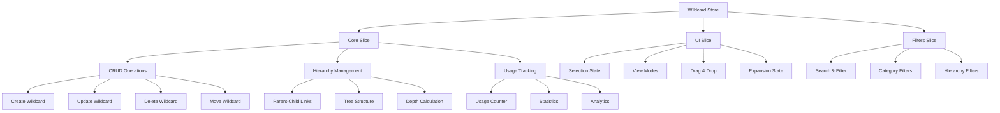

# Wildcard store

> Zustand store for Wildcard management in the media management system

## Description

The **Wildcard Store** manages Wildcards for AI prompts with advanced hierarchy, categorization, and usage tracking.

Wildcards are reusable text fragments that you can organize in hierarchical structures and use in image-generation prompts.

## Architecture



## Special features

### Hierarchical system

The store provides the following hierarchy features:

- **Tree structure**: Parent-child Wildcards with multiple levels
- **Hierarchical navigation**: Expansion and collapse of branches
- **Node movement**: Reorganization by drag and drop
- **Depth calculation**: Automatic analysis of the structure

### Advanced categorization

The store provides the following categorization features:

- **Predefined categories**: Character, Style, Pose, Lighting, Background
- **Colors by category**: Automatic visual identification
- **Representative emojis**: Contextual iconography
- **Filter by category**: Specific search by type

### Usage tracking

The store provides the following tracking features:

- **Usage counter**: Automatic frequency tracking
- **Detailed statistics**: Analysis of usage patterns
- **Popular Wildcards**: Identification of the most used
- **Usage history**: Temporal tracking

### Search and filtering

The store provides the following search features:

- **Text search**: In name, description, shortcut, replacement
- **Hierarchical filters**: By level, parent, children
- **Usage filters**: By frequency of use
- **Date filters**: By temporal range of creation

## Store structure

### Main state

```typescript
interface WildcardState {
	core: {
		wildcards: Record<string, WildcardComplete>; // Wildcard map by ID
		wildcardItems: Record<string, ItemReference[]>; // Associated items
		isLoading: boolean; // Loading state
		error: string | null; // Current error
		lastUpdated: Date | null; // Last update
	};
	ui: WildcardUIState; // Interface state
	filters: WildcardFiltersState; // Active filters
}
```

### UI state

```typescript
interface WildcardUIState {
	selectedIds: string[]; // Selected IDs
	viewMode: WildcardViewMode; // Display mode
	isViewerOpen: boolean; // Viewer open
	currentWildcardId: string | null; // Current Wildcard
	displayState: Record<string, WildcardDisplayState>; // Visual states
	draggedWildcardId: string | null; // Dragged Wildcard
	dropTargetWildcardId: string | null; // Drop target
	highlightedId: string | null; // Highlighted Wildcard
	expandedIds: string[]; // Expanded IDs
}
```

### Filters

```typescript
interface WildcardFiltersState {
	sortBy: WildcardSortCriteria; // Sort criterion
	searchQuery: string; // Search term
	filterByCategory: string | null; // Filter by category
	filterFavorites: boolean; // Favorites only
	parentId: string | null; // Filter by parent
	onlyWithChildren: boolean; // Only with children
	dateRange: { from: Date | null; to: Date | null }; // Date range
}
```

## Main actions

### Data management

```typescript
// Load Wildcards
await fetchWildcards();

// Create a new Wildcard
await createWildcard({
	name: 'New Wildcard',
	shortcut: '__new__',
	replacement: 'wildcard content',
	category: 'character',
});

// Update an existing Wildcard
await updateWildcard(id, { name: 'Updated name' });

// Delete a Wildcard
await removeWildcard(id);

// Move a Wildcard in the hierarchy
await moveWildcard(id, newParentId);
```

### Hierarchical management

```typescript
// Get children of a Wildcard
const children = getChildWildcards(parentId);

// Get the complete hierarchy
const hierarchy = getWildcardHierarchy();

// Expand or collapse branches
expandBranch(wildcardId);
collapseBranch(wildcardId);

// Expand or collapse individually
toggleWildcardExpanded(wildcardId);
```

### UI management

```typescript
// Multi-select
selectWildcard(id);
selectMultipleWildcards([id1, id2, id3]);
toggleWildcardSelection(id);
clearWildcardSelection();

// Wildcard viewer
openViewer(wildcardId);
closeViewer();
setCurrentWildcard(wildcardId);

// Drag and drop
setDraggedWildcard(id);
setDropTargetWildcard(targetId);

// Visual states
setWildcardDisplayState(id, { isHighlighted: true });
resetWildcardDisplayState(id);
```

### Filters and search

```typescript
// Update filters
updateFilters({
	filterByCategory: 'character',
	filterFavorites: true,
});

// Search by text
setSearchQuery('pose');

// Filter by hierarchy
updateFilters({
	parentId: 'parent-id',
	onlyWithChildren: true,
});

// Clear filters
clearFilters();
```

## Available utilities

### Statistics

```typescript
import { getWildcardStats } from '@/utils/wildcard';

const stats = getWildcardStats(wildcards);
// {
//   total: 150,
//   byCategory: { character: 45, style: 30, ... },
//   byUsage: { 'Heavily used': 15, 'Moderate use': 25, ... },
//   favorites: 12,
//   totalUsage: 2847,
//   avgUsage: 18.98,
//   hierarchy: { rootWildcards: 25, childWildcards: 125, maxDepth: 4 },
//   withImages: 89
// }
```

### Sort

```typescript
import { sortWildcards } from '@/utils/wildcard';

const sorted = sortWildcards(wildcards, 'usage:desc');
```

### Grouping

```typescript
import { groupWildcards } from '@/utils/wildcard';

const byCategory = groupWildcards(wildcards, 'category');
const byUsage = groupWildcards(wildcards, 'usage');
const byParent = groupWildcards(wildcards, 'parentId');
```

### Hierarchy

```typescript
import { buildWildcardTree, findWildcardDescendants, findWildcardPath } from '@/utils/wildcard';

// Build the hierarchical tree
const tree = buildWildcardTree(wildcards);

// Find all descendants
const descendants = findWildcardDescendants('parent-id', wildcards);

// Find the path from the root
const path = findWildcardPath('wildcard-id', wildcards);
```

### Visual generation

```typescript
import { generateWildcardColor, generateWildcardEmoji } from '@/utils/wildcard';

const color = generateWildcardColor('character'); // '#3B82F6'
const emoji = generateWildcardEmoji('style'); // '🎨'
```

## Store use

### In React components

```typescript
import { useWildcardStore } from '@/store/entities/wildcard'

function WildcardTree() {
  const {
    core: { wildcards },
    ui: { expandedIds },
    fetchWildcards,
    toggleWildcardExpanded,
    getChildWildcards
  } = useWildcardStore()

  useEffect(() => {
    fetchWildcards()
  }, [fetchWildcards])

  const renderWildcard = (wildcard: WildcardComplete, depth = 0) => {
    const children = getChildWildcards(wildcard.id)
    const isExpanded = expandedIds.includes(wildcard.id)

    return (
      <div key={wildcard.id} style={{ marginLeft: depth * 20 }}>
        <div onClick={() => toggleWildcardExpanded(wildcard.id)}>
          {children.length > 0 && (isExpanded ? '📂' : '📁')}
          {generateWildcardEmoji(wildcard.category)} {wildcard.name}
        </div>
        {isExpanded && children.map(child =>
          renderWildcard(child, depth + 1)
        )}
      </div>
    )
  }

  const rootWildcards = getChildWildcards(null)

  return (
    <div className="wildcard-tree">
      {rootWildcards.map(wildcard => renderWildcard(wildcard))}
    </div>
  )
}
```

### Search and filtering

```typescript
function WildcardSearch() {
  const {
    filters,
    updateFilters,
    getSortedWildcards
  } = useWildcardStore()

  const handleSearch = (query: string) => {
    updateFilters({ searchQuery: query })
  }

  const handleCategoryFilter = (category: string | null) => {
    updateFilters({ filterByCategory: category })
  }

  const filteredWildcards = getSortedWildcards()

  return (
    <div>
      <SearchInput
        value={filters.searchQuery}
        onChange={handleSearch}
        placeholder="Search wildcards..."
      />
      <CategoryFilter
        value={filters.filterByCategory}
        onChange={handleCategoryFilter}
      />
      <WildcardGrid wildcards={filteredWildcards} />
    </div>
  )
}
```

## Visual customization

### Colors by category

The store uses the following colors:

- **Character**: `#3B82F6` (Blue)
- **Style**: `#8B5CF6` (Purple)
- **Pose**: `#10B981` (Green)
- **Lighting**: `#F59E0B` (Yellow)
- **Background**: `#6B7280` (Gray)
- **Object**: `#EF4444` (Red)
- **Effect**: `#EC4899` (Pink)
- **Mood**: `#F97316` (Orange)
- **Technical**: `#06B6D4` (Cyan)
- **Prompt**: `#84CC16` (Lime)

### Emojis by category

The store uses the following emojis:

- **Character**: 👤
- **Style**: 🎨
- **Pose**: 🤸
- **Lighting**: 💡
- **Background**: 🌅
- **Object**: 📦
- **Effect**: ✨
- **Mood**: 😊
- **Technical**: ⚙️
- **Prompt**: 📝

## Persistence

The store uses selective persistence for the following data:

- **UI state**: View mode, expanded Wildcards
- **Filters**: Sort criteria, filter by parent

Data reloads from the server.

Selections reset in each session.

## Optimizations

### Performance

The store uses the following performance techniques:

- **Record structure**: O(1) for access by ID
- **Memoization**: Memoized selectors for hierarchy
- **Lazy loading**: On-demand load of relations
- **Debounce**: Search with delay

### Hierarchical management

The store uses the following hierarchy techniques:

- **Cycle prevention**: Automatic validation
- **Efficient calculation**: Optimized algorithms for depth
- **Hierarchy cache**: Cached results for better performance
- **Intelligent expansion**: Loads visible nodes only

## Usage examples

### Hierarchical Wildcard creation

```typescript
// Create a parent Wildcard
const characterWildcard = await createWildcard({
	name: 'Characters',
	shortcut: '__characters__',
	replacement: 'character, person',
	category: 'character',
});

// Create child Wildcards
await createWildcard({
	name: 'Warrior',
	shortcut: '__warrior__',
	replacement: 'warrior, soldier, knight',
	category: 'character',
	parentId: characterWildcard.id,
});

await createWildcard({
	name: 'Wizard',
	shortcut: '__wizard__',
	replacement: 'mage, sorcerer, wizard',
	category: 'character',
	parentId: characterWildcard.id,
});
```

### Advanced search with hierarchy

```typescript
// Search only root Wildcards with children
updateFilters({
	parentId: null,
	onlyWithChildren: true,
	filterByCategory: 'character',
});

// Search Wildcards by usage range
const highUsageWildcards = wildcards.filter((w) => (w.usage || 0) > 50);

// Search in a specific branch
const branchWildcards = findWildcardDescendants('parent-id', wildcards)
	.map((id) => wildcards[id])
	.filter((w) => w.name.toLowerCase().includes('search'));
```

### Advanced UI state management

```typescript
// Hierarchical selection (select a complete branch)
const selectBranch = (wildcardId: string) => {
	const descendants = findWildcardDescendants(wildcardId, Object.values(wildcards));
	selectMultipleWildcards([wildcardId, ...descendants]);
};

// Intelligent expansion (expand to a specific Wildcard)
const expandToWildcard = (wildcardId: string) => {
	const path = findWildcardPath(wildcardId, Object.values(wildcards));
	path.forEach((id) => expandWildcard(id));
};
```

---

**Last update**: January 2025
**Related**: [Prompt Store](../prompt/README.md), [Character Store](../character/README.md)
