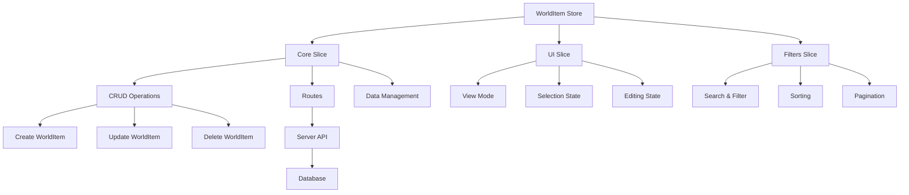

# WorldItem store

> Zustand store for World Item management in the media management system

## Description

The **WorldItem Store** manages RPG/D&D-style World Items with special features such as rarity, type, categories, and magical properties.

The store includes advanced filter, sort, and relation-management functions.

## Architecture



Routes call services.

## Special features

### RPG/D&D system

The store provides the following RPG features:

- **Item types**: Weapons, armor, accessories, consumables, materials, artifacts
- **Rarity system**: Common, Uncommon, Rare, Epic, Legendary, Mythic, Unique, Artifact
- **Categories**: Equipment, Quest, Crafting, Lore, Collectible, Utility, Magical, Technological
- **Magical properties**: Attributes, effects, requirements, statistics

### Advanced filtering

The store provides the following filter features:

- **Text search**: Name, description, type, category, rarity
- **Specific filters**: Type, category, rarity, Favorites
- **Numeric filters**: Minimum or maximum level, minimum or maximum value
- **Relation filters**: With images, notes, Concepts, Prompts

### Sort

The store provides the following sort options:

- **By name**: Ascending or descending
- **By type**: Ascending or descending
- **By rarity**: Numeric rarity weight
- **By dates**: Creation or update

## Store structure

### Main state

```typescript
interface WorldItemState {
	worldItems: WorldItem[]; // List of World Items
	isLoading: boolean; // Loading state
	error: string | null; // Current error
	ui: WorldItemUIState; // Interface state
	filters: WorldItemFilters; // Active filters
}
```

### UI state

```typescript
interface WorldItemUIState {
	selectedId: string | null; // Selected item ID
	editingId: string | null; // Item ID in edit
	highlightedId: string | null; // Highlighted item ID
	viewMode: WorldItemViewMode; // Display mode
}
```

### Filters

```typescript
interface WorldItemFilters {
	sortBy: WorldItemSortCriteria; // Sort criterion
	searchTerm: string | null; // Search term
	type: string | null; // Filter by type
	category: string | null; // Filter by category
	rarity: string | null; // Filter by rarity
	minLevel?: number; // Minimum level
	maxLevel?: number; // Maximum level
	minValue?: number; // Minimum value
	maxValue?: number; // Maximum value
	isFavorite?: boolean; // Favorites only
	hasImages?: boolean; // With images
	hasNotes?: boolean; // With notes
	hasConcepts?: boolean; // With Concepts
	hasPrompts?: boolean; // With Prompts
}
```

## Main actions

### Data management

```typescript
// Load World Items
await loadWorldItems();

// Create a new item
await createWorldItem(data);

// Update an existing item
await updateWorldItem(id, data);

// Delete an item
await deleteWorldItem(id);
```

### UI management

```typescript
// Select an item
selectWorldItem(id);

// Start editing
startEditing(id);

// Highlight an item
highlightWorldItem(id);

// Change view mode
setViewMode(mode);

// Clear selection
clearSelection();
```

### Filters and search

```typescript
// Update filters
updateFilters({ type: 'weapon', rarity: 'legendary' });

// Search by text
setSearchQuery('magic sword');

// Clear filters
clearFilters();

// Get filtered data
const filtered = getFilteredWorldItems();
const sorted = getSortedWorldItems();
```

## Available utilities

### Statistics

```typescript
import { getWorldItemStats } from '@/utils/world-item';

const stats = getWorldItemStats(worldItems);
// {
//   total: 150,
//   byType: { weapon: 45, armor: 30, ... },
//   byCategory: { equipment: 75, quest: 25, ... },
//   byRarity: { common: 60, rare: 15, ... },
//   favorites: 12,
//   withImages: 89
// }
```

### Sort

```typescript
import { sortWorldItems } from '@/utils/world-item';

const sorted = sortWorldItems(worldItems, 'rarity:desc');
```

### Grouping

```typescript
import { groupWorldItems } from '@/utils/world-item';

const grouped = groupWorldItems(worldItems, 'type');
// { weapon: [...], armor: [...], ... }
```

### Visual generation

```typescript
import { generateWorldItemColor, generateWorldItemEmoji } from '@/utils/world-item';

const color = generateWorldItemColor('legendary'); // '#F59E0B'
const emoji = generateWorldItemEmoji('weapon'); // '⚔️'
```

## Store use

### In React components

```typescript
import { useWorldItemStore } from '@/store/entities/world-item'

function WorldItemList() {
  const {
    worldItems,
    isLoading,
    loadWorldItems,
    setSearchQuery,
    getSortedWorldItems
  } = useWorldItemStore()

  useEffect(() => {
    loadWorldItems()
  }, [loadWorldItems])

  const handleSearch = (query: string) => {
    setSearchQuery(query)
  }

  const sortedItems = getSortedWorldItems()

  return (
    <div>
      <SearchInput onSearch={handleSearch} />
      {isLoading ? (
        <LoadingSpinner />
      ) : (
        <WorldItemGrid items={sortedItems} />
      )}
    </div>
  )
}
```

### Advanced filtering

```typescript
function WorldItemFilters() {
  const { filters, updateFilters } = useWorldItemStore()

  const handleTypeFilter = (type: string) => {
    updateFilters({ type })
  }

  const handleRarityFilter = (rarity: string) => {
    updateFilters({ rarity })
  }

  return (
    <div className="filters">
      <TypeSelector value={filters.type} onChange={handleTypeFilter} />
      <RaritySelector value={filters.rarity} onChange={handleRarityFilter} />
    </div>
  )
}
```

## Visual customization

### Colors by rarity

The store uses the following colors:

- **Common**: `#9CA3AF` (Gray)
- **Uncommon**: `#10B981` (Green)
- **Rare**: `#3B82F6` (Blue)
- **Epic**: `#8B5CF6` (Purple)
- **Legendary**: `#F59E0B` (Yellow)
- **Mythic**: `#EF4444` (Red)
- **Unique**: `#EC4899` (Pink)
- **Artifact**: `#F97316` (Orange)

### Emojis by type

The store uses the following emojis:

- **Weapon**: ⚔️
- **Armor**: 🛡️
- **Accessory**: 💍
- **Consumable**: 🧪
- **Material**: 🪨
- **Artifact**: 🏺
- **Relic**: 🗿
- **Key Item**: 🗝️
- **Misc**: 📦

## Persistence

The store uses automatic persistence for the following data:

- **UI state**: View mode, selections
- **Filters**: Search and filter criteria

Data reloads from the server.

## Optimizations

### Performance

The store uses the following performance techniques:

- **Memoization**: Memoized selectors to avoid recalculation
- **Lazy loading**: On-demand load of relations
- **Debounce**: Search with delay to avoid excessive calls

### Memory management

The store uses the following memory techniques:

- **Cleanup**: Automatic cleanup of references
- **Weak references**: To avoid memory leaks
- **Garbage collection**: Optimized for large objects

## Usage examples

### Magical item creation

```typescript
const magicalSword = {
	name: 'Sword of Dawn',
	description: 'A legendary sword forged with sunlight',
	type: 'weapon',
	category: 'equipment',
	rarity: 'legendary',
	attributes: JSON.stringify([
		{ name: 'attack', value: 150, maxValue: 200 },
		{ name: 'magic', value: 75, maxValue: 100 },
	]),
	effects: JSON.stringify([{ name: 'Solar Flare', description: 'Extra damage during the day' }]),
	isFavorite: true,
};

await createWorldItem(magicalSword);
```

### Advanced search

```typescript
// Search legendary weapons with images
updateFilters({
	type: 'weapon',
	rarity: 'legendary',
	hasImages: true,
});

// Search items by level
updateFilters({
	minLevel: 50,
	maxLevel: 100,
});
```

---

**Last update**: January 2025
**Related**: [Character Store](../character/README.md), [Collection Store](../collection/README.md)
