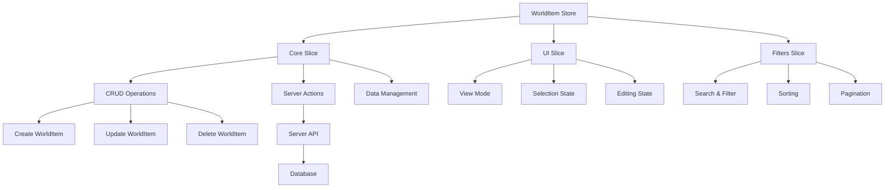

# 🌍 WorldItem Store

> **Store de Zustand para la gestión de objetos del mundo en el sistema de gestión de imágenes**

## 📋 Descripción

El **WorldItem Store** gestiona objetos del mundo tipo RPG/D&D con características especiales como rareza, tipo, categorías y propiedades mágicas. Incluye funcionalidades avanzadas de filtrado, ordenamiento y gestión de relaciones.

## 🏗️ Arquitectura



## 🎯 Características Especiales

### 🎮 Sistema RPG/D&D

- **Tipos de objetos**: Armas, armaduras, accesorios, consumibles, materiales, artefactos
- **Sistema de rareza**: Common, Uncommon, Rare, Epic, Legendary, Mythic, Unique, Artifact
- **Categorías**: Equipment, Quest, Crafting, Lore, Collectible, Utility, Magical, Technological
- **Propiedades mágicas**: Atributos, efectos, requisitos, estadísticas

### 🔍 Filtrado Avanzado

- **Búsqueda por texto**: Nombre, descripción, tipo, categoría, rareza
- **Filtros específicos**: Tipo, categoría, rareza, favoritos
- **Filtros numéricos**: Nivel mínimo/máximo, valor mínimo/máximo
- **Filtros de relaciones**: Con imágenes, notas, conceptos, prompts

### 📊 Ordenamiento

- **Por nombre**: Ascendente/Descendente
- **Por tipo**: Ascendente/Descendente
- **Por rareza**: Peso numérico de rareza
- **Por fechas**: Creación/Actualización

## 🧩 Estructura del Store

### 📊 Estado Principal

```typescript
interface WorldItemState {
	worldItems: WorldItem[]; // Lista de objetos del mundo
	isLoading: boolean; // Estado de carga
	error: string | null; // Error actual
	ui: WorldItemUIState; // Estado de interfaz
	filters: WorldItemFilters; // Filtros activos
}
```

### 🎮 Estado de UI

```typescript
interface WorldItemUIState {
	selectedId: string | null; // ID del objeto seleccionado
	editingId: string | null; // ID del objeto en edición
	highlightedId: string | null; // ID del objeto resaltado
	viewMode: WorldItemViewMode; // Modo de visualización
}
```

### 🔍 Filtros

```typescript
interface WorldItemFilters {
	sortBy: WorldItemSortCriteria; // Criterio de ordenamiento
	searchTerm: string | null; // Término de búsqueda
	type: string | null; // Filtro por tipo
	category: string | null; // Filtro por categoría
	rarity: string | null; // Filtro por rareza
	minLevel?: number; // Nivel mínimo
	maxLevel?: number; // Nivel máximo
	minValue?: number; // Valor mínimo
	maxValue?: number; // Valor máximo
	isFavorite?: boolean; // Solo favoritos
	hasImages?: boolean; // Con imágenes
	hasNotes?: boolean; // Con notas
	hasConcepts?: boolean; // Con conceptos
	hasPrompts?: boolean; // Con prompts
}
```

## 🔄 Acciones Principales

### 📥 Gestión de Datos

```typescript
// Cargar objetos del mundo
await loadWorldItems();

// Crear nuevo objeto
await createWorldItem(data);

// Actualizar objeto existente
await updateWorldItem(id, data);

// Eliminar objeto
await deleteWorldItem(id);
```

### 🎮 Gestión de UI

```typescript
// Seleccionar objeto
selectWorldItem(id);

// Iniciar edición
startEditing(id);

// Resaltar objeto
highlightWorldItem(id);

// Cambiar modo de vista
setViewMode(mode);

// Limpiar selección
clearSelection();
```

### 🔍 Filtros y Búsqueda

```typescript
// Actualizar filtros
updateFilters({ type: 'weapon', rarity: 'legendary' });

// Buscar por texto
setSearchQuery('espada mágica');

// Limpiar filtros
clearFilters();

// Obtener datos filtrados
const filtered = getFilteredWorldItems();
const sorted = getSortedWorldItems();
```

## 🛠️ Utilidades Disponibles

### 📊 Estadísticas

```typescript
import { getWorldItemStats } from '@/utils/world-item';

const stats = getWorldItemStats(worldItems);
// {
//   total: 150,
//   byType: { weapon: 45, armor: 30, ... },
//   byCategory: { equipment: 75, quest: 25, ... },
//   byRarity: { common: 60, rare: 15, ... },
//   favorites: 12,
//   withImages: 89
// }
```

### 🔄 Ordenamiento

```typescript
import { sortWorldItems } from '@/utils/world-item';

const sorted = sortWorldItems(worldItems, 'rarity:desc');
```

### 🏷️ Agrupamiento

```typescript
import { groupWorldItems } from '@/utils/world-item';

const grouped = groupWorldItems(worldItems, 'type');
// { weapon: [...], armor: [...], ... }
```

### 🎨 Generación Visual

```typescript
import { generateWorldItemColor, generateWorldItemEmoji } from '@/utils/world-item';

const color = generateWorldItemColor('legendary'); // '#F59E0B'
const emoji = generateWorldItemEmoji('weapon'); // '⚔️'
```

## 📦 Uso del Store

### 🎯 En Componentes React

```typescript
import { useWorldItemStore } from '@/store/entities/world-item'

function WorldItemList() {
  const {
    worldItems,
    isLoading,
    loadWorldItems,
    setSearchQuery,
    getSortedWorldItems
  } = useWorldItemStore()

  useEffect(() => {
    loadWorldItems()
  }, [loadWorldItems])

  const handleSearch = (query: string) => {
    setSearchQuery(query)
  }

  const sortedItems = getSortedWorldItems()

  return (
    <div>
      <SearchInput onSearch={handleSearch} />
      {isLoading ? (
        <LoadingSpinner />
      ) : (
        <WorldItemGrid items={sortedItems} />
      )}
    </div>
  )
}
```

### 🔍 Filtrado Avanzado

```typescript
function WorldItemFilters() {
  const { filters, updateFilters } = useWorldItemStore()

  const handleTypeFilter = (type: string) => {
    updateFilters({ type })
  }

  const handleRarityFilter = (rarity: string) => {
    updateFilters({ rarity })
  }

  return (
    <div className="filters">
      <TypeSelector value={filters.type} onChange={handleTypeFilter} />
      <RaritySelector value={filters.rarity} onChange={handleRarityFilter} />
    </div>
  )
}
```

## 🎨 Personalización Visual

### 🌈 Colores por Rareza

- **Common**: `#9CA3AF` (Gris)
- **Uncommon**: `#10B981` (Verde)
- **Rare**: `#3B82F6` (Azul)
- **Epic**: `#8B5CF6` (Púrpura)
- **Legendary**: `#F59E0B` (Amarillo)
- **Mythic**: `#EF4444` (Rojo)
- **Unique**: `#EC4899` (Rosa)
- **Artifact**: `#F97316` (Naranja)

### 🎭 Emojis por Tipo

- **Weapon**: ⚔️
- **Armor**: 🛡️
- **Accessory**: 💍
- **Consumable**: 🧪
- **Material**: 🪨
- **Artifact**: 🏺
- **Relic**: 🗿
- **Key Item**: 🗝️
- **Misc**: 📦

## 🔄 Persistencia

El store utiliza persistencia automática para:

- ✅ **Estado de UI**: Modo de vista, selecciones
- ✅ **Filtros**: Criterios de búsqueda y filtrado
- ❌ **Datos**: Se recargan desde el servidor

## 🚀 Optimizaciones

### ⚡ Performance

- **Memoización**: Selectores memoizados para evitar recálculos
- **Lazy Loading**: Carga bajo demanda de relaciones
- **Debounce**: Búsqueda con retardo para evitar llamadas excesivas

### 💾 Gestión de Memoria

- **Cleanup**: Limpieza automática de referencias
- **Weak References**: Para evitar memory leaks
- **Garbage Collection**: Optimizado para objetos grandes

## 📚 Ejemplos de Uso

### 🎮 Creación de Objeto Mágico

```typescript
const magicalSword = {
	name: 'Espada del Amanecer',
	description: 'Una espada legendaria forjada con luz solar',
	type: 'weapon',
	category: 'equipment',
	rarity: 'legendary',
	attributes: JSON.stringify([
		{ name: 'attack', value: 150, maxValue: 200 },
		{ name: 'magic', value: 75, maxValue: 100 },
	]),
	effects: JSON.stringify([{ name: 'Solar Flare', description: 'Daño adicional durante el día' }]),
	isFavorite: true,
};

await createWorldItem(magicalSword);
```

### 🔍 Búsqueda Avanzada

```typescript
// Buscar armas legendarias con imágenes
updateFilters({
	type: 'weapon',
	rarity: 'legendary',
	hasImages: true,
});

// Buscar objetos por nivel
updateFilters({
	minLevel: 50,
	maxLevel: 100,
});
```

---

**📝 Última actualización**: Enero 2025
**🔗 Relacionado**: [Character Store](../character/README.md), [Collection Store](../collection/README.md)
