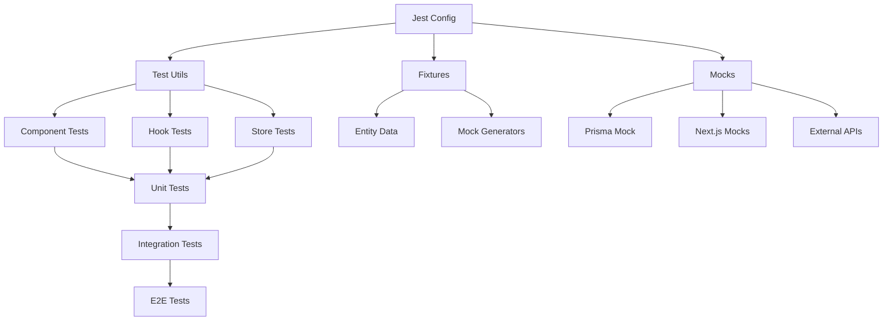

# 🧪 Documentación de Testing - Image Manager

## 📋 Estructura de Testing



## 🏗️ Arquitectura de Testing

### 📁 Estructura de Directorios

```
src/tests/
├── setup/                    # Tests de configuración
│   ├── jest-config.test.ts   # Verificación de Jest
│   └── react-testing.test.tsx # Verificación de React
├── helpers/                  # Utilidades de testing
│   └── test-utils.tsx        # Helpers comunes
├── fixtures/                 # Datos de prueba
│   └── entities.ts           # Mock data para entidades
├── __mocks__/               # Mocks globales
│   ├── @prisma/             # Mock de Prisma
│   └── next/                # Mocks de Next.js
├── resolver.js              # Resolver personalizado
└── image-mock.js            # Mock para imágenes
```

## 🔧 Configuración Principal

### Jest Config (`jest.config.ts`)
- **Environment**: jsdom para tests de React
- **Transform**: ts-jest para TypeScript
- **Resolver**: Personalizado para Next.js 15 + React 19
- **Module Mapping**: Alias y mocks configurados
- **Coverage**: 80% threshold mínimo

### Setup Files
- **jest.setup.ts**: Configuración global de Jest
- **test-utils.tsx**: Helpers para rendering y providers

## 🎯 Tipos de Tests

### 1. Tests Unitarios
- **Componentes**: Renderizado y interacciones
- **Hooks**: Lógica de estado y efectos
- **Utils**: Funciones puras y transformers
- **Stores**: Estado de Zustand

### 2. Tests de Integración
- **API Routes**: Endpoints de Next.js
- **Database**: Operaciones de Prisma
- **Scanner**: Lógica de escaneo de folders

### 3. Tests de UI
- **User Interactions**: Clicks, forms, navigation
- **Visual Regression**: Snapshots de componentes
- **Accessibility**: A11y compliance

## 📦 Utilidades Disponibles

### `renderWithProviders()`
```typescript
import { renderWithProviders } from '@/tests/helpers/test-utils';

test('should render with providers', () => {
  const { queryClient } = renderWithProviders(<MyComponent />);
  // Test con React Query disponible
});
```

### Mock Data Generators
```typescript
import { createMockFolder, createMockImage } from '@/tests/fixtures/entities';

const folder = createMockFolder({ name: 'Custom Folder' });
const image = createMockImage({ folderId: folder.id });
```

### Navigation Mocks
```typescript
import { navigationMocks } from '@/tests/__mocks__/next/navigation';

test('should navigate correctly', () => {
  // Test navigation
  expect(navigationMocks.push).toHaveBeenCalledWith('/new-path');
});
```

## 🎭 Estrategias de Mocking

### 🔄 Nivel de Mock
1. **Minimal Mocking**: Solo lo necesario
2. **Behavior Mocking**: Mock del comportamiento, no implementación
3. **Data Mocking**: Fixtures consistentes y realistas

### 📊 Prisma Mocking
```typescript
import { mockPrismaClient } from '@/tests/__mocks__/@prisma/client';

test('should query database', async () => {
  mockPrismaClient.folder.findMany.mockResolvedValue(mockFolders);
  // Test database interaction
});
```

## 🚀 Comandos de Testing

```bash
# Ejecutar todos los tests
pnpm test

# Modo watch
pnpm test:watch

# Coverage report
pnpm test:coverage

# Tests específicos
pnpm test folder.test.ts
```

## 📈 Métricas y Coverage

### Umbrales de Coverage
- **Statements**: 80%
- **Branches**: 80%
- **Functions**: 80%
- **Lines**: 80%

### Archivos Excluidos
- `*.d.ts` - Archivos de declaración
- `*.stories.*` - Storybook stories
- `tests/**/*` - Archivos de testing

## 🎨 Patrones de Testing

### AAA Pattern
```typescript
test('should do something', () => {
  // 🎯 Arrange
  const input = 'test';

  // ⚡ Act
  const result = myFunction(input);

  // ✅ Assert
  expect(result).toBe('expected');
});
```

### Given-When-Then
```typescript
test('given user input, when submitting form, then should save data', () => {
  // Given
  const formData = { name: 'Test' };

  // When
  fireEvent.submit(form, formData);

  // Then
  expect(mockSave).toHaveBeenCalledWith(formData);
});
```

## 🔗 Integración con Stack

### Next.js 15
- App Router testing
- Server Components mocking
- Navigation hooks testing

### React 19
- Concurrent features testing
- Suspense boundary testing
- Server Components compatibility

### Prisma
- Database operations mocking
- Transaction testing
- Type-safe mocking

### Zustand
- Store state testing
- Action testing
- Persistence testing

---

**Última actualización**: ${new Date().toLocaleDateString('es-ES')}
**Versión**: 1.0.0
