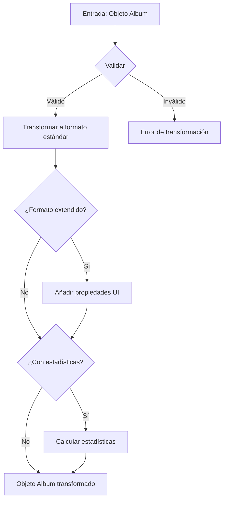

# 📸 Transformador de Álbumes (Album)

Este módulo proporciona funciones para transformar y validar objetos de álbum, asegurando una estructura de datos consistente en toda la aplicación.

## 📋 Descripción general

El transformador de álbumes maneja la conversión entre diferentes formatos de álbum:
- Transformación de objetos Prisma a objetos de aplicación
- Validación y normalización de datos
- Generación de formatos extendidos para interfaces de usuario
- Cálculo de estadísticas relacionadas con el álbum

## 🔄 Diagrama de flujo



## 📁 Estructura de archivos

```
album/
├── index.ts           # Punto de entrada principal y exportaciones
├── transformer.ts     # Funciones principales de transformación
├── mappers.ts         # Funciones para mapear entre distintos formatos
├── serializers.ts     # Funciones para serialización/deserialización
└── README.md          # Documentación (este archivo)
```

## 🧩 Tipos principales

```typescript
// Modelo básico de Álbum
interface Album {
    id: string;
    name: string;
    description?: string;
    emoji?: string;
    color?: string;
    category?: string;
    sortBy?: string;
    filters?: string;
    isFavorite?: boolean;
    featuredImage?: string;
    createdAt: Date;
    updatedAt: Date;
    // ... otras propiedades base
}

// Álbum con propiedades extendidas para UI
interface AlbumExtended extends Album {
    isSelected?: boolean;
    isHighlighted?: boolean;
    isExpanded?: boolean;
    isEditing?: boolean;
    displayOrder?: number;
    // ... propiedades de UI adicionales
}

// Álbum con estadísticas
interface AlbumWithStats extends AlbumExtended {
    imageCount: number;
    videoCount: number;
    tagCount: number;
    groupCount: number;
    totalSize: number;
    lastUpdated?: Date;
    distribution?: Array<{ name: string; count: number; }>;
    // ... estadísticas adicionales
}
```

## 🛠️ Funciones principales

### Transformadores básicos

```typescript
// Transforma un álbum único
transformAlbum(album: unknown): Album

// Transforma un array de álbumes
transformAlbums(albums: unknown[]): Album[]

// Transforma a formato extendido para UI
transformAlbumToExtended(album: Album): AlbumExtended

// Transforma incluyendo estadísticas
transformAlbumToWithStats(album: Album): AlbumWithStats
```

### Funciones de búsqueda y persistencia

```typescript
// Busca álbumes con opciones de filtrado
searchAlbums(options: AlbumSearchOptions): Promise<AlbumSearchResult>

// Obtiene un álbum por ID con relaciones completas
getAlbumById(id: string): Promise<AlbumComplete | null>

// Crea un nuevo álbum
createAlbum(data: AlbumCreateInput): Promise<AlbumComplete>

// Actualiza un álbum existente
updateAlbum(id: string, data: AlbumUpdateInput): Promise<AlbumComplete>

// Elimina un álbum
deleteAlbum(id: string): Promise<void>
```

## 📝 Ejemplos de uso

### Transformación básica

```typescript
import { transformAlbum } from '@/transformers/album';

// Transformar un objeto desconocido a Album
const album = transformAlbum(rawData);
console.log(album.name); // Acceso seguro a propiedades validadas
```

### Transformación con estadísticas para UI

```typescript
import { transformAlbumToWithStats } from '@/transformers/album';

// Obtener un álbum con estadísticas calculadas
const albumWithStats = transformAlbumToWithStats(album);
console.log(`Imágenes: ${albumWithStats.imageCount}`);
console.log(`Última actualización: ${albumWithStats.lastUpdated}`);
```

### Búsqueda de álbumes

```typescript
import { searchAlbums } from '@/transformers/album';

// Buscar álbumes con filtros
const result = await searchAlbums({
  search: 'paisajes',
  page: 1,
  pageSize: 10,
  orderBy: 'createdAt',
  orderDirection: 'desc',
  filters: {
    category: 'estilo',
    isFavorite: true
  }
});

console.log(`Total encontrados: ${result.total}`);
```

## 🔍 Manejo de errores

El transformador utiliza un sistema centralizado de manejo de errores que:

1. Registra detalles del error en el servidor
2. Lanza `TransformerError` con mensajes descriptivos
3. Preserva la información del error original en la propiedad `cause`

Ejemplo de captura:

```typescript
try {
  const album = transformAlbum(unknownData);
} catch (error) {
  if (error instanceof TransformerError) {
    console.error(`Error de transformación: ${error.message}`);
  } else {
    console.error(`Error inesperado: ${error}`);
  }
}
```

## ⚙️ Mejores prácticas

1. **Siempre use los transformadores**: Para garantizar datos consistentes, utilice las funciones de transformación incluso cuando crea que los datos ya están en el formato correcto.

2. **Maneje los errores**: Capture y maneje adecuadamente los errores de transformación para proporcionar feedback útil.

3. **Evite la manipulación directa**: No modifique objetos Album directamente; en su lugar, utilice las funciones de transformación para crear nuevas instancias.

4. **Considere el rendimiento**: Para álbumes grandes, utilice transformaciones selectivas en lugar de cargar todas las relaciones.

5. **Validación temprana**: Valide los datos lo antes posible en el flujo de la aplicación para detectar problemas antes de que se propaguen.

6. **Uso del store**: Utilice el AlbumStore para gestionar el estado de los álbumes en componentes del cliente.

## 🔄 Interacción con otros componentes

Los álbumes se relacionan con varias entidades del sistema:

- **Imágenes**: Los álbumes pueden contener múltiples imágenes
- **Videos**: Los álbumes pueden contener múltiples videos
- **Etiquetas**: Los álbumes pueden tener etiquetas asociadas
- **Grupos**: Los álbumes pueden ser compartidos con grupos
- **Colecciones**: Los álbumes pueden estar asociadas con colecciones

Para operaciones que involucran estas relaciones, consulte la documentación específica de cada entidad relacionada.