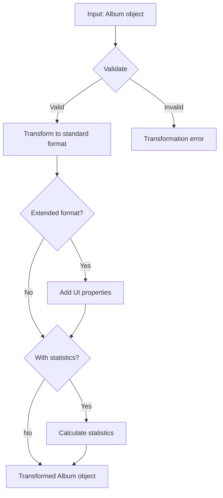

# Album transformer

This module transforms and validates Album objects. It keeps a consistent data structure across Media Manager.

## Overview

The Album transformer converts Album data between formats. It covers these operations:

- Transform database objects to application objects
- Validate and normalize data
- Build extended formats for user interfaces
- Calculate Album statistics

## Flow diagram



## File structure

```
album/
├── index.ts           # Main entry point and exports
├── transformer.ts     # Main transformation functions
├── mappers.ts         # Functions that map between formats
├── serializers.ts     # Serialization and deserialization functions
└── README.md          # Documentation (this file)
```

## Main types

```typescript
// Basic Album model
interface Album {
	id: string;
	name: string;
	description?: string;
	emoji?: string;
	color?: string;
	category?: string;
	sortBy?: string;
	filters?: string;
	isFavorite?: boolean;
	featuredImage?: string;
	createdAt: Date;
	updatedAt: Date;
	// ... other base properties
}

// Album with extra UI properties
interface AlbumExtended extends Album {
	isSelected?: boolean;
	isHighlighted?: boolean;
	isExpanded?: boolean;
	isEditing?: boolean;
	displayOrder?: number;
	// ... extra UI properties
}

// Album with statistics
interface AlbumWithStats extends AlbumExtended {
	imageCount: number;
	videoCount: number;
	tagCount: number;
	groupCount: number;
	totalSize: number;
	lastUpdated?: Date;
	distribution?: Array<{ name: string; count: number }>;
	// ... extra statistics
}
```

## Main functions

### Basic transformers

```typescript
// Transform a single Album
transformAlbum(album: unknown): Album

// Transform an array of Albums
transformAlbums(albums: unknown[]): Album[]

// Transform to the extended UI format
transformAlbumToExtended(album: Album): AlbumExtended

// Transform and include statistics
transformAlbumToWithStats(album: Album): AlbumWithStats
```

### Search and persistence functions

```typescript
// Search Albums with filter options
searchAlbums(options: AlbumSearchOptions): Promise<AlbumSearchResult>

// Get an Album by ID with full relations
getAlbumById(id: string): Promise<AlbumComplete | null>

// Create a new Album
createAlbum(data: AlbumCreateInput): Promise<AlbumComplete>

// Update an existing Album
updateAlbum(id: string, data: AlbumUpdateInput): Promise<AlbumComplete>

// Delete an Album
deleteAlbum(id: string): Promise<void>
```

## Usage examples

### Basic transformation

```typescript
import { transformAlbum } from '@/transformers/album';

// Transform an unknown object to Album
const album = transformAlbum(rawData);
console.log(album.name); // Safe access to validated properties
```

### Transformation with statistics for UI

```typescript
import { transformAlbumToWithStats } from '@/transformers/album';

// Get an Album with calculated statistics
const albumWithStats = transformAlbumToWithStats(album);
console.log(`Images: ${albumWithStats.imageCount}`);
console.log(`Last update: ${albumWithStats.lastUpdated}`);
```

### Album search

```typescript
import { searchAlbums } from '@/transformers/album';

// Search Albums with filters
const result = await searchAlbums({
	search: 'landscapes',
	page: 1,
	pageSize: 10,
	orderBy: 'createdAt',
	orderDirection: 'desc',
	filters: {
		category: 'style',
		isFavorite: true,
	},
});

console.log(`Total found: ${result.total}`);
```

## Error handling

The transformer uses a central error-handling system. The system does this work:

1. Log error details on the server
2. Throw `TransformerError` with descriptive messages
3. Keep the original error in the `cause` property

Capture example:

```typescript
try {
	const album = transformAlbum(unknownData);
} catch (error) {
	if (error instanceof TransformerError) {
		console.error(`Transformation error: ${error.message}`);
	} else {
		console.error(`Unexpected error: ${error}`);
	}
}
```

## Practices

1. **Use the transformers.** Call transformation functions even when the data looks correct. This keeps data consistent.
2. **Handle errors.** Catch transformation errors. Return useful feedback.
3. **Avoid direct mutation.** Do not change Album objects in place. Use transformers to create new instances.
4. **Watch performance.** For large Albums, use selective transformations. Do not load every relation.
5. **Validate early.** Validate data as soon as the application receives it. This stops problems from spreading.
6. **Use the store.** Use AlbumStore to manage Album state in client components.

## Interaction with other components

Albums relate to several objects in Media Manager. Those objects are:

- **Images**: An Album can contain many images
- **Videos**: An Album can contain many videos
- **Tags**: An Album can have associated Tags
- **Groups**: An Album can be shared with Groups
- **Collections**: An Album can associate with Collections

For operations that use these relations, read the documentation for the related object.
