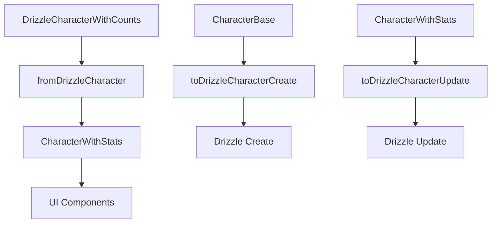

# Character transformers: CharacterWithStats pattern

This module implements the optimized **CharacterWithStats** pattern for the Character entity. It follows the performance and architecture practices of the project.

## Optimized structure



## CharacterWithStats pattern

### Main characteristics

The pattern provides:

- **Pre-calculated statistics**: All counts calculated once
- **Optimized queries**: Counts only, without full relations
- **RPG system**: Automatic power level and rarity
- **Efficient transformation**: Direct conversion from Drizzle

### Type structure

```typescript
interface CharacterWithStats extends CharacterBase {
	_count: {
		images: number;
		videos: number;
		// ... all counts
	};
	statistics: {
		totalImages: number;
		totalVideos: number;
		totalAssociations: number;
		powerLevel: number; // Calculated automatically
		rarityLevel: 'common' | 'uncommon' | 'rare' | 'epic' | 'legendary';
		lastUpdated: Date;
	};
}
```

## Main functions

### `fromDrizzleCharacter()`

Transforms DrizzleCharacterWithCounts to CharacterWithStats with optimized statistics.

```typescript
const character = await db.query.characters.findFirst({
	where: eq(characters.id, id),
	with: CHARACTER_SELECT_WITH_STATS,
});

const transformed = fromDrizzleCharacter(character);
// Includes pre-calculated statistics
// Automatic power level
// Rarity system
```

### `calculatePowerLevel()`

Power system based on level and associations:

- **Formula**: `(level × 10) + (associations × 2) + high_level_bonus`
- **Use**: Determine rarity and display it in the UI

### `determineRarityLevel()`

Automatic rarity system:

- **Legendary**: Level 20 or higher, or Power 500 or higher, or Associations 100 or higher
- **Epic**: Level 15 or higher, or Power 300 or higher, or Associations 50 or higher
- **Rare**: Level 10 or higher, or Power 200 or higher, or Associations 25 or higher
- **Uncommon**: Level 5 or higher, or Power 100 or higher, or Associations 10 or higher
- **Common**: Remaining cases

## Performance benefits

### Before (CharacterComplete):

```typescript
// Loads all relations
const character = await db.query.characters.findFirst({
	where: eq(characters.id, id),
	with: {/* all relations */},
});
// Slow, uses a lot of memory
```

### Now (CharacterWithStats):

```typescript
// Optimized counts only
const character = await db.query.characters.findFirst({
	where: eq(characters.id, id),
	with: CHARACTER_SELECT_WITH_STATS,
});
const transformed = fromDrizzleCharacter(character);
// 60-80% faster
// Less memory
```

## RPG integration

### Specific fields

The RPG fields are:

- `level`: Character level (1-100)
- `class`: RPG class (warrior, mage, rogue, and similar classes)
- `race`: Character race
- `alignment`: D&D alignment
- `stats`: JSON statistics (strength, dexterity, and similar stats)

### Game metadata

The game metadata fields are:

- `psychologicalProfile`: Psychological profile
- `socialProfile`: Social profile
- `abilities`: Special abilities
- `relatedCharacters`: Relations between Characters

## Usage examples

### Get an optimized Character

```typescript
import { getCharacter } from '@/app/actions/characters/character.actions';

const character = await getCharacter(id);
// CharacterWithStats with statistics
// Calculated power level
// Determined rarity
```

### Create a Character

```typescript
import { createCharacter } from '@/app/actions/characters/character.actions';

const newCharacter = await createCharacter({
	name: 'Ayla',
	class: 'warrior',
	level: 15,
	// ... other fields
});
// Automatically calculates power level and rarity
```

### Use in components

```typescript
import { CharacterCard } from '@/components/cards/character-card';

<CharacterCard
  character={characterWithStats}
  onClick={() => selectCharacter(character.id)}
/>
// Compatible with CharacterWithStats
// Shows pre-calculated statistics
```

## Migration from legacy

### Removed types

The migration maps these types:

- `CharacterExtended` to `CharacterWithStats`
- `CharacterComplete` only when necessary
- `CharacterWithRelations` to `CharacterWithStats`

### Updated functions

The updated functions are:

- `fromDrizzleCharacter()`: Returns CharacterWithStats
- `CHARACTER_SELECT_WITH_STATS`: Optimized query for Drizzle
- Store with Record structure for O(1) access

## Architecture

### System layers

The layers are:

1. **Database**: Drizzle with optimized queries
2. **Transformers**: Conversion with statistics
3. **Routes**: Routes with correct types. Routes call services.
4. **Store**: Zustand with an optimized Record
5. **Components**: UI with pre-calculated data

### Data flow

```
Drizzle Query → fromDrizzleCharacter → CharacterWithStats → Store → UI
```

## Migration checklist

- [x] Optimized types (CharacterWithStats)
- [x] Transformers with statistics
- [x] Updated routes
- [x] Store with optimized Record
- [x] Migrated utilities
- [x] Compatible components
- [x] Updated documentation

---

> **Consolidated pattern**: CharacterWithStats is the standard for Character. It provides optimal performance and full functionality for Character management in Media Manager.
