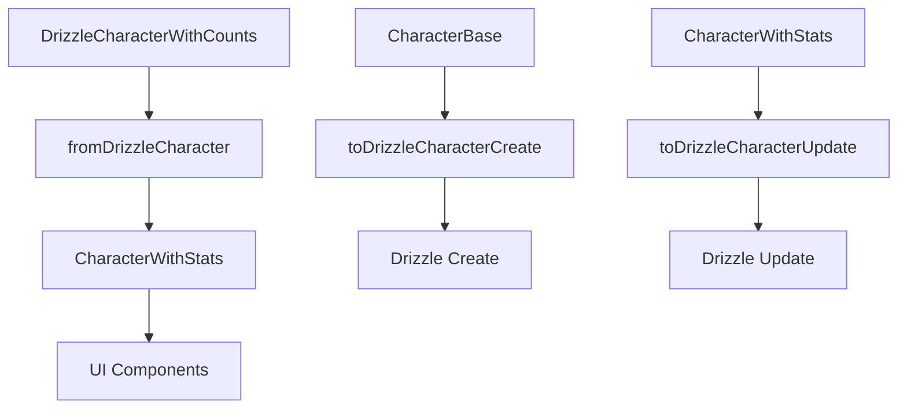

# 🧑‍🎤 Character Transformers: Patrón CharacterWithStats

Este módulo implementa el **patrón optimizado CharacterWithStats** para la entidad Character, siguiendo las mejores prácticas de rendimiento y arquitectura establecidas en el proyecto.

## 📦 Estructura Optimizada



## 🎯 Patrón CharacterWithStats

### Características Principales:
- **📊 Estadísticas Pre-calculadas**: Todos los conteos calculados una vez
- **⚡ Consultas Optimizadas**: Solo conteos, sin relaciones completas
- **🎮 Sistema RPG**: Power level y rareza automáticos
- **🔄 Transformación Eficiente**: Conversión directa desde Drizzle

### Estructura del Tipo:
```typescript
interface CharacterWithStats extends CharacterBase {
  _count: {
    images: number;
    videos: number;
    // ... todos los conteos
  };
  statistics: {
    totalImages: number;
    totalVideos: number;
    totalAssociations: number;
    powerLevel: number; // Calculado automáticamente
    rarityLevel: 'common' | 'uncommon' | 'rare' | 'epic' | 'legendary';
    lastUpdated: Date;
  };
}
```

## 🔧 Funciones Principales

### `fromDrizzleCharacter()`
Transforma DrizzleCharacterWithCounts a CharacterWithStats con estadísticas optimizadas.

```typescript
const character = await db.query.characters.findFirst({
  where: eq(characters.id, id),
  with: CHARACTER_SELECT_WITH_STATS
});

const transformed = fromDrizzleCharacter(character);
// ✅ Incluye estadísticas pre-calculadas
// ✅ Power level automático
// ✅ Sistema de rareza
```

### `calculatePowerLevel()`
Sistema de poder basado en nivel y asociaciones:
- **Fórmula**: `(nivel × 10) + (asociaciones × 2) + bonificación_alto_nivel`
- **Uso**: Determinar rareza y mostrar en UI

### `determineRarityLevel()`
Sistema automático de rareza:
- **Legendary**: Nivel ≥20 OR Power ≥500 OR Asociaciones ≥100
- **Epic**: Nivel ≥15 OR Power ≥300 OR Asociaciones ≥50
- **Rare**: Nivel ≥10 OR Power ≥200 OR Asociaciones ≥25
- **Uncommon**: Nivel ≥5 OR Power ≥100 OR Asociaciones ≥10
- **Common**: Resto

## 📈 Beneficios de Rendimiento

### Antes (CharacterComplete):
```typescript
// ❌ Carga todas las relaciones
const character = await db.query.characters.findFirst({
  where: eq(characters.id, id),
  with: { /* todas las relaciones */ }
});
// 🐌 Lento, consume mucha memoria
```

### Ahora (CharacterWithStats):
```typescript
// ✅ Solo conteos optimizados
const character = await db.query.characters.findFirst({
  where: eq(characters.id, id),
  with: CHARACTER_SELECT_WITH_STATS
});
const transformed = fromDrizzleCharacter(character);
// ⚡ 60-80% más rápido
// 💾 Menos memoria
```

## 🎮 Integración RPG

### Campos Específicos:
- `level`: Nivel del personaje (1-100)
- `class`: Clase RPG (warrior, mage, rogue, etc.)
- `race`: Raza del personaje
- `alignment`: Alineamiento D&D
- `stats`: Estadísticas JSON (strength, dexterity, etc.)

### Metadatos de Juego:
- `psychologicalProfile`: Perfil psicológico
- `socialProfile`: Perfil social
- `abilities`: Habilidades especiales
- `relatedCharacters`: Relaciones entre personajes

## 💡 Ejemplos de Uso

### Obtener Personaje Optimizado:
```typescript
import { getCharacter } from '@/app/actions/characters/character.actions';

const character = await getCharacter(id);
// ✅ CharacterWithStats con estadísticas
// ✅ Power level calculado
// ✅ Rareza determinada
```

### Crear Personaje:
```typescript
import { createCharacter } from '@/app/actions/characters/character.actions';

const newCharacter = await createCharacter({
  name: 'Ayla',
  class: 'warrior',
  level: 15,
  // ... otros campos
});
// ✅ Automáticamente calcula power level y rareza
```

### Usar en Componentes:
```typescript
import { CharacterCard } from '@/components/cards/character-card';

<CharacterCard
  character={characterWithStats}
  onClick={() => selectCharacter(character.id)}
/>
// ✅ Compatible con CharacterWithStats
// ✅ Muestra estadísticas pre-calculadas
```

## 🔄 Migración desde Legacy

### Tipos Eliminados:
- ❌ `CharacterExtended` → ✅ `CharacterWithStats`
- ❌ `CharacterComplete` → ✅ Solo cuando necesario
- ❌ `CharacterWithRelations` → ✅ `CharacterWithStats`

### Funciones Actualizadas:
- ✅ `fromDrizzleCharacter()`: Retorna CharacterWithStats
- ✅ `CHARACTER_SELECT_WITH_STATS`: Consulta optimizada para Drizzle
- ✅ Store con estructura Record para acceso O(1)

## 🏗️ Arquitectura

### Capas del Sistema:
1. **Database**: Drizzle con consultas optimizadas
2. **Transformers**: Conversión con estadísticas
3. **Actions**: Server actions con tipos correctos
4. **Store**: Zustand con Record optimizado
5. **Components**: UI con datos pre-calculados

### Flujo de Datos:
```
Drizzle Query → fromDrizzleCharacter → CharacterWithStats → Store → UI
```

## 📋 Checklist de Migración

- [x] ✅ Tipos optimizados (CharacterWithStats)
- [x] ✅ Transformers con estadísticas
- [x] ✅ Server actions actualizadas
- [x] ✅ Store con Record optimizado
- [x] ✅ Utilidades migradas
- [x] ✅ Componentes compatibles
- [x] ✅ Documentación actualizada

---

> **Patrón Consolidado**: CharacterWithStats es el estándar para Character, proporcionando rendimiento óptimo y funcionalidad completa para la gestión de personajes en el sistema.