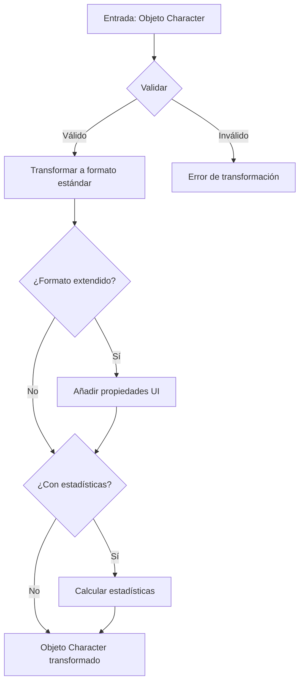

# 👤 Transformador de Personajes (Character)

Este módulo proporciona funciones para transformar y validar objetos de personaje, asegurando una estructura de datos consistente en toda la aplicación.

## 📋 Descripción general

El transformador de personajes maneja la conversión entre diferentes formatos de personaje:
- Transformación de objetos Prisma a objetos de aplicación
- Validación y normalización de datos
- Generación de formatos extendidos para interfaces de usuario
- Cálculo de estadísticas relacionadas con el personaje

## 🔄 Diagrama de flujo



## 📁 Estructura de archivos

```
character/
├── index.ts           # Punto de entrada principal y exportaciones
├── transformer.ts     # Funciones principales de transformación
├── mappers.ts         # Funciones para mapear entre distintos formatos
├── serializers.ts     # Funciones para serialización/deserialización
└── README.md          # Documentación (este archivo)
```

## 🧩 Tipos principales

```typescript
// Modelo básico de Personaje
interface Character {
    id: string;
    name: string;
    description?: string;
    emoji?: string;
    color?: string;
    level: number;
    class: string;
    race: string;
    alignment: string;
    type?: string;
    backstory?: string;
    stats?: string; // JSON serializado
    goals?: string; // JSON serializado
    fears?: string; // JSON serializado
    isFavorite?: boolean;
    // ... otras propiedades base
}

// Personaje con propiedades extendidas para UI
interface CharacterExtended extends Character {
    isSelected?: boolean;
    isHighlighted?: boolean;
    isExpanded?: boolean;
    isEditing?: boolean;
    displayOrder?: number;
    parsedStats?: Record<string, number>; // Stats deserializados
    parsedGoals?: string[]; // Goals deserializados
    parsedFears?: string[]; // Fears deserializados
    // ... propiedades de UI adicionales
}

// Personaje con estadísticas
interface CharacterWithStats extends CharacterExtended {
    imageCount: number;
    videoCount: number;
    tagCount: number;
    placeCount: number;
    relationshipCount: number;
    powerLevel: number;
    statsChart: Array<{name: string, value: number}>;
    distribution: Array<{name: string, count: number}>;
    lastUpdated?: Date;
    // ... estadísticas adicionales
}
```

## 🛠️ Funciones principales

### Transformadores básicos

```typescript
// Transforma un personaje único
transformCharacter(character: unknown): Character

// Transforma un array de personajes
transformCharacters(characters: unknown[]): Character[]

// Transforma a formato extendido para UI
transformCharacterToExtended(character: Character): CharacterExtended

// Transforma incluyendo estadísticas
transformCharacterToWithStats(character: Character): CharacterWithStats
```

### Funciones de búsqueda y persistencia

```typescript
// Busca personajes con opciones de filtrado
searchCharacters(options: CharacterSearchOptions): Promise<CharacterSearchResult>

// Obtiene un personaje por ID con relaciones completas
getCharacterById(id: string): Promise<CharacterComplete | null>

// Crea un nuevo personaje
createCharacter(data: CharacterCreateInput): Promise<CharacterComplete>

// Actualiza un personaje existente
updateCharacter(id: string, data: CharacterUpdateInput): Promise<CharacterComplete>

// Elimina un personaje
deleteCharacter(id: string): Promise<void>
```

## 📝 Ejemplos de uso

### Transformación básica

```typescript
import { transformCharacter } from '@/transformers/character';

// Transformar un objeto desconocido a Character
const character = transformCharacter(rawData);
console.log(character.name); // Acceso seguro a propiedades validadas
```

### Transformación con estadísticas para UI

```typescript
import { transformCharacterToWithStats } from '@/transformers/character';

// Obtener un personaje con estadísticas calculadas
const characterWithStats = transformCharacterToWithStats(character);
console.log(`Nivel de poder: ${characterWithStats.powerLevel}`);
console.log(`Imágenes asociadas: ${characterWithStats.imageCount}`);
```

### Búsqueda de personajes

```typescript
import { searchCharacters } from '@/transformers/character';

// Buscar personajes con filtros
const result = await searchCharacters({
  search: 'guerrero',
  page: 1,
  pageSize: 10,
  orderBy: 'level',
  orderDirection: 'desc',
  filters: {
    class: 'Warrior',
    race: 'Human',
    minLevel: 10
  }
});

console.log(`Total encontrados: ${result.total}`);
```

## 🔍 Manejo de errores

El transformador utiliza un sistema centralizado de manejo de errores que:

1. Registra detalles del error en el servidor
2. Lanza `TransformerError` con mensajes descriptivos
3. Preserva la información del error original en la propiedad `cause`

Ejemplo de captura:

```typescript
try {
  const character = transformCharacter(unknownData);
} catch (error) {
  if (error instanceof TransformerError) {
    console.error(`Error de transformación: ${error.message}`);
  } else {
    console.error(`Error inesperado: ${error}`);
  }
}
```

## ⚙️ Mejores prácticas

1. **Siempre use los transformadores**: Para garantizar datos consistentes, utilice las funciones de transformación incluso cuando crea que los datos ya están en el formato correcto.

2. **Maneje los errores**: Capture y maneje adecuadamente los errores de transformación para proporcionar feedback útil.

3. **Evite la manipulación directa**: No modifique objetos Character directamente; en su lugar, utilice las funciones de transformación para crear nuevas instancias.

4. **Calcule estadísticas bajo demanda**: Las estadísticas como el nivel de poder son costosas de calcular, úselas solo cuando sea necesario.

5. **Validación temprana**: Valide los datos lo antes posible en el flujo de la aplicación para detectar problemas antes de que se propaguen.

6. **Uso del store**: Utilice el CharacterStore para gestionar el estado de los personajes en componentes del cliente.

## 🔄 Interacción con otros componentes

Los personajes se relacionan con varias entidades del sistema:

- **Imágenes**: Los personajes pueden estar representados en múltiples imágenes
- **Lugares**: Los personajes pueden estar asociados con lugares en el mundo
- **Objetos del mundo**: Los personajes pueden poseer o interactuar con objetos
- **Otros personajes**: Los personajes pueden tener relaciones con otros personajes
- **Grupos**: Los personajes pueden pertenecer a grupos o facciones

Para operaciones que involucran estas relaciones, consulte la documentación específica de cada entidad relacionada.