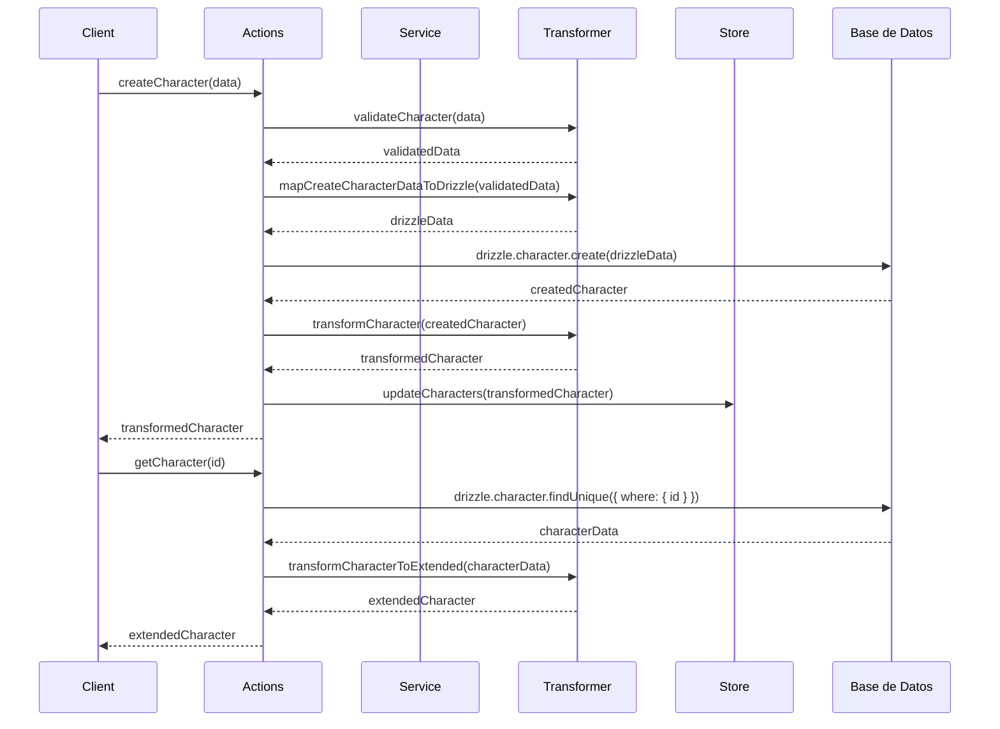

# Entidad Character

## Descripción

La entidad `Character` representa personajes dentro del sistema, que pueden ser utilizados en diferentes contextos creativos como narrativas, juegos de rol, o worldbuilding. Los personajes tienen atributos como nivel, clase, raza, y estadísticas, así como información sobre su personalidad, miedos, creencias y relaciones con otros personajes.

## Estructura

```mermaid
graph TD
    Character[Entidad Character]

    Character --> Transformers[Transformers]
    Character --> Types[Types]
    Character --> Services[Services]
    Character --> Store[Store]
    Character --> Actions[Actions]

    Transformers --> T1[transformCharacter]
    Transformers --> T2[transformCharacters]
    Transformers --> T3[transformCharacterToExtended]
    Transformers --> T4[transformCharacterToWithStats]
    Transformers --> T5[Serializers]
    Transformers --> T6[Mappers]

    Types --> Ty1[CharacterBase]
    Types --> Ty2[CharacterComplete]
    Types --> Ty3[CharacterExtended]
    Types --> Ty4[CharacterWithStats]
    Types --> Ty5[CharacterClass]

    Services --> S1[CharacterService]

    Store --> St1[CharacterStore]
    Store --> St2[Core Slice]
    Store --> St3[UI Slice]
    Store --> St4[Filters Slice]

    Actions --> A1[createCharacter]
    Actions --> A2[updateCharacter]
    Actions --> A3[deleteCharacter]
    Actions --> A4[getCharacter]
    Actions --> A5[getCharacters]
```



## Flujo de datos



## Tipos principales

### CharacterBase

Representa la estructura base de un personaje.

```typescript
interface CharacterBase {
  id: string;
  name: string;
  emoji: string;
  color: string;
  description: string | null;
  shortcut: string | null;
  category: string | null;
  level: number;
  class: string;
  race: string;
  type: string | null;
  alignment: string;
  backstory: string;
  stats: string; // String JSON
  psychologicalProfile: string;
  socialProfile: string;
  relationships: string; // String JSON
  goals: string; // String JSON
  fears: string; // String JSON
  beliefs: string; // String JSON
  personality: string; // String JSON
  skills: string; // String JSON
  abilities: string; // String JSON
  featuredImage: string | null;
  isFavorite: boolean;
  sortBy: string;
  filters: string; // String JSON
  createdAt: Date;
  updatedAt: Date;
}
```

### CharacterExtended

Extiende `Character` con propiedades adicionales útiles para la UI.

```typescript
interface CharacterExtended extends CharacterComplete {
  isSelected: boolean;
  isHighlighted: boolean;
  previewContent: string;
  parsedParameters: Record<string, any>;
  parsedTags: string[];
  lastUpdated: Date;
  importance: number;
}
```

### CharacterWithStats

Extiende `Character` con estadísticas calculadas.

```typescript
interface CharacterWithStats extends CharacterComplete {
  stats: {
    imageCount: number;
    videoCount: number;
    albumCount: number;
    tagCount: number;
    noteCount: number;
    placeCount: number;
    worldItemCount: number;
    conceptCount: number;
    promptCount: number;
    wildcardCount: number;
    propertyCount: number;
    groupCount: number;
    relatedCharacterCount: number;
    totalContentItems: number;
    lastUpdated: Date;
    lastUsed: Date;
  }
}
```

## Funciones principales

### Transformers

- `transformCharacter`: Transforma un objeto a un Character, validando su estructura.
- `transformCharacters`: Transforma un array de objetos a Characters.
- `transformCharacterToExtended`: Extiende un Character con propiedades para UI.
- `transformCharacterToWithStats`: Transforma un Character para incluir estadísticas.

### Serializers

- `fromPrismaCharacter`: Transforma un objeto de Prisma a CharacterComplete.
- `toPrismaCharacter`: Transforma un CharacterComplete a formato Prisma para operaciones CRUD.
- `validateCharacter`: Valida un objeto como Character.
- `deserializeStats`: Deserializa un string JSON de estadísticas a objeto.
- `serializeStats`: Serializa un objeto de estadísticas a string JSON.
- `deserializeRelationships`: Deserializa un string JSON de relaciones a array.
- `serializeRelationships`: Serializa un array de relaciones a string JSON.

### Mappers

- `mapCharacterSearchOptionsToPrisma`: Mapea opciones de búsqueda a formato Prisma.
- `mapCreateCharacterDataToPrisma`: Mapea datos de creación a formato Prisma.
- `mapUpdateCharacterDataToPrisma`: Mapea datos de actualización a formato Prisma.
- `filterCharacters`: Filtra personajes según criterios.
- `sortCharacters`: Ordena personajes según criterio.
- `paginateCharacters`: Aplica paginación a un array de personajes.

## Ejemplos de uso

### Transformar un personaje desde Prisma

```typescript
// Obtener personaje de Prisma
const prismaCharacter = await prisma.character.findUnique({ where: { id } });

// Transformar a CharacterComplete
const character = transformCharacter(prismaCharacter, { deserializeFields: true });
```

### Extender un personaje para UI

```typescript
// Obtener personaje
const character = await getCharacter(characterId);

// Extender para UI
const extendedCharacter = transformCharacterToExtended(character);

// Usar en componente
return <CharacterCard character={extendedCharacter} />;
```

### Filtrar y ordenar personajes

```typescript
// Obtener personajes
const characters = await getCharacters();

// Aplicar filtros y ordenación
const filteredCharacters = filterCharacters(characters, {
  class: 'warrior',
  minLevel: 5
});
const sortedCharacters = sortCharacters(filteredCharacters, 'level:desc');

// Mostrar resultados
return (
  <CharacterList characters={sortedCharacters} />
);
```

## Mejores prácticas

1. **Serialización**: Usar `serializeStats` y `serializeRelationships` al guardar datos en la base de datos para asegurar el correcto formato JSON.
2. **Deserialización**: Usar `deserializeStats` y `deserializeRelationships` al leer datos de la base de datos para trabajar con objetos JS.
3. **Validación**: Siempre validar los datos antes de guardarlos usando `validateCharacter`.
4. **Relaciones**: Utilizar los métodos `mapCreateCharacterDataToPrisma` y `mapUpdateCharacterDataToPrisma` para manejar correctamente las relaciones.
5. **Extensión para UI**: Utilizar `transformCharacterToExtended` cuando se necesiten propiedades adicionales para la interfaz de usuario.
6. **Estadísticas**: Para obtener métricas sobre el personaje, usar `transformCharacterToWithStats`.
7. **Búsqueda eficiente**: Aprovechar `mapCharacterSearchOptionsToPrisma` para realizar búsquedas optimizadas en la base de datos.

## Integración con otras entidades

Los personajes pueden relacionarse con diversas entidades del sistema:

- **Images/Videos**: Contenido visual relacionado con el personaje
- **Tags**: Etiquetas para categorizar al personaje
- **Places**: Lugares que el personaje ha visitado o donde habita
- **WorldItems**: Objetos que el personaje posee o ha creado
- **Concepts**: Conceptos asociados al personaje
- **Prompts**: Prompts donde se utiliza al personaje
- **Notes**: Notas sobre el personaje
- **Characters**: Relaciones con otros personajes (amigos, enemigos, etc.)