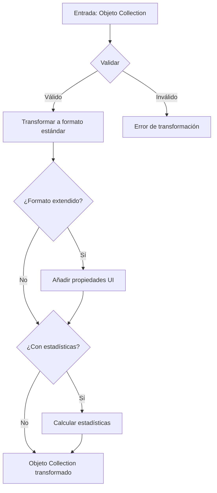
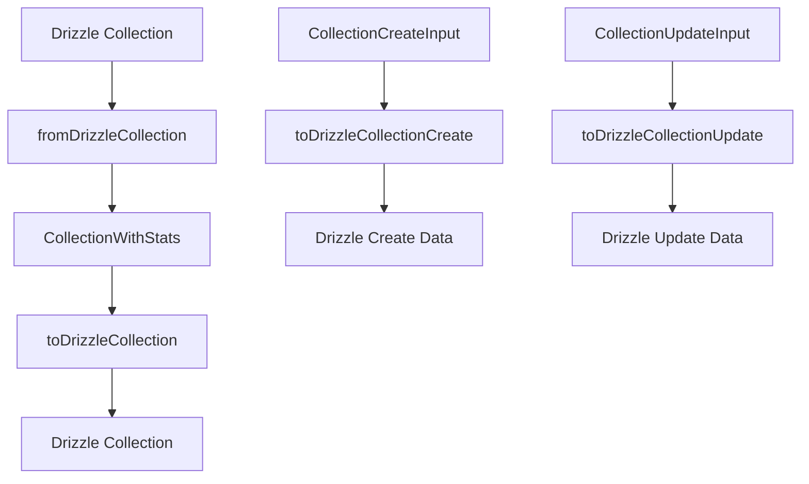

# 🗂️ Transformador de Colecciones (Collection)

Este módulo proporciona funciones para transformar y validar objetos de colección, asegurando una estructura de datos consistente en toda la aplicación.

## 📋 Descripción general

El transformador de colecciones maneja la conversión entre diferentes formatos de colección:

- Transformación de objetos Drizzle a objetos de aplicación
- Validación y normalización de datos
- Generación de formatos extendidos para interfaces de usuario
- Cálculo de estadísticas relacionadas con la colección

## 🔄 Diagrama de flujo



## 📁 Estructura de archivos

```
collection/
├── index.ts           # Punto de entrada principal y exportaciones
├── transformer.ts     # Funciones principales de transformación
├── mappers.ts         # Funciones para mapear entre distintos formatos
├── serializers.ts     # Funciones para serialización/deserialización
└── README.md          # Documentación (este archivo)
```

## 🧩 Tipos principales

```typescript
// Modelo básico de Colección
interface Collection {
    id: string;
    name: string;
    description?: string;
    emoji?: string;
    color?: string;
    category?: 'PERSONAL' | 'WORK' | 'PROJECT' | 'OTHER';
    isPublic?: boolean;
    isPinned?: boolean;
    isFavorite?: boolean;
    parentId?: string;
    // ... otras propiedades base
}

// Colección con propiedades extendidas para UI
interface CollectionExtended extends Collection {
    isSelected?: boolean;
    isHighlighted?: boolean;
    // ... propiedades de UI adicionales
}

// Colección con estadísticas
interface CollectionWithStats extends CollectionExtended {
    imageCount: number;
    videoCount: number;
    albumCount: number;
    tagCount: number;
    groupCount: number;
    totalSize: number;
    lastUpdated?: Date;
    // ... estadísticas adicionales
}
```

## 🛠️ Funciones principales

### Transformadores básicos

```typescript
// Transforma una colección única
transformCollection(collection: unknown): Collection

// Transforma un array de colecciones
transformCollections(collections: unknown[]): Collection[]

// Transforma a formato extendido para UI
transformCollectionToExtended(collection: Collection): CollectionExtended

// Transforma incluyendo estadísticas
transformCollectionToWithStats(collection: Collection): CollectionWithStats
```

### Funciones de búsqueda y persistencia

```typescript
// Busca colecciones con opciones de filtrado
searchCollections(options: CollectionSearchOptions): Promise<CollectionSearchResult>

// Obtiene una colección por ID con relaciones completas
getCollectionById(id: string): Promise<CollectionComplete | null>
```

## 📝 Ejemplos de uso

### Transformación básica

```typescript
import { transformCollection } from '@/transformers/collection';

// Transformar un objeto desconocido a Collection
const collection = transformCollection(rawData);
console.log(collection.name); // Acceso seguro a propiedades validadas
```

### Transformación con estadísticas para UI

```typescript
import { transformCollectionToWithStats } from '@/transformers/collection';

// Obtener una colección con estadísticas calculadas
const collectionWithStats = transformCollectionToWithStats(collection);
console.log(`Imágenes: ${collectionWithStats.imageCount}`);
console.log(`Última actualización: ${collectionWithStats.lastUpdated}`);
```

### Búsqueda de colecciones

```typescript
import { searchCollections } from '@/transformers/collection';

// Buscar colecciones con filtros
const result = await searchCollections({
  search: 'naturaleza',
  page: 1,
  pageSize: 10,
  orderBy: 'createdAt',
  orderDirection: 'desc',
  filters: {
    category: 'PERSONAL',
    isPublic: true
  }
});

console.log(`Total: ${result.total}, Páginas: ${result.totalPages}`);
```

## 🔍 Manejo de errores

El transformador utiliza un sistema centralizado de manejo de errores que:

1. Registra detalles del error en el servidor
2. Lanza `TransformerError` con mensajes descriptivos
3. Preserva la información del error original en la propiedad `cause`

Ejemplo de captura:

```typescript
try {
  const collection = transformCollection(unknownData);
} catch (error) {
  if (error instanceof TransformerError) {
    console.error(`Error de transformación: ${error.message}`);
  } else {
    console.error(`Error inesperado: ${error}`);
  }
}
```

## ⚙️ Mejores prácticas

1. **Siempre use los transformadores**: Para garantizar datos consistentes, utilice las funciones de transformación incluso cuando crea que los datos ya están en el formato correcto.

2. **Maneje los errores**: Capture y maneje adecuadamente los errores de transformación para proporcionar feedback útil.

3. **Evite la manipulación directa**: No modifique objetos Collection directamente; en su lugar, utilice las funciones de transformación para crear nuevas instancias.

4. **Considere el rendimiento**: Para colecciones grandes, utilice transformaciones selectivas en lugar de cargar todas las relaciones.

5. **Validación temprana**: Valide los datos lo antes posible en el flujo de la aplicación para detectar problemas antes de que se propaguen.

6. **Uso del store**: Utilice el CollectionStore para gestionar el estado de las colecciones en componentes del cliente.

## 🔄 Interacción con otros componentes

Las colecciones se relacionan con varias entidades del sistema:

- **Imágenes**: Las colecciones pueden contener múltiples imágenes
- **Videos**: Las colecciones pueden contener múltiples videos
- **Álbumes**: Las colecciones pueden contener o estar asociadas con álbumes
- **Etiquetas**: Las colecciones pueden tener etiquetas asociadas
- **Grupos**: Las colecciones pueden ser compartidas con grupos

Para operaciones que involucran estas relaciones, consulte la documentación específica de cada entidad relacionada.

## 📚 Collection Transformer

### Propósito

Transformar datos de Collection entre diferentes capas de la aplicación:

- **Drizzle → CollectionWithStats**: Para uso en UI y lógica de negocio
- **CollectionWithStats → Drizzle**: Para persistencia en base de datos

### Arquitectura



### Tipos Principales

#### CollectionWithStats

```typescript
interface CollectionWithStats extends CollectionBase {
  _count?: {
    images: number;
    videos: number;
    albums: number;
    // ... otros conteos
  };
  stats: {
    totalItems: number;
    totalImages: number;
    totalVideos: number;
    totalEntities: number;
    lastUpdated: Date;
  };
}
```

### Funciones Principales

#### `fromDrizzleCollection(DrizzleCollection: DrizzleCollectionWithCounts): CollectionWithStats`

Convierte datos de Drizzle a formato de aplicación con estadísticas calculadas.

**Características:**

- ✅ Deserializa JSON (filters, editions, sortBy)
- ✅ Calcula estadísticas basadas en `_count`
- ✅ Maneja valores null/undefined
- ✅ Optimizado para performance

#### `toDrizzleCollection(collection: CollectionWithStats): DrizzleCollection`

Convierte datos de aplicación a formato Drizzle para persistencia.

#### `toDrizzleCollectionCreate(input: CollectionCreateInput): DrizzleCollectionCreateInput`

Prepara datos para creación en Drizzle.

#### `toDrizzleCollectionUpdate(input: CollectionUpdateInput): DrizzleCollectionUpdateInput`

Prepara datos para actualización en Drizzle.

### Funciones Server Actions

#### `getCollectionById(id: string): Promise<CollectionWithStats | null>`

Obtiene una colección por ID con estadísticas calculadas.

#### `getCollections(): Promise<CollectionWithStats[]>`

Obtiene todas las colecciones con estadísticas.

### Optimizaciones

1. **Consultas optimizadas**: Solo `_count`, no relaciones completas
2. **Cálculo eficiente**: Estadísticas pre-calculadas en transformación
3. **Serialización correcta**: Manejo adecuado de JSON fields
4. **Type safety**: Tipado estricto en todas las capas

### Patrones de Uso

```typescript
// ✅ Correcto - Usar CollectionWithStats
const collections = await getCollections();
const totalItems = collection.stats.totalItems;

// ❌ Incorrecto - No usar tipos legacy
const collection: CollectionComplete = await getCollection(id);
```

### Migración Completada

- ✅ Eliminados tipos `CollectionComplete` y `CollectionExtended`
- ✅ Implementado patrón `CollectionWithStats`
- ✅ Optimizadas consultas de base de datos
- ✅ Actualizados stores, components y services
- ✅ Documentación actualizada
