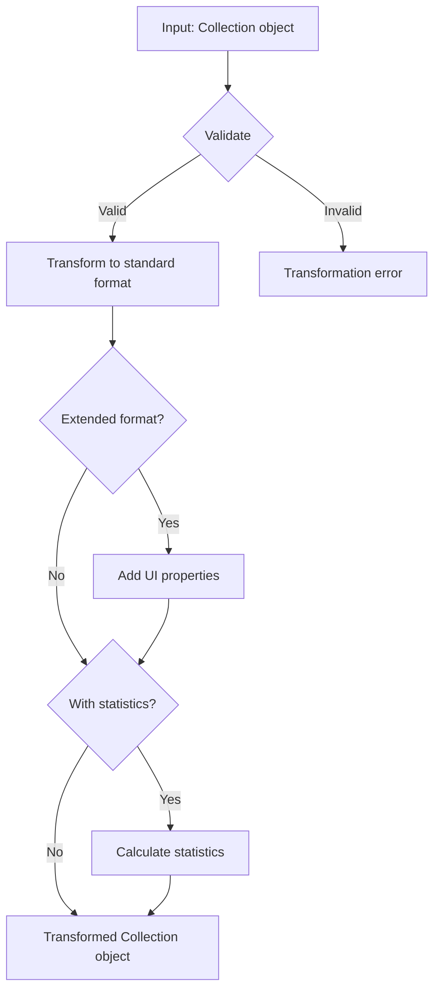
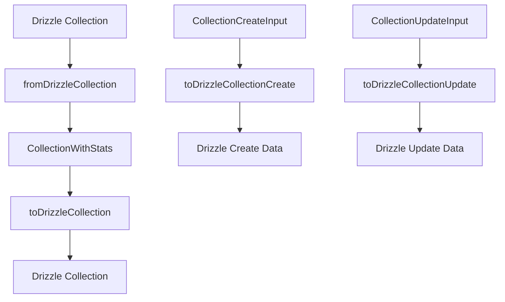

# Collection transformer

This module transforms and validates Collection objects. It keeps a consistent data structure across Media Manager.

## Overview

The Collection transformer converts Collection data between formats. It covers these operations:

- Transform Drizzle objects to application objects
- Validate and normalize data
- Build extended formats for user interfaces
- Calculate Collection statistics

## Flow diagram



## File structure

```
collection/
├── index.ts           # Main entry point and exports
├── transformer.ts     # Main transformation functions
├── mappers.ts         # Functions that map between formats
├── serializers.ts     # Serialization and deserialization functions
└── README.md          # Documentation (this file)
```

## Main types

```typescript
// Basic Collection model
interface Collection {
	id: string;
	name: string;
	description?: string;
	emoji?: string;
	color?: string;
	category?: 'PERSONAL' | 'WORK' | 'PROJECT' | 'OTHER';
	isPublic?: boolean;
	isPinned?: boolean;
	isFavorite?: boolean;
	parentId?: string;
	// ... other base properties
}

// Collection with extra UI properties
interface CollectionExtended extends Collection {
	isSelected?: boolean;
	isHighlighted?: boolean;
	// ... extra UI properties
}

// Collection with statistics
interface CollectionWithStats extends CollectionExtended {
	imageCount: number;
	videoCount: number;
	albumCount: number;
	tagCount: number;
	groupCount: number;
	totalSize: number;
	lastUpdated?: Date;
	// ... extra statistics
}
```

## Main functions

### Basic transformers

```typescript
// Transform a single Collection
transformCollection(collection: unknown): Collection

// Transform an array of Collections
transformCollections(collections: unknown[]): Collection[]

// Transform to the extended UI format
transformCollectionToExtended(collection: Collection): CollectionExtended

// Transform and include statistics
transformCollectionToWithStats(collection: Collection): CollectionWithStats
```

### Search and persistence functions

```typescript
// Search Collections with filter options
searchCollections(options: CollectionSearchOptions): Promise<CollectionSearchResult>

// Get a Collection by ID with full relations
getCollectionById(id: string): Promise<CollectionComplete | null>
```

## Usage examples

### Basic transformation

```typescript
import { transformCollection } from '@/transformers/collection';

// Transform an unknown object to Collection
const collection = transformCollection(rawData);
console.log(collection.name); // Safe access to validated properties
```

### Transformation with statistics for UI

```typescript
import { transformCollectionToWithStats } from '@/transformers/collection';

// Get a Collection with calculated statistics
const collectionWithStats = transformCollectionToWithStats(collection);
console.log(`Images: ${collectionWithStats.imageCount}`);
console.log(`Last update: ${collectionWithStats.lastUpdated}`);
```

### Collection search

```typescript
import { searchCollections } from '@/transformers/collection';

// Search Collections with filters
const result = await searchCollections({
	search: 'nature',
	page: 1,
	pageSize: 10,
	orderBy: 'createdAt',
	orderDirection: 'desc',
	filters: {
		category: 'PERSONAL',
		isPublic: true,
	},
});

console.log(`Total: ${result.total}, Pages: ${result.totalPages}`);
```

## Error handling

The transformer uses a central error-handling system. The system does this work:

1. Log error details on the server
2. Throw `TransformerError` with descriptive messages
3. Keep the original error in the `cause` property

Capture example:

```typescript
try {
	const collection = transformCollection(unknownData);
} catch (error) {
	if (error instanceof TransformerError) {
		console.error(`Transformation error: ${error.message}`);
	} else {
		console.error(`Unexpected error: ${error}`);
	}
}
```

## Practices

1. **Use the transformers.** Call transformation functions even when the data looks correct. This keeps data consistent.
2. **Handle errors.** Catch transformation errors. Return useful feedback.
3. **Avoid direct mutation.** Do not change Collection objects in place. Use transformers to create new instances.
4. **Watch performance.** For large Collections, use selective transformations. Do not load every relation.
5. **Validate early.** Validate data as soon as the application receives it. This stops problems from spreading.
6. **Use the store.** Use CollectionStore to manage Collection state in client components.

## Interaction with other components

Collections relate to several objects in Media Manager. Those objects are:

- **Images**: A Collection can contain many images
- **Videos**: A Collection can contain many videos
- **Albums**: A Collection can contain or associate with Albums
- **Tags**: A Collection can have associated Tags
- **Groups**: A Collection can be shared with Groups

For operations that use these relations, read the documentation for the related object.

## Collection transformer

### Purpose

Transform Collection data between application layers. The conversions are:

- **Drizzle to CollectionWithStats**: For UI and application logic
- **CollectionWithStats to Drizzle**: For database persistence

### Architecture



### Main types

#### CollectionWithStats

```typescript
interface CollectionWithStats extends CollectionBase {
	_count?: {
		images: number;
		videos: number;
		albums: number;
		// ... other counts
	};
	stats: {
		totalItems: number;
		totalImages: number;
		totalVideos: number;
		totalEntities: number;
		lastUpdated: Date;
	};
}
```

### Main functions

#### `fromDrizzleCollection(DrizzleCollection: DrizzleCollectionWithCounts): CollectionWithStats`

Converts Drizzle data to application format with calculated statistics.

**Characteristics:**

- Deserializes JSON (`filters`, `editions`, `sortBy`)
- Calculates statistics based on `_count`
- Handles null and undefined values
- Optimized for performance

#### `toDrizzleCollection(collection: CollectionWithStats): DrizzleCollection`

Converts application data to Drizzle format for persistence.

#### `toDrizzleCollectionCreate(input: CollectionCreateInput): DrizzleCollectionCreateInput`

Prepares data for creation in Drizzle.

#### `toDrizzleCollectionUpdate(input: CollectionUpdateInput): DrizzleCollectionUpdateInput`

Prepares data for update in Drizzle.

### Route functions

#### `getCollectionById(id: string): Promise<CollectionWithStats | null>`

Gets a Collection by ID with calculated statistics.

#### `getCollections(): Promise<CollectionWithStats[]>`

Gets all Collections with statistics.

### Optimizations

1. **Optimized queries**: Only `_count`, not full relations
2. **Efficient calculation**: Pre-calculated statistics in transformation
3. **Correct serialization**: Proper handling of JSON fields
4. **Type safety**: Strict typing in all layers

### Usage patterns

```typescript
// Correct: use CollectionWithStats
const collections = await getCollections();
const totalItems = collection.stats.totalItems;

// Incorrect: do not use legacy types
const collection: CollectionComplete = await getCollection(id);
```

### Completed migration

- Removed `CollectionComplete` and `CollectionExtended` types
- Implemented the `CollectionWithStats` pattern
- Optimized database queries
- Updated stores, components, and services
- Updated documentation
