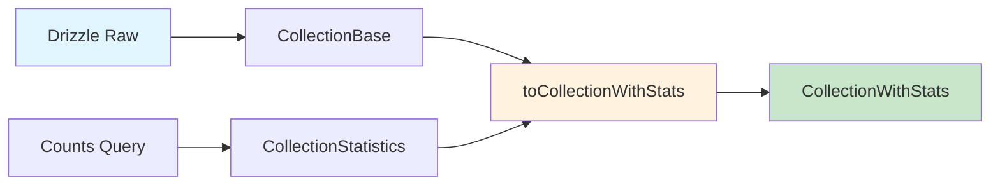

# Transformadores de Collection

## 📋 Descripción General

Este módulo contiene todos los transformadores, validadores y utilidades para manejar la entidad **Collection** dentro del sistema de gestión de imágenes. Las colecciones representan agrupaciones lógicas de contenido multimedia.

**✅ Estado:** MIGRADO A DRIZZLE - Enero 2025
**🎯 Propósito:** Transformar datos entre Drizzle ORM y tipos locales para la entidad Collection
**🔧 Arquitectura:** Patrón de transformadores con validación Zod

## 🏗️ Estructura del Módulo

```
src/transformers/collection/
├── index.ts          # 📤 Exportaciones públicas
├── mappers.ts         # 🗺️ Transformaciones básicas entre tipos
├── transformer.ts     # 🔄 Conversiones desde Drizzle ORM
├── serializers.ts     # 📦 Manejo de campos JSON complejos
├── validators.ts      # 🛡️ Validaciones con esquemas Zod
├── schema.ts          # 📋 Esquemas Zod para validación
└── documentation.md   # 📚 Este archivo
```

## 🔄 Tipos y Transformaciones

### Tipos Base

- **`CollectionBase`**: Estructura base desde Drizzle ORM
- **`CollectionStatistics`**: Estadísticas calculadas (conteos de relaciones)
- **`CollectionWithStats`**: Tipo canónico con estadísticas integradas

### Flujo de Transformación



## 📚 API Pública

### Mappers (`mappers.ts`)

#### `toCollectionWithStats(collection, counts)`

Convierte un `CollectionBase` y sus conteos a `CollectionWithStats`.

**Parámetros:**

- `collection: CollectionBase` - Datos base de la colección
- `counts: CollectionCounts['_count']` - Conteos de relaciones

**Retorna:** `CollectionWithStats`

### Transformers (`transformer.ts`)

#### `fromDrizzleCollection(drizzleCollection, counts)`

Transforma datos de Drizzle a nuestro tipo canónico.

**Parámetros:**

- `drizzleCollection: CollectionBase | null` - Datos desde Drizzle
- `counts: CollectionCounts` - Conteos de relaciones

**Retorna:** `CollectionWithStats | null`

#### `fromDrizzleCollections(drizzleCollections)`

Transforma múltiples colecciones de Drizzle.

**Parámetros:**

- `drizzleCollections: Array<{collection: CollectionBase, counts: CollectionCounts}>` - Array de datos

**Retorna:** `CollectionWithStats[]`

### Serializers (`serializers.ts`)

#### `deserializeFilters(jsonString)`

Deserializa el campo JSON `filters`.

#### `serializeFilters(filters)`

Serializa filtros a JSON string.

#### `deserializeSortBy(jsonString)` / `serializeSortBy()`

Manejo de criterios de ordenamiento.

#### `deserializeEditions(jsonString)` / `serializeEditions()`

Manejo de ediciones de la colección.

### Validators (`validators.ts`)

#### `validateCollectionBase(data)`

Valida datos como `CollectionBase`.

#### `validateCollectionWithStats(data)`

Valida datos como `CollectionWithStats`.

#### `validateCollectionCounts(data)`

Valida conteos de relaciones.

#### `sanitizeCollectionData(data)`

Sanea y aplica valores por defecto.

## 🛡️ Validación con Zod

### Esquemas Disponibles

- **`CollectionBaseSchema`**: Validación de datos base
- **`CollectionStatisticsSchema`**: Validación de estadísticas
- **`CollectionWithStatsSchema`**: Validación del tipo canónico
- **`CollectionCountsSchema`**: Validación de conteos desde Drizzle
- **`CollectionCreateSchema`**: Validación para creación
- **`CollectionUpdateSchema`**: Validación para actualización

### Ejemplo de Uso

```typescript
import { validateCollectionBase, CollectionBaseSchema } from '@/transformers/collection';

// Validación directa
const validCollection = validateCollectionBase(rawData);

// Validación con esquema
const result = CollectionBaseSchema.safeParse(rawData);
if (result.success) {
	console.log('Datos válidos:', result.data);
} else {
	console.error('Errores de validación:', result.error.errors);
}
```

## 🔗 Integración con el Sistema

### Uso en Stores

```typescript
import { fromDrizzleCollection, toCollectionWithStats } from '@/transformers/collection';

// En un store de Zustand
const transformedCollection = fromDrizzleCollection(drizzleData, counts);
```

### Uso en Servicios

```typescript
import { validateCollectionCreate, sanitizeCollectionData } from '@/transformers/collection';

// Antes de enviar a Drizzle
const sanitizedData = sanitizeCollectionData(userInput);
const validData = validateCollectionCreate(sanitizedData);
```

## 📊 Estadísticas Soportadas

Las colecciones incluyen las siguientes estadísticas:

- **Contenido Multimedia:**
  - `imageCount`: Número de imágenes
  - `videoCount`: Número de videos

- **Entidades Relacionadas:**
  - `albumCount`: Álbumes asociados
  - `tagCount`: Tags aplicados
  - `characterCount`: Personajes incluidos
  - `placeCount`: Lugares referenciados
  - `worldItemCount`: Elementos de mundo
  - `conceptCount`: Conceptos asociados
  - `promptCount`: Prompts incluidos
  - `noteCount`: Notas adjuntas
  - `wildcardCount`: Wildcards aplicados
  - `propertyCount`: Propiedades personalizadas
  - `groupCount`: Grupos relacionados

## 🚨 Manejo de Errores

Todos los transformadores usan la clase `TransformerError` para errores consistentes:

```typescript
try {
	const result = validateCollectionBase(data);
} catch (error) {
	if (error instanceof TransformerError) {
		console.error('Error de transformación:', error.message);
	}
}
```

## 🧪 Testing

Para validar el funcionamiento:

```typescript
import { fromDrizzleCollection, validateCollectionWithStats } from '@/transformers/collection';

// Datos de prueba
const mockCollection: CollectionBase = {
	/* ... */
};
const mockCounts = { images: 5, videos: 2 /* ... */ };

// Probar transformación
const result = fromDrizzleCollection(mockCollection, mockCounts);
expect(result).toBeDefined();
expect(result?.stats.imageCount).toBe(5);

// Probar validación
expect(() => validateCollectionWithStats(result)).not.toThrow();
```

## 📝 Migración desde Drizzle

**Estado Anterior:** Dependía completamente de tipos Drizzle (`Collection`, `Drizzle.CollectionInclude`)
**Estado Actual:** Usa solo tipos Drizzle locales (`CollectionBase`, tipos locales)

### Cambios Principales

1. **Eliminación de tipos Drizzle:** Todos los imports de `@Drizzle/client` fueron removidos
2. **Nuevos tipos locales:** Uso de `CollectionBase` y `CollectionWithStats`
3. **Transformadores simplificados:** Funciones más directas y eficientes
4. **Validación mejorada:** Esquemas Zod para toda validación
5. **Documentación completa:** Documentación detallada y ejemplos de uso

### Compatibilidad

Los transformadores mantienen **100% compatibilidad** con:

- ✅ Stores existentes que usan `CollectionWithStats`
- ✅ Vistas que consumen estos tipos
- ✅ Servicios que manejan colecciones
- ✅ Tests que dependen de estos transformadores

---

**✅ Estado de Migración:** COMPLETADO
**🎯 Próximos Pasos:** Continuar migración con otros bloques de transformadores
**📅 Última Actualización:** Enero 2025
