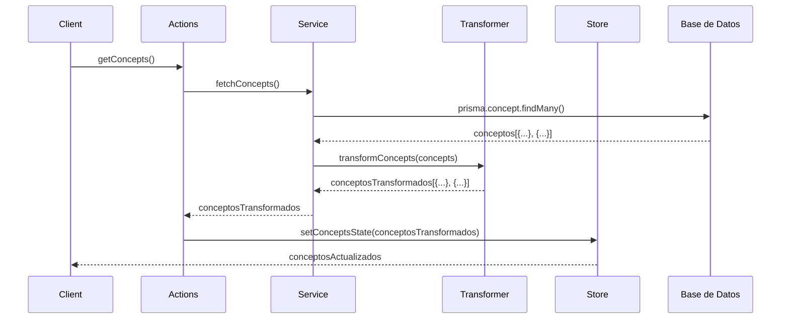

# Entidad Concept

## Descripción

La entidad `Concept` representa ideas, conceptos o nociones abstractas dentro del sistema. Los conceptos pueden relacionarse con cualquier otra entidad del sistema y sirven como una forma de organizar conocimiento y establecer conexiones temáticas. A diferencia de las etiquetas (tags), los conceptos contienen contenido detallado que puede incluir explicaciones, definiciones o elaboraciones extensas.

## Estructura

```mermaid
graph TD
    Concept[Entidad Concept]

    Concept --> Transformers[Transformers]
    Concept --> Types[Types]
    Concept --> Services[Services]
    Concept --> Store[Store]
    Concept --> Actions[Actions]

    Transformers --> T1[transformConcept]
    Transformers --> T2[transformConcepts]
    Transformers --> T3[transformConceptToExtended]
    Transformers --> T4[transformConceptToWithStats]
    Transformers --> T5[Serializers]
    Transformers --> T6[Mappers]

    Types --> Ty1[ConceptBase]
    Types --> Ty2[ConceptComplete]
    Types --> Ty3[ConceptExtended]
    Types --> Ty4[ConceptWithStats]

    Services --> S1[ConceptService]

    Store --> St1[ConceptStore]
    Store --> St2[Core Slice]
    Store --> St3[UI Slice]
    Store --> St4[Filters Slice]

    Actions --> A1[createConcept]
    Actions --> A2[updateConcept]
    Actions --> A3[deleteConcept]
    Actions --> A4[getConcept]
    Actions --> A5[getConcepts]
```



## Flujo de datos



## Tipos principales

### Concept

Representa la estructura base de un concepto.

```typescript
interface ConceptBase {
  id: string;
  name: string;
  emoji: string;
  color: string;
  description: string | null;
  content: string;
  category: string;
  tags: string;
  featuredImage: string | null;
  isFavorite: boolean;
  createdAt: Date;
  updatedAt: Date;
}
```

### ConceptExtended

Extiende `Concept` con propiedades adicionales útiles para la UI.

```typescript
interface ConceptExtended extends ConceptComplete {
  isSelected: boolean;
  isHighlighted: boolean;
  previewContent: string;
  lastUpdated: Date;
  importance: number;
}
```

### ConceptWithStats

Extiende `Concept` con estadísticas calculadas.

```typescript
interface ConceptWithStats extends ConceptComplete {
  stats: {
    imageCount: number;
    videoCount: number;
    albumCount: number;
    tagCount: number;
    noteCount: number;
    relatedCharacters: number;
    relatedPlaces: number;
    relatedWorldItems: number;
    totalContentItems: number;
    lastUpdated: Date;
  }
}
```

## Funciones principales

### Transformers

- `transformConcept`: Transforma un objeto a un Concept, validando su estructura.
- `transformConcepts`: Transforma un array de objetos a Concepts.
- `transformConceptToExtended`: Extiende un Concept con propiedades para UI.
- `transformConceptToWithStats`: Transforma un Concept para incluir estadísticas.

### Serializers

- `toPrismaConcept`: Serializa un concepto para guardarlo en Prisma.
- `fromPrismaConcept`: Deserializa un concepto desde Prisma.
- `serializeTags`: Convierte un array de tags a formato string para Prisma.
- `deserializeTags`: Convierte un string de tags a formato array.

### Mappers

- `mapCreateConceptDataToPrisma`: Mapea datos de creación al formato Prisma.
- `mapUpdateConceptDataToPrisma`: Mapea datos de actualización al formato Prisma.
- `mapConceptFiltersToPrisma`: Mapea filtros de búsqueda al formato Prisma.

## Ejemplos de uso

### Transformar un concepto desde Prisma

```typescript
// Obtener concepto de Prisma
const prismaConcept = await prisma.concept.findUnique({ where: { id } });

// Transformar a ConceptComplete
const concept = transformConcept(prismaConcept);
```

### Extender un concepto para UI

```typescript
// Obtener concepto
const concept = await getConcept(conceptId);

// Extender para UI
const extendedConcept = transformConceptToExtended(concept);

// Usar en componente
return <ConceptCard concept={extendedConcept} />;
```

### Transformar un concepto con estadísticas

```typescript
// Obtener concepto
const concept = await getConcept(conceptId);

// Incluir estadísticas
const conceptWithStats = transformConceptToWithStats(concept);

// Usar en panel de información
return <ConceptStatsPanel concept={conceptWithStats} />;
```

## Mejores prácticas

1. **Validación**: Siempre validar los conceptos antes de guardarlos usando `validateConcept` o `transformConcept`.
2. **Error handling**: Capturar errores de transformación con try/catch y manejarlos adecuadamente.
3. **Extensión para UI**: Usar `transformConceptToExtended` cuando se necesiten propiedades adicionales en la interfaz.
4. **Estadísticas**: Usar `transformConceptToWithStats` cuando se necesite mostrar métricas o conteos.
5. **Rendimiento**: Para operaciones masivas, considerar la deserialización selectiva mediante opciones de transformación.

## Integración con otras entidades

Los conceptos pueden relacionarse con prácticamente cualquier otra entidad del sistema:

- **Images/Videos**: Contenido multimedia relacionado con el concepto
- **Tags**: Etiquetas para categorizar conceptos
- **Characters/Places/WorldItems**: Entidades del mundo que están relacionadas con el concepto
- **Notes**: Notas que elaboran sobre el concepto
- **Prompts**: Prompts que utilizan el concepto
- **Groups**: Grupos que contienen el concepto