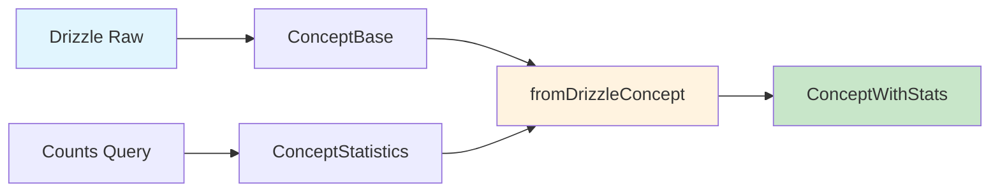

# Transformadores de Concept

## 📋 Descripción General

Este módulo contiene todos los transformadores, validadores y utilidades para manejar la entidad **Concept** dentro del sistema de gestión de imágenes. Los conceptos representan ideas, temas o clasificaciones que ayudan a organizar y categorizar el contenido.

**✅ Estado:** MIGRADO A DRIZZLE - Enero 2025  
**🎯 Propósito:** Transformar datos entre Drizzle ORM y tipos locales para la entidad Concept  
**🔧 Arquitectura:** Patrón de transformadores con validación Zod  

## 🏗️ Estructura del Módulo

```
src/transformers/concept/
├── index.ts          # 📤 Exportaciones públicas
├── mappers.ts         # 🗺️ Transformaciones básicas entre tipos
├── transformer.ts     # 🔄 Conversiones desde Drizzle ORM
├── serializers.ts     # 📦 Manejo de campos JSON complejos
├── validators.ts      # 🛡️ Validaciones con esquemas Zod
├── schema.ts          # 📋 Esquemas Zod para validación
└── documentation.md   # 📚 Este archivo
```

## 🔄 Tipos y Transformaciones

### Tipos Base

- **`ConceptBase`**: Estructura base desde Drizzle ORM
- **`ConceptStatistics`**: Estadísticas calculadas (conteos de relaciones)
- **`ConceptWithStats`**: Tipo canónico con estadísticas integradas

### Flujo de Transformación



---

**✅ Estado de Migración:** COMPLETADO  
**🎯 Próximos Pasos:** Continuar migración con otros bloques de transformadores  
**📅 Última Actualización:** Enero 2025